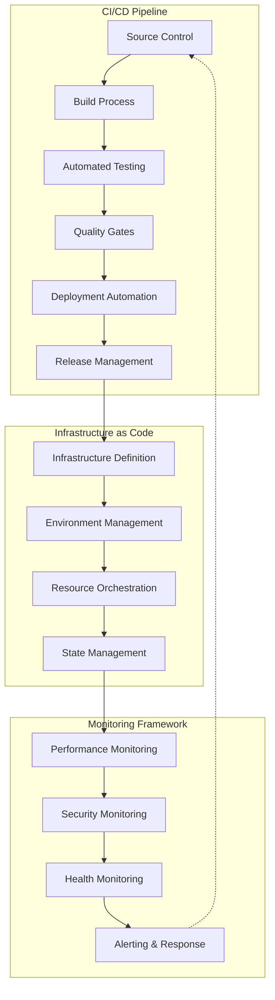
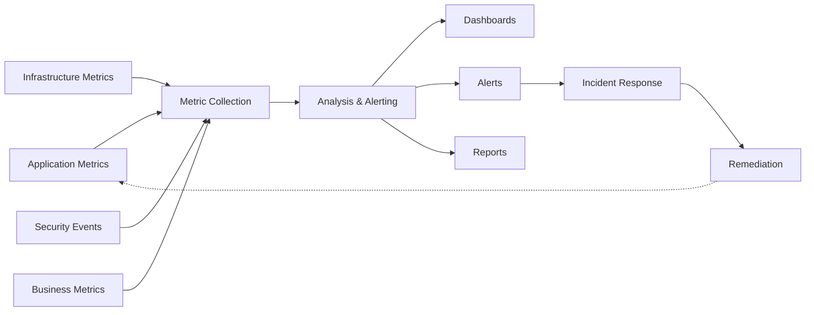
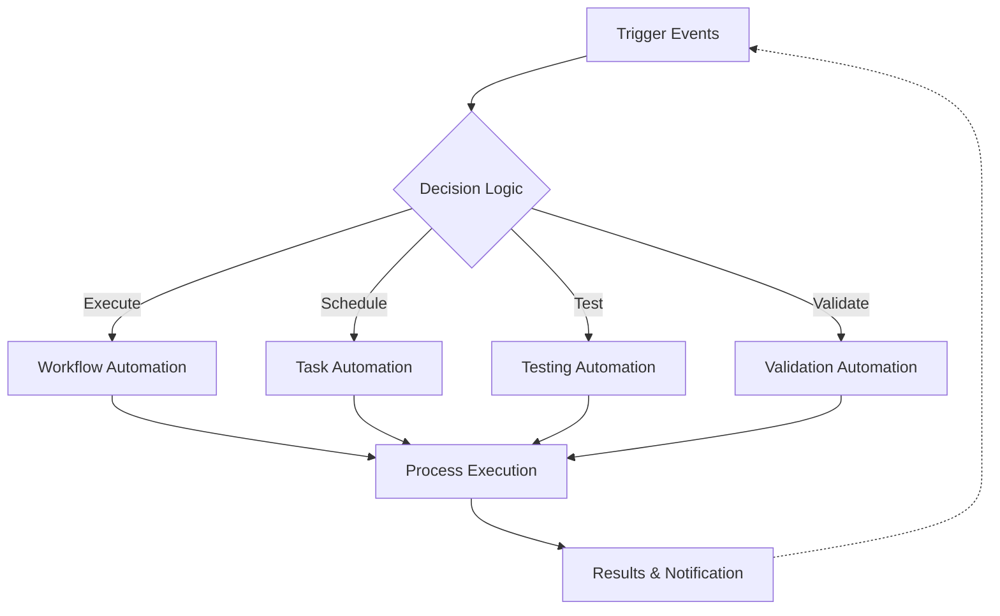

# DevOps Framework

## 📋 Overview
This framework defines the DevOps practices, processes, and tools for continuous integration, delivery, and deployment, aligned with the [[technical_infrastructure_framework|Technical Infrastructure Framework]] and [[security_framework|Security Framework]].



## 🤖 Agent Integration Points

The following integration points are designed for autonomous agents and automation systems:

| Component | Automation Hook | Description |
|-----------|----------------|-------------|
| Source Control | `devops:hooks:source-control` | Integration point for repository operations |
| Build Process | `devops:hooks:build-process` | Trigger points for build automation |
| Testing | `devops:hooks:testing` | Test execution and reporting |
| Deployment | `devops:hooks:deployment` | Deployment automation triggers |
| Monitoring | `devops:hooks:monitoring` | Monitoring system integration |

<!-- AUTO-GENERATED-CONTENT:START (AGENT_CAPABILITIES) -->
<!-- Automation capabilities metadata for autonomous systems -->
```json
{
  "framework": "devops",
  "version": "1.0.0",
  "capabilities": [
    {
      "name": "ci_pipeline_automation",
      "description": "Continuous integration pipeline automation",
      "entryPoints": ["build_automation", "test_automation"]
    },
    {
      "name": "cd_pipeline_automation",
      "description": "Continuous deployment pipeline automation",
      "entryPoints": ["deployment_automation", "release_automation"]
    },
    {
      "name": "infrastructure_automation",
      "description": "Infrastructure as code automation",
      "entryPoints": ["infrastructure_code", "environment_provisioning"]
    },
    {
      "name": "monitoring_automation",
      "description": "Automated monitoring and alerting",
      "entryPoints": ["performance_tracking", "security_monitoring"]
    }
  ]
}
```
<!-- AUTO-GENERATED-CONTENT:END -->

## 🔄 CI/CD Pipeline

### Build Pipeline
1. **Source Control**
   - [[repository_management|Repository Management]]
     - Branch strategy
     - Version control
     - Code review
     - Merge process
   
   - [[code_management|Code Management]]
     - Code standards
     - Quality gates
     - Static analysis
     - Security scanning

2. **Build Process**
   - [[build_automation|Build Automation]]
     - Build scripts
     - Dependency management
     - Artifact creation
     - Version tagging
   
   - [[build_optimization|Build Optimization]]
     - Cache management
     - Parallel processing
     - Resource utilization
     - Performance tuning

### Test Pipeline
1. **Automated Testing**
   - [[test_automation|Test Automation]]
     - Unit tests
     - Integration tests
     - System tests
     - Performance tests
   
   - [[test_management|Test Management]]
     - Test strategy
     - Coverage tracking
     - Result analysis
     - Quality metrics

2. **Quality Gates**
   - [[quality_validation|Quality Validation]]
     - Code quality
     - Test coverage
     - Security compliance
     - Performance criteria
   
   - [[quality_reporting|Quality Reporting]]
     - Quality metrics
     - Coverage reports
     - Issue tracking
     - Trend analysis

### Deployment Pipeline
1. **Deployment Automation**
   - [[deployment_automation|Deployment Automation]]
     - Release packaging
     - Environment setup
     - Configuration management
     - Service deployment
   
   - [[deployment_strategy|Deployment Strategy]]
     - Release strategy
     - Rollback procedures
     - Canary deployments
     - Blue-green deployments

2. **Release Management**
   - [[release_automation|Release Automation]]
     - Version control
     - Change tracking
     - Approval workflow
     - Release notes
   
   - [[release_coordination|Release Coordination]]
     - Schedule management
     - Stakeholder communication
     - Impact assessment
     - Success validation

## 🏗 Infrastructure as Code

### Configuration Management
1. **Infrastructure Definition**
   - [[infrastructure_code|Infrastructure Code]]
     - Resource definitions
     - Configuration templates
     - Environment specs
     - Dependency mapping
   
   - [[configuration_management|Configuration Management]]
     - Config versioning
     - Change tracking
     - State management
     - Validation rules

2. **Environment Management**
   - [[environment_provisioning|Environment Provisioning]]
     - Resource creation
     - Service setup
     - Network configuration
     - Security implementation
   
   - [[environment_maintenance|Environment Maintenance]]
     - Updates management
     - Patch deployment
     - Health monitoring
     - Optimization tasks

### Resource Orchestration
1. **Resource Management**
   - [[resource_provisioning|Resource Provisioning]]
     - Capacity planning
     - Scaling rules
     - Resource allocation
     - Usage optimization
   
   - [[resource_coordination|Resource Coordination]]
     - Service discovery
     - Load balancing
     - Health checking
     - Failover management

2. **State Management**
   - [[state_tracking|State Tracking]]
     - State versioning
     - Change detection
     - Drift management
     - Recovery procedures
   
   - [[state_synchronization|State Synchronization]]
     - Config sync
     - State backup
     - Version control
     - Conflict resolution

## 📊 Monitoring Framework



### Performance Monitoring
1. **System Monitoring**
   - [[performance_tracking|Performance Tracking]]
     - Resource metrics
     - Service metrics
     - Application metrics
     - Infrastructure metrics
   
   - [[performance_analysis|Performance Analysis]]
     - Trend analysis
     - Bottleneck detection
     - Capacity planning
     - Optimization recommendations

2. **Resource Monitoring**
   - [[resource_tracking|Resource Tracking]]
     - Usage monitoring
     - Cost tracking
     - Efficiency metrics
     - Optimization opportunities
   
   - [[resource_analysis|Resource Analysis]]
     - Utilization patterns
     - Cost analysis
     - Scaling recommendations
     - Optimization strategies

### Security Monitoring
1. **Security Tracking**
   - [[security_monitoring|Security Monitoring]]
     - Threat detection
     - Vulnerability scanning
     - Compliance checking
     - Access tracking
   
   - [[security_analysis|Security Analysis]]
     - Risk assessment
     - Threat analysis
     - Compliance validation
     - Security recommendations

2. **Health Monitoring**
   - [[health_tracking|Health Tracking]]
     - Service health
     - System health
     - Application health
     - Infrastructure health
   
   - [[health_analysis|Health Analysis]]
     - Health trends
     - Issue patterns
     - Recovery metrics
     - Improvement recommendations

## 🤖 Automation Framework



### Process Automation
1. **Workflow Automation**
   - [[workflow_automation|Workflow Automation]]
     - Task automation
     - Process flows
     - Integration points
     - Error handling
   
   - [[workflow_optimization|Workflow Optimization]]
     - Process efficiency
     - Resource utilization
     - Error reduction
     - Performance improvement

2. **Task Automation**
   - [[task_automation|Task Automation]]
     - Routine tasks
     - Maintenance tasks
     - Monitoring tasks
     - Recovery tasks
   
   - [[task_optimization|Task Optimization]]
     - Execution efficiency
     - Resource usage
     - Error handling
     - Performance tuning

### Testing Automation
1. **Test Automation**
   - [[automated_testing|Automated Testing]]
     - Test execution
     - Result validation
     - Coverage tracking
     - Report generation
   
   - [[test_optimization|Test Optimization]]
     - Execution speed
     - Resource usage
     - Coverage improvement
     - Quality enhancement

2. **Validation Automation**
   - [[automated_validation|Automated Validation]]
     - Quality checks
     - Security scans
     - Compliance validation
     - Performance testing
   
   - [[validation_optimization|Validation Optimization]]
     - Process efficiency
     - Resource utilization
     - Coverage expansion
     - Accuracy improvement

## 📝 Documentation & Training

### Documentation Framework
1. **Process Documentation**
   - [[process_documentation|Process Documentation]]
     - Workflow guides
     - Standard procedures
     - Best practices
     - Troubleshooting guides
   
   - [[technical_documentation|Technical Documentation]]
     - System architecture
     - Configuration guides
     - Integration specs
     - Recovery procedures

2. **Training Materials**
   - [[training_documentation|Training Documentation]]
     - User guides
     - Admin guides
     - Developer guides
     - Operation manuals
   
   - [[knowledge_base|Knowledge Base]]
     - Best practices
     - Common issues
     - Solutions guide
     - Tips and tricks

### Training Framework
1. **Technical Training**
   - [[devops_training|DevOps Training]]
     - Tool usage
     - Process execution
     - Best practices
     - Troubleshooting
   
   - [[automation_training|Automation Training]]
     - Script development
     - Tool configuration
     - Integration setup
     - Maintenance procedures

2. **Process Training**
   - [[workflow_training|Workflow Training]]
     - Process execution
     - Tool usage
     - Integration points
     - Error handling
   
   - [[best_practices_training|Best Practices Training]]
     - Quality standards
     - Security practices
     - Efficiency guidelines
     - Performance optimization

---
**Metadata**
- Created: <% tp.date.now("YYYY-MM-DD") %>
- Last Updated: <% tp.date.now("YYYY-MM-DD") %>
- Owner: [[devops_team]]
- Review Cycle: Quarterly
- Next Review: <% tp.date.now("YYYY") %>-<% (tp.date.now("MM") + 3).toString().padStart(2, '0') %>-<% tp.date.now("DD") %> 
- Related: [[technical_infrastructure_framework|Technical Infrastructure Framework]], [[security_architecture|Security Architecture]], [[application_security|Application Security]], [[network_security|Network Security]], [[data_security|Data Security]], [[monitoring_infrastructure|Monitoring Infrastructure]] 