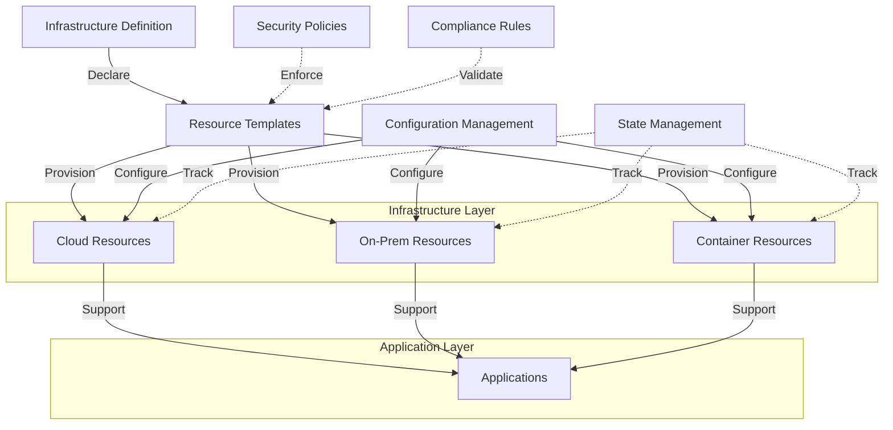
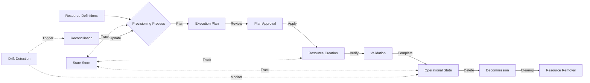
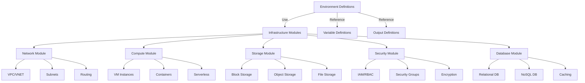

# Infrastructure Code

## 📋 Overview
This document defines the standards, processes, and best practices for managing infrastructure as code, ensuring consistent resource provisioning, configuration management, and environment orchestration across all deployment targets.



## 🤖 Agent Integration Points

| Component | Automation Hook | Description |
|-----------|----------------|-------------|
| Resource Definition | `infra:hooks:define` | Resource template creation and validation |
| Provisioning | `infra:hooks:provision` | Resource provisioning automation |
| Configuration | `infra:hooks:configure` | Configuration management operations |
| State Management | `infra:hooks:state` | State tracking and synchronization |
| Compliance | `infra:hooks:compliance` | Compliance validation and enforcement |

<!-- AUTO-GENERATED-CONTENT:START (AGENT_CAPABILITIES) -->
<!-- Automation capabilities metadata for autonomous systems -->
```json
{
  "component": "infrastructure_code",
  "version": "1.0.0",
  "capabilities": [
    {
      "name": "resource_provisioning",
      "description": "Automated infrastructure provisioning",
      "actions": ["plan", "apply", "destroy", "validate"]
    },
    {
      "name": "configuration_management",
      "description": "Automated configuration management",
      "actions": ["configure", "update", "validate", "remediate"]
    },
    {
      "name": "state_management",
      "description": "Infrastructure state management",
      "actions": ["track", "synchronize", "detect-drift", "reconcile"]
    },
    {
      "name": "security_governance",
      "description": "Security and compliance automation",
      "actions": ["validate", "enforce", "report", "remediate"]
    }
  ],
  "integrations": [
    {
      "name": "environment_provisioning",
      "description": "Integration with environment provisioning",
      "connection": "environment_provisioning"
    },
    {
      "name": "deployment_automation",
      "description": "Integration with deployment systems",
      "connection": "deploy:hooks:environment"
    },
    {
      "name": "security_operations",
      "description": "Integration with security systems",
      "connection": "security_operations"
    }
  ]
}
```
<!-- AUTO-GENERATED-CONTENT:END -->

## 🏗️ Resource Definitions

### Definition Standards
1. **Resource Templates**
   - Template structure
   - Resource organization
   - Parameter design
   - Output specifications

2. **Modularity Approach**
   - Module design
   - Reusability patterns
   - Versioning strategy
   - Dependency management

### Provider Integration
1. **Cloud Providers**
   - AWS integration
   - Azure integration
   - GCP integration
   - Multi-cloud strategy

2. **Platform Integration**
   - Kubernetes integration
   - Container orchestration
   - Edge computing
   - Hybrid-cloud architecture

## 🔄 Resource Management



### Provisioning Strategy
1. **Provisioning Process**
   - Planning phase
   - Execution phase
   - Validation phase
   - Documentation phase

2. **Resource Lifecycle**
   - Creation workflow
   - Update process
   - Scaling strategy
   - Decommissioning approach

### Resource Organization
1. **Organizational Structure**
   - Resource grouping
   - Logical separation
   - Environment isolation
   - Resource boundaries

2. **Naming Standards**
   - Naming conventions
   - Tagging strategy
   - Metadata requirements
   - Identification patterns

## 📝 Configuration Management

### Configuration Strategy
1. **Configuration Approach**
   - Declarative configuration
   - Imperative operations
   - Hybrid methodologies
   - Validation techniques

2. **Configuration Sources**
   - Source control integration
   - Configuration versioning
   - Change tracking
   - Approval workflow

### Configuration Implementation
1. **Implementation Methods**
   - Native tooling
   - Configuration languages
   - Hybrid approaches
   - Custom extensions

2. **Tool Integration**
   - Tool selection
   - Integration points
   - Execution models
   - Result validation

## 🧩 Modular Design



### Modular Architecture
1. **Module Design**
   - Interface definition
   - Implementation encapsulation
   - Versioning approach
   - Documentation requirements

2. **Composition Strategy**
   - Module composition
   - Dependency management
   - Integration patterns
   - Configuration passing

### Module Management
1. **Module Registry**
   - Registry strategy
   - Version control
   - Distribution approach
   - Documentation standards

2. **Versioning Strategy**
   - Semantic versioning
   - Compatibility rules
   - Upgrade path
   - Deprecation policy

## 📊 State Management

### State Tracking
1. **State Storage**
   - Storage strategy
   - Security requirements
   - Access control
   - Backup approach

2. **State Operations**
   - State locking
   - Concurrency management
   - Migration procedures
   - Corruption recovery

### Drift Management
1. **Drift Detection**
   - Detection strategy
   - Monitoring approach
   - Alerting integration
   - Resolution workflow

2. **Reconciliation Process**
   - Reconciliation approach
   - Enforcement policy
   - Exception handling
   - Documentation requirements

## 🔒 Security & Compliance

### Security Implementation
1. **Security Controls**
   - Access management
   - Network security
   - Data protection
   - Monitoring requirements

2. **Security Automation**
   - Policy as code
   - Automated validation
   - Remediation workflow
   - Continuous verification

### Compliance Management
1. **Compliance Controls**
   - Policy definition
   - Validation approach
   - Evidence collection
   - Reporting requirements

2. **Auditing Strategy**
   - Audit logging
   - Change tracking
   - Approval workflow
   - Verification procedures

## 🔄 Environment Management

### Environment Strategy
1. **Environment Types**
   - Development environments
   - Testing environments
   - Staging environments
   - Production environments

2. **Environment Consistency**
   - Parity requirements
   - Configuration differences
   - Scaling considerations
   - Security differentiation

### Environment Automation
1. **Provisioning Automation**
   - Automation strategy
   - CI/CD integration
   - Approval workflow
   - Validation requirements

2. **Lifecycle Management**
   - Creation process
   - Update procedures
   - Scaling operations
   - Teardown workflow

## 📚 Documentation & Training

### Architecture Documentation
1. **Design Documentation**
   - Architecture diagrams
   - Design decisions
   - Component relationships
   - Scaling considerations

2. **Operational Documentation**
   - Operational procedures
   - Maintenance tasks
   - Troubleshooting guides
   - Recovery procedures

### Knowledge Management
1. **Training Materials**
   - Onboarding guides
   - Tool training
   - Best practices
   - Example implementations

2. **Knowledge Sharing**
   - Documentation sharing
   - Expertise development
   - Community engagement
   - Innovation support

## 🔧 Implementation Examples

### Terraform Module Structure Example

```hcl
# Example Terraform module structure
module "vpc" {
  source  = "terraform-aws-modules/vpc/aws"
  version = "3.14.0"

  name = "my-vpc"
  cidr = "10.0.0.0/16"

  azs             = ["us-east-1a", "us-east-1b", "us-east-1c"]
  private_subnets = ["10.0.1.0/24", "10.0.2.0/24", "10.0.3.0/24"]
  public_subnets  = ["10.0.101.0/24", "10.0.102.0/24", "10.0.103.0/24"]

  enable_nat_gateway = true
  single_nat_gateway = true

  tags = {
    Environment = "production"
    Project     = "example-app"
    ManagedBy   = "terraform"
  }
}

module "security_groups" {
  source  = "./modules/security"
  vpc_id  = module.vpc.vpc_id
  
  application_ports = [80, 443]
  database_ports    = [5432]
  
  environment = "production"
}

module "compute" {
  source = "./modules/compute"
  
  vpc_id            = module.vpc.vpc_id
  subnet_ids        = module.vpc.private_subnets
  security_group_id = module.security_groups.app_security_group_id
  
  instance_type  = "t3.medium"
  instance_count = 3
  
  environment = "production"
  depends_on  = [module.vpc, module.security_groups]
}
```

### Infrastructure Pipeline Configuration Example

```yaml
# Example infrastructure CI/CD pipeline
infrastructure_pipeline:
  stages:
    - validate
    - plan
    - apply
    - verify
    
  environments:
    development:
      auto_apply: true
      approval_required: false
      variables:
        environment: "development"
        instance_count: 1
        instance_type: "t3.small"
        
    staging:
      auto_apply: false
      approval_required: true
      approvers: ["devops-team"]
      variables:
        environment: "staging"
        instance_count: 2
        instance_type: "t3.medium"
        
    production:
      auto_apply: false
      approval_required: true
      approvers: ["devops-team", "operations-team"]
      variables:
        environment: "production"
        instance_count: 3
        instance_type: "t3.large"
  
  notifications:
    - event: plan-created
      channels: [slack-devops]
    - event: apply-needed
      channels: [slack-devops, email-approvers]
    - event: apply-complete
      channels: [slack-devops, slack-operations]
    - event: apply-failed
      channels: [slack-devops, email-devops, pager-duty]
```

---
**Metadata**
- Created: 2023-07-15
- Last Updated: 2023-07-15
- Owner: [[devops_team]]
- Review Cycle: Quarterly
- Next Review: 2023-10-15
- Related: [[devops_framework|DevOps Framework]], [[environment_provisioning|Environment Provisioning]], [[configuration_management|Configuration Management]], [[security_architecture|Security Architecture]], [[deployment_automation|Deployment Automation]] 