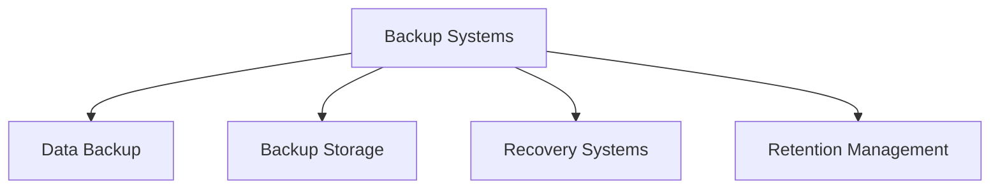

# Backup Systems

## 📋 Overview
This document outlines the backup systems framework and implementation for our Operations Knowledge Base, providing a comprehensive approach to data backup, retention, and recovery.

## 🎯 Backup Framework

### Core Components


### Backup Architecture
1. **Backup Layers**
   ```yaml
   backup_layers:
     data_layer:
       - file_systems
       - databases
       - configurations
       - user_data
     system_layer:
       - system_state
       - application_state
       - security_settings
       - network_configs
   ```

2. **Backup Types**
   - Full Backup
   - Incremental Backup
   - Differential Backup
   - Snapshot Backup

## 💾 Data Backup

### Backup Strategy
1. **Backup Planning**
   ```python
   def implement_backup_strategy():
       schedule_regular_backups()
       configure_backup_types()
       set_retention_policies()
       verify_backup_integrity()
   ```

2. **Backup Execution**
   - Automated backups
   - Manual backups
   - Emergency backups
   - Verification process

### Data Protection
1. **Protection Methods**
   ```json
   {
     "data_protection": {
       "encryption": ["at_rest", "in_transit", "key_management"],
       "security": ["access_control", "audit_logging", "compliance"],
       "integrity": ["checksums", "verification", "validation"]
     }
   }
   ```

2. **Security Measures**
   - Data encryption
   - Access control
   - Audit logging
   - Compliance checks

## 📦 Backup Storage

### Storage Management
1. **Storage Types**
   - Local storage
   - Network storage
   - Cloud storage
   - Offsite storage

2. **Storage Architecture**
   - Primary storage
   - Secondary storage
   - Archive storage
   - Disaster recovery

### Storage Operations
1. **Storage Management**
   - Capacity planning
   - Performance optimization
   - Redundancy management
   - Cost optimization

2. **Data Management**
   - Data organization
   - Version control
   - Retention policies
   - Archival processes

## 🔄 Recovery Systems

### Recovery Planning
1. **Recovery Strategy**
   - Recovery objectives
   - Recovery procedures
   - Testing protocols
   - Verification methods

2. **Recovery Types**
   - Full recovery
   - Point-in-time recovery
   - Selective recovery
   - Emergency recovery

### Recovery Operations
1. **Recovery Process**
   - Recovery initiation
   - Data restoration
   - System recovery
   - Verification steps

2. **Recovery Testing**
   - Regular testing
   - Scenario testing
   - Performance testing
   - Documentation review

## 📊 Retention Management

### Retention Strategy
1. **Retention Policies**
   - Retention periods
   - Storage tiers
   - Archival rules
   - Deletion policies

2. **Policy Management**
   - Policy enforcement
   - Compliance checking
   - Audit tracking
   - Policy updates

### Data Lifecycle
1. **Lifecycle Stages**
   - Active data
   - Backup data
   - Archive data
   - Deleted data

2. **Lifecycle Management**
   - Stage transitions
   - Access patterns
   - Cost optimization
   - Compliance maintenance

## 🔍 Monitoring and Reporting

### Backup Monitoring
1. **Monitoring Systems**
   - Backup status
   - Storage usage
   - Performance metrics
   - Error tracking

2. **Alert Management**
   - Status alerts
   - Error notifications
   - Capacity warnings
   - Performance alerts

### Reporting System
1. **Regular Reports**
   - Backup status
   - Storage usage
   - Performance metrics
   - Compliance status

2. **Analysis Reports**
   - Trend analysis
   - Capacity planning
   - Cost analysis
   - Efficiency metrics

## 🛠 Backup Tools

### Tool Selection
1. **Backup Tools**
   - Backup software
   - Storage tools
   - Management tools
   - Monitoring tools

2. **Integration Tools**
   - System integration
   - Storage integration
   - Security integration
   - Monitoring integration

### Tool Management
1. **Tool Operations**
   - Configuration management
   - Performance tuning
   - Update management
   - Support procedures

2. **Tool Maintenance**
   - Regular updates
   - Performance optimization
   - Security patches
   - Feature updates

## 📜 Compliance and Audit

### Compliance Management
1. **Compliance Requirements**
   - Data protection
   - Retention rules
   - Security standards
   - Industry regulations

2. **Audit Support**
   - Audit trails
   - Compliance reports
   - Policy documentation
   - Control verification

### Documentation
1. **System Documentation**
   - Architecture docs
   - Process docs
   - Policy docs
   - Procedure docs

2. **Operational Documentation**
   - Operation guides
   - Recovery procedures
   - Maintenance docs
   - Emergency procedures

## 📝 Related Documentation
- [[disaster-recovery]]
- [[data-protection]]
- [[storage-management]]
- [[compliance-framework]]

## 🔄 Change Log
| Date | Change | Author |
|------|--------|--------|
| YYYY-MM-DD | Initial backup systems documentation | Name |

---

*Last updated: <% tp.date.now("YYYY-MM-DD") %>* 