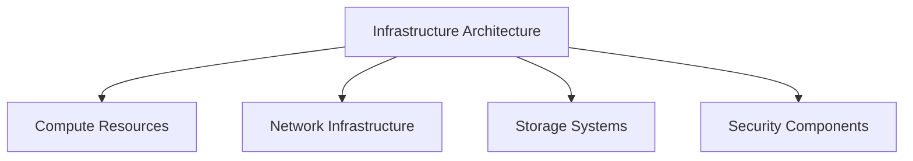

# Infrastructure Architecture

## 📋 Overview
This document outlines the infrastructure architecture framework and implementation for our Operations Knowledge Base, providing a comprehensive view of our system's infrastructure design and components.

## 🎯 Architecture Framework

### Core Components


### Architecture Layers
1. **Infrastructure Layers**
   ```yaml
   architecture_layers:
     physical_layer:
       - hardware_systems
       - data_centers
       - network_equipment
       - storage_systems
     platform_layer:
       - virtualization
       - containers
       - orchestration
       - automation
   ```

2. **Service Layers**
   - Infrastructure Services
   - Platform Services
   - Application Services
   - Security Services

## 💻 Compute Infrastructure

### Compute Resources
1. **Server Infrastructure**
   ```python
   def define_compute_resources():
       allocate_physical_servers()
       configure_virtual_machines()
       setup_container_hosts()
       manage_compute_clusters()
   ```

2. **Resource Management**
   - Capacity planning
   - Resource allocation
   - Performance optimization
   - Scaling management

### Virtualization Layer
1. **Virtual Infrastructure**
   ```json
   {
     "virtualization": {
       "platforms": ["hypervisors", "containers", "serverless"],
       "management": ["orchestration", "automation", "monitoring"],
       "resources": ["compute", "memory", "storage", "network"]
     }
   }
   ```

2. **Container Platform**
   - Container runtime
   - Orchestration system
   - Image registry
   - Service mesh

## 🌐 Network Architecture

### Network Infrastructure
1. **Network Components**
   - Core network
   - Distribution layer
   - Access layer
   - Edge services

2. **Network Services**
   - Load balancing
   - Traffic routing
   - Network security
   - Service discovery

### Connectivity
1. **Internal Networks**
   - Data center network
   - Service network
   - Management network
   - Storage network

2. **External Networks**
   - Internet connectivity
   - VPN services
   - CDN integration
   - API gateway

## 💾 Storage Architecture

### Storage Systems
1. **Storage Types**
   - Block storage
   - File storage
   - Object storage
   - Archive storage

2. **Storage Services**
   - Data persistence
   - Backup systems
   - Recovery services
   - Archive management

### Data Management
1. **Data Services**
   - Data replication
   - Data protection
   - Data lifecycle
   - Data migration

2. **Storage Operations**
   - Capacity management
   - Performance tuning
   - Availability control
   - Backup operations

## 🔒 Security Architecture

### Security Infrastructure
1. **Security Components**
   - Firewalls
   - IDS/IPS systems
   - Access control
   - Encryption systems

2. **Security Services**
   - Authentication
   - Authorization
   - Monitoring
   - Incident response

### Security Operations
1. **Security Management**
   - Policy enforcement
   - Threat detection
   - Vulnerability management
   - Compliance monitoring

2. **Security Controls**
   - Access controls
   - Network security
   - Data protection
   - System hardening

## 🔄 Infrastructure Operations

### Operational Components
1. **Management Systems**
   - Infrastructure management
   - Configuration management
   - Change management
   - Performance management

2. **Monitoring Systems**
   - Resource monitoring
   - Performance monitoring
   - Security monitoring
   - Availability monitoring

### Automation
1. **Automation Framework**
   - Infrastructure as Code
   - Configuration automation
   - Deployment automation
   - Operation automation

2. **Orchestration**
   - Service orchestration
   - Resource orchestration
   - Workflow automation
   - Policy automation

## 📈 Scaling and Performance

### Scaling Architecture
1. **Scaling Components**
   - Horizontal scaling
   - Vertical scaling
   - Auto-scaling
   - Load distribution

2. **Performance Optimization**
   - Resource optimization
   - Service optimization
   - Network optimization
   - Storage optimization

### High Availability
1. **Availability Design**
   - Redundancy
   - Failover systems
   - Disaster recovery
   - Business continuity

2. **Resilience Measures**
   - Service resilience
   - Data resilience
   - Network resilience
   - System resilience

## 🛠 Infrastructure Tools

### Management Tools
1. **Infrastructure Tools**
   - Resource management
   - Configuration management
   - Monitoring tools
   - Automation tools

2. **Operation Tools**
   - Deployment tools
   - Maintenance tools
   - Backup tools
   - Recovery tools

### Development Tools
1. **Infrastructure Development**
   - IaC tools
   - CI/CD tools
   - Testing tools
   - Version control

2. **Integration Tools**
   - API integration
   - Service integration
   - Data integration
   - Security integration

## 📝 Related Documentation
- [[network-design]]
- [[security-architecture]]
- [[deployment-strategy]]
- [[scaling-strategy]]

## 🔄 Change Log
| Date | Change | Author |
|------|--------|--------|
| YYYY-MM-DD | Initial infrastructure architecture documentation | Name |

---

*Last updated: <% tp.date.now("YYYY-MM-DD") %>* 