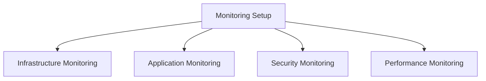

# Monitoring Setup

## 📋 Overview
This document outlines the monitoring setup framework and implementation for our Operations Knowledge Base, providing a comprehensive approach to system monitoring and observability.

## 🎯 Monitoring Framework

### Core Components


### Monitoring Architecture
1. **Monitoring Layers**
   ```yaml
   monitoring_layers:
     infrastructure_layer:
       - system_metrics
       - resource_metrics
       - network_metrics
       - storage_metrics
     application_layer:
       - service_metrics
       - performance_metrics
       - user_metrics
       - business_metrics
   ```

2. **Monitoring Dimensions**
   - Resource Monitoring
   - Performance Monitoring
   - Security Monitoring
   - Business Monitoring

## 📊 Infrastructure Monitoring

### System Monitoring
1. **Resource Metrics**
   ```python
   def monitor_system_resources():
       track_cpu_usage()
       monitor_memory_utilization()
       measure_disk_io()
       analyze_network_traffic()
   ```

2. **Infrastructure Metrics**
   - Server health
   - Network performance
   - Storage utilization
   - Service availability

### Resource Monitoring
1. **Resource Metrics**
   ```json
   {
     "resource_monitoring": {
       "compute": ["cpu", "memory", "processes", "threads"],
       "storage": ["capacity", "iops", "latency", "throughput"],
       "network": ["bandwidth", "latency", "packets", "errors"]
     }
   }
   ```

2. **Capacity Metrics**
   - Resource usage
   - Capacity planning
   - Growth trends
   - Utilization patterns

## 🔍 Application Monitoring

### Service Monitoring
1. **Service Metrics**
   - Service health
   - API performance
   - Transaction rates
   - Error rates

2. **Performance Metrics**
   - Response times
   - Throughput
   - Concurrency
   - Resource usage

### User Monitoring
1. **User Metrics**
   - User activity
   - Session data
   - Feature usage
   - Error encounters

2. **Experience Metrics**
   - Response times
   - Error rates
   - Satisfaction scores
   - Usage patterns

## 🔒 Security Monitoring

### Security Metrics
1. **Security Events**
   - Access attempts
   - Security incidents
   - Policy violations
   - Threat detection

2. **Compliance Metrics**
   - Policy compliance
   - Security standards
   - Audit requirements
   - Risk metrics

### Threat Monitoring
1. **Threat Detection**
   - Intrusion detection
   - Malware detection
   - Anomaly detection
   - Behavior analysis

2. **Security Analysis**
   - Threat analysis
   - Risk assessment
   - Vulnerability scanning
   - Security auditing

## 📈 Performance Monitoring

### Performance Metrics
1. **System Performance**
   - Resource performance
   - Service performance
   - Network performance
   - Storage performance

2. **Application Performance**
   - Transaction performance
   - Query performance
   - Cache performance
   - API performance

### Performance Analysis
1. **Analysis Methods**
   - Performance trending
   - Bottleneck analysis
   - Capacity planning
   - Optimization opportunities

2. **Performance Optimization**
   - Resource optimization
   - Service optimization
   - Query optimization
   - Cache optimization

## 🔔 Alerting System

### Alert Configuration
1. **Alert Rules**
   - Threshold alerts
   - Trend alerts
   - Anomaly alerts
   - Composite alerts

2. **Alert Management**
   - Alert routing
   - Alert prioritization
   - Alert correlation
   - Alert suppression

### Response Management
1. **Incident Response**
   - Alert triage
   - Response procedures
   - Escalation paths
   - Resolution tracking

2. **Alert Analysis**
   - Alert patterns
   - Response effectiveness
   - Resolution time
   - Impact analysis

## 📊 Visualization

### Dashboard Design
1. **Dashboard Types**
   - Overview dashboards
   - Technical dashboards
   - Business dashboards
   - Custom dashboards

2. **Visualization Components**
   - Metric graphs
   - Status indicators
   - Alert displays
   - Trend visualizations

### Data Presentation
1. **Data Views**
   - Real-time views
   - Historical views
   - Comparative views
   - Analytical views

2. **Interaction Methods**
   - Drill-down capability
   - Filter options
   - Time range selection
   - Custom queries

## 🛠 Monitoring Tools

### Tool Selection
1. **Monitoring Tools**
   - Infrastructure monitoring
   - Application monitoring
   - Security monitoring
   - Performance monitoring

2. **Analysis Tools**
   - Log analysis
   - Metric analysis
   - Performance analysis
   - Security analysis

### Tool Integration
1. **Integration Methods**
   - Data collection
   - Tool integration
   - Alert integration
   - Reporting integration

2. **Data Management**
   - Data collection
   - Data storage
   - Data analysis
   - Data retention

## 📝 Related Documentation
- [[infrastructure-architecture]]
- [[performance-monitoring]]
- [[security-monitoring]]
- [[alerting-system]]

## 🔄 Change Log
| Date | Change | Author |
|------|--------|--------|
| YYYY-MM-DD | Initial monitoring setup documentation | Name |

---

*Last updated: <% tp.date.now("YYYY-MM-DD") %>* 