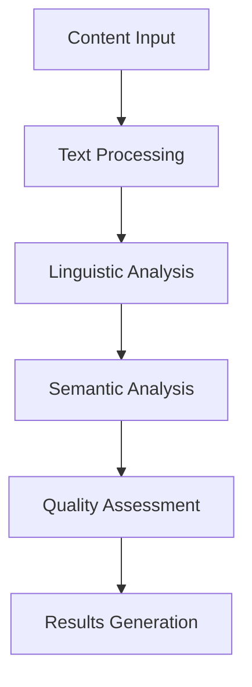

# Content Analysis

## 📋 Overview
This document outlines the content analysis capabilities of our Operations Knowledge Base, enabling automated understanding, classification, and quality assessment of documentation.

## 🎯 Analysis Capabilities

### Content Understanding
1. **Topic Analysis**
   - Topic extraction
   - Theme identification
   - Subject classification
   - Concept mapping

2. **Structure Analysis**
   - Document structure
   - Section organization
   - Content hierarchy
   - Flow analysis

3. **Context Analysis**
   - Content relationships
   - Cross-references
   - Dependencies
   - Prerequisites

## 🧠 Analysis Methods

### Text Analysis


### Processing Pipeline
1. **Text Processing**
   - Content extraction
   - Text normalization
   - Structure parsing
   - Format handling

2. **Linguistic Analysis**
   - Grammar checking
   - Style analysis
   - Readability scoring
   - Terminology validation

3. **Semantic Analysis**
   - Topic modeling
   - Entity recognition
   - Relationship extraction
   - Context understanding

## 📊 Quality Assessment

### Content Quality
1. **Readability Metrics**
   ```python
   def assess_readability(text):
       score = calculate_readability_score(text)
       complexity = analyze_complexity(text)
       clarity = measure_clarity(text)
       return {
           'score': score,
           'complexity': complexity,
           'clarity': clarity
       }
   ```

2. **Style Compliance**
   - Writing style
   - Formatting rules
   - Terminology usage
   - Documentation standards

### Technical Quality
1. **Technical Accuracy**
   - Command validation
   - Code snippet checking
   - API reference validation
   - Version compatibility

2. **Documentation Coverage**
   - Topic coverage
   - Detail level
   - Example inclusion
   - Use case coverage

## 🔍 Content Enhancement

### Automated Improvements
1. **Content Suggestions**
   - Missing information
   - Clarity improvements
   - Structure optimization
   - Additional examples

2. **Link Suggestions**
   - Internal references
   - External resources
   - Related content
   - Supporting materials

### Quality Optimization
- Style improvements
- Clarity enhancements
- Structure refinement
- Terminology consistency

## 📈 Analysis Metrics

### Content Metrics
1. **Quality Scores**
   - Readability score
   - Technical accuracy
   - Completeness score
   - Consistency rating

2. **Usage Metrics**
   - Access frequency
   - User engagement
   - Reference count
   - Feedback ratings

### Performance Metrics
- Processing time
- Analysis accuracy
- Resource usage
- System reliability

## 🛠 Implementation Tools

### Analysis Tools
1. **NLP Tools**
   - NLTK integration
   - spaCy processing
   - Transformers models
   - Custom analyzers

2. **Quality Tools**
   - Style checkers
   - Grammar validators
   - Code analyzers
   - Link validators

### Visualization Tools
- Topic maps
- Relationship graphs
- Quality dashboards
- Trend analysis

## 🔄 Continuous Improvement

### Analysis Evolution
1. **Model Updates**
   - Training updates
   - Feature expansion
   - Accuracy improvements
   - Performance optimization

2. **Rule Updates**
   - Style rules
   - Quality criteria
   - Validation rules
   - Assessment metrics

### Learning System
- Feedback integration
- Pattern learning
- Rule refinement
- Model adaptation

## 🔒 Quality Control

### Validation Process
1. **Automated Checks**
   - Content validation
   - Style verification
   - Link checking
   - Format validation

2. **Manual Review**
   - Expert review
   - Peer review
   - User feedback
   - Quality assessment

### Quality Assurance
- Accuracy verification
- Consistency checking
- Coverage assessment
- Standard compliance

## 📝 Related Documentation
- [[knowledge-graph]]
- [[semantic-search]]
- [[content-enrichment]]
- [[quality-metrics]]

## 🔄 Change Log
| Date | Change | Author |
|------|--------|--------|
| YYYY-MM-DD | Initial content analysis documentation | Name |

---

*Last updated: <% tp.date.now("YYYY-MM-DD") %>* 