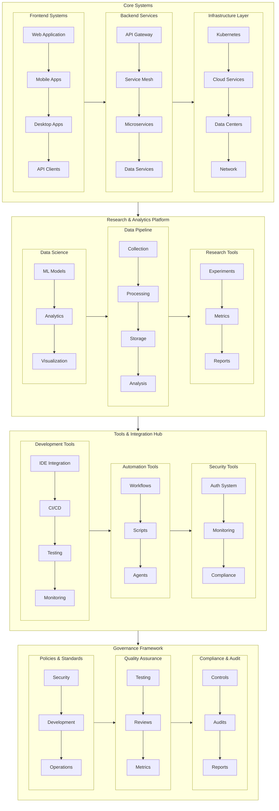
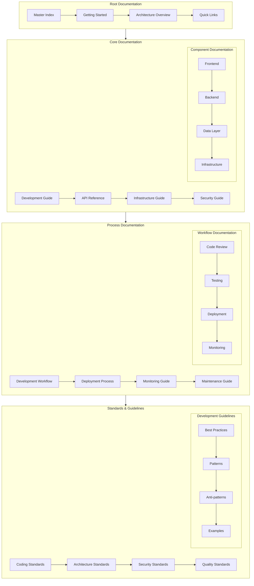
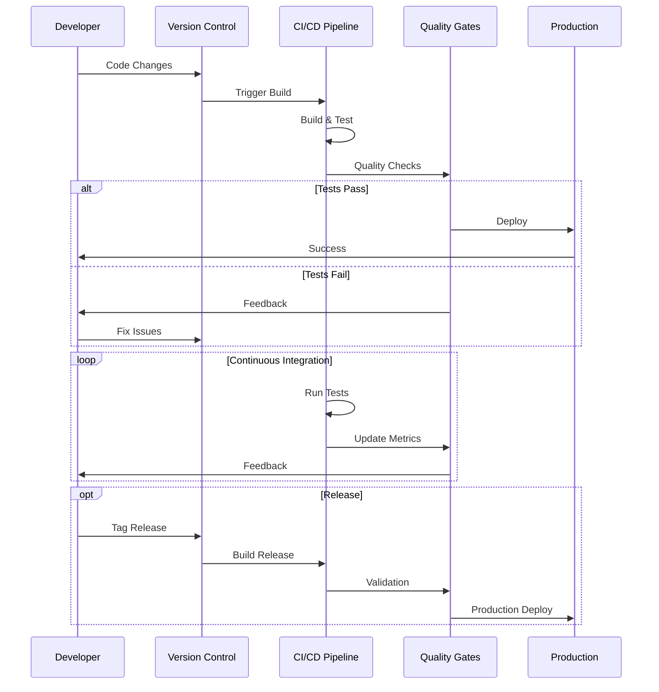
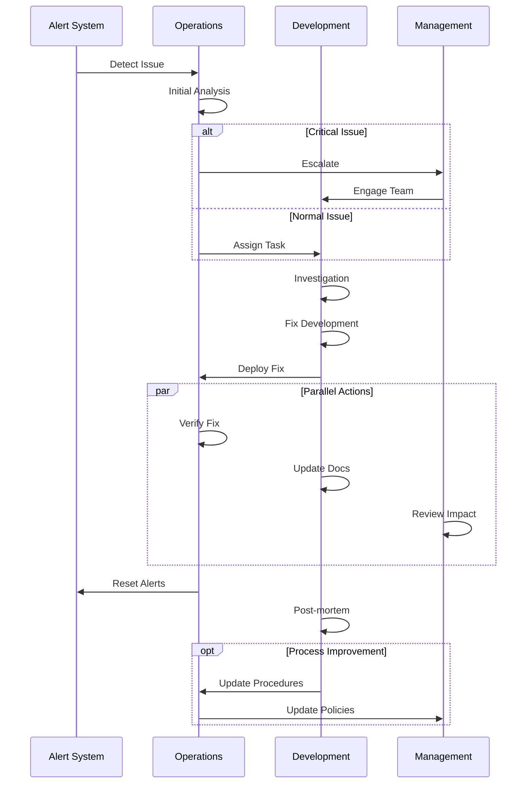
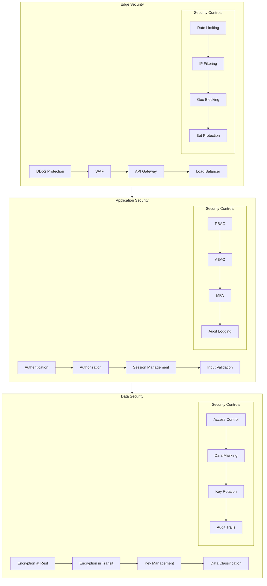

# Master Documentation Index

## System Architecture Overview

### Complete System Architecture

## Documentation Structure

### Documentation Hierarchy

## System Workflows

### Development Workflow

### Incident Management

## Cross-cutting Concerns

### Security Architecture

## Quick Navigation

### Core Systems Documentation
- [Development Guide](development/index.md)
- [API Documentation](api/index.md)
- [Infrastructure Guide](infrastructure/index.md)
- [Security Documentation](security/index.md)

### Research & Analytics Documentation
- [Data Science Guide](research/data-science/index.md)
- [Analytics Platform](research/analytics/index.md)
- [Experiment Framework](research/experiments/index.md)

### Tools & Integration Documentation
- [Development Tools](tools/development/index.md)
- [Automation Framework](tools/automation/index.md)
- [Monitoring System](tools/monitoring/index.md)

### Standards & Governance
- [Coding Standards](standards/coding/index.md)
- [Architecture Guidelines](standards/architecture/index.md)
- [Security Policies](standards/security/index.md)

### Agents Documentation
- [MultiAgent System](agents/multiagent-system.md) - Framework for composing AI agent teams

---

*Last updated: 2024-03-20* 