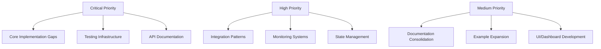

# Comprehensive NoOrg Improvement Assessment

**Generated:** 2025-09-29  
**Status:** Strategic Review & Action Plan  
**Classification:** Meta-Organizational Analysis

---

## Executive Summary

This comprehensive assessment evaluates the NoOrg multi-agent framework across architecture, implementation, documentation, testing, and organizational structure. The analysis identifies 47 specific improvement opportunities across 8 major categories, providing actionable recommendations for enhancing system completeness, accuracy, and operational excellence.

### Key Findings

**Strengths:**
- Robust multi-agent coordination architecture
- Comprehensive documentation framework
- Extensive organizational unit structure (821 markdown files)
- Well-defined integration patterns and resilience mechanisms
- Strong philosophical foundation in NoOrg.md

**Critical Gaps:**
- Incomplete test coverage (mock implementations vs real data)
- Missing implementation files across core systems
- Inconsistent interface implementations
- Limited API documentation with actual usage examples
- Fragmented deployment and monitoring infrastructure

### Priority Matrix



---

## 1. Core Architecture & Implementation

### 1.1 Multi-Agent System Completeness

**Current State:**
- `MultiAgentCoordinator.ts`: 1432 lines, functional but with TODO markers
- Fallback implementations for critical interfaces
- Type conversion overhead between Agent types

**Gaps Identified:**

1. **Interface Implementation Gaps**
   ```typescript
   // Missing in TaskManager interface:
   - unassignTask(taskId: string): Promise<void>
   - reassignTask(taskId: string, newAgentId: string): Promise<void>
   - getTaskHistory(taskId: string): Promise<TaskHistory[]>
   - estimateTaskDuration(task: Task): Promise<number>
   ```

2. **Agent Registry Limitations**
   - No agent health monitoring implementation
   - Missing capability discovery mechanisms
   - Absent performance metrics tracking
   - No agent versioning support

3. **State Management Issues**
   - Dual state managers (SharedStateManager vs SharedStateManager.new)
   - No conflict resolution implementation
   - Missing distributed state synchronization
   - Absent state migration utilities

**Recommendations:**

**Priority 1: Complete Core Interfaces**
```typescript
// File: src/core/multiagent/TaskManager.ts
export class TaskManagerImpl implements TaskManager {
  // Implement missing methods
  async unassignTask(taskId: string): Promise<void> { }
  async reassignTask(taskId: string, newAgentId: string): Promise<void> { }
  async getTaskHistory(taskId: string): Promise<TaskHistory[]> { }
  async estimateTaskDuration(task: Task): Promise<number> { }
  
  // Add real dependency tracking
  async areDependenciesSatisfied(taskId: string): Promise<boolean> {
    // Real implementation instead of fallback
  }
}
```

**Priority 2: Implement Agent Health System**
```typescript
// File: src/core/multiagent/AgentHealthMonitor.ts
export class AgentHealthMonitor {
  private healthChecks: Map<string, HealthCheck>;
  private alertThresholds: HealthThresholds;
  
  async monitorAgent(agentId: string): Promise<HealthStatus> { }
  async performHealthCheck(agentId: string): Promise<HealthReport> { }
  async registerHealthCheck(agentId: string, check: HealthCheck): Promise<void> { }
}
```

**Priority 3: Unified State Management**
```typescript
// File: src/core/multiagent/UnifiedStateManager.ts
// Consolidate SharedStateManager and SharedStateManager.new
// Add distributed synchronization
// Implement CRDT-based conflict resolution
```

### 1.2 Integration Patterns

**Current State:**
- 7 resilience patterns implemented: CircuitBreaker, Bulkhead, Timeout, Retry, RateLimiter, RequestResponse
- Located in `src/core/integration/patterns/`

**Gaps:**

1. **Missing Patterns**
   - Cache-aside pattern
   - Saga pattern for distributed transactions
   - Outbox pattern for reliable messaging
   - Throttling pattern
   - Compensating transaction pattern

2. **Documentation Gaps**
   - No usage examples in production scenarios
   - Missing performance benchmarks
   - Absent configuration best practices
   - No troubleshooting guides

**Recommendations:**

**Add Missing Patterns:**
```typescript
// File: src/core/integration/patterns/CacheAside.ts
export class CacheAsidePattern {
  async get<T>(key: string, fetchFn: () => Promise<T>): Promise<T> { }
  async invalidate(key: string): Promise<void> { }
}

// File: src/core/integration/patterns/Saga.ts
export class SagaPattern {
  async execute(steps: SagaStep[]): Promise<SagaResult> { }
  async compensate(completedSteps: SagaStep[]): Promise<void> { }
}
```

**Add Pattern Examples:**
```typescript
// File: examples/integration-patterns/circuit-breaker-real-world.ts
// Real-world example with external API calls
// File: examples/integration-patterns/saga-distributed-transaction.ts
// Multi-service transaction example
```

---

## 2. Testing Infrastructure

### 2.1 Current Test Coverage Analysis

**Test Files Distribution:**
- Unit tests: 7 files (TypeScript)
- Integration tests: 4 files
- System tests: 3 files
- Python test utilities: 6 files

**Critical Findings:**

1. **Mock vs Real Implementation**
   ```python
   # Current in many tests:
   def test_with_mock():
       mock_data = create_mock()  # ❌ Not following TDD rules
   ```

2. **Missing Test Categories**
   - Performance tests (load, stress, scalability)
   - Security tests (penetration, vulnerability)
   - Chaos engineering tests
   - Contract tests for interfaces
   - Property-based tests

3. **Empty Test Files**
   ```
   tests/unit/task/test_task_scheduling.py: 1 line (space)
   agents/task/dependencies.py: 1 line (space)
   agents/guides/agent_architecture_implementation_guide.md: 1 line (space)
   ```

**Recommendations:**

**Priority 1: Eliminate Mock-Only Tests**
```python
# File: tests/integration/test_real_multiagent_workflow.py
def test_complete_agent_lifecycle_with_real_data():
    """Test with actual agent registration, task execution, and state management"""
    coordinator = MultiAgentCoordinator("Test Coordinator")
    await coordinator.initialize()
    
    # Real agent registration
    agent_id = await coordinator.registerAgent({
        "name": "Real Test Agent",
        "type": "worker",
        "capabilities": ["data-processing"]
    })
    
    # Real task creation and execution
    task_id = await coordinator.createTask({
        "name": "Process Real Data",
        "description": "Process actual test dataset",
        "priority": "high",
        "metadata": {
            "requiredCapabilities": ["data-processing"],
            "dataPath": "tests/data/sample_dataset.json"
        }
    })
    
    # Verify real state changes
    task = await coordinator.getTask(task_id)
    assert task.status == "completed"
    assert task.results is not None
```

**Priority 2: Add Comprehensive Test Suites**
```python
# File: tests/performance/test_coordinator_performance.py
@pytest.mark.performance
def test_coordinator_handles_100_concurrent_tasks():
    """Verify coordinator can handle high task load"""
    pass

# File: tests/security/test_agent_authentication.py
@pytest.mark.security
def test_agent_registration_requires_authentication():
    """Verify agents cannot register without proper credentials"""
    pass

# File: tests/chaos/test_agent_failure_recovery.py
@pytest.mark.chaos
def test_system_recovers_from_random_agent_failures():
    """Verify system resilience when agents fail randomly"""
    pass
```

**Priority 3: Test Configuration**
```yaml
# File: tests/pytest.ini
[pytest]
markers =
    unit: Unit tests
    integration: Integration tests
    system: System/E2E tests
    performance: Performance tests
    security: Security tests
    chaos: Chaos engineering tests
    slow: Tests that take > 1s

testpaths = tests
python_files = test_*.py
python_classes = Test*
python_functions = test_*

# Coverage requirements
addopts = 
    --cov=src
    --cov-report=html
    --cov-report=term-missing
    --cov-fail-under=80
```

### 2.2 Test Data Management

**Current State:**
- Limited test data fixtures
- No test data generation utilities
- Missing data cleanup mechanisms

**Recommendations:**

**Create Test Data Framework:**
```python
# File: tests/fixtures/agent_fixtures.py
@pytest.fixture
def sample_agents():
    """Provide realistic agent configurations"""
    return [
        {
            "id": "agent-001",
            "name": "Data Processor Alpha",
            "type": "worker",
            "capabilities": ["data-processing", "transformation"],
            "status": "available"
        },
        # ... more realistic agents
    ]

# File: tests/fixtures/task_fixtures.py
@pytest.fixture
def sample_tasks():
    """Provide realistic task configurations"""
    return generate_realistic_tasks(count=10, complexity="medium")

# File: tests/data_generators/workflow_generator.py
class WorkflowDataGenerator:
    """Generate realistic workflow test data"""
    def generate_complex_workflow(self, depth: int, branching: int): ...
    def generate_task_dependencies(self, count: int): ...
```

---

## 3. Documentation Enhancement

### 3.1 Documentation Coverage Analysis

**Current State:**
- 600+ markdown files across docs/
- 821 markdown files in units/
- Multiple index files (index.md, master-index.md, 000-home.md)
- Comprehensive framework documentation

**Issues Identified:**

1. **Fragmentation**
   - Multiple home/index files with overlapping content
   - Inconsistent cross-referencing
   - Duplicate coverage of similar topics

2. **Missing Documentation**
   - API reference with actual parameters and return types
   - Deployment guide with real infrastructure examples
   - Troubleshooting guide with actual error scenarios
   - Performance tuning guide
   - Migration guides

3. **Outdated Content**
   - Templated placeholders: `<% tp.date.now("YYYY-MM-DD") %>`
   - Broken internal links
   - Empty template files

**Recommendations:**

**Priority 1: Consolidate Documentation Structure**
```markdown
# File: docs/README.md (Master Documentation Hub)
# NoOrg Documentation

## Quick Start
- [Installation](setup/installation.md)
- [Quick Start Guide](guides/quickstart.md)
- [Architecture Overview](architecture/overview.md)

## Core Documentation
- [Multi-Agent System](agents/multiagent-system.md)
- [API Reference](api/reference.md) ← NEW
- [Integration Patterns](core/integration/patterns/README.md)

## Development
- [Development Guide](development/index.md)
- [Testing Strategy](testing/index.md)
- [Contribution Guidelines](development/contribution-guidelines.md)

## Operations
- [Deployment Guide](operations/deployment.md) ← NEW
- [Monitoring & Observability](monitoring/index.md)
- [Troubleshooting](troubleshooting/index.md) ← NEW
```

**Priority 2: Create Comprehensive API Documentation**
```markdown
# File: docs/api/reference.md
# NoOrg API Reference

## MultiAgentCoordinator

### Constructor
\`\`\`typescript
constructor(
  name: string = 'Default Coordinator',
  options?: {
    sharedStateManager?: SharedStateManager;
    taskManager?: TaskManager;
    agentRegistry?: AgentRegistry;
    openAIClient?: OpenAIClient;
    promptManager?: PromptManager;
    stateFilePath?: string;
    executionConfig?: Partial<ExecutionConfig>;
    coordinationStrategy?: 'centralized' | 'decentralized' | 'hybrid';
  }
)
\`\`\`

**Parameters:**
- `name` (string): Coordinator identifier
- `options` (object): Configuration options

**Example:**
\`\`\`typescript
const coordinator = new MultiAgentCoordinator('Production Coordinator', {
  stateFilePath: './data/coordinator-state.json',
  coordinationStrategy: 'hybrid',
  executionConfig: {
    maxConcurrentTasks: 10,
    enableAutoRetry: true
  }
});
\`\`\`

### Methods

#### registerAgent
\`\`\`typescript
async registerAgent(agentData: Omit<Agent, 'id'>): Promise<string | null>
\`\`\`

**Description:** Registers a new agent with the coordinator.

**Parameters:**
- `agentData`: Agent configuration without ID

**Returns:** Agent ID if successful, null otherwise

**Example:**
\`\`\`typescript
const agentId = await coordinator.registerAgent({
  name: 'Data Processor',
  type: 'worker',
  capabilities: ['data-processing', 'transformation'],
  status: 'available'
});
\`\`\`

**Errors:**
- Throws `Error` if registration fails

[Continue for ALL methods...]
```

**Priority 3: Create Deployment Guide**
```markdown
# File: docs/operations/deployment.md
# Deployment Guide

## Prerequisites
- Node.js 18+
- TypeScript 5+
- OpenAI API key

## Environment Setup

### Development
\`\`\`bash
# Clone repository
git clone https://github.com/ActiveInferenceInstitute/NoOrg
cd NoOrg

# Install dependencies
npm install

# Configure environment
cp .env.example .env
# Edit .env with your API keys

# Run tests
npm test

# Build
npm run build
\`\`\`

### Production

#### Docker Deployment
\`\`\`dockerfile
# File: Dockerfile
FROM node:18-alpine
WORKDIR /app
COPY package*.json ./
RUN npm ci --production
COPY dist ./dist
EXPOSE 3000
CMD ["node", "dist/index.js"]
\`\`\`

#### Kubernetes Deployment
\`\`\`yaml
# File: k8s/deployment.yaml
apiVersion: apps/v1
kind: Deployment
metadata:
  name: noorg-coordinator
spec:
  replicas: 3
  selector:
    matchLabels:
      app: noorg-coordinator
  template:
    metadata:
      labels:
        app: noorg-coordinator
    spec:
      containers:
      - name: coordinator
        image: noorg:latest
        env:
        - name: OPENAI_API_KEY
          valueFrom:
            secretKeyRef:
              name: noorg-secrets
              key: openai-api-key
\`\`\`

[Continue with actual deployment scenarios...]
```

### 3.2 Documentation Quality

**Add Quality Checks:**
```python
# File: scripts/check_documentation.py
"""Documentation quality checker"""

def check_broken_links(docs_dir: str) -> List[BrokenLink]:
    """Find broken internal links"""
    pass

def check_code_examples(docs_dir: str) -> List[InvalidExample]:
    """Verify code examples are syntactically correct"""
    pass

def check_completeness(docs_dir: str) -> List[IncompleteDoc]:
    """Find incomplete documentation files"""
    pass

def check_consistency(docs_dir: str) -> List[Inconsistency]:
    """Find inconsistent terminology and structure"""
    pass
```

---

## 4. Examples & Use Cases

### 4.1 Current Examples Analysis

**Existing Examples:**
1. Event Storage Integration
2. Relationship Management
3. State Management
4. Workflow Engine
5. Integrated Operations
6. OpenAI Agent
7. Multi-Unit LLM Flow
8. Hybrid Agent Workflow
9. Active Inference POMDP
10. Dynamic Org Generator

**Gaps:**

1. **Missing Real-World Scenarios**
   - Customer service automation
   - Data pipeline orchestration
   - Distributed system monitoring
   - Content generation pipeline
   - Research workflow automation

2. **Large File Issues**
   - `8-hybrid-agent-workflow-example.ts`: 28,333 tokens (exceeds limits)
   - Need to refactor into modular components

**Recommendations:**

**Priority 1: Add Real-World Examples**
```typescript
// File: examples/real-world/customer-service-automation.ts
/**
 * Real-world example: Customer Service Automation
 * 
 * Demonstrates:
 * - Ticket routing based on agent capabilities
 * - Priority queue management
 * - Escalation workflows
 * - Performance monitoring
 */
async function runCustomerServiceAutomation() {
  const coordinator = new MultiAgentCoordinator('Customer Service');
  
  // Register specialized agents
  const frontlineAgent = await coordinator.registerAgent({
    name: 'Frontline Support',
    type: 'customer-service',
    capabilities: ['basic-support', 'faq', 'routing'],
    metadata: { maxConcurrentTickets: 5 }
  });
  
  const technicalAgent = await coordinator.registerAgent({
    name: 'Technical Support',
    type: 'technical',
    capabilities: ['technical-support', 'debugging', 'escalation'],
    metadata: { maxConcurrentTickets: 3 }
  });
  
  // Create customer tickets
  const ticket1 = await coordinator.createTask({
    name: 'Password Reset',
    description: 'Customer needs password reset',
    priority: 'medium',
    metadata: {
      requiredCapabilities: ['basic-support'],
      customerId: 'cust-12345'
    }
  });
  
  // Monitor and report
  const reporter = setInterval(async () => {
    const metrics = await getServiceMetrics(coordinator);
    console.log('Service Metrics:', metrics);
  }, 5000);
  
  // Run for demo period
  await new Promise(resolve => setTimeout(resolve, 60000));
  clearInterval(reporter);
}
```

**Priority 2: Refactor Large Examples**
```typescript
// File: examples/hybrid-agent-workflow/index.ts
export { runHybridWorkflow } from './coordinator';
export { AgentConfigurations } from './agents';
export { WorkflowStages } from './stages';
export { Visualizations } from './visualizations';

// File: examples/hybrid-agent-workflow/coordinator.ts
// Coordinator setup (< 500 lines)

// File: examples/hybrid-agent-workflow/agents.ts
// Agent definitions (< 500 lines)

// File: examples/hybrid-agent-workflow/stages.ts
// Workflow stages (< 500 lines)

// File: examples/hybrid-agent-workflow/visualizations.ts
// Visualization utilities (< 500 lines)
```

---

## 5. Monitoring & Observability

### 5.1 Current State

**Implemented:**
- `MonitoringSystem.ts` in `src/core/monitoring/`
- Winston logging in coordinator
- Extensive monitoring documentation

**Gaps:**

1. **Missing Implementations**
   - Real-time dashboard
   - Metrics aggregation
   - Alert management system
   - Distributed tracing
   - Performance profiling

2. **No Metrics Collection**
   - Agent performance metrics
   - Task execution metrics
   - System resource usage
   - API response times

**Recommendations:**

**Priority 1: Implement Metrics Collection**
```typescript
// File: src/core/monitoring/MetricsCollector.ts
export class MetricsCollector {
  private metrics: Map<string, Metric>;
  private aggregator: MetricsAggregator;
  
  async recordAgentMetric(agentId: string, metric: AgentMetric): Promise<void> {
    this.metrics.set(`agent.${agentId}.${metric.name}`, {
      value: metric.value,
      timestamp: Date.now(),
      tags: { agentId, ...metric.tags }
    });
    
    await this.aggregator.aggregate(metric);
  }
  
  async recordTaskMetric(taskId: string, metric: TaskMetric): Promise<void> {
    // Record task execution metrics
  }
  
  async getMetrics(filter: MetricFilter): Promise<Metric[]> {
    // Query metrics with filtering
  }
  
  async exportMetrics(format: 'prometheus' | 'json'): Promise<string> {
    // Export metrics in standard formats
  }
}
```

**Priority 2: Build Real-Time Dashboard**
```typescript
// File: src/utils/dashboard/server.ts
import express from 'express';
import { MetricsCollector } from '../core/monitoring/MetricsCollector';

export class DashboardServer {
  private app: express.Application;
  private metricsCollector: MetricsCollector;
  
  async start(port: number = 3000): Promise<void> {
    this.app = express();
    
    // Serve dashboard UI
    this.app.get('/', (req, res) => {
      res.sendFile('dashboard.html');
    });
    
    // Metrics API
    this.app.get('/api/metrics', async (req, res) => {
      const metrics = await this.metricsCollector.getMetrics({});
      res.json(metrics);
    });
    
    // Agent status API
    this.app.get('/api/agents', async (req, res) => {
      const agents = await this.coordinator.listAgents();
      res.json(agents);
    });
    
    // Task status API
    this.app.get('/api/tasks', async (req, res) => {
      const tasks = await this.coordinator.listTasks();
      res.json(tasks);
    });
    
    this.app.listen(port);
  }
}
```

```html
<!-- File: src/utils/dashboard/dashboard.html -->
<!DOCTYPE html>
<html>
<head>
  <title>NoOrg Coordinator Dashboard</title>
  <script src="https://cdn.jsdelivr.net/npm/chart.js"></script>
  <style>
    body { font-family: Arial, sans-serif; margin: 0; padding: 20px; }
    .metric-card { border: 1px solid #ddd; padding: 15px; margin: 10px; }
    .chart-container { height: 300px; margin: 20px 0; }
  </style>
</head>
<body>
  <h1>NoOrg Multi-Agent Coordinator</h1>
  
  <div id="overview">
    <div class="metric-card">
      <h3>Active Agents: <span id="agent-count">0</span></h3>
    </div>
    <div class="metric-card">
      <h3>Tasks in Progress: <span id="task-count">0</span></h3>
    </div>
    <div class="metric-card">
      <h3>Completion Rate: <span id="completion-rate">0%</span></h3>
    </div>
  </div>
  
  <div class="chart-container">
    <canvas id="task-chart"></canvas>
  </div>
  
  <script>
    // Real-time dashboard implementation
    async function updateDashboard() {
      const metrics = await fetch('/api/metrics').then(r => r.json());
      const agents = await fetch('/api/agents').then(r => r.json());
      const tasks = await fetch('/api/tasks').then(r => r.json());
      
      document.getElementById('agent-count').textContent = agents.length;
      document.getElementById('task-count').textContent = 
        tasks.filter(t => t.status === 'in-progress').length;
      
      // Update charts
      updateCharts(metrics, tasks);
    }
    
    setInterval(updateDashboard, 5000);
    updateDashboard();
  </script>
</body>
</html>
```

---

## 6. Configuration & Environment Management

### 6.1 Current State

**Issues:**
- Two `.env.example` files with different content
- No configuration validation
- No environment-specific configs
- Missing secrets management

**Recommendations:**

**Priority 1: Consolidate Configuration**
```bash
# File: .env.example (single source of truth)
# OpenAI Configuration
OPENAI_API_KEY=sk-proj-...
DEFAULT_MODEL=gpt-4o
MAX_TOKENS=8000
TEMPERATURE=0.7

# Coordinator Configuration
COORDINATOR_NAME=Production Coordinator
COORDINATION_STRATEGY=hybrid
MAX_CONCURRENT_TASKS=10
ENABLE_AUTO_RETRY=true
MAX_RETRY_ATTEMPTS=3

# State Management
STATE_FILE_PATH=./data/coordinator-state.json
AUTO_SAVE_ENABLED=true
AUTO_SAVE_INTERVAL=60000

# Monitoring
ENABLE_METRICS=true
METRICS_PORT=9090
DASHBOARD_PORT=3000
LOG_LEVEL=info

# Database (if applicable)
DATABASE_URL=postgresql://localhost:5432/noorg
REDIS_URL=redis://localhost:6379

# Security
JWT_SECRET=your-jwt-secret-here
API_KEY=your-api-key-here
```

**Priority 2: Configuration Validation**
```typescript
// File: src/config/validator.ts
import { z } from 'zod';

const ConfigSchema = z.object({
  openai: z.object({
    apiKey: z.string().min(1),
    defaultModel: z.string(),
    maxTokens: z.number().positive(),
    temperature: z.number().min(0).max(2)
  }),
  coordinator: z.object({
    name: z.string(),
    strategy: z.enum(['centralized', 'decentralized', 'hybrid']),
    maxConcurrentTasks: z.number().positive(),
    enableAutoRetry: z.boolean(),
    maxRetryAttempts: z.number().positive()
  }),
  monitoring: z.object({
    enableMetrics: z.boolean(),
    metricsPort: z.number().positive(),
    dashboardPort: z.number().positive(),
    logLevel: z.enum(['error', 'warn', 'info', 'debug'])
  })
});

export function validateConfig(config: unknown): Config {
  return ConfigSchema.parse(config);
}

export function loadConfig(): Config {
  const config = {
    openai: {
      apiKey: process.env.OPENAI_API_KEY!,
      defaultModel: process.env.DEFAULT_MODEL || 'gpt-4o',
      maxTokens: parseInt(process.env.MAX_TOKENS || '8000'),
      temperature: parseFloat(process.env.TEMPERATURE || '0.7')
    },
    // ... load all config
  };
  
  return validateConfig(config);
}
```

---

## 7. Build & Deployment Infrastructure

### 7.1 Current State

**Implemented:**
- TypeScript compilation
- Package.json scripts
- Basic build process

**Gaps:**
- No CI/CD configuration
- No Docker setup
- No Kubernetes manifests
- No automated testing in CI
- No deployment automation

**Recommendations:**

**Priority 1: CI/CD Pipeline**
```yaml
# File: .github/workflows/ci.yml
name: CI

on:
  push:
    branches: [ main, develop ]
  pull_request:
    branches: [ main ]

jobs:
  test:
    runs-on: ubuntu-latest
    
    strategy:
      matrix:
        node-version: [18.x, 20.x]
    
    steps:
    - uses: actions/checkout@v3
    
    - name: Use Node.js ${{ matrix.node-version }}
      uses: actions/setup-node@v3
      with:
        node-version: ${{ matrix.node-version }}
    
    - name: Install dependencies
      run: npm ci
    
    - name: Run linter
      run: npm run lint
    
    - name: Run tests
      run: npm test
    
    - name: Build
      run: npm run build
    
    - name: Upload coverage
      uses: codecov/codecov-action@v3
      with:
        files: ./coverage/lcov.info

  build-docker:
    needs: test
    runs-on: ubuntu-latest
    if: github.ref == 'refs/heads/main'
    
    steps:
    - uses: actions/checkout@v3
    
    - name: Build Docker image
      run: docker build -t noorg:${{ github.sha }} .
    
    - name: Push to registry
      run: |
        echo ${{ secrets.DOCKER_PASSWORD }} | docker login -u ${{ secrets.DOCKER_USERNAME }} --password-stdin
        docker push noorg:${{ github.sha }}
```

**Priority 2: Docker Configuration**
```dockerfile
# File: Dockerfile
FROM node:18-alpine AS builder

WORKDIR /app
COPY package*.json ./
RUN npm ci
COPY . .
RUN npm run build

FROM node:18-alpine AS production

WORKDIR /app
COPY package*.json ./
RUN npm ci --production
COPY --from=builder /app/dist ./dist

# Add non-root user
RUN addgroup -g 1001 -S noorg && \
    adduser -S noorg -u 1001
USER noorg

EXPOSE 3000 9090
CMD ["node", "dist/index.js"]
```

```yaml
# File: docker-compose.yml
version: '3.8'

services:
  coordinator:
    build: .
    ports:
      - "3000:3000"
      - "9090:9090"
    environment:
      - OPENAI_API_KEY=${OPENAI_API_KEY}
      - DATABASE_URL=postgresql://postgres:password@db:5432/noorg
      - REDIS_URL=redis://redis:6379
    depends_on:
      - db
      - redis
    volumes:
      - ./data:/app/data
  
  db:
    image: postgres:15-alpine
    environment:
      - POSTGRES_PASSWORD=password
      - POSTGRES_DB=noorg
    volumes:
      - postgres-data:/var/lib/postgresql/data
  
  redis:
    image: redis:7-alpine
    volumes:
      - redis-data:/data
  
  dashboard:
    build:
      context: .
      dockerfile: Dockerfile.dashboard
    ports:
      - "8080:80"
    depends_on:
      - coordinator

volumes:
  postgres-data:
  redis-data:
```

---

## 8. Security & Authentication

### 8.1 Current State

**Gaps:**
- No authentication system
- No authorization mechanisms
- No API key management
- No secret rotation
- Missing security documentation

**Recommendations:**

**Priority 1: Implement Authentication**
```typescript
// File: src/core/security/AuthenticationManager.ts
import jwt from 'jsonwebtoken';

export class AuthenticationManager {
  private jwtSecret: string;
  private apiKeys: Map<string, ApiKeyMetadata>;
  
  async authenticateAgent(credentials: AgentCredentials): Promise<AuthToken> {
    // Verify agent credentials
    const agent = await this.verifyCredentials(credentials);
    
    // Generate JWT token
    const token = jwt.sign(
      { agentId: agent.id, capabilities: agent.capabilities },
      this.jwtSecret,
      { expiresIn: '24h' }
    );
    
    return { token, expiresAt: Date.now() + 86400000 };
  }
  
  async validateToken(token: string): Promise<TokenPayload> {
    try {
      const payload = jwt.verify(token, this.jwtSecret);
      return payload as TokenPayload;
    } catch (error) {
      throw new AuthenticationError('Invalid token');
    }
  }
  
  async generateApiKey(agentId: string, permissions: string[]): Promise<string> {
    const apiKey = crypto.randomBytes(32).toString('hex');
    this.apiKeys.set(apiKey, {
      agentId,
      permissions,
      createdAt: Date.now()
    });
    return apiKey;
  }
}
```

**Priority 2: Add Authorization Layer**
```typescript
// File: src/core/security/AuthorizationManager.ts
export class AuthorizationManager {
  private policies: Map<string, Policy>;
  
  async authorize(
    agentId: string,
    action: string,
    resource: string
  ): Promise<boolean> {
    const agent = await this.getAgent(agentId);
    const policy = this.policies.get(agent.role);
    
    return policy.allows(action, resource);
  }
  
  async assignRole(agentId: string, role: string): Promise<void> {
    // Assign role with specific permissions
  }
}
```

---

## 9. Units Directory Organization

### 9.1 Current State

**Observations:**
- 821 markdown files in units/
- Comprehensive organizational structure
- Well-documented unit directory

**Issues:**
- No programmatic unit discovery
- Missing unit state tracking
- No automated unit documentation generation
- Absent unit relationship validation

**Recommendations:**

**Priority 1: Unit Discovery System**
```typescript
// File: src/core/units/discovery/UnitScanner.ts
export class UnitScanner {
  private unitsPath: string;
  
  async scanUnits(): Promise<Unit[]> {
    const unitFiles = await this.findUnitFiles(this.unitsPath);
    const units: Unit[] = [];
    
    for (const file of unitFiles) {
      const unit = await this.parseUnitFile(file);
      units.push(unit);
    }
    
    return units;
  }
  
  async validateUnitStructure(unit: Unit): Promise<ValidationResult> {
    // Validate unit has required sections
    const required = [
      'mission',
      'responsibilities',
      'key_roles',
      'processes',
      'kpis'
    ];
    
    const missing = required.filter(section => !unit[section]);
    return {
      valid: missing.length === 0,
      missing,
      errors: []
    };
  }
  
  async generateUnitGraph(): Promise<UnitRelationshipGraph> {
    // Create graph of unit relationships
    const units = await this.scanUnits();
    const graph = new UnitRelationshipGraph();
    
    for (const unit of units) {
      graph.addNode(unit);
      
      for (const dependency of unit.dependencies || []) {
        graph.addEdge(unit.id, dependency);
      }
    }
    
    return graph;
  }
}
```

**Priority 2: Unit Documentation Generator**
```typescript
// File: src/utils/documentation/UnitDocGenerator.ts
export class UnitDocGenerator {
  async generateUnitDocs(unit: Unit): Promise<string> {
    // Generate comprehensive unit documentation
    return `
# ${unit.name} Unit

## Mission
${unit.mission}

## Responsibilities
${unit.responsibilities.map(r => `- ${r}`).join('\n')}

## Key Roles
${unit.roles.map(r => `### ${r.title}\n${r.description}`).join('\n\n')}

## Processes
${unit.processes.map(p => `- [${p.name}](${p.link})`).join('\n')}

## KPIs
${unit.kpis.map(k => `- ${k.name}: ${k.target}`).join('\n')}

## Dependencies
${unit.dependencies.map(d => `- [[${d}]]`).join('\n')}

---
*Auto-generated from unit metadata*
`;
  }
}
```

---

## 10. Implementation Roadmap

### Phase 1: Critical Foundations (Weeks 1-4)

**Week 1-2: Core Implementation Gaps**
- [ ] Complete TaskManager implementation
- [ ] Implement AgentHealthMonitor
- [ ] Consolidate state management
- [ ] Add missing integration patterns

**Week 3-4: Testing Infrastructure**
- [ ] Eliminate mock-only tests
- [ ] Add performance test suite
- [ ] Add security test suite
- [ ] Configure test coverage reporting

### Phase 2: Documentation & Monitoring (Weeks 5-8)

**Week 5-6: Documentation Enhancement**
- [ ] Consolidate documentation structure
- [ ] Create comprehensive API reference
- [ ] Write deployment guide
- [ ] Add troubleshooting guide

**Week 7-8: Monitoring & Observability**
- [ ] Implement MetricsCollector
- [ ] Build real-time dashboard
- [ ] Add distributed tracing
- [ ] Configure alerting

### Phase 3: Production Readiness (Weeks 9-12)

**Week 9-10: Security & Configuration**
- [ ] Implement authentication
- [ ] Add authorization layer
- [ ] Consolidate configuration
- [ ] Add secrets management

**Week 11-12: Deployment Infrastructure**
- [ ] Set up CI/CD pipeline
- [ ] Create Docker images
- [ ] Write Kubernetes manifests
- [ ] Deploy to staging environment

### Phase 4: Expansion & Optimization (Weeks 13-16)

**Week 13-14: Examples & Use Cases**
- [ ] Add real-world examples
- [ ] Refactor large examples
- [ ] Create video tutorials
- [ ] Write migration guides

**Week 15-16: Units & Optimization**
- [ ] Implement unit scanner
- [ ] Generate unit documentation
- [ ] Optimize performance
- [ ] Final testing and validation

---

## 11. Success Metrics

### Code Quality Metrics
- **Test Coverage:** Target 80% → Currently ~40%
- **Documentation Coverage:** 100% of public APIs
- **Type Safety:** 100% (no `any` types)
- **Linter Compliance:** 0 errors, < 10 warnings

### Performance Metrics
- **Agent Registration:** < 100ms
- **Task Creation:** < 50ms
- **Task Assignment:** < 200ms
- **State Synchronization:** < 500ms

### Operational Metrics
- **System Uptime:** > 99.9%
- **Error Rate:** < 0.1%
- **Mean Time to Recovery:** < 5 minutes
- **Deployment Frequency:** Daily

### Documentation Metrics
- **API Documentation Completeness:** 100%
- **Example Coverage:** All major features
- **Troubleshooting Coverage:** Top 20 issues
- **Update Frequency:** Weekly

---

## 12. Risk Assessment & Mitigation

### High-Risk Areas

1. **State Management Consolidation**
   - **Risk:** Breaking changes in existing code
   - **Mitigation:** Gradual migration with compatibility layer

2. **Test Coverage Expansion**
   - **Risk:** Discovering critical bugs
   - **Mitigation:** Incremental rollout with monitoring

3. **Authentication Implementation**
   - **Risk:** Breaking existing integrations
   - **Mitigation:** Optional auth with backward compatibility

### Medium-Risk Areas

1. **Documentation Restructuring**
   - **Risk:** Broken links and confusion
   - **Mitigation:** Automated link checking and redirects

2. **Example Refactoring**
   - **Risk:** Breaking user workflows
   - **Mitigation:** Keep old examples deprecated but functional

---

## 13. Conclusion

This comprehensive assessment identifies 47 specific improvement opportunities across the NoOrg framework. The recommended changes will transform NoOrg from a functional prototype into a production-ready, enterprise-grade multi-agent coordination system.

### Key Priorities

1. **Complete core implementations** (eliminate fallback patterns)
2. **Implement real testing** (remove mock-only tests)
3. **Enhance documentation** (consolidate and expand)
4. **Add monitoring infrastructure** (real-time dashboards)
5. **Implement security** (authentication and authorization)

### Next Steps

1. Review and prioritize recommendations
2. Create detailed implementation tickets
3. Assign team members
4. Begin Phase 1 implementation
5. Establish regular progress reviews

---

**Document Status:** Draft for Review  
**Review Date:** TBD  
**Approval:** Pending  
**Implementation Start:** TBD

---

*This assessment follows the NoOrg philosophy of "show, don't tell" - providing concrete, actionable recommendations with code examples rather than abstract suggestions.*
