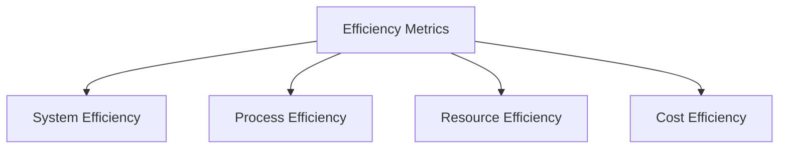

# Efficiency Metrics

## 📋 Overview
This document outlines the efficiency metrics and measurement strategies for our Operations Knowledge Base, tracking system performance and process optimization.

## 🎯 Metric Categories

### Core Metrics


### Measurement Framework
1. **Key Indicators**
   ```yaml
   efficiency_metrics:
     system_metrics:
       - response_time
       - throughput
       - resource_usage
       - error_rates
     process_metrics:
       - completion_time
       - automation_rate
       - error_reduction
       - cost_savings
   ```

2. **Performance Standards**
   - Efficiency targets
   - Performance benchmarks
   - Quality thresholds
   - Cost objectives

## 📊 System Efficiency

### Performance Metrics
1. **Response Time**
   ```python
   def measure_system_efficiency():
       track_response_times()
       measure_throughput()
       analyze_resource_usage()
       calculate_efficiency_ratio()
   ```

2. **Resource Utilization**
   - CPU efficiency
   - Memory usage
   - Storage optimization
   - Network efficiency

### Optimization Metrics
1. **System Optimization**
   - Cache hit rates
   - Query performance
   - Load distribution
   - Resource allocation

2. **Performance Trends**
   - Historical performance
   - Optimization impact
   - Efficiency gains
   - Bottleneck reduction

## 🔍 Process Efficiency

### Workflow Metrics
1. **Process Analytics**
   ```json
   {
     "process_metrics": {
       "measurements": ["completion_time", "error_rate", "automation_level"],
       "dimensions": ["process_type", "complexity", "volume"],
       "timeframes": ["real-time", "daily", "weekly", "monthly"]
     }
   }
   ```

2. **Task Metrics**
   - Task completion time
   - Error frequency
   - Rework rate
   - Quality scores

### Automation Metrics
1. **Automation Level**
   - Automation coverage
   - Manual vs automated
   - Time savings
   - Error reduction

2. **Automation Impact**
   - Productivity gains
   - Quality improvement
   - Cost reduction
   - User satisfaction

## 💰 Cost Efficiency

### Resource Costs
1. **Cost Tracking**
   - Infrastructure costs
   - Operational costs
   - Maintenance costs
   - Support costs

2. **Cost Optimization**
   - Resource optimization
   - Process optimization
   - Automation savings
   - Efficiency gains

### ROI Analysis
1. **Investment Returns**
   - Cost savings
   - Productivity gains
   - Quality improvements
   - Time savings

2. **Value Metrics**
   - Business value
   - User value
   - Process value
   - Innovation value

## 🔄 Resource Efficiency

### Resource Management
1. **Resource Utilization**
   - Resource allocation
   - Usage optimization
   - Capacity planning
   - Waste reduction

2. **Resource Metrics**
   - Utilization rates
   - Efficiency ratios
   - Optimization levels
   - Cost per unit

### Optimization Strategies
1. **Resource Optimization**
   - Allocation strategies
   - Usage patterns
   - Efficiency improvements
   - Cost reduction

2. **Impact Analysis**
   - Performance impact
   - Cost impact
   - User impact
   - Process impact

## 📈 Performance Analysis

### Performance Tracking
1. **Metric Collection**
   - Real-time metrics
   - Historical data
   - Trend analysis
   - Pattern detection

2. **Analysis Tools**
   - Performance analytics
   - Efficiency analysis
   - Cost analysis
   - Impact assessment

### Improvement Tracking
1. **Progress Metrics**
   - Efficiency gains
   - Performance improvements
   - Cost reductions
   - Quality enhancements

2. **Success Measures**
   - Goal achievement
   - Target metrics
   - Benchmark comparison
   - ROI calculation

## 🎯 Goal Setting

### Efficiency Goals
1. **Target Metrics**
   - Performance targets
   - Efficiency targets
   - Cost targets
   - Quality targets

2. **Progress Tracking**
   - Goal monitoring
   - Progress indicators
   - Achievement rates
   - Impact measurement

### Success Criteria
1. **Performance Standards**
   - Efficiency thresholds
   - Quality standards
   - Cost parameters
   - Impact measures

2. **Evaluation Methods**
   - Performance evaluation
   - Efficiency assessment
   - Cost analysis
   - Impact analysis

## 📝 Related Documentation
- [[adoption-metrics]]
- [[impact-metrics]]
- [[performance-tools]]
- [[cost-analysis]]

## 🔄 Change Log
| Date | Change | Author |
|------|--------|--------|
| YYYY-MM-DD | Initial efficiency metrics documentation | Name |

---

*Last updated: <% tp.date.now("YYYY-MM-DD") %>* 