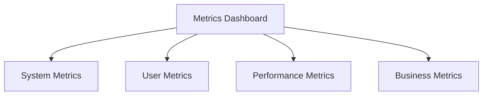

# Metrics Dashboard

## 📋 Overview
This document outlines the metrics dashboard framework and implementation for our Operations Knowledge Base, providing real-time visibility into key performance indicators and system health.

## 🎯 Dashboard Framework

### Core Components


### Dashboard Architecture
1. **Data Sources**
   ```yaml
   data_sources:
     system_data:
       - performance_metrics
       - resource_utilization
       - error_rates
       - health_status
     user_data:
       - usage_metrics
       - engagement_stats
       - satisfaction_scores
       - behavior_patterns
   ```

2. **Visualization Layers**
   - Real-time displays
   - Historical trends
   - Comparative analysis
   - Predictive insights

## 📊 Dashboard Components

### System Monitoring
1. **Performance Metrics**
   ```python
   def monitor_system_performance():
       track_response_times()
       measure_throughput()
       analyze_resource_usage()
       monitor_error_rates()
   ```

2. **Health Indicators**
   - System status
   - Component health
   - Resource levels
   - Error conditions

### User Analytics
1. **Usage Metrics**
   ```json
   {
     "user_metrics": {
       "dimensions": ["activity", "engagement", "satisfaction", "adoption"],
       "timeframes": ["real-time", "daily", "weekly", "monthly"],
       "views": ["individual", "team", "department", "organization"]
     }
   }
   ```

2. **Behavior Analysis**
   - Usage patterns
   - Feature adoption
   - Navigation flows
   - Content interaction

## 🔍 Visualization Types

### Chart Types
1. **Time Series**
   - Line charts
   - Area charts
   - Sparklines
   - Trend indicators

2. **Status Displays**
   - Gauges
   - Traffic lights
   - Progress bars
   - Status cards

### Interactive Elements
1. **User Controls**
   - Time range selectors
   - Filters
   - Drill-down options
   - Custom views

2. **Dynamic Updates**
   - Real-time refresh
   - Auto-scaling
   - Data streaming
   - Alert highlighting

## 📈 Dashboard Views

### Standard Views
1. **Executive Dashboard**
   - KPI overview
   - Strategic metrics
   - Business impact
   - Trend analysis

2. **Operational Dashboard**
   - System health
   - Performance metrics
   - Resource usage
   - Error tracking

### Custom Views
1. **Role-based Views**
   - Admin view
   - User view
   - Manager view
   - Analyst view

2. **Function-based Views**
   - Technical metrics
   - Business metrics
   - User metrics
   - Process metrics

## 🔄 Real-time Monitoring

### Live Updates
1. **Performance Tracking**
   - Current status
   - Active issues
   - Resource usage
   - User activity

2. **Alert System**
   - Threshold alerts
   - Trend alerts
   - Anomaly detection
   - Status changes

### Historical Analysis
1. **Trend Analysis**
   - Performance trends
   - Usage patterns
   - Growth trends
   - Issue patterns

2. **Comparative Analysis**
   - Period comparison
   - Benchmark analysis
   - Target tracking
   - Variance analysis

## 🔒 Access Control

### User Management
1. **Access Levels**
   - View permissions
   - Data access
   - Feature access
   - Admin rights

2. **Role Management**
   - Role definitions
   - Permission sets
   - Access controls
   - Audit logging

### Data Security
1. **Security Controls**
   - Data encryption
   - Access logging
   - Security monitoring
   - Compliance checks

2. **Privacy Protection**
   - Data masking
   - Anonymization
   - Access controls
   - Audit trails

## 📱 Mobile Access

### Mobile Interface
1. **Responsive Design**
   - Mobile layout
   - Touch optimization
   - Performance tuning
   - Offline access

2. **Mobile Features**
   - Quick views
   - Key metrics
   - Alert notifications
   - Action items

### Mobile Security
1. **Access Security**
   - Mobile authentication
   - Secure connection
   - Data protection
   - Session management

2. **Device Management**
   - Device registration
   - Access control
   - Remote wipe
   - Security policies

## 📝 Related Documentation
- [[reporting-system]]
- [[metrics-collection]]
- [[data-visualization]]
- [[access-control]]

## 🔄 Change Log
| Date | Change | Author |
|------|--------|--------|
| YYYY-MM-DD | Initial metrics dashboard documentation | Name |

---

*Last updated: <% tp.date.now("YYYY-MM-DD") %>* 