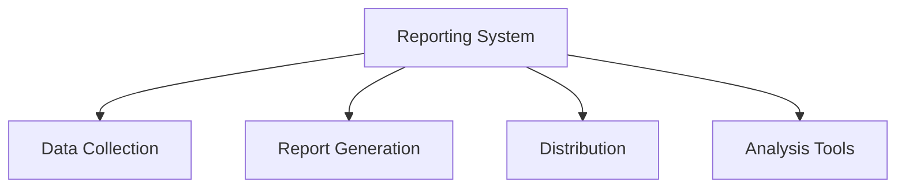

# Reporting System

## 📋 Overview
This document outlines the reporting system framework and implementation for our Operations Knowledge Base, providing comprehensive reporting capabilities for metrics, analysis, and insights.

## 🎯 Reporting Framework

### Core Components


### System Architecture
1. **Report Types**
   ```yaml
   report_categories:
     operational:
       - system_performance
       - resource_utilization
       - error_analysis
       - health_status
     business:
       - user_metrics
       - value_analysis
       - impact_assessment
       - trend_analysis
   ```

2. **Reporting Layers**
   - Raw data
   - Processed metrics
   - Analysis results
   - Executive summaries

## 📊 Report Generation

### Automated Reports
1. **Scheduled Reports**
   ```python
   def generate_scheduled_reports():
       collect_metrics()
       process_data()
       format_report()
       distribute_report()
   ```

2. **Event-triggered Reports**
   - Incident reports
   - Alert reports
   - Status changes
   - Threshold breaches

### Custom Reports
1. **Report Builder**
   ```json
   {
     "custom_reports": {
       "components": ["metrics", "charts", "analysis", "recommendations"],
       "formats": ["pdf", "html", "excel", "json"],
       "delivery": ["email", "dashboard", "api", "export"]
     }
   }
   ```

2. **Analysis Tools**
   - Data filtering
   - Metric selection
   - Visualization options
   - Export capabilities

## 📈 Report Types

### Standard Reports
1. **System Reports**
   - Performance reports
   - Resource reports
   - Error reports
   - Health reports

2. **Business Reports**
   - Usage reports
   - Value reports
   - Impact reports
   - Trend reports

### Special Reports
1. **Compliance Reports**
   - Audit reports
   - Security reports
   - Policy reports
   - Risk reports

2. **Analysis Reports**
   - Deep dive analysis
   - Root cause analysis
   - Pattern analysis
   - Predictive analysis

## 🔄 Report Workflow

### Generation Process
1. **Data Collection**
   - Metric gathering
   - Data validation
   - Processing rules
   - Quality checks

2. **Report Creation**
   - Template application
   - Data formatting
   - Chart generation
   - Analysis inclusion

### Distribution Process
1. **Delivery Methods**
   - Email distribution
   - Dashboard publishing
   - API access
   - Export options

2. **Access Control**
   - Permission checks
   - Role-based access
   - Security controls
   - Audit logging

## 📊 Data Management

### Data Sources
1. **Metric Sources**
   - System metrics
   - User metrics
   - Business metrics
   - Performance metrics

2. **Integration Points**
   - Database connections
   - API integrations
   - File imports
   - Real-time streams

### Data Processing
1. **Processing Pipeline**
   - Data cleaning
   - Transformation
   - Aggregation
   - Analysis

2. **Quality Control**
   - Validation rules
   - Consistency checks
   - Accuracy verification
   - Completeness checks

## 🔍 Analysis Tools

### Data Analysis
1. **Statistical Analysis**
   - Trend analysis
   - Pattern detection
   - Correlation analysis
   - Predictive modeling

2. **Business Analysis**
   - Impact assessment
   - Value analysis
   - ROI calculation
   - Performance evaluation

### Visualization Tools
1. **Chart Types**
   - Time series
   - Comparisons
   - Distributions
   - Relationships

2. **Interactive Features**
   - Drill-down capability
   - Filter options
   - Custom views
   - Export functions

## 🔒 Security and Compliance

### Security Controls
1. **Access Security**
   - Authentication
   - Authorization
   - Data protection
   - Audit trails

2. **Data Security**
   - Encryption
   - Masking
   - Retention
   - Disposal

### Compliance Requirements
1. **Regulatory Compliance**
   - Data protection
   - Privacy rules
   - Industry standards
   - Internal policies

2. **Audit Support**
   - Report history
   - Access logs
   - Change tracking
   - Version control

## 📱 Mobile Support

### Mobile Access
1. **Mobile Interface**
   - Responsive design
   - Touch optimization
   - Offline access
   - Sync capabilities

2. **Mobile Features**
   - Report viewing
   - Quick analysis
   - Alert notifications
   - Action items

### Mobile Security
1. **Device Security**
   - Authentication
   - Data protection
   - Session management
   - Remote control

## 📝 Related Documentation
- [[metrics-dashboard]]
- [[data-analysis]]
- [[security-controls]]
- [[compliance-requirements]]

## 🔄 Change Log
| Date | Change | Author |
|------|--------|--------|
| YYYY-MM-DD | Initial reporting system documentation | Name |

---

*Last updated: <% tp.date.now("YYYY-MM-DD") %>* 