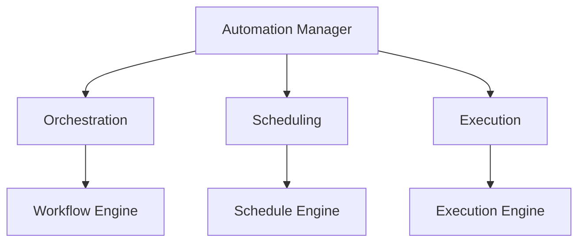

# Monitoring Automation Framework

```yaml
---
title: Monitoring Automation Framework
unit: [[units/Technology/agent_systems_unit]]
created: 2024-02-13
updated: 2024-02-13
owner: Agent Systems Unit
process_type: automation
criticality: high
reviewers:
  - Automation Team
  - Operations Team
  - Quality Team
status: draft
version: 1.0
tags:
  - automation
  - monitoring
  - orchestration
  - workflow
related_documents:
  - [[monitoring/monitoring_framework]]
  - [[monitoring/performance_framework]]
  - [[monitoring/metrics_framework]]
  - [[monitoring/alerting_framework]]
---
```

## Purpose & Scope
This document defines the automation framework for monitoring systems within the agent framework, providing comprehensive approaches for automating monitoring tasks, workflows, and responses. It integrates with the [[monitoring/monitoring_framework|Monitoring Framework]] and extends the capabilities defined in the [[monitoring/performance_framework|Performance Framework]].

## Automation Architecture

### 1. Core Components
#### 1.1 Automation Manager
```python
class AutomationManager:
    def __init__(self):
        self.orchestrator = WorkflowOrchestrator()
        self.scheduler = TaskScheduler()
        self.executor = TaskExecutor()
        self.monitor = AutomationMonitor()
        self.controller = AutomationController()
```

#### 1.2 Component Relationships


### 2. Workflow Orchestration
#### 2.1 Orchestration System
```python
class WorkflowOrchestrator:
    def __init__(self):
        self.engine = WorkflowEngine()
        self.designer = WorkflowDesigner()
        self.validator = WorkflowValidator()
        self.executor = WorkflowExecutor()

    async def orchestrate_workflow(self, workflow):
        design = await self.designer.design_workflow(workflow)
        validation = await self.validator.validate_workflow(design)
        execution = await self.executor.execute_workflow(validation)
        return await self.engine.manage_workflow(execution)
```

#### 2.2 Workflow Types
- [[monitoring/workflows/collection|Collection Workflows]]
  - Metric Collection
  - Data Aggregation
  - Data Processing
  - Data Storage

- [[monitoring/workflows/analysis|Analysis Workflows]]
  - Performance Analysis
  - Trend Analysis
  - Anomaly Detection
  - Pattern Recognition

### 3. Task Scheduling
#### 3.1 Scheduling System
```python
class TaskScheduler:
    def __init__(self):
        self.engine = ScheduleEngine()
        self.planner = SchedulePlanner()
        self.optimizer = ScheduleOptimizer()
        self.monitor = ScheduleMonitor()

    async def schedule_tasks(self, tasks):
        plan = await self.planner.create_schedule(tasks)
        optimization = await self.optimizer.optimize_schedule(plan)
        monitoring = await self.monitor.monitor_schedule(optimization)
        return await self.engine.execute_schedule(monitoring)
```

#### 3.2 Schedule Types
- [[monitoring/schedules/periodic|Periodic Schedules]]
- [[monitoring/schedules/event|Event-driven Schedules]]
- [[monitoring/schedules/conditional|Conditional Schedules]]
- [[monitoring/schedules/adaptive|Adaptive Schedules]]

### 4. Task Execution
#### 4.1 Execution System
```python
class TaskExecutor:
    def __init__(self):
        self.engine = ExecutionEngine()
        self.dispatcher = TaskDispatcher()
        self.coordinator = TaskCoordinator()
        self.monitor = ExecutionMonitor()

    async def execute_tasks(self, tasks):
        dispatch = await self.dispatcher.dispatch_tasks(tasks)
        coordination = await self.coordinator.coordinate_execution(dispatch)
        monitoring = await self.monitor.monitor_execution(coordination)
        return await self.engine.manage_execution(monitoring)
```

#### 4.2 Execution Types
- [[monitoring/execution/parallel|Parallel Execution]]
- [[monitoring/execution/sequential|Sequential Execution]]
- [[monitoring/execution/distributed|Distributed Execution]]
- [[monitoring/execution/conditional|Conditional Execution]]

### 5. Automation Control
#### 5.1 Control System
```python
class AutomationController:
    def __init__(self):
        self.engine = ControlEngine()
        self.policy = PolicyManager()
        self.enforcer = PolicyEnforcer()
        self.monitor = ControlMonitor()

    async def control_automation(self, automation):
        policy = await self.policy.get_policy(automation)
        enforcement = await self.enforcer.enforce_policy(policy)
        monitoring = await self.monitor.monitor_control(enforcement)
        return await self.engine.manage_control(monitoring)
```

#### 5.2 Control Types
- [[monitoring/control/workflow|Workflow Control]]
- [[monitoring/control/schedule|Schedule Control]]
- [[monitoring/control/execution|Execution Control]]
- [[monitoring/control/resource|Resource Control]]

## Implementation Guidelines

### 1. Automation Standards
#### 1.1 Standard Controls
```python
class AutomationStandards:
    async def validate_standards(self, automation):
        # Standards validation logic
        pass

    async def apply_standards(self, application):
        # Standards application
        pass

    async def verify_compliance(self, verification):
        # Compliance verification
        pass
```

#### 1.2 Standard Types
- [[monitoring/standards/workflow|Workflow Standards]]
- [[monitoring/standards/schedule|Schedule Standards]]
- [[monitoring/standards/execution|Execution Standards]]
- [[monitoring/standards/control|Control Standards]]

### 2. Automation Process
#### 2.1 Process System
```python
class AutomationProcess:
    def __init__(self):
        self.planner = ProcessPlanner()
        self.executor = ProcessExecutor()
        self.validator = ProcessValidator()
        self.monitor = ProcessMonitor()
```

#### 2.2 Process Types
- [[monitoring/processes/workflow|Workflow Process]]
- [[monitoring/processes/schedule|Schedule Process]]
- [[monitoring/processes/execution|Execution Process]]
- [[monitoring/processes/control|Control Process]]

## Quality Control

### 1. Automation Quality
#### 1.1 Quality Metrics
- Workflow Quality
- Schedule Quality
- Execution Quality
- Control Quality

#### 1.2 Quality Monitoring
```python
class QualityMonitoring:
    async def monitor_quality(self, automation):
        # Quality monitoring logic
        pass

    async def validate_quality(self, validation):
        # Quality validation logic
        pass

    async def measure_metrics(self, measurements):
        # Metrics measurement
        pass
```

### 2. Performance Management
#### 2.1 Performance Areas
- [[monitoring/performance/workflow|Workflow Performance]]
- [[monitoring/performance/schedule|Schedule Performance]]
- [[monitoring/performance/execution|Execution Performance]]
- [[monitoring/performance/control|Control Performance]]

#### 2.2 Optimization Areas
- [[monitoring/optimization/workflow|Workflow Optimization]]
- [[monitoring/optimization/schedule|Schedule Optimization]]
- [[monitoring/optimization/execution|Execution Optimization]]
- [[monitoring/optimization/control|Control Optimization]]

## Security Requirements

### 1. Automation Security
#### 1.1 Security Controls
```python
class AutomationSecurity:
    async def secure_automation(self, automation):
        # Security implementation logic
        pass

    async def validate_security(self, validation):
        # Security validation logic
        pass

    async def audit_automation(self, audit):
        # Automation auditing logic
        pass
```

#### 1.2 Security Areas
- [[security/automation/workflow|Workflow Security]]
- [[security/automation/schedule|Schedule Security]]
- [[security/automation/execution|Execution Security]]
- [[security/automation/control|Control Security]]

### 2. Documentation Requirements
- [[documentation/automation/workflow|Workflow Documentation]]
- [[documentation/automation/schedule|Schedule Documentation]]
- [[documentation/automation/execution|Execution Documentation]]
- [[documentation/automation/control|Control Documentation]]

## Related Documentation
### Internal Links
- [[monitoring/monitoring_framework|Monitoring Framework]]
- [[monitoring/performance_framework|Performance Framework]]
- [[monitoring/metrics_framework|Metrics Framework]]
- [[monitoring/alerting_framework|Alerting Framework]]

### External References
- Automation Standards
- Workflow Patterns
- Scheduling Guidelines
- Best Practices

## Maintenance
### Review Schedule
- Daily Automation Review
- Weekly Performance Review
- Monthly Security Assessment
- Quarterly Framework Audit

### Update Process
1. Automation Analysis
2. Quality Review
3. Security Assessment
4. Enhancement Planning
5. Implementation

## Appendices
### A. Workflow Patterns
```python
# Example workflow pattern
class WorkflowPattern:
    def __init__(self):
        self.designer = WorkflowDesigner()
        self.validator = WorkflowValidator()
        self.executor = WorkflowExecutor()
```

### B. Schedule Patterns
```python
# Example schedule pattern
class SchedulePattern:
    def __init__(self):
        self.planner = SchedulePlanner()
        self.optimizer = ScheduleOptimizer()
        self.monitor = ScheduleMonitor()
```

### C. Execution Patterns
```python
# Example execution pattern
class ExecutionPattern:
    def __init__(self):
        self.dispatcher = TaskDispatcher()
        self.coordinator = TaskCoordinator()
        self.monitor = ExecutionMonitor()
``` 