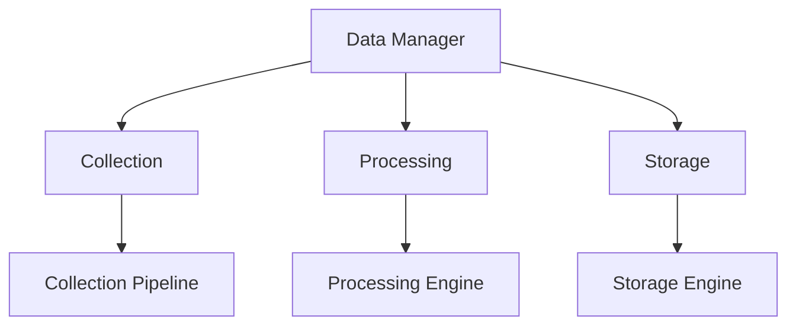

# Monitoring Data Framework

```yaml
---
title: Monitoring Data Framework
unit: [[units/Technology/agent_systems_unit]]
created: 2024-02-13
updated: 2024-02-13
owner: Agent Systems Unit
process_type: data
criticality: high
reviewers:
  - Data Team
  - Operations Team
  - Quality Team
status: draft
version: 1.0
tags:
  - data
  - monitoring
  - storage
  - analysis
related_documents:
  - [[monitoring/monitoring_framework]]
  - [[monitoring/metrics_framework]]
  - [[monitoring/performance_framework]]
  - [[monitoring/optimization_framework]]
---
```

## Purpose & Scope
This document defines the data management framework for monitoring systems within the agent framework, providing comprehensive approaches for collecting, processing, storing, and analyzing monitoring data. It integrates with the [[monitoring/monitoring_framework|Monitoring Framework]] and extends the capabilities defined in the [[monitoring/metrics_framework|Metrics Framework]].

## Data Architecture

### 1. Core Components
#### 1.1 Data Manager
```python
class DataManager:
    def __init__(self):
        self.collector = DataCollector()
        self.processor = DataProcessor()
        self.storage = DataStorage()
        self.analyzer = DataAnalyzer()
        self.archiver = DataArchiver()
```

#### 1.2 Component Relationships


### 2. Data Collection
#### 2.1 Collection System
```python
class DataCollector:
    def __init__(self):
        self.pipeline = CollectionPipeline()
        self.validator = DataValidator()
        self.transformer = DataTransformer()
        self.buffer = DataBuffer()

    async def collect_data(self, source):
        validation = await self.validator.validate_data(source)
        transformation = await self.transformer.transform_data(validation)
        buffering = await self.buffer.buffer_data(transformation)
        return await self.pipeline.process_data(buffering)
```

#### 2.2 Data Types
- [[monitoring/data/types/metrics|Metric Data]]
  - Performance Metrics
  - Resource Metrics
  - Business Metrics
  - System Metrics

- [[monitoring/data/types/events|Event Data]]
  - System Events
  - Application Events
  - Security Events
  - Business Events

### 3. Data Processing
#### 3.1 Processing System
```python
class DataProcessor:
    def __init__(self):
        self.engine = ProcessingEngine()
        self.enricher = DataEnricher()
        self.aggregator = DataAggregator()
        self.filter = DataFilter()

    async def process_data(self, data):
        enrichment = await self.enricher.enrich_data(data)
        aggregation = await self.aggregator.aggregate_data(enrichment)
        filtering = await self.filter.filter_data(aggregation)
        return await self.engine.process_data(filtering)
```

#### 3.2 Processing Types
- [[monitoring/data/processing/enrichment|Data Enrichment]]
- [[monitoring/data/processing/aggregation|Data Aggregation]]
- [[monitoring/data/processing/filtering|Data Filtering]]
- [[monitoring/data/processing/transformation|Data Transformation]]

### 4. Data Storage
#### 4.1 Storage System
```python
class DataStorage:
    def __init__(self):
        self.engine = StorageEngine()
        self.indexer = DataIndexer()
        self.compressor = DataCompressor()
        self.cache = DataCache()

    async def store_data(self, data):
        indexing = await self.indexer.index_data(data)
        compression = await self.compressor.compress_data(indexing)
        caching = await self.cache.cache_data(compression)
        return await self.engine.store_data(caching)
```

#### 4.2 Storage Types
- [[monitoring/data/storage/timeseries|Time Series Storage]]
- [[monitoring/data/storage/document|Document Storage]]
- [[monitoring/data/storage/object|Object Storage]]
- [[monitoring/data/storage/cache|Cache Storage]]

### 5. Data Analysis
#### 5.1 Analysis System
```python
class DataAnalyzer:
    def __init__(self):
        self.engine = AnalysisEngine()
        self.query = QueryEngine()
        self.statistics = StatisticsEngine()
        self.visualizer = DataVisualizer()

    async def analyze_data(self, data):
        query = await self.query.query_data(data)
        statistics = await self.statistics.calculate_statistics(query)
        visualization = await self.visualizer.visualize_data(statistics)
        return await self.engine.analyze_data(visualization)
```

#### 5.2 Analysis Types
- [[monitoring/data/analysis/statistical|Statistical Analysis]]
- [[monitoring/data/analysis/predictive|Predictive Analysis]]
- [[monitoring/data/analysis/diagnostic|Diagnostic Analysis]]
- [[monitoring/data/analysis/prescriptive|Prescriptive Analysis]]

## Implementation Guidelines

### 1. Data Standards
#### 1.1 Standard Controls
```python
class DataStandards:
    async def validate_standards(self, data):
        # Standards validation logic
        pass

    async def apply_standards(self, application):
        # Standards application
        pass

    async def verify_compliance(self, verification):
        # Compliance verification
        pass
```

#### 1.2 Standard Types
- [[monitoring/standards/data/collection|Collection Standards]]
- [[monitoring/standards/data/processing|Processing Standards]]
- [[monitoring/standards/data/storage|Storage Standards]]
- [[monitoring/standards/data/analysis|Analysis Standards]]

### 2. Data Process
#### 2.1 Process System
```python
class DataProcess:
    def __init__(self):
        self.planner = ProcessPlanner()
        self.executor = ProcessExecutor()
        self.validator = ProcessValidator()
        self.monitor = ProcessMonitor()
```

#### 2.2 Process Types
- [[monitoring/processes/data/collection|Collection Process]]
- [[monitoring/processes/data/processing|Processing Process]]
- [[monitoring/processes/data/storage|Storage Process]]
- [[monitoring/processes/data/analysis|Analysis Process]]

## Quality Control

### 1. Data Quality
#### 1.1 Quality Metrics
- Collection Quality
- Processing Quality
- Storage Quality
- Analysis Quality

#### 1.2 Quality Monitoring
```python
class QualityMonitoring:
    async def monitor_quality(self, data):
        # Quality monitoring logic
        pass

    async def validate_quality(self, validation):
        # Quality validation logic
        pass

    async def measure_metrics(self, measurements):
        # Metrics measurement
        pass
```

### 2. Performance Management
#### 2.1 Performance Areas
- [[monitoring/performance/data/collection|Collection Performance]]
- [[monitoring/performance/data/processing|Processing Performance]]
- [[monitoring/performance/data/storage|Storage Performance]]
- [[monitoring/performance/data/analysis|Analysis Performance]]

#### 2.2 Optimization Areas
- [[monitoring/optimization/data/collection|Collection Optimization]]
- [[monitoring/optimization/data/processing|Processing Optimization]]
- [[monitoring/optimization/data/storage|Storage Optimization]]
- [[monitoring/optimization/data/analysis|Analysis Optimization]]

## Security Requirements

### 1. Data Security
#### 1.1 Security Controls
```python
class DataSecurity:
    async def secure_data(self, data):
        # Security implementation logic
        pass

    async def validate_security(self, validation):
        # Security validation logic
        pass

    async def audit_data(self, audit):
        # Data auditing logic
        pass
```

#### 1.2 Security Areas
- [[security/data/collection|Collection Security]]
- [[security/data/processing|Processing Security]]
- [[security/data/storage|Storage Security]]
- [[security/data/analysis|Analysis Security]]

### 2. Documentation Requirements
- [[documentation/data/collection|Collection Documentation]]
- [[documentation/data/processing|Processing Documentation]]
- [[documentation/data/storage|Storage Documentation]]
- [[documentation/data/analysis|Analysis Documentation]]

## Related Documentation
### Internal Links
- [[monitoring/monitoring_framework|Monitoring Framework]]
- [[monitoring/metrics_framework|Metrics Framework]]
- [[monitoring/performance_framework|Performance Framework]]
- [[monitoring/optimization_framework|Optimization Framework]]

### External References
- Data Management Standards
- Analysis Patterns
- Storage Guidelines
- Best Practices

## Maintenance
### Review Schedule
- Daily Data Review
- Weekly Performance Review
- Monthly Storage Assessment
- Quarterly Framework Audit

### Update Process
1. Data Analysis
2. Quality Review
3. Security Assessment
4. Enhancement Planning
5. Implementation

## Appendices
### A. Data Patterns
```python
# Example data pattern
class DataPattern:
    def __init__(self):
        self.collector = DataCollector()
        self.processor = DataProcessor()
        self.analyzer = DataAnalyzer()
```

### B. Storage Patterns
```python
# Example storage pattern
class StoragePattern:
    def __init__(self):
        self.engine = StorageEngine()
        self.indexer = DataIndexer()
        self.cache = DataCache()
```

### C. Analysis Patterns
```python
# Example analysis pattern
class AnalysisPattern:
    def __init__(self):
        self.query = QueryEngine()
        self.statistics = StatisticsEngine()
        self.visualizer = DataVisualizer()
``` 