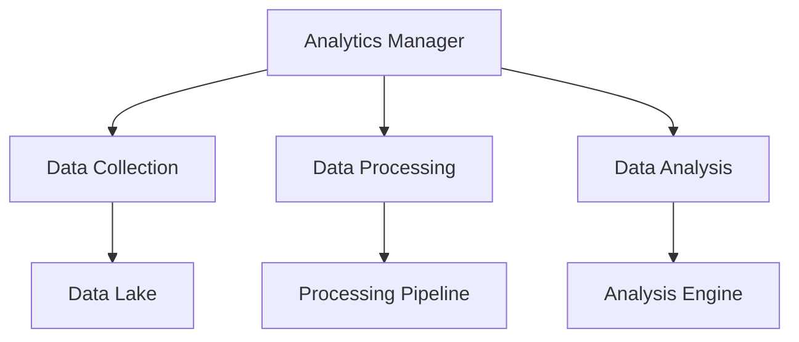

# Monitoring Analytics Framework

```yaml
---
title: Monitoring Analytics Framework
unit: [[units/Technology/agent_systems_unit]]
created: 2024-02-13
updated: 2024-02-13
owner: Agent Systems Unit
process_type: analytics
criticality: high
reviewers:
  - Analytics Team
  - Data Science Team
  - Quality Team
status: draft
version: 1.0
tags:
  - analytics
  - monitoring
  - data
  - insights
related_documents:
  - [[monitoring/monitoring_implementation]]
  - [[monitoring/monitoring_patterns]]
  - [[monitoring/monitoring_integration]]
  - [[monitoring/monitoring_security]]
---
```

## Purpose & Scope
This document defines the analytics framework for monitoring systems within the agent framework, providing comprehensive analytics processes, standards, and best practices for deriving insights from monitoring data.

## Analytics Architecture

### 1. Core Components
#### 1.1 Analytics Manager
```python
class MonitoringAnalyticsManager:
    def __init__(self):
        self.collector = DataCollector()
        self.processor = DataProcessor()
        self.analyzer = DataAnalyzer()
        self.predictor = DataPredictor()
        self.reporter = AnalyticsReporter()
```

#### 1.2 Component Relationships


### 2. Data Collection
#### 2.1 Collection System
```python
class DataCollector:
    def __init__(self):
        self.sources = DataSourceRegistry()
        self.ingestion = DataIngestionPipeline()
        self.validator = DataValidator()
        self.storage = DataStorage()

    async def collect_data(self, sources):
        registration = await self.sources.register_sources(sources)
        ingestion = await self.ingestion.ingest_data(registration)
        validation = await self.validator.validate_data(ingestion)
        return await self.storage.store_data(validation)
```

#### 2.2 Data Types
- Metric Data
- Event Data
- Log Data
- Trace Data

### 3. Data Processing
#### 3.1 Processing System
```python
class DataProcessor:
    def __init__(self):
        self.pipeline = ProcessingPipeline()
        self.transformer = DataTransformer()
        self.enricher = DataEnricher()
        self.aggregator = DataAggregator()

    async def process_data(self, data):
        transformation = await self.transformer.transform_data(data)
        enrichment = await self.enricher.enrich_data(transformation)
        aggregation = await self.aggregator.aggregate_data(enrichment)
        return await self.pipeline.process_data(aggregation)
```

#### 3.2 Processing Types
- Stream Processing
- Batch Processing
- Real-time Processing
- Historical Processing

### 4. Data Analysis
#### 4.1 Analysis System
```python
class DataAnalyzer:
    def __init__(self):
        self.engine = AnalysisEngine()
        self.models = ModelRegistry()
        self.evaluator = ModelEvaluator()
        self.optimizer = ModelOptimizer()

    async def analyze_data(self, data):
        model = await self.models.get_model(data)
        analysis = await self.engine.analyze_data(data, model)
        evaluation = await self.evaluator.evaluate_results(analysis)
        return await self.optimizer.optimize_model(evaluation)
```

#### 4.2 Analysis Types
- Statistical Analysis
- Pattern Analysis
- Trend Analysis
- Anomaly Detection

### 5. Data Prediction
#### 5.1 Prediction System
```python
class DataPredictor:
    def __init__(self):
        self.engine = PredictionEngine()
        self.models = PredictiveModels()
        self.trainer = ModelTrainer()
        self.validator = ModelValidator()

    async def predict_data(self, data):
        model = await self.models.get_model(data)
        training = await self.trainer.train_model(model, data)
        validation = await self.validator.validate_model(training)
        return await self.engine.generate_predictions(validation)
```

#### 5.2 Prediction Types
- Trend Prediction
- Anomaly Prediction
- Resource Prediction
- Performance Prediction

### 6. Analytics Reporting
#### 6.1 Reporting System
```python
class AnalyticsReporter:
    def __init__(self):
        self.generator = ReportGenerator()
        self.visualizer = DataVisualizer()
        self.formatter = ReportFormatter()
        self.distributor = ReportDistributor()

    async def generate_report(self, results):
        visualization = await self.visualizer.visualize_data(results)
        formatting = await self.formatter.format_report(visualization)
        distribution = await self.distributor.distribute_report(formatting)
        return await self.generator.generate_report(distribution)
```

#### 6.2 Report Types
- Analytics Reports
- Prediction Reports
- Trend Reports
- Anomaly Reports

## Implementation Guidelines

### 1. Analytics Standards
#### 1.1 Standard Controls
```python
class AnalyticsStandards:
    async def validate_standards(self, analytics):
        # Standards validation logic
        pass

    async def apply_standards(self, application):
        # Standards application
        pass

    async def verify_compliance(self, verification):
        # Compliance verification
        pass
```

#### 1.2 Standard Types
- Data Standards
- Model Standards
- Analysis Standards
- Reporting Standards

### 2. Analytics Process
#### 2.1 Process System
```python
class AnalyticsProcess:
    def __init__(self):
        self.planner = ProcessPlanner()
        self.executor = ProcessExecutor()
        self.validator = ProcessValidator()
        self.monitor = ProcessMonitor()
```

#### 2.2 Process Types
- Collection Process
- Analysis Process
- Prediction Process
- Reporting Process

## Quality Control

### 1. Analytics Quality
#### 1.1 Quality Metrics
- Data Quality
- Model Quality
- Analysis Quality
- Prediction Quality

#### 1.2 Quality Monitoring
```python
class QualityMonitoring:
    async def monitor_quality(self, analytics):
        # Quality monitoring logic
        pass

    async def validate_quality(self, validation):
        # Quality validation logic
        pass

    async def measure_metrics(self, metrics):
        # Metrics measurement
        pass
```

### 2. Performance Management
#### 2.1 Performance Areas
- Data Performance
- Model Performance
- Analysis Performance
- Prediction Performance

#### 2.2 Optimization
- Data Optimization
- Model Optimization
- Analysis Optimization
- Prediction Optimization

## Security Requirements

### 1. Analytics Security
#### 1.1 Security Controls
```python
class AnalyticsSecurity:
    async def secure_analytics(self, analytics):
        # Security implementation logic
        pass

    async def validate_security(self, validation):
        # Security validation logic
        pass

    async def audit_analytics(self, audit):
        # Analytics auditing logic
        pass
```

#### 1.2 Security Areas
- Data Security
- Model Security
- Analysis Security
- Report Security

### 2. Documentation Requirements
- Data Documentation
- Model Documentation
- Analysis Documentation
- Report Documentation

## Related Documentation
### Internal Links
- [[monitoring/monitoring_implementation|Monitoring Implementation]]
- [[monitoring/monitoring_patterns|Monitoring Patterns]]
- [[monitoring/monitoring_integration|Monitoring Integration]]
- [[monitoring/monitoring_security|Monitoring Security]]

### External References
- Analytics Standards
- Data Science Standards
- Security Standards
- Industry Best Practices

## Maintenance
### Review Schedule
- Daily Analytics Review
- Weekly Model Review
- Monthly Quality Assessment
- Quarterly Framework Audit

### Update Process
1. Analytics Analysis
2. Model Review
3. Quality Assessment
4. Enhancement Planning
5. Implementation

## Appendices
### A. Analytics Patterns
```python
# Example analytics pattern
class AnalyticsPattern:
    def __init__(self):
        self.collector = DataCollector()
        self.analyzer = DataAnalyzer()
        self.predictor = DataPredictor()
```

### B. Model Patterns
```python
# Example model pattern
class ModelPattern:
    def __init__(self):
        self.trainer = ModelTrainer()
        self.validator = ModelValidator()
        self.optimizer = ModelOptimizer()
```

### C. Reporting Patterns
```python
# Example reporting pattern
class ReportingPattern:
    def __init__(self):
        self.generator = ReportGenerator()
        self.visualizer = DataVisualizer()
        self.distributor = ReportDistributor()
``` 