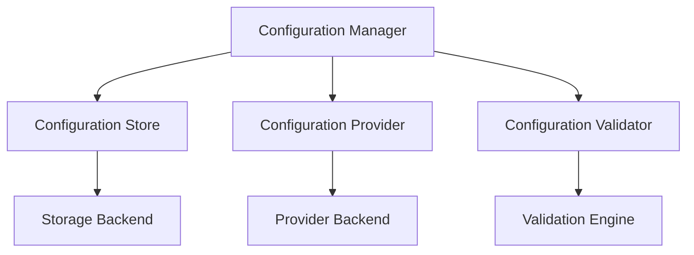

# Monitoring Configuration Framework

```yaml
---
title: Monitoring Configuration Framework
unit: [[units/Technology/agent_systems_unit]]
created: 2024-02-13
updated: 2024-02-13
owner: Agent Systems Unit
process_type: configuration
criticality: high
reviewers:
  - Operations Team
  - Development Team
  - Architecture Team
status: draft
version: 1.0
tags:
  - configuration
  - monitoring
  - management
  - settings
related_documents:
  - [[monitoring/monitoring_implementation]]
  - [[monitoring/monitoring_patterns]]
  - [[monitoring/monitoring_integration]]
  - [[monitoring/monitoring_security]]
---
```

## Purpose & Scope
This document defines the configuration framework for monitoring systems within the agent framework, providing comprehensive configuration management, standards, and best practices for monitoring components.

## Configuration Architecture

### 1. Core Components
#### 1.1 Configuration Manager
```python
class MonitoringConfigurationManager:
    def __init__(self):
        self.store = ConfigurationStore()
        self.provider = ConfigurationProvider()
        self.validator = ConfigurationValidator()
        self.monitor = ConfigurationMonitor()
        self.deployer = ConfigurationDeployer()
```

#### 1.2 Component Relationships


### 2. Configuration Store
#### 2.1 Storage System
```python
class ConfigurationStore:
    def __init__(self):
        self.backend = StorageBackend()
        self.cache = ConfigurationCache()
        self.indexer = ConfigurationIndexer()
        self.archiver = ConfigurationArchiver()

    async def manage_configuration(self, config):
        storage = await self.backend.store_configuration(config)
        caching = await self.cache.cache_configuration(storage)
        indexing = await self.indexer.index_configuration(caching)
        return await self.archiver.archive_configuration(indexing)
```

#### 2.2 Storage Types
- File Storage
- Database Storage
- Cache Storage
- Archive Storage

### 3. Configuration Provider
#### 3.1 Provider System
```python
class ConfigurationProvider:
    def __init__(self):
        self.backend = ProviderBackend()
        self.resolver = ConfigurationResolver()
        self.loader = ConfigurationLoader()
        self.transformer = ConfigurationTransformer()

    async def provide_configuration(self, request):
        resolution = await self.resolver.resolve_configuration(request)
        loading = await self.loader.load_configuration(resolution)
        transformation = await self.transformer.transform_configuration(loading)
        return await self.backend.provide_configuration(transformation)
```

#### 3.2 Provider Types
- File Provider
- Environment Provider
- Service Provider
- Remote Provider

### 4. Configuration Validator
#### 4.1 Validation System
```python
class ConfigurationValidator:
    def __init__(self):
        self.engine = ValidationEngine()
        self.schema = SchemaValidator()
        self.rules = RuleValidator()
        self.reporter = ValidationReporter()

    async def validate_configuration(self, config):
        schema = await self.schema.validate_schema(config)
        rules = await self.rules.validate_rules(schema)
        validation = await self.engine.validate_configuration(rules)
        return await self.reporter.report_validation(validation)
```

#### 4.2 Validation Types
- Schema Validation
- Rule Validation
- Type Validation
- Format Validation

### 5. Configuration Monitor
#### 5.1 Monitoring System
```python
class ConfigurationMonitor:
    def __init__(self):
        self.collector = MetricCollector()
        self.analyzer = ConfigurationAnalyzer()
        self.alerter = AlertManager()
        self.reporter = ReportGenerator()

    async def monitor_configuration(self, config):
        collection = await self.collector.collect_metrics(config)
        analysis = await self.analyzer.analyze_configuration(collection)
        alerts = await self.alerter.process_alerts(analysis)
        return await self.reporter.generate_report(analysis)
```

#### 5.2 Monitoring Types
- Change Monitoring
- Access Monitoring
- Usage Monitoring
- Health Monitoring

### 6. Configuration Deployer
#### 6.1 Deployment System
```python
class ConfigurationDeployer:
    def __init__(self):
        self.pipeline = DeploymentPipeline()
        self.distributor = ConfigurationDistributor()
        self.applier = ConfigurationApplier()
        self.verifier = DeploymentVerifier()

    async def deploy_configuration(self, config):
        distribution = await self.distributor.distribute_configuration(config)
        application = await self.applier.apply_configuration(distribution)
        verification = await self.verifier.verify_deployment(application)
        return await self.pipeline.process_deployment(verification)
```

#### 6.2 Deployment Types
- Rolling Deployment
- Atomic Deployment
- Staged Deployment
- Emergency Deployment

## Management Guidelines

### 1. Configuration Standards
#### 1.1 Standard Controls
```python
class ConfigurationStandards:
    async def validate_standards(self, config):
        # Standards validation logic
        pass

    async def apply_standards(self, application):
        # Standards application
        pass

    async def verify_compliance(self, verification):
        # Compliance verification
        pass
```

#### 1.2 Standard Types
- Format Standards
- Structure Standards
- Naming Standards
- Version Standards

### 2. Change Management
#### 2.1 Change System
```python
class ChangeManager:
    def __init__(self):
        self.tracker = ChangeTracker()
        self.controller = ChangeController()
        self.validator = ChangeValidator()
        self.monitor = ChangeMonitor()
```

#### 2.2 Change Types
- Planned Changes
- Emergency Changes
- Rollback Changes
- Version Changes

## Quality Control

### 1. Configuration Quality
#### 1.1 Quality Metrics
- Accuracy Metrics
- Consistency Metrics
- Performance Metrics
- Reliability Metrics

#### 1.2 Quality Monitoring
```python
class QualityMonitoring:
    async def monitor_quality(self, config):
        # Quality monitoring logic
        pass

    async def validate_quality(self, validation):
        # Quality validation logic
        pass

    async def measure_metrics(self, metrics):
        # Metrics measurement
        pass
```

### 2. Performance Management
#### 2.1 Performance Areas
- Access Performance
- Update Performance
- Validation Performance
- Deployment Performance

#### 2.2 Optimization
- Access Optimization
- Storage Optimization
- Validation Optimization
- Deployment Optimization

## Security Requirements

### 1. Configuration Security
#### 1.1 Security Controls
```python
class ConfigurationSecurity:
    async def secure_configuration(self, config):
        # Security implementation logic
        pass

    async def validate_security(self, validation):
        # Security validation logic
        pass

    async def audit_access(self, audit):
        # Access auditing logic
        pass
```

#### 1.2 Security Areas
- Access Security
- Storage Security
- Transport Security
- Audit Security

### 2. Documentation Requirements
- Configuration Documentation
- Change Documentation
- Security Documentation
- Audit Documentation

## Related Documentation
### Internal Links
- [[monitoring/monitoring_implementation|Monitoring Implementation]]
- [[monitoring/monitoring_patterns|Monitoring Patterns]]
- [[monitoring/monitoring_integration|Monitoring Integration]]
- [[monitoring/monitoring_security|Monitoring Security]]

### External References
- Configuration Standards
- Management Guidelines
- Security Standards
- Industry Best Practices

## Maintenance
### Review Schedule
- Daily Configuration Review
- Weekly Change Review
- Monthly Security Assessment
- Quarterly Framework Audit

### Update Process
1. Configuration Analysis
2. Change Review
3. Security Assessment
4. Enhancement Planning
5. Implementation

## Appendices
### A. Configuration Patterns
```python
# Example configuration pattern
class ConfigurationPattern:
    def __init__(self):
        self.store = ConfigurationStore()
        self.provider = ConfigurationProvider()
        self.validator = ConfigurationValidator()
```

### B. Change Patterns
```python
# Example change pattern
class ChangePattern:
    def __init__(self):
        self.tracker = ChangeTracker()
        self.controller = ChangeController()
        self.validator = ChangeValidator()
```

### C. Security Patterns
```python
# Example security pattern
class SecurityPattern:
    def __init__(self):
        self.validator = SecurityValidator()
        self.control = AccessControl()
        self.audit = AuditLogger()
``` 