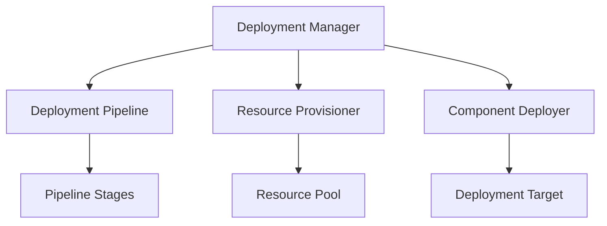

# Monitoring Deployment Framework

```yaml
---
title: Monitoring Deployment Framework
unit: [[units/Technology/agent_systems_unit]]
created: 2024-02-13
updated: 2024-02-13
owner: Agent Systems Unit
process_type: deployment
criticality: high
reviewers:
  - Operations Team
  - Development Team
  - Infrastructure Team
status: draft
version: 1.0
tags:
  - deployment
  - monitoring
  - operations
  - infrastructure
related_documents:
  - [[monitoring/monitoring_implementation]]
  - [[monitoring/monitoring_configuration]]
  - [[monitoring/monitoring_integration]]
  - [[monitoring/monitoring_security]]
---
```

## Purpose & Scope
This document defines the deployment framework for monitoring systems within the agent framework, providing comprehensive deployment processes, standards, and best practices for monitoring components.

## Deployment Architecture

### 1. Core Components
#### 1.1 Deployment Manager
```python
class MonitoringDeploymentManager:
    def __init__(self):
        self.pipeline = DeploymentPipeline()
        self.provisioner = ResourceProvisioner()
        self.deployer = ComponentDeployer()
        self.validator = DeploymentValidator()
        self.monitor = DeploymentMonitor()
```

#### 1.2 Component Relationships


### 2. Deployment Pipeline
#### 2.1 Pipeline System
```python
class DeploymentPipeline:
    def __init__(self):
        self.stages = PipelineStages()
        self.executor = StageExecutor()
        self.validator = StageValidator()
        self.monitor = PipelineMonitor()

    async def execute_pipeline(self, deployment):
        stages = await self.stages.create_stages(deployment)
        execution = await self.executor.execute_stages(stages)
        validation = await self.validator.validate_stages(execution)
        return await self.monitor.monitor_pipeline(validation)
```

#### 2.2 Pipeline Stages
- Build Stage
- Test Stage
- Deploy Stage
- Verify Stage

### 3. Resource Provisioner
#### 3.1 Provisioning System
```python
class ResourceProvisioner:
    def __init__(self):
        self.manager = ResourceManager()
        self.allocator = ResourceAllocator()
        self.scheduler = ResourceScheduler()
        self.monitor = ResourceMonitor()

    async def provision_resources(self, requirements):
        allocation = await self.allocator.allocate_resources(requirements)
        scheduling = await self.scheduler.schedule_resources(allocation)
        management = await self.manager.manage_resources(scheduling)
        return await self.monitor.monitor_resources(management)
```

#### 3.2 Resource Types
- Compute Resources
- Storage Resources
- Network Resources
- Security Resources

### 4. Component Deployer
#### 4.1 Deployment System
```python
class ComponentDeployer:
    def __init__(self):
        self.orchestrator = DeploymentOrchestrator()
        self.executor = DeploymentExecutor()
        self.validator = ComponentValidator()
        self.monitor = ComponentMonitor()

    async def deploy_components(self, components):
        orchestration = await self.orchestrator.orchestrate_deployment(components)
        execution = await self.executor.execute_deployment(orchestration)
        validation = await self.validator.validate_components(execution)
        return await self.monitor.monitor_components(validation)
```

#### 4.2 Deployment Types
- Rolling Deployment
- Blue-Green Deployment
- Canary Deployment
- Emergency Deployment

### 5. Deployment Validation
#### 5.1 Validation System
```python
class DeploymentValidator:
    def __init__(self):
        self.engine = ValidationEngine()
        self.tester = DeploymentTester()
        self.verifier = HealthVerifier()
        self.reporter = ValidationReporter()

    async def validate_deployment(self, deployment):
        testing = await self.tester.test_deployment(deployment)
        verification = await self.verifier.verify_health(testing)
        validation = await self.engine.validate_results(verification)
        return await self.reporter.report_validation(validation)
```

#### 5.2 Validation Types
- Health Validation
- Performance Validation
- Security Validation
- Integration Validation

### 6. Deployment Monitor
#### 6.1 Monitoring System
```python
class DeploymentMonitor:
    def __init__(self):
        self.collector = MetricCollector()
        self.analyzer = DeploymentAnalyzer()
        self.alerter = AlertManager()
        self.reporter = ReportGenerator()

    async def monitor_deployment(self, deployment):
        collection = await self.collector.collect_metrics(deployment)
        analysis = await self.analyzer.analyze_deployment(collection)
        alerts = await self.alerter.process_alerts(analysis)
        return await self.reporter.generate_report(analysis)
```

#### 6.2 Monitoring Types
- Health Monitoring
- Performance Monitoring
- Resource Monitoring
- Security Monitoring

## Implementation Guidelines

### 1. Deployment Standards
#### 1.1 Standard Controls
```python
class DeploymentStandards:
    async def validate_standards(self, deployment):
        # Standards validation logic
        pass

    async def apply_standards(self, application):
        # Standards application
        pass

    async def verify_compliance(self, verification):
        # Compliance verification
        pass
```

#### 1.2 Standard Types
- Process Standards
- Resource Standards
- Security Standards
- Quality Standards

### 2. Deployment Process
#### 2.1 Process System
```python
class DeploymentProcess:
    def __init__(self):
        self.planner = ProcessPlanner()
        self.executor = ProcessExecutor()
        self.validator = ProcessValidator()
        self.monitor = ProcessMonitor()
```

#### 2.2 Process Types
- Planning Process
- Execution Process
- Validation Process
- Monitoring Process

## Quality Control

### 1. Deployment Quality
#### 1.1 Quality Metrics
- Success Rate
- Performance Metrics
- Resource Metrics
- Health Metrics

#### 1.2 Quality Monitoring
```python
class QualityMonitoring:
    async def monitor_quality(self, deployment):
        # Quality monitoring logic
        pass

    async def validate_quality(self, validation):
        # Quality validation logic
        pass

    async def measure_metrics(self, metrics):
        # Metrics measurement
        pass
```

### 2. Performance Management
#### 2.1 Performance Areas
- Deployment Performance
- Resource Performance
- System Performance
- Network Performance

#### 2.2 Optimization
- Process Optimization
- Resource Optimization
- System Optimization
- Network Optimization

## Security Requirements

### 1. Deployment Security
#### 1.1 Security Controls
```python
class DeploymentSecurity:
    async def secure_deployment(self, deployment):
        # Security implementation logic
        pass

    async def validate_security(self, validation):
        # Security validation logic
        pass

    async def audit_deployment(self, audit):
        # Deployment auditing logic
        pass
```

#### 1.2 Security Areas
- Process Security
- Resource Security
- Network Security
- Access Security

### 2. Documentation Requirements
- Process Documentation
- Resource Documentation
- Security Documentation
- Audit Documentation

## Related Documentation
### Internal Links
- [[monitoring/monitoring_implementation|Monitoring Implementation]]
- [[monitoring/monitoring_configuration|Monitoring Configuration]]
- [[monitoring/monitoring_integration|Monitoring Integration]]
- [[monitoring/monitoring_security|Monitoring Security]]

### External References
- Deployment Standards
- Process Guidelines
- Security Standards
- Industry Best Practices

## Maintenance
### Review Schedule
- Daily Deployment Review
- Weekly Process Review
- Monthly Security Assessment
- Quarterly Framework Audit

### Update Process
1. Deployment Analysis
2. Process Review
3. Security Assessment
4. Enhancement Planning
5. Implementation

## Appendices
### A. Deployment Patterns
```python
# Example deployment pattern
class DeploymentPattern:
    def __init__(self):
        self.pipeline = DeploymentPipeline()
        self.provisioner = ResourceProvisioner()
        self.deployer = ComponentDeployer()
```

### B. Process Patterns
```python
# Example process pattern
class ProcessPattern:
    def __init__(self):
        self.planner = ProcessPlanner()
        self.executor = ProcessExecutor()
        self.validator = ProcessValidator()
```

### C. Security Patterns
```python
# Example security pattern
class SecurityPattern:
    def __init__(self):
        self.validator = SecurityValidator()
        self.control = AccessControl()
        self.audit = AuditLogger()
``` 