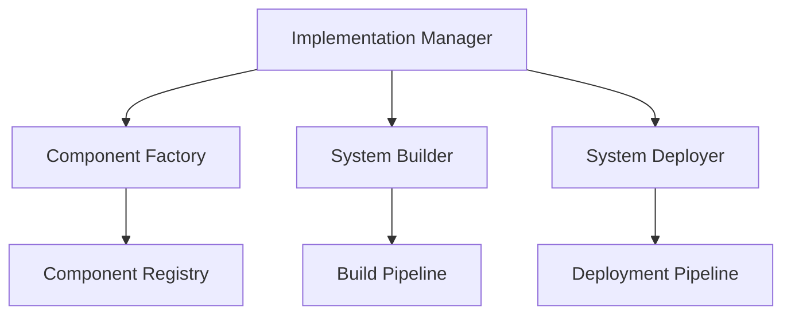

# Monitoring Implementation Framework

```yaml
---
title: Monitoring Implementation Framework
unit: [[units/Technology/agent_systems_unit]]
created: 2024-02-13
updated: 2024-02-13
owner: Agent Systems Unit
process_type: implementation
criticality: high
reviewers:
  - Development Team
  - Architecture Team
  - Quality Team
status: draft
version: 1.0
tags:
  - implementation
  - monitoring
  - development
  - standards
related_documents:
  - [[monitoring/monitoring_patterns]]
  - [[monitoring/monitoring_integration]]
  - [[monitoring/monitoring_security]]
  - [[monitoring/resource_monitoring]]
---
```

## Purpose & Scope
This document defines the implementation framework for monitoring systems within the agent framework, providing comprehensive implementation guidelines, standards, and best practices for monitoring components.

## Implementation Architecture

### 1. Core Components
#### 1.1 Implementation Manager
```python
class MonitoringImplementationManager:
    def __init__(self):
        self.factory = ComponentFactory()
        self.builder = SystemBuilder()
        self.deployer = SystemDeployer()
        self.validator = ImplementationValidator()
        self.monitor = ImplementationMonitor()
```

#### 1.2 Component Relationships


### 2. Component Factory
#### 2.1 Factory System
```python
class ComponentFactory:
    def __init__(self):
        self.registry = ComponentRegistry()
        self.creator = ComponentCreator()
        self.validator = ComponentValidator()
        self.monitor = ComponentMonitor()

    async def create_component(self, spec):
        registration = await self.registry.register_component(spec)
        creation = await self.creator.create_component(registration)
        validation = await self.validator.validate_component(creation)
        return await self.monitor.monitor_component(validation)
```

#### 2.2 Component Types
- Collector Components
- Analyzer Components
- Processor Components
- Reporter Components

### 3. System Builder
#### 3.1 Builder System
```python
class SystemBuilder:
    def __init__(self):
        self.pipeline = BuildPipeline()
        self.assembler = SystemAssembler()
        self.tester = SystemTester()
        self.validator = BuildValidator()

    async def build_system(self, components):
        assembly = await self.assembler.assemble_system(components)
        testing = await self.tester.test_system(assembly)
        validation = await self.validator.validate_build(testing)
        return await self.pipeline.process_build(validation)
```

#### 3.2 Build Types
- Development Build
- Testing Build
- Staging Build
- Production Build

### 4. System Deployer
#### 4.1 Deployment System
```python
class SystemDeployer:
    def __init__(self):
        self.pipeline = DeploymentPipeline()
        self.provisioner = ResourceProvisioner()
        self.deployer = ComponentDeployer()
        self.validator = DeploymentValidator()

    async def deploy_system(self, build):
        provisioning = await self.provisioner.provision_resources(build)
        deployment = await self.deployer.deploy_components(provisioning)
        validation = await self.validator.validate_deployment(deployment)
        return await self.pipeline.process_deployment(validation)
```

#### 4.2 Deployment Types
- Development Deployment
- Testing Deployment
- Staging Deployment
- Production Deployment

### 5. Implementation Validation
#### 5.1 Validation System
```python
class ImplementationValidator:
    def __init__(self):
        self.engine = ValidationEngine()
        self.tester = ImplementationTester()
        self.analyzer = QualityAnalyzer()
        self.reporter = ValidationReporter()

    async def validate_implementation(self, implementation):
        testing = await self.tester.test_implementation(implementation)
        analysis = await self.analyzer.analyze_quality(testing)
        validation = await self.engine.validate_results(analysis)
        return await self.reporter.report_validation(validation)
```

#### 5.2 Validation Types
- Component Validation
- System Validation
- Quality Validation
- Performance Validation

### 6. Implementation Monitoring
#### 6.1 Monitoring System
```python
class ImplementationMonitor:
    def __init__(self):
        self.collector = MetricCollector()
        self.analyzer = ImplementationAnalyzer()
        self.alerter = AlertManager()
        self.reporter = ReportGenerator()

    async def monitor_implementation(self, implementation):
        collection = await self.collector.collect_metrics(implementation)
        analysis = await self.analyzer.analyze_implementation(collection)
        alerts = await self.alerter.process_alerts(analysis)
        return await self.reporter.generate_report(analysis)
```

#### 6.2 Monitoring Types
- Component Monitoring
- System Monitoring
- Quality Monitoring
- Performance Monitoring

## Development Guidelines

### 1. Implementation Standards
#### 1.1 Coding Standards
```python
class CodingStandards:
    async def validate_code(self, code):
        # Code validation logic
        pass

    async def apply_standards(self, implementation):
        # Standards application
        pass

    async def verify_compliance(self, validation):
        # Compliance verification
        pass
```

#### 1.2 Standard Types
- Code Standards
- Design Standards
- Quality Standards
- Security Standards

### 2. Development Process
#### 2.1 Process System
```python
class DevelopmentProcess:
    def __init__(self):
        self.planner = ProcessPlanner()
        self.executor = ProcessExecutor()
        self.validator = ProcessValidator()
        self.monitor = ProcessMonitor()
```

#### 2.2 Process Types
- Planning Process
- Development Process
- Testing Process
- Deployment Process

## Quality Control

### 1. Implementation Quality
#### 1.1 Quality Metrics
- Code Quality
- Design Quality
- Performance Quality
- Security Quality

#### 1.2 Quality Monitoring
```python
class QualityMonitoring:
    async def monitor_quality(self, implementation):
        # Quality monitoring logic
        pass

    async def validate_quality(self, validation):
        # Quality validation logic
        pass

    async def measure_metrics(self, metrics):
        # Metrics measurement
        pass
```

### 2. Performance Management
#### 2.1 Performance Areas
- Code Performance
- System Performance
- Resource Performance
- Integration Performance

#### 2.2 Optimization
- Code Optimization
- System Optimization
- Resource Optimization
- Integration Optimization

## Testing Requirements

### 1. Implementation Testing
#### 1.1 Testing Controls
```python
class ImplementationTesting:
    async def execute_tests(self, implementation):
        # Test execution logic
        pass

    async def validate_results(self, results):
        # Results validation logic
        pass

    async def report_coverage(self, coverage):
        # Coverage reporting logic
        pass
```

#### 1.2 Testing Areas
- Unit Testing
- Integration Testing
- System Testing
- Performance Testing

### 2. Documentation Requirements
- Code Documentation
- Design Documentation
- Test Documentation
- Deployment Documentation

## Related Documentation
### Internal Links
- [[monitoring/monitoring_patterns|Monitoring Patterns]]
- [[monitoring/monitoring_integration|Monitoring Integration]]
- [[monitoring/monitoring_security|Monitoring Security]]
- [[monitoring/resource_monitoring|Resource Monitoring]]

### External References
- Implementation Standards
- Development Guidelines
- Testing Standards
- Industry Best Practices

## Maintenance
### Review Schedule
- Daily Code Review
- Weekly Implementation Review
- Monthly Quality Assessment
- Quarterly Framework Audit

### Update Process
1. Implementation Analysis
2. Quality Review
3. Testing Assessment
4. Enhancement Planning
5. Implementation

## Appendices
### A. Implementation Patterns
```python
# Example implementation pattern
class ImplementationPattern:
    def __init__(self):
        self.factory = ComponentFactory()
        self.builder = SystemBuilder()
        self.deployer = SystemDeployer()
```

### B. Development Patterns
```python
# Example development pattern
class DevelopmentPattern:
    def __init__(self):
        self.planner = ProcessPlanner()
        self.executor = ProcessExecutor()
        self.validator = ProcessValidator()
```

### C. Testing Patterns
```python
# Example testing pattern
class TestingPattern:
    def __init__(self):
        self.executor = TestExecutor()
        self.validator = TestValidator()
        self.reporter = TestReporter()
``` 