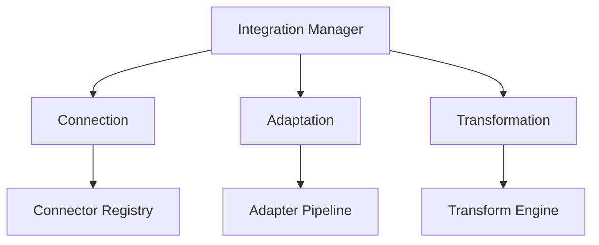

# Monitoring Integration Framework

```yaml
---
title: Monitoring Integration Framework
unit: [[units/Technology/agent_systems_unit]]
created: 2024-02-13
updated: 2024-02-13
owner: Agent Systems Unit
process_type: integration
criticality: high
reviewers:
  - Integration Team
  - Architecture Team
  - Security Team
status: draft
version: 1.0
tags:
  - integration
  - monitoring
  - interfaces
  - connectivity
related_documents:
  - [[monitoring/monitoring_framework]]
  - [[monitoring/metrics_framework]]
  - [[monitoring/alerting_framework]]
---
```

## Purpose & Scope
This document defines the integration framework for monitoring systems within the agent framework, providing standardized approaches for connecting and integrating monitoring components with other system elements.

## Integration Architecture

### 1. Core Components
#### 1.1 Integration Manager
```python
class MonitoringIntegrationManager:
    def __init__(self):
        self.connector = IntegrationConnector()
        self.adapter = IntegrationAdapter()
        self.transformer = DataTransformer()
        self.validator = IntegrationValidator()
        self.router = IntegrationRouter()
```

#### 1.2 Component Relationships


### 2. Integration Connection
#### 2.1 Connection System
```python
class IntegrationConnector:
    def __init__(self):
        self.registry = ConnectorRegistry()
        self.factory = ConnectorFactory()
        self.pool = ConnectionPool()
        self.monitor = ConnectionMonitor()

    async def establish_connection(self, target):
        connector = await self.factory.create_connector(target)
        connection = await self.pool.get_connection(connector)
        monitoring = await self.monitor.monitor_connection(connection)
        return await self.registry.register_connection(monitoring)
```

#### 2.2 Connection Types
- Service Connection
- Database Connection
- API Connection
- Event Connection

### 3. Integration Adaptation
#### 3.1 Adaptation System
```python
class IntegrationAdapter:
    def __init__(self):
        self.registry = AdapterRegistry()
        self.factory = AdapterFactory()
        self.pipeline = AdaptationPipeline()
        self.validator = AdaptationValidator()

    async def adapt_integration(self, source, target):
        adapter = await self.factory.create_adapter(source, target)
        pipeline = await self.pipeline.process_adaptation(adapter)
        validation = await self.validator.validate_adaptation(pipeline)
        return await self.registry.register_adapter(validation)
```

#### 3.2 Adaptation Types
- Protocol Adaptation
- Format Adaptation
- Schema Adaptation
- Security Adaptation

### 4. Data Transformation
#### 4.1 Transformation System
```python
class DataTransformer:
    def __init__(self):
        self.engine = TransformEngine()
        self.mapper = DataMapper()
        self.converter = DataConverter()
        self.validator = TransformValidator()

    async def transform_data(self, data, target_format):
        mapping = await self.mapper.map_data(data)
        conversion = await self.converter.convert_data(mapping, target_format)
        validation = await self.validator.validate_transformation(conversion)
        return await self.engine.transform_data(validation)
```

#### 4.2 Transformation Types
- Format Transformation
- Schema Transformation
- Protocol Transformation
- Security Transformation

### 5. Integration Routing
#### 5.1 Routing System
```python
class IntegrationRouter:
    def __init__(self):
        self.engine = RoutingEngine()
        self.resolver = EndpointResolver()
        self.scheduler = MessageScheduler()
        self.tracker = MessageTracker()

    async def route_message(self, message):
        endpoint = await self.resolver.resolve_endpoint(message)
        scheduling = await self.scheduler.schedule_message(endpoint)
        tracking = await self.tracker.track_message(scheduling)
        return await self.engine.route_message(tracking)
```

#### 5.2 Routing Types
- Direct Routing
- Queue Routing
- Topic Routing
- Pattern Routing

### 6. Integration Validation
#### 6.1 Validation System
```python
class IntegrationValidator:
    def __init__(self):
        self.engine = ValidationEngine()
        self.checker = SchemaChecker()
        self.tester = IntegrationTester()
        self.reporter = ValidationReporter()

    async def validate_integration(self, integration):
        schema = await self.checker.check_schema(integration)
        testing = await self.tester.test_integration(schema)
        reporting = await self.reporter.report_validation(testing)
        return await self.engine.validate_integration(reporting)
```

#### 6.2 Validation Types
- Schema Validation
- Protocol Validation
- Security Validation
- Performance Validation

## Implementation Guidelines

### 1. Integration Standards
#### 1.1 Standard Controls
```python
class IntegrationStandards:
    async def validate_standards(self, integration):
        # Standards validation logic
        pass

    async def apply_standards(self, application):
        # Standards application
        pass

    async def verify_compliance(self, verification):
        # Compliance verification
        pass
```

#### 1.2 Standard Types
- Protocol Standards
- Format Standards
- Security Standards
- Performance Standards

### 2. Integration Process
#### 2.1 Process System
```python
class IntegrationProcess:
    def __init__(self):
        self.planner = ProcessPlanner()
        self.executor = ProcessExecutor()
        self.validator = ProcessValidator()
        self.monitor = ProcessMonitor()
```

#### 2.2 Process Types
- Connection Process
- Adaptation Process
- Transformation Process
- Validation Process

## Quality Control

### 1. Integration Quality
#### 1.1 Quality Metrics
- Connection Quality
- Adaptation Quality
- Transformation Quality
- Validation Quality

#### 1.2 Quality Monitoring
```python
class QualityMonitoring:
    async def monitor_quality(self, integration):
        # Quality monitoring logic
        pass

    async def validate_quality(self, validation):
        # Quality validation logic
        pass

    async def measure_metrics(self, metrics):
        # Metrics measurement
        pass
```

### 2. Performance Management
#### 2.1 Performance Areas
- Connection Performance
- Adaptation Performance
- Transformation Performance
- Routing Performance

#### 2.2 Optimization
- Connection Optimization
- Adaptation Optimization
- Transformation Optimization
- Routing Optimization

## Security Requirements

### 1. Integration Security
#### 1.1 Security Controls
```python
class IntegrationSecurity:
    async def secure_integration(self, integration):
        # Security implementation logic
        pass

    async def validate_security(self, validation):
        # Security validation logic
        pass

    async def audit_integration(self, audit):
        # Integration auditing logic
        pass
```

#### 1.2 Security Areas
- Connection Security
- Data Security
- Protocol Security
- Access Security

### 2. Documentation Requirements
- Integration Documentation
- Protocol Documentation
- Security Documentation
- Compliance Documentation

## Related Documentation
### Internal Links
- [[monitoring/monitoring_framework]]
- [[monitoring/metrics_framework]]
- [[monitoring/alerting_framework]]
- [[security/integration_security]]

### External References
- Integration Standards
- Protocol Standards
- Security Standards
- Best Practices

## Maintenance
### Review Schedule
- Daily Integration Review
- Weekly Performance Review
- Monthly Security Assessment
- Quarterly Framework Audit

### Update Process
1. Integration Analysis
2. Performance Review
3. Security Assessment
4. Enhancement Planning
5. Implementation

## Appendices
### A. Integration Patterns
```python
# Example integration pattern
class IntegrationPattern:
    def __init__(self):
        self.connector = IntegrationConnector()
        self.adapter = IntegrationAdapter()
        self.transformer = DataTransformer()
```

### B. Protocol Patterns
```python
# Example protocol pattern
class ProtocolPattern:
    def __init__(self):
        self.handler = ProtocolHandler()
        self.converter = ProtocolConverter()
        self.validator = ProtocolValidator()
```

### C. Security Patterns
```python
# Example security pattern
class SecurityPattern:
    def __init__(self):
        self.authenticator = SecurityAuthenticator()
        self.authorizer = SecurityAuthorizer()
        self.auditor = SecurityAuditor()
``` 