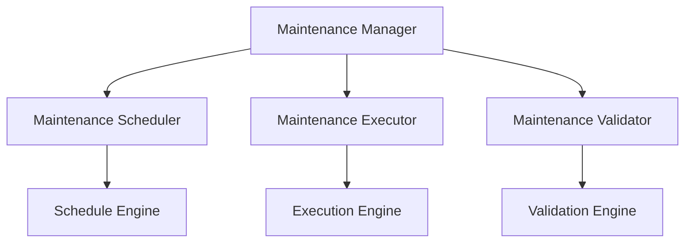

# Monitoring Maintenance Framework

```yaml
---
title: Monitoring Maintenance Framework
unit: [[units/Technology/agent_systems_unit]]
created: 2024-02-13
updated: 2024-02-13
owner: Agent Systems Unit
process_type: maintenance
criticality: high
reviewers:
  - Operations Team
  - Maintenance Team
  - Support Team
status: draft
version: 1.0
tags:
  - maintenance
  - monitoring
  - operations
  - support
related_documents:
  - [[monitoring/monitoring_implementation]]
  - [[monitoring/monitoring_deployment]]
  - [[monitoring/monitoring_configuration]]
  - [[monitoring/monitoring_testing]]
---
```

## Purpose & Scope
This document defines the maintenance framework for monitoring systems within the agent framework, providing comprehensive maintenance processes, standards, and best practices for monitoring components.

## Maintenance Architecture

### 1. Core Components
#### 1.1 Maintenance Manager
```python
class MonitoringMaintenanceManager:
    def __init__(self):
        self.scheduler = MaintenanceScheduler()
        self.executor = MaintenanceExecutor()
        self.validator = MaintenanceValidator()
        self.monitor = MaintenanceMonitor()
        self.reporter = MaintenanceReporter()
```

#### 1.2 Component Relationships


### 2. Maintenance Scheduler
#### 2.1 Scheduling System
```python
class MaintenanceScheduler:
    def __init__(self):
        self.engine = ScheduleEngine()
        self.planner = MaintenancePlanner()
        self.optimizer = ScheduleOptimizer()
        self.monitor = ScheduleMonitor()

    async def schedule_maintenance(self, requirements):
        planning = await self.planner.plan_maintenance(requirements)
        optimization = await self.optimizer.optimize_schedule(planning)
        scheduling = await self.engine.create_schedule(optimization)
        return await self.monitor.monitor_schedule(scheduling)
```

#### 2.2 Schedule Types
- Routine Maintenance
- Preventive Maintenance
- Corrective Maintenance
- Emergency Maintenance

### 3. Maintenance Executor
#### 3.1 Execution System
```python
class MaintenanceExecutor:
    def __init__(self):
        self.engine = ExecutionEngine()
        self.controller = MaintenanceController()
        self.coordinator = MaintenanceCoordinator()
        self.monitor = ExecutionMonitor()

    async def execute_maintenance(self, schedule):
        control = await self.controller.control_maintenance(schedule)
        coordination = await self.coordinator.coordinate_maintenance(control)
        execution = await self.engine.execute_maintenance(coordination)
        return await self.monitor.monitor_execution(execution)
```

#### 3.2 Execution Types
- System Maintenance
- Component Maintenance
- Data Maintenance
- Security Maintenance

### 4. Maintenance Validator
#### 4.1 Validation System
```python
class MaintenanceValidator:
    def __init__(self):
        self.engine = ValidationEngine()
        self.checker = MaintenanceChecker()
        self.verifier = ResultVerifier()
        self.reporter = ValidationReporter()

    async def validate_maintenance(self, execution):
        checking = await self.checker.check_maintenance(execution)
        verification = await self.verifier.verify_results(checking)
        validation = await self.engine.validate_results(verification)
        return await self.reporter.report_validation(validation)
```

#### 4.2 Validation Types
- Process Validation
- Result Validation
- Quality Validation
- Security Validation

### 5. Maintenance Monitor
#### 5.1 Monitoring System
```python
class MaintenanceMonitor:
    def __init__(self):
        self.collector = MetricCollector()
        self.analyzer = MaintenanceAnalyzer()
        self.alerter = AlertManager()
        self.reporter = MonitorReporter()

    async def monitor_maintenance(self, maintenance):
        collection = await self.collector.collect_metrics(maintenance)
        analysis = await self.analyzer.analyze_maintenance(collection)
        alerts = await self.alerter.process_alerts(analysis)
        return await self.reporter.report_monitoring(analysis)
```

#### 5.2 Monitoring Types
- Process Monitoring
- Performance Monitoring
- Quality Monitoring
- Security Monitoring

### 6. Maintenance Reporter
#### 6.1 Reporting System
```python
class MaintenanceReporter:
    def __init__(self):
        self.generator = ReportGenerator()
        self.formatter = ReportFormatter()
        self.distributor = ReportDistributor()
        self.archiver = ReportArchiver()

    async def report_maintenance(self, results):
        generation = await self.generator.generate_report(results)
        formatting = await self.formatter.format_report(generation)
        distribution = await self.distributor.distribute_report(formatting)
        return await self.archiver.archive_report(distribution)
```

#### 6.2 Report Types
- Status Reports
- Performance Reports
- Quality Reports
- Audit Reports

## Implementation Guidelines

### 1. Maintenance Standards
#### 1.1 Standard Controls
```python
class MaintenanceStandards:
    async def validate_standards(self, maintenance):
        # Standards validation logic
        pass

    async def apply_standards(self, application):
        # Standards application
        pass

    async def verify_compliance(self, verification):
        # Compliance verification
        pass
```

#### 1.2 Standard Types
- Process Standards
- Quality Standards
- Security Standards
- Documentation Standards

### 2. Maintenance Process
#### 2.1 Process System
```python
class MaintenanceProcess:
    def __init__(self):
        self.planner = ProcessPlanner()
        self.executor = ProcessExecutor()
        self.validator = ProcessValidator()
        self.monitor = ProcessMonitor()
```

#### 2.2 Process Types
- Planning Process
- Execution Process
- Validation Process
- Monitoring Process

## Quality Control

### 1. Maintenance Quality
#### 1.1 Quality Metrics
- Process Quality
- Result Quality
- Performance Quality
- Security Quality

#### 1.2 Quality Monitoring
```python
class QualityMonitoring:
    async def monitor_quality(self, maintenance):
        # Quality monitoring logic
        pass

    async def validate_quality(self, validation):
        # Quality validation logic
        pass

    async def measure_metrics(self, metrics):
        # Metrics measurement
        pass
```

### 2. Performance Management
#### 2.1 Performance Areas
- Process Performance
- System Performance
- Resource Performance
- Service Performance

#### 2.2 Optimization
- Process Optimization
- System Optimization
- Resource Optimization
- Service Optimization

## Security Requirements

### 1. Maintenance Security
#### 1.1 Security Controls
```python
class MaintenanceSecurity:
    async def secure_maintenance(self, maintenance):
        # Security implementation logic
        pass

    async def validate_security(self, validation):
        # Security validation logic
        pass

    async def audit_maintenance(self, audit):
        # Maintenance auditing logic
        pass
```

#### 1.2 Security Areas
- Process Security
- System Security
- Data Security
- Access Security

### 2. Documentation Requirements
- Process Documentation
- System Documentation
- Security Documentation
- Audit Documentation

## Related Documentation
### Internal Links
- [[monitoring/monitoring_implementation|Monitoring Implementation]]
- [[monitoring/monitoring_deployment|Monitoring Deployment]]
- [[monitoring/monitoring_configuration|Monitoring Configuration]]
- [[monitoring/monitoring_testing|Monitoring Testing]]

### External References
- Maintenance Standards
- Process Guidelines
- Security Standards
- Industry Best Practices

## Maintenance
### Review Schedule
- Daily Maintenance Review
- Weekly Process Review
- Monthly Quality Assessment
- Quarterly Framework Audit

### Update Process
1. Maintenance Analysis
2. Process Review
3. Quality Assessment
4. Enhancement Planning
5. Implementation

## Appendices
### A. Maintenance Patterns
```python
# Example maintenance pattern
class MaintenancePattern:
    def __init__(self):
        self.scheduler = MaintenanceScheduler()
        self.executor = MaintenanceExecutor()
        self.validator = MaintenanceValidator()
```

### B. Process Patterns
```python
# Example process pattern
class ProcessPattern:
    def __init__(self):
        self.planner = ProcessPlanner()
        self.executor = ProcessExecutor()
        self.validator = ProcessValidator()
```

### C. Quality Patterns
```python
# Example quality pattern
class QualityPattern:
    def __init__(self):
        self.monitor = QualityMonitor()
        self.analyzer = QualityAnalyzer()
        self.reporter = QualityReporter()
``` 