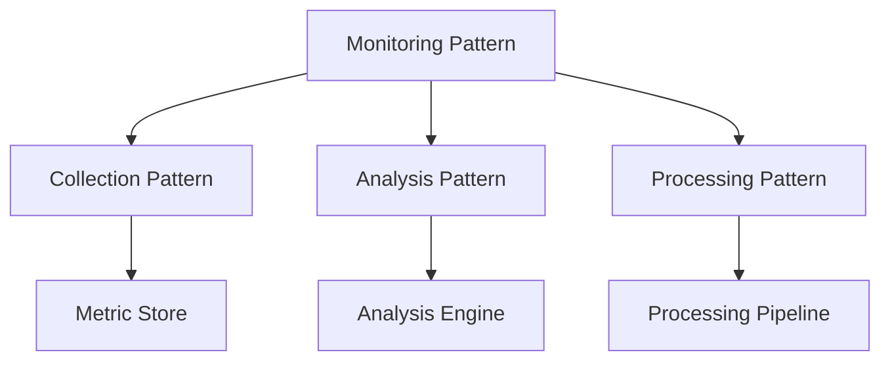

# Monitoring Patterns Framework

```yaml
---
title: Monitoring Patterns Framework
unit: [[units/Technology/agent_systems_unit]]
created: 2024-02-13
updated: 2024-02-13
owner: Agent Systems Unit
process_type: patterns
criticality: high
reviewers:
  - Architecture Team
  - Development Team
  - Quality Team
status: draft
version: 1.0
tags:
  - patterns
  - monitoring
  - implementation
  - design
related_documents:
  - [[monitoring/monitoring_integration]]
  - [[monitoring/security_monitoring]]
  - [[monitoring/performance_monitoring]]
  - [[monitoring/resource_monitoring]]
---
```

## Purpose & Scope
This document defines the reusable monitoring patterns for the agent system, providing comprehensive pattern templates, implementations, and usage guidelines for consistent monitoring across all components.

## Pattern Architecture

### 1. Core Patterns
#### 1.1 Base Pattern
```python
class MonitoringPattern:
    def __init__(self):
        self.collector = MetricCollector()
        self.analyzer = DataAnalyzer()
        self.processor = DataProcessor()
        self.reporter = ReportGenerator()
        self.alerter = AlertManager()
```

#### 1.2 Pattern Relationships


### 2. Collection Patterns
#### 2.1 Collector Pattern
```python
class CollectionPattern:
    def __init__(self):
        self.sources = SourceRegistry()
        self.collectors = CollectorRegistry()
        self.pipeline = CollectionPipeline()
        self.validator = DataValidator()

    async def collect_data(self, source):
        registration = await self.sources.register_source(source)
        collector = await self.collectors.get_collector(registration)
        collection = await self.pipeline.process_collection(collector)
        return await self.validator.validate_data(collection)
```

#### 2.2 Collection Types
- Push Collection
- Pull Collection
- Event Collection
- Stream Collection

### 3. Analysis Patterns
#### 3.1 Analysis Pattern
```python
class AnalysisPattern:
    def __init__(self):
        self.engine = AnalysisEngine()
        self.rules = RuleEngine()
        self.processor = DataProcessor()
        self.validator = ResultValidator()

    async def analyze_data(self, data):
        rules = await self.rules.get_rules(data)
        processing = await self.processor.process_data(data, rules)
        analysis = await self.engine.analyze_data(processing)
        return await self.validator.validate_results(analysis)
```

#### 3.2 Analysis Types
- Statistical Analysis
- Pattern Analysis
- Trend Analysis
- Anomaly Analysis

### 4. Processing Patterns
#### 4.1 Processing Pattern
```python
class ProcessingPattern:
    def __init__(self):
        self.pipeline = ProcessingPipeline()
        self.transformer = DataTransformer()
        self.enricher = DataEnricher()
        self.validator = ProcessValidator()

    async def process_data(self, data):
        transformation = await self.transformer.transform_data(data)
        enrichment = await self.enricher.enrich_data(transformation)
        processing = await self.pipeline.process_data(enrichment)
        return await self.validator.validate_processing(processing)
```

#### 4.2 Processing Types
- Stream Processing
- Batch Processing
- Real-time Processing
- Event Processing

### 5. Reporting Patterns
#### 5.1 Reporting Pattern
```python
class ReportingPattern:
    def __init__(self):
        self.generator = ReportGenerator()
        self.formatter = ReportFormatter()
        self.distributor = ReportDistributor()
        self.archiver = ReportArchiver()

    async def generate_report(self, data):
        generation = await self.generator.generate_report(data)
        formatting = await self.formatter.format_report(generation)
        distribution = await self.distributor.distribute_report(formatting)
        return await self.archiver.archive_report(distribution)
```

#### 5.2 Report Types
- Metric Reports
- Analysis Reports
- Alert Reports
- Summary Reports

### 6. Alert Patterns
#### 6.1 Alert Pattern
```python
class AlertPattern:
    def __init__(self):
        self.detector = AlertDetector()
        self.classifier = AlertClassifier()
        self.router = AlertRouter()
        self.notifier = AlertNotifier()

    async def process_alert(self, event):
        detection = await self.detector.detect_alert(event)
        classification = await self.classifier.classify_alert(detection)
        routing = await self.router.route_alert(classification)
        return await self.notifier.notify_alert(routing)
```

#### 6.2 Alert Types
- Threshold Alerts
- Anomaly Alerts
- Pattern Alerts
- Trend Alerts

## Implementation Guidelines

### 1. Pattern Implementation
#### 1.1 Implementation Steps
```python
class PatternImplementation:
    async def implement_pattern(self, spec):
        # Pattern implementation logic
        pass

    async def configure_pattern(self, config):
        # Pattern configuration
        pass

    async def validate_pattern(self, validation):
        # Pattern validation
        pass
```

#### 1.2 Implementation Standards
- Pattern Architecture
- Component Standards
- Integration Standards
- Quality Standards

### 2. Pattern Management
#### 2.1 Management System
```python
class PatternManager:
    def __init__(self):
        self.registry = PatternRegistry()
        self.factory = PatternFactory()
        self.validator = PatternValidator()
        self.monitor = PatternMonitor()
```

#### 2.2 Management Types
- Pattern Registration
- Pattern Creation
- Pattern Validation
- Pattern Monitoring

## Quality Control

### 1. Pattern Quality
#### 1.1 Quality Metrics
- Implementation Quality
- Performance Metrics
- Reliability Metrics
- Reusability Metrics

#### 1.2 Quality Monitoring
```python
class QualityMonitoring:
    async def monitor_quality(self, pattern):
        # Quality monitoring logic
        pass

    async def validate_pattern(self, validation):
        # Pattern validation logic
        pass

    async def measure_performance(self, metrics):
        # Performance measurement
        pass
```

### 2. Performance Management
#### 2.1 Performance Areas
- Implementation Performance
- Integration Performance
- Execution Performance
- Resource Usage

#### 2.2 Optimization
- Pattern Optimization
- Resource Optimization
- Integration Optimization
- Execution Optimization

## Security Requirements

### 1. Pattern Security
#### 1.1 Security Controls
```python
class PatternSecurity:
    async def secure_pattern(self, pattern):
        # Security implementation logic
        pass

    async def validate_security(self, validation):
        # Security validation logic
        pass

    async def audit_pattern(self, audit):
        # Audit logging logic
        pass
```

#### 1.2 Security Areas
- Implementation Security
- Integration Security
- Data Security
- Access Security

### 2. Compliance Requirements
- Security Standards
- Implementation Standards
- Integration Standards
- Audit Requirements

## Related Documentation
### Internal Links
- [[monitoring/monitoring_integration|Monitoring Integration]]
- [[monitoring/security_monitoring|Security Monitoring]]
- [[monitoring/performance_monitoring|Performance Monitoring]]
- [[monitoring/resource_monitoring|Resource Monitoring]]

### External References
- Pattern Standards
- Implementation Guidelines
- Security Standards
- Industry Best Practices

## Maintenance
### Review Schedule
- Daily Pattern Review
- Weekly Implementation Review
- Monthly Security Assessment
- Quarterly Framework Audit

### Update Process
1. Pattern Analysis
2. Implementation Review
3. Security Assessment
4. Enhancement Planning
5. Implementation

## Appendices
### A. Implementation Patterns
```python
# Example implementation pattern
class ImplementationPattern:
    def __init__(self):
        self.factory = PatternFactory()
        self.validator = PatternValidator()
        self.monitor = PatternMonitor()
```

### B. Integration Patterns
```python
# Example integration pattern
class IntegrationPattern:
    def __init__(self):
        self.connector = PatternConnector()
        self.router = PatternRouter()
        self.transformer = PatternTransformer()
```

### C. Security Patterns
```python
# Example security pattern
class SecurityPattern:
    def __init__(self):
        self.validator = SecurityValidator()
        self.control = AccessControl()
        self.audit = AuditLogger()
``` 