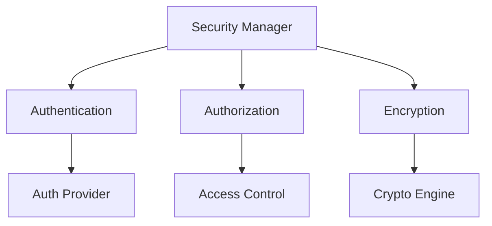

# Monitoring Security Framework

```yaml
---
title: Monitoring Security Framework
unit: [[units/Technology/agent_systems_unit]]
created: 2024-02-13
updated: 2024-02-13
owner: Agent Systems Unit
process_type: security
criticality: high
reviewers:
  - Security Team
  - Compliance Team
  - Operations Team
status: draft
version: 1.0
tags:
  - security
  - monitoring
  - compliance
  - protection
related_documents:
  - [[monitoring/monitoring_framework]]
  - [[monitoring/metrics_framework]]
  - [[monitoring/alerting_framework]]
  - [[security/security_framework]]
---
```

## Purpose & Scope
This document defines the security framework for monitoring systems within the agent framework, providing comprehensive security controls, standards, and best practices for protecting monitoring components and data.

## Security Architecture

### 1. Core Components
#### 1.1 Security Manager
```python
class MonitoringSecurityManager:
    def __init__(self):
        self.authenticator = SecurityAuthenticator()
        self.authorizer = SecurityAuthorizer()
        self.encryptor = DataEncryptor()
        self.auditor = SecurityAuditor()
        self.validator = SecurityValidator()
```

#### 1.2 Component Relationships


### 2. Authentication System
#### 2.1 Authentication Manager
```python
class SecurityAuthenticator:
    def __init__(self):
        self.provider = AuthProvider()
        self.verifier = CredentialVerifier()
        self.session = SessionManager()
        self.monitor = AuthMonitor()

    async def authenticate_request(self, credentials):
        verification = await self.verifier.verify_credentials(credentials)
        session = await self.session.create_session(verification)
        monitoring = await self.monitor.monitor_auth(session)
        return await self.provider.authenticate_user(monitoring)
```

#### 2.2 Authentication Types
- Token Authentication
- Certificate Authentication
- Key Authentication
- Multi-factor Authentication

### 3. Authorization System
#### 3.1 Authorization Manager
```python
class SecurityAuthorizer:
    def __init__(self):
        self.provider = AuthzProvider()
        self.policy = PolicyEngine()
        self.enforcer = PolicyEnforcer()
        self.monitor = AuthzMonitor()

    async def authorize_request(self, request):
        policy = await self.policy.get_policy(request)
        enforcement = await self.enforcer.enforce_policy(policy)
        monitoring = await self.monitor.monitor_authz(enforcement)
        return await self.provider.authorize_request(monitoring)
```

#### 3.2 Authorization Types
- Role-based Authorization
- Policy-based Authorization
- Attribute-based Authorization
- Context-based Authorization

### 4. Encryption System
#### 4.1 Encryption Manager
```python
class DataEncryptor:
    def __init__(self):
        self.engine = CryptoEngine()
        self.keystore = KeyManager()
        self.cipher = CipherSuite()
        self.monitor = CryptoMonitor()

    async def encrypt_data(self, data):
        key = await self.keystore.get_key(data)
        cipher = await self.cipher.get_cipher(key)
        monitoring = await self.monitor.monitor_encryption(cipher)
        return await self.engine.encrypt_data(data, monitoring)
```

#### 4.2 Encryption Types
- Data Encryption
- Channel Encryption
- Key Encryption
- Storage Encryption

### 5. Audit System
#### 5.1 Audit Manager
```python
class SecurityAuditor:
    def __init__(self):
        self.logger = AuditLogger()
        self.analyzer = AuditAnalyzer()
        self.reporter = AuditReporter()
        self.archiver = AuditArchiver()

    async def audit_security(self, event):
        logging = await self.logger.log_event(event)
        analysis = await self.analyzer.analyze_audit(logging)
        reporting = await self.reporter.report_audit(analysis)
        return await self.archiver.archive_audit(reporting)
```

#### 5.2 Audit Types
- Access Audit
- Operation Audit
- Security Audit
- Compliance Audit

### 6. Validation System
#### 6.1 Validation Manager
```python
class SecurityValidator:
    def __init__(self):
        self.engine = ValidationEngine()
        self.checker = SecurityChecker()
        self.tester = SecurityTester()
        self.reporter = ValidationReporter()

    async def validate_security(self, security):
        checks = await self.checker.check_security(security)
        testing = await self.tester.test_security(checks)
        reporting = await self.reporter.report_validation(testing)
        return await self.engine.validate_security(reporting)
```

#### 6.2 Validation Types
- Control Validation
- Policy Validation
- Configuration Validation
- Compliance Validation

## Implementation Guidelines

### 1. Security Standards
#### 1.1 Standard Controls
```python
class SecurityStandards:
    async def validate_standards(self, security):
        # Standards validation logic
        pass

    async def apply_standards(self, application):
        # Standards application
        pass

    async def verify_compliance(self, verification):
        # Compliance verification
        pass
```

#### 1.2 Standard Types
- Authentication Standards
- Authorization Standards
- Encryption Standards
- Audit Standards

### 2. Security Process
#### 2.1 Process System
```python
class SecurityProcess:
    def __init__(self):
        self.planner = ProcessPlanner()
        self.executor = ProcessExecutor()
        self.validator = ProcessValidator()
        self.monitor = ProcessMonitor()
```

#### 2.2 Process Types
- Authentication Process
- Authorization Process
- Encryption Process
- Audit Process

## Quality Control

### 1. Security Quality
#### 1.1 Quality Metrics
- Authentication Quality
- Authorization Quality
- Encryption Quality
- Audit Quality

#### 1.2 Quality Monitoring
```python
class QualityMonitoring:
    async def monitor_quality(self, security):
        # Quality monitoring logic
        pass

    async def validate_quality(self, validation):
        # Quality validation logic
        pass

    async def measure_metrics(self, metrics):
        # Metrics measurement
        pass
```

### 2. Performance Management
#### 2.1 Performance Areas
- Authentication Performance
- Authorization Performance
- Encryption Performance
- Audit Performance

#### 2.2 Optimization
- Authentication Optimization
- Authorization Optimization
- Encryption Optimization
- Audit Optimization

## Compliance Requirements

### 1. Security Compliance
#### 1.1 Compliance Controls
```python
class SecurityCompliance:
    async def validate_compliance(self, security):
        # Compliance validation logic
        pass

    async def enforce_compliance(self, enforcement):
        # Compliance enforcement
        pass

    async def report_compliance(self, report):
        # Compliance reporting
        pass
```

#### 1.2 Compliance Areas
- Data Protection
- Access Control
- Audit Trail
- Risk Management

### 2. Documentation Requirements
- Security Documentation
- Policy Documentation
- Compliance Documentation
- Audit Documentation

## Related Documentation
### Internal Links
- [[monitoring/monitoring_framework]]
- [[monitoring/metrics_framework]]
- [[monitoring/alerting_framework]]
- [[security/security_framework]]

### External References
- Security Standards
- Compliance Standards
- Industry Regulations
- Best Practices

## Maintenance
### Review Schedule
- Daily Security Review
- Weekly Compliance Review
- Monthly Risk Assessment
- Quarterly Framework Audit

### Update Process
1. Security Analysis
2. Risk Assessment
3. Compliance Review
4. Enhancement Planning
5. Implementation

## Appendices
### A. Security Patterns
```python
# Example security pattern
class SecurityPattern:
    def __init__(self):
        self.authenticator = SecurityAuthenticator()
        self.authorizer = SecurityAuthorizer()
        self.encryptor = DataEncryptor()
```

### B. Compliance Patterns
```python
# Example compliance pattern
class CompliancePattern:
    def __init__(self):
        self.validator = ComplianceValidator()
        self.enforcer = ComplianceEnforcer()
        self.reporter = ComplianceReporter()
```

### C. Audit Patterns
```python
# Example audit pattern
class AuditPattern:
    def __init__(self):
        self.logger = AuditLogger()
        self.analyzer = AuditAnalyzer()
        self.reporter = AuditReporter()
``` 