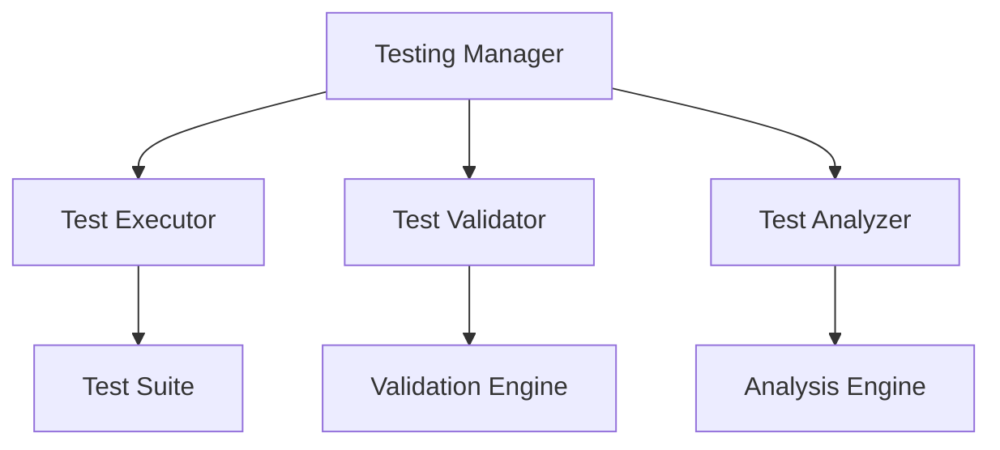

# Monitoring Testing Framework

```yaml
---
title: Monitoring Testing Framework
unit: [[units/Technology/agent_systems_unit]]
created: 2024-02-13
updated: 2024-02-13
owner: Agent Systems Unit
process_type: testing
criticality: high
reviewers:
  - Quality Team
  - Development Team
  - Testing Team
status: draft
version: 1.0
tags:
  - testing
  - monitoring
  - quality
  - validation
related_documents:
  - [[monitoring/monitoring_implementation]]
  - [[monitoring/monitoring_deployment]]
  - [[monitoring/monitoring_configuration]]
  - [[monitoring/monitoring_security]]
---
```

## Purpose & Scope
This document defines the testing framework for monitoring systems within the agent framework, providing comprehensive testing processes, standards, and best practices for monitoring components.

## Testing Architecture

### 1. Core Components
#### 1.1 Testing Manager
```python
class MonitoringTestingManager:
    def __init__(self):
        self.executor = TestExecutor()
        self.validator = TestValidator()
        self.analyzer = TestAnalyzer()
        self.reporter = TestReporter()
        self.monitor = TestMonitor()
```

#### 1.2 Component Relationships


### 2. Test Executor
#### 2.1 Execution System
```python
class TestExecutor:
    def __init__(self):
        self.runner = TestRunner()
        self.scheduler = TestScheduler()
        self.controller = TestController()
        self.monitor = ExecutionMonitor()

    async def execute_tests(self, suite):
        scheduling = await self.scheduler.schedule_tests(suite)
        execution = await self.runner.run_tests(scheduling)
        control = await self.controller.control_execution(execution)
        return await self.monitor.monitor_execution(control)
```

#### 2.2 Test Types
- Unit Tests
- Integration Tests
- System Tests
- Performance Tests

### 3. Test Validator
#### 3.1 Validation System
```python
class TestValidator:
    def __init__(self):
        self.engine = ValidationEngine()
        self.checker = ResultChecker()
        self.verifier = CoverageVerifier()
        self.reporter = ValidationReporter()

    async def validate_tests(self, results):
        checking = await self.checker.check_results(results)
        verification = await self.verifier.verify_coverage(checking)
        validation = await self.engine.validate_results(verification)
        return await self.reporter.report_validation(validation)
```

#### 3.2 Validation Types
- Result Validation
- Coverage Validation
- Performance Validation
- Security Validation

### 4. Test Analyzer
#### 4.1 Analysis System
```python
class TestAnalyzer:
    def __init__(self):
        self.engine = AnalysisEngine()
        self.profiler = TestProfiler()
        self.metrics = MetricsAnalyzer()
        self.reporter = AnalysisReporter()

    async def analyze_tests(self, results):
        profiling = await self.profiler.profile_tests(results)
        metrics = await self.metrics.analyze_metrics(profiling)
        analysis = await self.engine.analyze_results(metrics)
        return await self.reporter.report_analysis(analysis)
```

#### 4.2 Analysis Types
- Performance Analysis
- Coverage Analysis
- Quality Analysis
- Risk Analysis

### 5. Test Reporter
#### 5.1 Reporting System
```python
class TestReporter:
    def __init__(self):
        self.generator = ReportGenerator()
        self.formatter = ReportFormatter()
        self.distributor = ReportDistributor()
        self.archiver = ReportArchiver()

    async def report_tests(self, results):
        generation = await self.generator.generate_report(results)
        formatting = await self.formatter.format_report(generation)
        distribution = await self.distributor.distribute_report(formatting)
        return await self.archiver.archive_report(distribution)
```

#### 5.2 Report Types
- Test Reports
- Coverage Reports
- Performance Reports
- Quality Reports

### 6. Test Monitor
#### 6.1 Monitoring System
```python
class TestMonitor:
    def __init__(self):
        self.collector = MetricCollector()
        self.analyzer = TestingAnalyzer()
        self.alerter = AlertManager()
        self.reporter = MonitorReporter()

    async def monitor_tests(self, execution):
        collection = await self.collector.collect_metrics(execution)
        analysis = await self.analyzer.analyze_testing(collection)
        alerts = await self.alerter.process_alerts(analysis)
        return await self.reporter.report_monitoring(analysis)
```

#### 6.2 Monitoring Types
- Execution Monitoring
- Performance Monitoring
- Coverage Monitoring
- Quality Monitoring

## Implementation Guidelines

### 1. Testing Standards
#### 1.1 Standard Controls
```python
class TestingStandards:
    async def validate_standards(self, tests):
        # Standards validation logic
        pass

    async def apply_standards(self, application):
        # Standards application
        pass

    async def verify_compliance(self, verification):
        # Compliance verification
        pass
```

#### 1.2 Standard Types
- Test Standards
- Coverage Standards
- Quality Standards
- Security Standards

### 2. Testing Process
#### 2.1 Process System
```python
class TestingProcess:
    def __init__(self):
        self.planner = ProcessPlanner()
        self.executor = ProcessExecutor()
        self.validator = ProcessValidator()
        self.monitor = ProcessMonitor()
```

#### 2.2 Process Types
- Planning Process
- Execution Process
- Validation Process
- Monitoring Process

## Quality Control

### 1. Testing Quality
#### 1.1 Quality Metrics
- Coverage Metrics
- Performance Metrics
- Reliability Metrics
- Quality Metrics

#### 1.2 Quality Monitoring
```python
class QualityMonitoring:
    async def monitor_quality(self, testing):
        # Quality monitoring logic
        pass

    async def validate_quality(self, validation):
        # Quality validation logic
        pass

    async def measure_metrics(self, metrics):
        # Metrics measurement
        pass
```

### 2. Performance Management
#### 2.1 Performance Areas
- Test Performance
- System Performance
- Resource Performance
- Network Performance

#### 2.2 Optimization
- Test Optimization
- Process Optimization
- Resource Optimization
- System Optimization

## Security Requirements

### 1. Testing Security
#### 1.1 Security Controls
```python
class TestingSecurity:
    async def secure_testing(self, testing):
        # Security implementation logic
        pass

    async def validate_security(self, validation):
        # Security validation logic
        pass

    async def audit_testing(self, audit):
        # Testing auditing logic
        pass
```

#### 1.2 Security Areas
- Process Security
- Data Security
- System Security
- Access Security

### 2. Documentation Requirements
- Test Documentation
- Process Documentation
- Security Documentation
- Audit Documentation

## Related Documentation
### Internal Links
- [[monitoring/monitoring_implementation|Monitoring Implementation]]
- [[monitoring/monitoring_deployment|Monitoring Deployment]]
- [[monitoring/monitoring_configuration|Monitoring Configuration]]
- [[monitoring/monitoring_security|Monitoring Security]]

### External References
- Testing Standards
- Process Guidelines
- Security Standards
- Industry Best Practices

## Maintenance
### Review Schedule
- Daily Test Review
- Weekly Process Review
- Monthly Quality Assessment
- Quarterly Framework Audit

### Update Process
1. Testing Analysis
2. Process Review
3. Quality Assessment
4. Enhancement Planning
5. Implementation

## Appendices
### A. Testing Patterns
```python
# Example testing pattern
class TestingPattern:
    def __init__(self):
        self.executor = TestExecutor()
        self.validator = TestValidator()
        self.analyzer = TestAnalyzer()
```

### B. Process Patterns
```python
# Example process pattern
class ProcessPattern:
    def __init__(self):
        self.planner = ProcessPlanner()
        self.executor = ProcessExecutor()
        self.validator = ProcessValidator()
```

### C. Quality Patterns
```python
# Example quality pattern
class QualityPattern:
    def __init__(self):
        self.monitor = QualityMonitor()
        self.analyzer = QualityAnalyzer()
        self.reporter = QualityReporter()
``` 