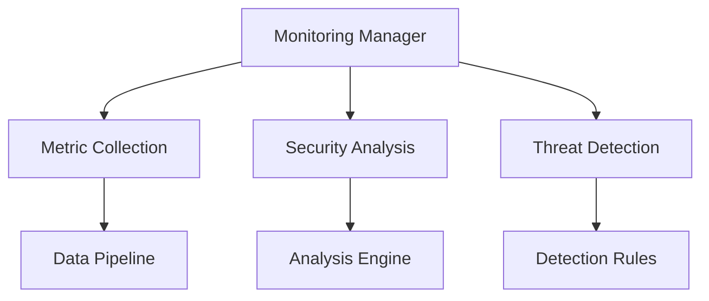

# Security Monitoring Framework

```yaml
---
title: Security Monitoring Framework
unit: [[units/Technology/agent_systems_unit]]
created: 2024-02-13
updated: 2024-02-13
owner: Agent Systems Unit
process_type: monitoring
criticality: high
reviewers:
  - Security Team
  - Operations Team
  - Compliance Team
status: draft
version: 1.0
tags:
  - security
  - monitoring
  - operations
  - alerts
related_documents:
  - [[security/service_security]]
  - [[security/data_security]]
  - [[processes/service_management]]
  - [[processes/data_management]]
---
```

## Purpose & Scope
This document defines the security monitoring framework for the agent system, providing comprehensive monitoring, detection, alerting, and response capabilities across all security domains.

## Monitoring Architecture

### 1. Core Components
#### 1.1 Monitoring Manager
```python
class SecurityMonitoringManager:
    def __init__(self):
        self.collector = MetricCollector()
        self.analyzer = SecurityAnalyzer()
        self.detector = ThreatDetector()
        self.alerter = AlertManager()
        self.responder = IncidentResponder()
```

#### 1.2 Component Relationships


### 2. Metric Collection
#### 2.1 Collection System
```python
class MetricCollector:
    def __init__(self):
        self.collectors = CollectorRegistry()
        self.processors = DataProcessors()
        self.pipeline = DataPipeline()
        self.storage = MetricStorage()

    async def collect_metrics(self):
        raw_data = await self.collectors.collect_all()
        processed = await self.processors.process_data(raw_data)
        pipeline = await self.pipeline.process_data(processed)
        await self.storage.store_metrics(pipeline)
```

#### 2.2 Metric Types
- Security Metrics
- Performance Metrics
- Resource Metrics
- Compliance Metrics

### 3. Security Analysis
#### 3.1 Analysis System
```python
class SecurityAnalyzer:
    def __init__(self):
        self.engine = AnalysisEngine()
        self.rules = RuleEngine()
        self.correlator = EventCorrelator()
        self.profiler = BehaviorProfiler()

    async def analyze_security(self, data):
        profile = await self.profiler.profile_behavior(data)
        correlation = await self.correlator.correlate_events(profile)
        analysis = await self.engine.analyze_data(correlation)
        results = await self.rules.evaluate_rules(analysis)
        return results
```

#### 3.2 Analysis Types
- Pattern Analysis
- Anomaly Detection
- Behavior Analysis
- Threat Analysis

### 4. Threat Detection
#### 4.1 Detection System
```python
class ThreatDetector:
    def __init__(self):
        self.engine = DetectionEngine()
        self.rules = DetectionRules()
        self.scanner = VulnerabilityScanner()
        self.assessor = RiskAssessor()

    async def detect_threats(self, data):
        scan = await self.scanner.scan_system(data)
        assessment = await self.assessor.assess_risks(scan)
        detection = await self.engine.detect_threats(assessment)
        evaluation = await self.rules.evaluate_threats(detection)
        return evaluation
```

#### 4.2 Detection Methods
- Signature Detection
- Anomaly Detection
- Behavior Detection
- Heuristic Detection

### 5. Alert Management
#### 5.1 Alert System
```python
class AlertManager:
    def __init__(self):
        self.generator = AlertGenerator()
        self.classifier = AlertClassifier()
        self.prioritizer = AlertPrioritizer()
        self.notifier = AlertNotifier()

    async def manage_alerts(self, events):
        alerts = await self.generator.generate_alerts(events)
        classified = await self.classifier.classify_alerts(alerts)
        prioritized = await self.prioritizer.prioritize_alerts(classified)
        await self.notifier.notify_alerts(prioritized)
```

#### 5.2 Alert Types
- Security Alerts
- Performance Alerts
- Resource Alerts
- Compliance Alerts

### 6. Incident Response
#### 6.1 Response System
```python
class IncidentResponder:
    def __init__(self):
        self.coordinator = ResponseCoordinator()
        self.handler = IncidentHandler()
        self.resolver = IncidentResolver()
        self.reporter = IncidentReporter()

    async def handle_incident(self, incident):
        coordination = await self.coordinator.coordinate_response(incident)
        handling = await self.handler.handle_incident(coordination)
        resolution = await self.resolver.resolve_incident(handling)
        await self.reporter.report_incident(resolution)
```

#### 6.2 Response Types
- Automated Response
- Manual Response
- Escalated Response
- Emergency Response

## Implementation Guidelines

### 1. Monitoring Implementation
#### 1.1 Implementation Steps
```python
class MonitoringImplementation:
    async def implement_monitoring(self, spec):
        # Monitoring implementation logic
        pass

    async def configure_collectors(self, collectors):
        # Collector configuration
        pass

    async def setup_analysis(self, analysis):
        # Analysis setup
        pass
```

#### 1.2 Implementation Standards
- Monitoring Architecture
- Collection Standards
- Analysis Rules
- Response Procedures

### 2. Rule Management
#### 2.1 Rule System
```python
class RuleManager:
    def __init__(self):
        self.engine = RuleEngine()
        self.validator = RuleValidator()
        self.optimizer = RuleOptimizer()
        self.deployer = RuleDeployer()
```

#### 2.2 Rule Types
- Detection Rules
- Analysis Rules
- Correlation Rules
- Response Rules

## Quality Control

### 1. Monitoring Quality
#### 1.1 Quality Metrics
- Detection Accuracy
- Response Time
- False Positive Rate
- Coverage Rate

#### 1.2 Quality Monitoring
```python
class MonitoringQuality:
    async def monitor_quality(self, monitoring):
        # Quality monitoring logic
        pass

    async def validate_rules(self, rules):
        # Rule validation logic
        pass

    async def measure_effectiveness(self, metrics):
        # Effectiveness measurement
        pass
```

### 2. Performance Management
#### 2.1 Performance Areas
- Collection Performance
- Analysis Performance
- Detection Performance
- Response Performance

#### 2.2 Optimization
- Rule Optimization
- Resource Management
- Cache Strategy
- Load Distribution

## Compliance Requirements

### 1. Monitoring Compliance
#### 1.1 Compliance Controls
```python
class MonitoringCompliance:
    async def validate_compliance(self, requirements):
        # Compliance validation logic
        pass

    async def monitor_compliance(self, controls):
        # Compliance monitoring logic
        pass

    async def report_compliance(self, status):
        # Compliance reporting logic
        pass
```

#### 1.2 Compliance Areas
- Security Standards
- Privacy Requirements
- Industry Regulations
- Internal Policies

### 2. Audit Requirements
- Monitoring Logs
- Alert History
- Response Records
- Compliance Reports

## Related Documentation
### Internal Links
- [[security/service_security|Service Security]]
- [[security/data_security|Data Security]]
- [[monitoring/performance_monitoring|Performance Monitoring]]
- [[monitoring/resource_monitoring|Resource Monitoring]]

### External References
- Security Standards
- Monitoring Best Practices
- Compliance Requirements
- Industry Guidelines

## Maintenance
### Review Schedule
- Daily Rule Review
- Weekly Performance Review
- Monthly Compliance Assessment
- Quarterly Framework Audit

### Update Process
1. Monitoring Analysis
2. Rule Review
3. Performance Assessment
4. Enhancement Planning
5. Implementation

## Appendices
### A. Monitoring Patterns
```python
# Example monitoring pattern
class MonitoringPattern:
    def __init__(self):
        self.collector = MetricCollector()
        self.analyzer = DataAnalyzer()
        self.detector = ThreatDetector()
```

### B. Rule Patterns
```python
# Example rule pattern
class RulePattern:
    def __init__(self):
        self.engine = RuleEngine()
        self.validator = RuleValidator()
        self.optimizer = RuleOptimizer()
```

### C. Response Patterns
```python
# Example response pattern
class ResponsePattern:
    def __init__(self):
        self.handler = IncidentHandler()
        self.resolver = IncidentResolver()
        self.reporter = IncidentReporter()
``` 