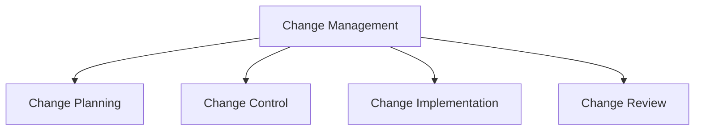

# Change Management

## 📋 Overview
This document outlines the change management framework and procedures for our Operations Knowledge Base, ensuring controlled and effective implementation of changes across all system components.

## 🎯 Change Framework

### Core Components


### Change Architecture
1. **Change Types**
   ```yaml
   change_types:
     standard_changes:
       - routine_updates
       - planned_maintenance
       - minor_enhancements
       - regular_patches
     major_changes:
       - system_upgrades
       - architecture_changes
       - major_releases
       - infrastructure_changes
   ```

2. **Change Categories**
   - Standard changes
   - Emergency changes
   - Normal changes
   - Major changes

## 📝 Change Planning

### Request Process
1. **Change Request**
   ```python
   def process_change_request():
       validate_request()
       assess_impact()
       plan_implementation()
       obtain_approval()
   ```

2. **Request Documentation**
   - Change description
   - Impact assessment
   - Resource requirements
   - Timeline planning

### Impact Assessment
1. **Assessment Areas**
   ```json
   {
     "impact_assessment": {
       "technical": ["system_impact", "service_impact", "performance_impact"],
       "business": ["user_impact", "process_impact", "cost_impact"],
       "risk": ["potential_risks", "mitigation_plans", "rollback_procedures"]
     }
   }
   ```

2. **Risk Analysis**
   - Technical risks
   - Business risks
   - Security risks
   - Operational risks

## 🔍 Change Control

### Control Process
1. **Change Review**
   - Technical review
   - Impact review
   - Risk review
   - Resource review

2. **Approval Process**
   - Change board review
   - Stakeholder approval
   - Technical approval
   - Final authorization

### Change Schedule
1. **Schedule Management**
   - Change calendar
   - Resource allocation
   - Dependency management
   - Conflict resolution

2. **Timeline Planning**
   - Implementation schedule
   - Resource scheduling
   - Testing schedule
   - Communication plan

## 🔄 Implementation Process

### Pre-Implementation
1. **Preparation Steps**
   - Environment preparation
   - Resource allocation
   - Team briefing
   - Backup verification

2. **Testing Requirements**
   - Test environment
   - Test cases
   - Validation criteria
   - Rollback procedures

### Implementation
1. **Change Execution**
   - Step-by-step process
   - Progress monitoring
   - Issue handling
   - Status updates

2. **Validation Steps**
   - Implementation checks
   - Performance validation
   - Security verification
   - User acceptance

## 📊 Change Monitoring

### Implementation Monitoring
1. **Monitoring Areas**
   - System performance
   - Service availability
   - User impact
   - Error rates

2. **Performance Metrics**
   - Response times
   - Error rates
   - Resource usage
   - User feedback

### Post-Implementation
1. **Review Process**
   - Success verification
   - Issue identification
   - Performance analysis
   - User feedback

2. **Documentation Update**
   - Change records
   - System documentation
   - Process documentation
   - Training materials

## 🔄 Rollback Procedures

### Rollback Planning
1. **Rollback Strategy**
   - Trigger conditions
   - Rollback steps
   - Recovery points
   - Verification process

2. **Recovery Process**
   - System restoration
   - Data recovery
   - Service restoration
   - Validation steps

### Post-Rollback
1. **Analysis Process**
   - Failure analysis
   - Impact assessment
   - Process review
   - Improvement planning

2. **Documentation**
   - Incident record
   - Lesson learned
   - Process updates
   - Prevention measures

## 📢 Communication Plan

### Stakeholder Communication
1. **Communication Strategy**
   - Stakeholder identification
   - Message planning
   - Delivery methods
   - Feedback channels

2. **Update Process**
   - Status updates
   - Progress reports
   - Issue notifications
   - Completion notices

### User Communication
1. **User Updates**
   - Change notifications
   - Impact statements
   - Status updates
   - Support information

2. **Support Process**
   - Help desk preparation
   - User guidance
   - Issue resolution
   - Feedback collection

## 📈 Quality Assurance

### Quality Control
1. **Quality Metrics**
   - Implementation quality
   - Process adherence
   - Documentation quality
   - User satisfaction

2. **Validation Process**
   - Technical validation
   - Process validation
   - Documentation review
   - User acceptance

### Process Improvement
1. **Review Process**
   - Process evaluation
   - Efficiency analysis
   - Issue identification
   - Improvement planning

2. **Updates**
   - Process updates
   - Documentation updates
   - Training updates
   - Tool improvements

## 📝 Related Documentation
- [[operational-procedures]]
- [[incident-response]]
- [[release-management]]
- [[monitoring-guidelines]]

## 🔄 Change Log
| Date | Change | Author |
|------|--------|--------|
| YYYY-MM-DD | Initial change management documentation | Name |

---

*Last updated: <% tp.date.now("YYYY-MM-DD") %>* 