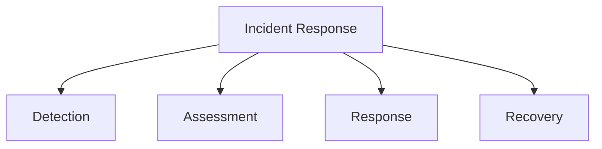

# Incident Response

## 📋 Overview
This document outlines the incident response procedures and framework for our Operations Knowledge Base, ensuring effective and coordinated responses to system incidents and emergencies.

## 🎯 Response Framework

### Core Components


### Response Architecture
1. **Response Layers**
   ```yaml
   response_layers:
     detection:
       - monitoring_alerts
       - user_reports
       - system_alerts
       - security_alerts
     response:
       - initial_response
       - incident_management
       - communication
       - resolution
   ```

2. **Response Types**
   - System incidents
   - Security incidents
   - Performance incidents
   - Service incidents

## 🚨 Incident Detection

### Detection Methods
1. **Monitoring Alerts**
   ```python
   def detect_incidents():
       monitor_system_alerts()
       check_security_alerts()
       analyze_performance_alerts()
       review_user_reports()
   ```

2. **Alert Processing**
   - Alert validation
   - Priority assessment
   - Impact evaluation
   - Response initiation

### Initial Assessment
1. **Assessment Process**
   ```json
   {
     "incident_assessment": {
       "impact": ["severity", "scope", "users_affected", "services_affected"],
       "priority": ["urgency", "business_impact", "recovery_time", "resources"],
       "response": ["immediate_actions", "team_activation", "communication", "escalation"]
     }
   }
   ```

2. **Impact Analysis**
   - Service impact
   - User impact
   - Business impact
   - Security impact

## 🔄 Response Process

### Immediate Response
1. **Initial Actions**
   - Incident confirmation
   - Team activation
   - Initial containment
   - Communication initiation

2. **Response Coordination**
   - Team coordination
   - Resource allocation
   - Status tracking
   - Communication management

### Incident Management
1. **Management Process**
   - Incident tracking
   - Resource management
   - Progress monitoring
   - Status reporting

2. **Response Teams**
   - Technical teams
   - Support teams
   - Security teams
   - Management teams

## 🛠 Resolution Process

### Incident Resolution
1. **Resolution Steps**
   - Problem identification
   - Solution development
   - Implementation
   - Verification

2. **Recovery Actions**
   - Service restoration
   - Data recovery
   - System stabilization
   - Performance restoration

### Post-Incident
1. **Review Process**
   - Incident analysis
   - Lesson learning
   - Process improvement
   - Documentation update

2. **Follow-up Actions**
   - Prevention measures
   - System updates
   - Process updates
   - Training updates

## 📢 Communication Plan

### Internal Communication
1. **Team Communication**
   - Status updates
   - Action items
   - Progress reports
   - Resolution updates

2. **Management Updates**
   - Incident briefings
   - Impact reports
   - Resource requests
   - Resolution status

### External Communication
1. **User Communication**
   - Service notices
   - Status updates
   - Resolution timeline
   - Follow-up information

2. **Stakeholder Updates**
   - Impact assessment
   - Response actions
   - Recovery timeline
   - Business continuity

## 📊 Incident Tracking

### Documentation
1. **Incident Records**
   - Incident details
   - Response actions
   - Resolution steps
   - Timeline tracking

2. **Status Tracking**
   - Progress monitoring
   - Action tracking
   - Resource tracking
   - Time tracking

### Analysis
1. **Incident Analysis**
   - Root cause analysis
   - Impact assessment
   - Response evaluation
   - Prevention planning

2. **Metrics Collection**
   - Response time
   - Resolution time
   - Impact metrics
   - Cost assessment

## 🔍 Quality Control

### Response Quality
1. **Quality Metrics**
   - Response efficiency
   - Resolution effectiveness
   - Communication quality
   - Team performance

2. **Process Improvement**
   - Lesson learning
   - Process updates
   - Training needs
   - Tool improvements

### Validation
1. **Response Validation**
   - Action verification
   - Solution testing
   - Recovery confirmation
   - Documentation review

2. **Follow-up Review**
   - Process review
   - Team performance
   - Tool effectiveness
   - Documentation quality

## 🛠 Response Tools

### Tool Selection
1. **Management Tools**
   - Incident tracking
   - Communication tools
   - Documentation tools
   - Analysis tools

2. **Technical Tools**
   - Diagnostic tools
   - Recovery tools
   - Monitoring tools
   - Security tools

### Tool Integration
1. **System Integration**
   - Alert integration
   - Monitoring integration
   - Communication integration
   - Documentation integration

2. **Process Integration**
   - Workflow integration
   - Team coordination
   - Status tracking
   - Reporting integration

## 📝 Related Documentation
- [[operational-procedures]]
- [[monitoring-guidelines]]
- [[security-incident-response]]
- [[disaster-recovery]]

## 🔄 Change Log
| Date | Change | Author |
|------|--------|--------|
| YYYY-MM-DD | Initial incident response documentation | Name |

---

*Last updated: <% tp.date.now("YYYY-MM-DD") %>* 