# Operations Documentation

## System Operations Overview

### Operations Architecture

```mermaid
graph TB
    subgraph Monitoring[Monitoring & Observability]
        subgraph Metrics[Metrics Collection]
            M1[System Metrics] --> M2[Application Metrics]
            M2 --> M3[Business Metrics]
            M3 --> M4[Custom Metrics]
            
            subgraph Collection[Collection Pipeline]
                C1[Collectors] --> C2[Aggregators]
                C2 --> C3[Time Series DB]
                C3 --> C4[Query Engine]
            end
        end
        
        subgraph Logging[Log Management]
            L1[System Logs] --> L2[Application Logs]
            L2 --> L3[Audit Logs]
            L3 --> L4[Security Logs]
            
            subgraph LogPipeline[Log Pipeline]
                LP1[Log Shippers] --> LP2[Log Processors]
                LP2 --> LP3[Log Storage]
                LP3 --> LP4[Log Analytics]
            end
        end
        
        subgraph Tracing[Distributed Tracing]
            T1[Request Tracing] --> T2[Service Tracing]
            T2 --> T3[Database Tracing]
            T3 --> T4[External Calls]
            
            subgraph TracePipeline[Trace Pipeline]
                TP1[Trace Collection] --> TP2[Trace Processing]
                TP2 --> TP3[Trace Storage]
                TP3 --> TP4[Trace Analysis]
            end
        end
    end
    
    subgraph Deployment[Deployment & Release]
        subgraph Pipeline[Deployment Pipeline]
            D1[Build] --> D2[Test]
            D2 --> D3[Package]
            D3 --> D4[Deploy]
            
            subgraph Environments[Environment Management]
                E1[Development] --> E2[Testing]
                E2 --> E3[Staging]
                E3 --> E4[Production]
            end
        end
        
        subgraph Release[Release Management]
            R1[Version Control] --> R2[Release Planning]
            R2 --> R3[Release Testing]
            R3 --> R4[Release Deployment]
            
            subgraph Strategy[Release Strategy]
                S1[Blue/Green] --> S2[Canary]
                S2 --> S3[Rolling Update]
                S3 --> S4[Feature Flags]
            end
        end
        
        subgraph Config[Configuration Management]
            CM1[Config Files] --> CM2[Secrets]
            CM2 --> CM3[Environment Vars]
            CM3 --> CM4[Feature Flags]
        end
    end
    
    subgraph Maintenance[System Maintenance]
        subgraph Routine[Routine Maintenance]
            RM1[Updates] --> RM2[Patches]
            RM2 --> RM3[Backups]
            RM3 --> RM4[Cleanup]
            
            subgraph Schedule[Maintenance Schedule]
                MS1[Daily] --> MS2[Weekly]
                MS2 --> MS3[Monthly]
                MS3 --> MS4[Quarterly]
            end
        end
        
        subgraph Performance[Performance Management]
            PM1[Monitoring] --> PM2[Analysis]
            PM2 --> PM3[Optimization]
            PM3 --> PM4[Validation]
            
            subgraph Metrics[Performance Metrics]
                PF1[Response Time] --> PF2[Throughput]
                PF2 --> PF3[Resource Usage]
                PF3 --> PF4[Error Rates]
            end
        end
        
        subgraph Capacity[Capacity Planning]
            CP1[Resource Monitoring] --> CP2[Trend Analysis]
            CP2 --> CP3[Forecasting]
            CP3 --> CP4[Scaling Plans]
        end
    end
    
    Monitoring --> Deployment
    Deployment --> Maintenance
```

## Monitoring System

### Monitoring Architecture

```mermaid
graph TB
    subgraph Collection[Data Collection]
        subgraph Agents[Monitoring Agents]
            A1[System Agent] --> A2[Application Agent]
            A2 --> A3[Network Agent]
            A3 --> A4[Custom Agent]
            
            subgraph AgentConfig[Agent Configuration]
                AC1[Collection Rules] --> AC2[Filtering]
                AC2 --> AC3[Aggregation]
                AC3 --> AC4[Buffering]
            end
        end
        
        subgraph Integration[Data Integration]
            I1[Push APIs] --> I2[Pull APIs]
            I2 --> I3[Event Stream]
            I3 --> I4[Batch Import]
            
            subgraph Protocol[Integration Protocols]
                P1[HTTP/HTTPS] --> P2[gRPC]
                P2 --> P3[MQTT]
                P3 --> P4[Custom]
            end
        end
    end
    
    subgraph Processing[Data Processing]
        subgraph Pipeline[Processing Pipeline]
            PP1[Validation] --> PP2[Enrichment]
            PP2 --> PP3[Transformation]
            PP3 --> PP4[Aggregation]
            
            subgraph Rules[Processing Rules]
                PR1[Filtering] --> PR2[Mapping]
                PR2 --> PR3[Calculation]
                PR3 --> PR4[Routing]
            end
        end
        
        subgraph Stream[Stream Processing]
            SP1[Real-time] --> SP2[Near Real-time]
            SP2 --> SP3[Batch]
            
            subgraph Engine[Processing Engine]
                E1[Stream Engine] --> E2[Batch Engine]
                E2 --> E3[Query Engine]
            end
        end
    end
    
    subgraph Storage[Data Storage]
        subgraph TimeSeries[Time Series DB]
            TS1[Raw Data] --> TS2[Aggregated]
            TS2 --> TS3[Downsampled]
            
            subgraph Retention[Data Retention]
                R1[Hot Data] --> R2[Warm Data]
                R2 --> R3[Cold Data]
            end
        end
        
        subgraph Analytics[Analytics Storage]
            AS1[OLAP] --> AS2[Search]
            AS2 --> AS3[Graph]
            
            subgraph Query[Query Engines]
                Q1[SQL] --> Q2[Search]
                Q2 --> Q3[Graph]
            end
        end
    end
    
    Collection --> Processing
    Processing --> Storage
```

## Deployment System

### Deployment Architecture

```mermaid
graph TB
    subgraph Build[Build System]
        subgraph Source[Source Control]
            S1[Code] --> S2[Dependencies]
            S2 --> S3[Configuration]
            S3 --> S4[Tests]
            
            subgraph Version[Version Control]
                V1[Git] --> V2[Tags]
                V2 --> V3[Branches]
                V3 --> V4[Releases]
            end
        end
        
        subgraph CI[CI Pipeline]
            CI1[Checkout] --> CI2[Build]
            CI2 --> CI3[Test]
            CI3 --> CI4[Package]
            
            subgraph Steps[Pipeline Steps]
                ST1[Lint] --> ST2[Compile]
                ST2 --> ST3[Unit Test]
                ST3 --> ST4[Integration]
            end
        end
    end
    
    subgraph Deploy[Deployment System]
        subgraph CD[CD Pipeline]
            CD1[Artifacts] --> CD2[Config]
            CD2 --> CD3[Deploy]
            CD3 --> CD4[Verify]
            
            subgraph Strategy[Deployment Strategy]
                DS1[Blue/Green] --> DS2[Canary]
                DS2 --> DS3[Rolling]
                DS3 --> DS4[Feature Flags]
            end
        end
        
        subgraph Platform[Deployment Platform]
            DP1[Kubernetes] --> DP2[Service Mesh]
            DP2 --> DP3[Ingress]
            DP3 --> DP4[Config]
            
            subgraph Resources[Platform Resources]
                PR1[Pods] --> PR2[Services]
                PR2 --> PR3[ConfigMaps]
                PR3 --> PR4[Secrets]
            end
        end
    end
    
    subgraph Verify[Verification System]
        subgraph Tests[Test Suite]
            T1[Smoke Tests] --> T2[Integration]
            T2 --> T3[Performance]
            T3 --> T4[Security]
            
            subgraph Validation[Test Validation]
                TV1[Assertions] --> TV2[Metrics]
                TV2 --> TV3[Logs]
                TV3 --> TV4[Alerts]
            end
        end
        
        subgraph Monitor[Deployment Monitoring]
            M1[Health Checks] --> M2[Metrics]
            M2 --> M3[Logs]
            M3 --> M4[Traces]
            
            subgraph Alerts[Alert System]
                AL1[Thresholds] --> AL2[Anomalies]
                AL2 --> AL3[Patterns]
                AL3 --> AL4[Correlation]
            end
        end
    end
    
    Build --> Deploy
    Deploy --> Verify
```

## Maintenance System

### Maintenance Architecture

```mermaid
graph TB
    subgraph Updates[System Updates]
        subgraph Patch[Patch Management]
            P1[Security Patches] --> P2[Bug Fixes]
            P2 --> P3[Feature Updates]
            P3 --> P4[System Updates]
            
            subgraph Schedule[Update Schedule]
                US1[Emergency] --> US2[Critical]
                US2 --> US3[Regular]
                US3 --> US4[Optional]
            end
        end
        
        subgraph Process[Update Process]
            UP1[Planning] --> UP2[Testing]
            UP2 --> UP3[Deployment]
            UP3 --> UP4[Verification]
            
            subgraph Rollback[Rollback Plan]
                RB1[Backup] --> RB2[Restore]
                RB2 --> RB3[Verify]
                RB3 --> RB4[Document]
            end
        end
    end
    
    subgraph Backup[Backup System]
        subgraph Data[Data Backup]
            B1[Full Backup] --> B2[Incremental]
            B2 --> B3[Differential]
            B3 --> B4[Snapshot]
            
            subgraph Storage[Backup Storage]
                BS1[Local] --> BS2[Remote]
                BS2 --> BS3[Cloud]
                BS3 --> BS4[Archive]
            end
        end
        
        subgraph Recovery[Recovery System]
            R1[Point in Time] --> R2[Full System]
            R2 --> R3[Application]
            R3 --> R4[Data Only]
            
            subgraph Testing[Recovery Testing]
                RT1[Validation] --> RT2[Simulation]
                RT2 --> RT3[Documentation]
                RT3 --> RT4[Training]
            end
        end
    end
    
    subgraph Performance[Performance Management]
        subgraph Monitor[Performance Monitoring]
            PM1[Resource Usage] --> PM2[Response Time]
            PM2 --> PM3[Throughput]
            PM3 --> PM4[Error Rates]
            
            subgraph Metrics[Performance Metrics]
                PF1[System] --> PF2[Application]
                PF2 --> PF3[Database]
                PF3 --> PF4[Network]
            end
        end
        
        subgraph Optimize[Performance Optimization]
            PO1[Analysis] --> PO2[Tuning]
            PO2 --> PO3[Testing]
            PO3 --> PO4[Validation]
            
            subgraph Actions[Optimization Actions]
                OA1[Resource] --> OA2[Configuration]
                OA2 --> OA3[Code]
                OA3 --> OA4[Architecture]
            end
        end
    end
    
    Updates --> Backup
    Backup --> Performance
```

## Related Documentation
- [Monitoring Guide](monitoring/guide.md)
- [Deployment Procedures](deployment/procedures.md)
- [Maintenance Schedule](maintenance/schedule.md)
- [Backup Strategy](backup/strategy.md)
- [Performance Tuning](performance/tuning.md)

---

*Last updated: 2024-03-20* 