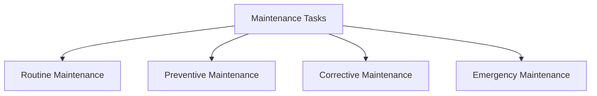

# Maintenance Tasks

## 📋 Overview
This document outlines the maintenance tasks and procedures for our Operations Knowledge Base, ensuring systematic and effective system maintenance through well-defined tasks and schedules.

## 🎯 Maintenance Framework

### Core Components


### Maintenance Architecture
1. **Maintenance Types**
   ```yaml
   maintenance_types:
     routine:
       - daily_tasks
       - weekly_tasks
       - monthly_tasks
       - quarterly_tasks
     preventive:
       - system_checks
       - updates_patches
       - performance_tuning
       - security_hardening
   ```

2. **Task Categories**
   - System maintenance
   - Database maintenance
   - Network maintenance
   - Security maintenance

## 📅 Routine Maintenance

### Daily Tasks
1. **System Checks**
   ```python
   def daily_maintenance():
       check_system_health()
       monitor_performance()
       verify_backups()
       review_logs()
   ```

2. **Regular Monitoring**
   - Health checks
   - Performance monitoring
   - Error checking
   - Log review

### Weekly Tasks
1. **Weekly Operations**
   ```json
   {
     "weekly_tasks": {
       "system": ["updates", "cleanup", "optimization", "verification"],
       "data": ["backup_review", "integrity_check", "cleanup", "archival"],
       "security": ["scan", "audit", "review", "update"]
     }
   }
   ```

2. **Weekly Reviews**
   - Performance review
   - Security review
   - Resource usage
   - Issue tracking

## 🔧 Preventive Maintenance

### System Updates
1. **Update Management**
   - Security patches
   - System updates
   - Software updates
   - Firmware updates

2. **Update Process**
   - Update planning
   - Testing
   - Implementation
   - Verification

### System Optimization
1. **Performance Tuning**
   - Resource optimization
   - Cache management
   - Query optimization
   - Storage optimization

2. **Configuration Management**
   - System configuration
   - Service configuration
   - Security configuration
   - Network configuration

## 🛠 Corrective Maintenance

### Issue Resolution
1. **Problem Management**
   - Issue identification
   - Root cause analysis
   - Solution implementation
   - Verification

2. **System Repairs**
   - Component repair
   - Service restoration
   - Data recovery
   - Performance recovery

### Performance Recovery
1. **Recovery Tasks**
   - System recovery
   - Service recovery
   - Data recovery
   - Performance recovery

2. **Validation Steps**
   - System testing
   - Performance testing
   - Security testing
   - User validation

## 🚨 Emergency Maintenance

### Emergency Response
1. **Critical Issues**
   - System failures
   - Security breaches
   - Data corruption
   - Service outages

2. **Response Process**
   - Issue assessment
   - Immediate action
   - Recovery steps
   - Follow-up

### Recovery Operations
1. **Emergency Procedures**
   - System restore
   - Data recovery
   - Service restoration
   - Security measures

2. **Post-Emergency**
   - Root cause analysis
   - Documentation
   - Prevention measures
   - Process improvement

## 📊 Maintenance Scheduling

### Schedule Management
1. **Maintenance Calendar**
   - Daily schedule
   - Weekly schedule
   - Monthly schedule
   - Quarterly schedule

2. **Task Planning**
   - Resource allocation
   - Time management
   - Priority setting
   - Coordination

### Schedule Types
1. **Regular Schedules**
   - Routine tasks
   - Preventive tasks
   - Review tasks
   - Update tasks

2. **Special Schedules**
   - Major updates
   - System upgrades
   - Infrastructure changes
   - Special projects

## 🔍 Quality Control

### Task Verification
1. **Quality Checks**
   - Task completion
   - Performance validation
   - Security verification
   - Documentation review

2. **Validation Process**
   - Testing procedures
   - Performance checks
   - Security validation
   - User acceptance

### Quality Metrics
1. **Performance Metrics**
   - Task efficiency
   - Success rate
   - Time management
   - Resource usage

2. **Impact Analysis**
   - System impact
   - User impact
   - Performance impact
   - Security impact

## 📈 Reporting and Documentation

### Maintenance Records
1. **Task Documentation**
   - Task details
   - Procedures followed
   - Results achieved
   - Issues encountered

2. **Record Keeping**
   - Maintenance logs
   - Change records
   - Issue tracking
   - Performance data

### Reporting
1. **Regular Reports**
   - Daily reports
   - Weekly summaries
   - Monthly reviews
   - Quarterly assessments

2. **Special Reports**
   - Incident reports
   - Problem reports
   - Change reports
   - Audit reports

## 🛠 Maintenance Tools

### Tool Selection
1. **Management Tools**
   - Monitoring tools
   - Management systems
   - Automation tools
   - Documentation tools

2. **Support Tools**
   - Diagnostic tools
   - Analysis tools
   - Testing tools
   - Reporting tools

### Tool Usage
1. **Tool Management**
   - Tool configuration
   - Access control
   - Usage tracking
   - Maintenance

2. **Automation**
   - Task automation
   - Schedule automation
   - Report automation
   - Monitoring automation

## 📝 Related Documentation
- [[operational-procedures]]
- [[monitoring-guidelines]]
- [[change-management]]
- [[problem-management]]

## 🔄 Change Log
| Date | Change | Author |
|------|--------|--------|
| YYYY-MM-DD | Initial maintenance tasks documentation | Name |

---

*Last updated: <% tp.date.now("YYYY-MM-DD") %>* 