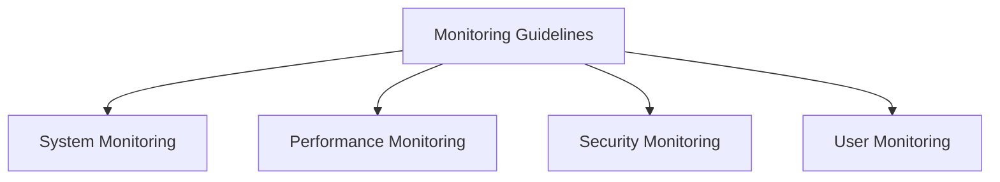

# Monitoring Guidelines

## 📋 Overview
This document outlines the monitoring guidelines and best practices for our Operations Knowledge Base, ensuring comprehensive system observability and effective performance tracking.

## 🎯 Monitoring Framework

### Core Components


### Monitoring Architecture
1. **Monitoring Layers**
   ```yaml
   monitoring_layers:
     infrastructure:
       - system_metrics
       - resource_metrics
       - network_metrics
       - storage_metrics
     application:
       - performance_metrics
       - error_metrics
       - user_metrics
       - business_metrics
   ```

2. **Monitoring Types**
   - Real-time monitoring
   - Historical monitoring
   - Predictive monitoring
   - Behavioral monitoring

## 🔍 System Monitoring

### Infrastructure Monitoring
1. **System Metrics**
   ```python
   def monitor_infrastructure():
       track_system_resources()
       monitor_network_performance()
       check_storage_usage()
       verify_service_health()
   ```

2. **Resource Tracking**
   - CPU utilization
   - Memory usage
   - Disk I/O
   - Network traffic

### Service Monitoring
1. **Service Metrics**
   ```json
   {
     "service_monitoring": {
       "availability": ["uptime", "response_time", "errors", "latency"],
       "performance": ["throughput", "capacity", "utilization", "queues"],
       "health": ["status", "dependencies", "endpoints", "resources"]
     }
   }
   ```

2. **Service Health**
   - Availability checks
   - Performance metrics
   - Error tracking
   - Dependency status

## 📊 Performance Monitoring

### Application Performance
1. **Performance Metrics**
   - Response times
   - Transaction rates
   - Error rates
   - Resource usage

2. **Performance Analysis**
   - Trend analysis
   - Bottleneck detection
   - Capacity planning
   - Optimization opportunities

### User Experience
1. **User Metrics**
   - Page load times
   - Transaction times
   - Error encounters
   - Session data

2. **Experience Analysis**
   - User satisfaction
   - Feature usage
   - Error impact
   - Performance impact

## 🔒 Security Monitoring

### Security Metrics
1. **Security Events**
   - Access attempts
   - Security incidents
   - Policy violations
   - Threat indicators

2. **Security Analysis**
   - Threat detection
   - Vulnerability assessment
   - Risk analysis
   - Compliance monitoring

### Compliance Monitoring
1. **Compliance Metrics**
   - Policy compliance
   - Standard adherence
   - Regulatory requirements
   - Audit trails

2. **Audit Requirements**
   - Access logging
   - Change tracking
   - Security events
   - Compliance reports

## 📈 Metrics Collection

### Data Collection
1. **Collection Methods**
   - Agent-based collection
   - API integration
   - Log analysis
   - Network monitoring

2. **Data Processing**
   - Data aggregation
   - Data filtering
   - Data enrichment
   - Data storage

### Metric Types
1. **Core Metrics**
   - Technical metrics
   - Business metrics
   - User metrics
   - Security metrics

2. **Custom Metrics**
   - Application-specific
   - Business-specific
   - User-specific
   - Process-specific

## 🔔 Alerting System

### Alert Configuration
1. **Alert Rules**
   - Threshold alerts
   - Trend alerts
   - Anomaly alerts
   - Composite alerts

2. **Alert Management**
   - Alert routing
   - Alert prioritization
   - Alert correlation
   - Alert suppression

### Response Process
1. **Alert Handling**
   - Alert triage
   - Response procedures
   - Escalation paths
   - Resolution tracking

2. **Incident Management**
   - Incident creation
   - Response coordination
   - Status tracking
   - Resolution documentation

## 📊 Visualization

### Dashboard Design
1. **Dashboard Types**
   - Overview dashboards
   - Technical dashboards
   - Business dashboards
   - Custom dashboards

2. **Visual Elements**
   - Metric graphs
   - Status indicators
   - Trend displays
   - Alert notifications

### Data Presentation
1. **View Types**
   - Real-time views
   - Historical views
   - Comparative views
   - Analytical views

2. **Interaction Options**
   - Drill-down capability
   - Filter options
   - Time range selection
   - Custom queries

## 🛠 Monitoring Tools

### Tool Selection
1. **Monitoring Tools**
   - System monitoring
   - Application monitoring
   - Network monitoring
   - Security monitoring

2. **Support Tools**
   - Log management
   - Metric storage
   - Analysis tools
   - Visualization tools

### Tool Integration
1. **Integration Points**
   - Data collection
   - Alert integration
   - Tool coordination
   - Reporting integration

2. **Data Management**
   - Data storage
   - Data retention
   - Data access
   - Data backup

## 📝 Related Documentation
- [[operational-procedures]]
- [[maintenance-tasks]]
- [[incident-response]]
- [[performance-metrics]]

## 🔄 Change Log
| Date | Change | Author |
|------|--------|--------|
| YYYY-MM-DD | Initial monitoring guidelines documentation | Name |

---

*Last updated: <% tp.date.now("YYYY-MM-DD") %>* 