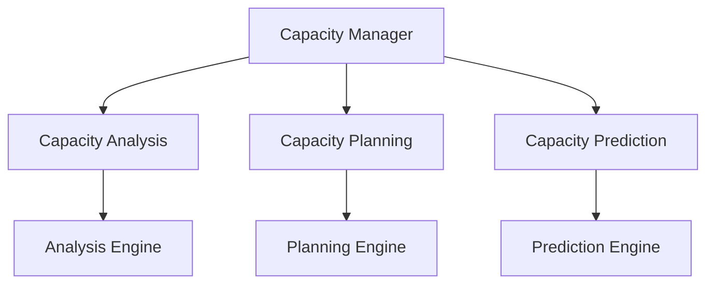

# Capacity Planning Framework

```yaml
---
title: Capacity Planning Framework
unit: [[units/Technology/agent_systems_unit]]
created: 2024-02-13
updated: 2024-02-13
owner: Agent Systems Unit
process_type: planning
criticality: high
reviewers:
  - Operations Team
  - Planning Team
  - Resource Team
status: draft
version: 1.0
tags:
  - capacity
  - planning
  - resources
  - scaling
related_documents:
  - [[monitoring/resource_monitoring]]
  - [[monitoring/performance_monitoring]]
  - [[processes/resource_management]]
  - [[processes/monitoring_processes]]
---
```

## Purpose & Scope
This document defines the capacity planning framework for the agent system, providing comprehensive planning, analysis, and management capabilities for system capacity across all components.

## Planning Architecture

### 1. Core Components
#### 1.1 Capacity Manager
```python
class CapacityManager:
    def __init__(self):
        self.analyzer = CapacityAnalyzer()
        self.planner = CapacityPlanner()
        self.predictor = CapacityPredictor()
        self.optimizer = CapacityOptimizer()
        self.monitor = CapacityMonitor()
```

#### 1.2 Component Relationships


### 2. Capacity Analysis
#### 2.1 Analysis System
```python
class CapacityAnalyzer:
    def __init__(self):
        self.engine = AnalysisEngine()
        self.profiler = UsageProfiler()
        self.correlator = MetricCorrelator()
        self.assessor = ImpactAssessor()

    async def analyze_capacity(self, data):
        profile = await self.profiler.profile_usage(data)
        correlation = await self.correlator.correlate_metrics(profile)
        assessment = await self.assessor.assess_impact(correlation)
        return await self.engine.analyze_results(assessment)
```

#### 2.2 Analysis Types
- Usage Analysis
- Growth Analysis
- Impact Analysis
- Risk Analysis

### 3. Capacity Planning
#### 3.1 Planning System
```python
class CapacityPlanner:
    def __init__(self):
        self.engine = PlanningEngine()
        self.modeler = CapacityModeler()
        self.optimizer = ResourceOptimizer()
        self.validator = PlanValidator()

    async def create_plan(self, analysis):
        model = await self.modeler.create_model(analysis)
        optimization = await self.optimizer.optimize_resources(model)
        plan = await self.engine.create_plan(optimization)
        return await self.validator.validate_plan(plan)
```

#### 3.2 Planning Types
- Resource Planning
- Growth Planning
- Scaling Planning
- Contingency Planning

### 4. Capacity Prediction
#### 4.1 Prediction System
```python
class CapacityPredictor:
    def __init__(self):
        self.engine = PredictionEngine()
        self.modeler = GrowthModeler()
        self.analyzer = TrendAnalyzer()
        self.validator = PredictionValidator()

    async def predict_capacity(self, data):
        model = await self.modeler.create_model(data)
        trends = await self.analyzer.analyze_trends(model)
        prediction = await self.engine.predict_growth(trends)
        return await self.validator.validate_prediction(prediction)
```

#### 4.2 Prediction Types
- Growth Prediction
- Usage Prediction
- Impact Prediction
- Risk Prediction

### 5. Capacity Optimization
#### 5.1 Optimization System
```python
class CapacityOptimizer:
    def __init__(self):
        self.engine = OptimizationEngine()
        self.planner = OptimizationPlanner()
        self.executor = OptimizationExecutor()
        self.validator = OptimizationValidator()

    async def optimize_capacity(self, plan):
        optimization = await self.planner.create_plan(plan)
        execution = await self.executor.execute_plan(optimization)
        validation = await self.validator.validate_optimization(execution)
        return await self.engine.apply_optimization(validation)
```

#### 5.2 Optimization Types
- Resource Optimization
- Cost Optimization
- Performance Optimization
- Risk Optimization

### 6. Capacity Monitoring
#### 6.1 Monitoring System
```python
class CapacityMonitor:
    def __init__(self):
        self.collector = MetricCollector()
        self.analyzer = UsageAnalyzer()
        self.alerter = AlertManager()
        self.reporter = ReportGenerator()

    async def monitor_capacity(self, metrics):
        collection = await self.collector.collect_metrics(metrics)
        analysis = await self.analyzer.analyze_usage(collection)
        alerts = await self.alerter.process_alerts(analysis)
        return await self.reporter.generate_report(analysis)
```

#### 6.2 Monitoring Types
- Usage Monitoring
- Growth Monitoring
- Performance Monitoring
- Risk Monitoring

## Implementation Guidelines

### 1. Planning Implementation
#### 1.1 Implementation Steps
```python
class PlanningImplementation:
    async def implement_planning(self, spec):
        # Planning implementation logic
        pass

    async def configure_components(self, components):
        # Component configuration
        pass

    async def setup_monitoring(self, monitoring):
        # Monitoring setup
        pass
```

#### 1.2 Implementation Standards
- Planning Architecture
- Component Standards
- Monitoring Rules
- Integration Guidelines

### 2. Resource Management
#### 2.1 Management System
```python
class ResourceManagement:
    def __init__(self):
        self.allocator = ResourceAllocator()
        self.scheduler = ResourceScheduler()
        self.controller = ResourceController()
        self.monitor = ResourceMonitor()
```

#### 2.2 Management Types
- Allocation Management
- Scheduling Management
- Control Management
- Monitoring Management

## Quality Control

### 1. Planning Quality
#### 1.1 Quality Metrics
- Planning Accuracy
- Prediction Accuracy
- Optimization Effectiveness
- Resource Efficiency

#### 1.2 Quality Monitoring
```python
class QualityMonitoring:
    async def monitor_quality(self, planning):
        # Quality monitoring logic
        pass

    async def validate_plans(self, plans):
        # Plan validation logic
        pass

    async def measure_effectiveness(self, metrics):
        # Effectiveness measurement
        pass
```

### 2. Performance Management
#### 2.1 Performance Areas
- Planning Performance
- Prediction Performance
- Optimization Performance
- Resource Performance

#### 2.2 Optimization
- Process Optimization
- Resource Management
- Cost Optimization
- Risk Management

## Compliance Requirements

### 1. Planning Compliance
#### 1.1 Compliance Controls
```python
class PlanningCompliance:
    async def validate_compliance(self, requirements):
        # Compliance validation logic
        pass

    async def monitor_compliance(self, controls):
        # Compliance monitoring logic
        pass

    async def report_compliance(self, status):
        # Compliance reporting logic
        pass
```

#### 1.2 Compliance Areas
- Planning Standards
- Resource Standards
- Security Standards
- Regulatory Requirements

### 2. Documentation Requirements
- Planning Documentation
- Resource Documentation
- Compliance Documentation
- Audit Reports

## Related Documentation
### Internal Links
- [[monitoring/resource_monitoring|Resource Monitoring]]
- [[monitoring/performance_monitoring|Performance Monitoring]]
- [[processes/resource_management|Resource Management]]
- [[processes/monitoring_processes|Monitoring Processes]]

### External References
- Planning Standards
- Resource Management
- Optimization Guidelines
- Industry Benchmarks

## Maintenance
### Review Schedule
- Daily Capacity Review
- Weekly Planning Review
- Monthly Optimization Assessment
- Quarterly Framework Audit

### Update Process
1. Capacity Analysis
2. Planning Review
3. Optimization Assessment
4. Enhancement Planning
5. Implementation

## Appendices
### A. Planning Patterns
```python
# Example planning pattern
class PlanningPattern:
    def __init__(self):
        self.analyzer = CapacityAnalyzer()
        self.planner = CapacityPlanner()
        self.predictor = CapacityPredictor()
```

### B. Optimization Patterns
```python
# Example optimization pattern
class OptimizationPattern:
    def __init__(self):
        self.engine = OptimizationEngine()
        self.planner = OptimizationPlanner()
        self.executor = OptimizationExecutor()
```

### C. Monitoring Patterns
```python
# Example monitoring pattern
class MonitoringPattern:
    def __init__(self):
        self.collector = MetricCollector()
        self.analyzer = UsageAnalyzer()
        self.reporter = ReportGenerator()
``` 