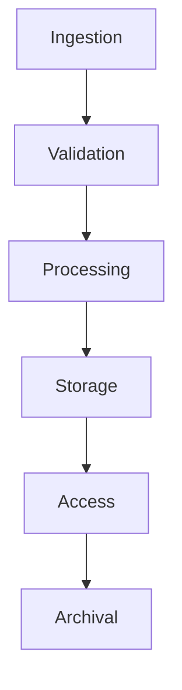

# Data Management Processes

```yaml
---
title: Data Management Processes
unit: [[units/Technology/agent_systems_unit]]
created: 2024-02-13
updated: 2024-02-13
owner: Agent Systems Unit
process_type: operational
criticality: high
reviewers:
  - Data Team
  - Integration Team
  - Security Team
status: draft
version: 1.0
tags:
  - data
  - processes
  - operations
  - management
related_documents:
  - [[agents/modules/integration/data]]
  - [[agents/modules/core/state]]
  - [[processes/service_management]]
  - [[security/data_security]]
---
```

## Purpose & Scope
This document defines the operational processes and procedures for managing data integration within the agent system, providing comprehensive guidelines for data lifecycle management, transformation, and security.

## Process Overview

### 1. Data Lifecycle
#### 1.1 Lifecycle Stages


#### 1.2 Stage Processes
```python
class DataLifecycle:
    def __init__(self):
        self.ingestion = IngestionProcess()
        self.validation = ValidationProcess()
        self.processing = ProcessingSystem()
        self.storage = StorageManager()
        self.access = AccessControl()
        self.archival = ArchivalSystem()

    async def manage_lifecycle(self, data):
        async with self.lifecycle_context(data):
            await self.perform_ingestion()
            await self.execute_validation()
            await self.process_data()
            await self.store_data()
            await self.manage_access()
            await self.archive_data()
```

### 2. Data Ingestion
#### 2.1 Ingestion Process
```python
class DataIngestion:
    def __init__(self):
        self.collectors = DataCollectors()
        self.validators = DataValidators()
        self.transformers = DataTransformers()
        self.loaders = DataLoaders()

    async def ingest_data(self, source):
        data = await self.collectors.collect_data(source)
        validated = await self.validators.validate_data(data)
        transformed = await self.transformers.transform_data(validated)
        await self.loaders.load_data(transformed)
```

#### 2.2 Ingestion Methods
- Batch Ingestion
- Stream Ingestion
- Event Ingestion
- API Ingestion

### 3. Data Processing
#### 3.1 Processing System
```python
class DataProcessing:
    def __init__(self):
        self.pipeline = ProcessingPipeline()
        self.executor = ProcessingExecutor()
        self.monitor = ProcessingMonitor()
        self.optimizer = ProcessingOptimizer()

    async def process_data(self, data):
        pipeline = await self.pipeline.create_pipeline(data)
        execution = await self.executor.execute_pipeline(pipeline)
        monitoring = await self.monitor.track_execution(execution)
        await self.optimizer.optimize_processing(monitoring)
```

#### 3.2 Processing Types
- Data Transformation
- Data Enrichment
- Data Aggregation
- Data Analysis

### 4. Data Storage
#### 4.1 Storage Management
```python
class StorageManagement:
    def __init__(self):
        self.manager = StorageManager()
        self.allocator = StorageAllocator()
        self.optimizer = StorageOptimizer()
        self.monitor = StorageMonitor()

    async def manage_storage(self, data):
        requirements = await self.manager.analyze_requirements(data)
        allocation = await self.allocator.allocate_storage(requirements)
        optimization = await self.optimizer.optimize_storage(allocation)
        await self.monitor.monitor_storage(optimization)
```

#### 4.2 Storage Types
- Primary Storage
- Cache Storage
- Archive Storage
- Backup Storage

### 5. Data Access
#### 5.1 Access Control
```python
class DataAccess:
    def __init__(self):
        self.controller = AccessController()
        self.authenticator = AccessAuthenticator()
        self.authorizer = AccessAuthorizer()
        self.auditor = AccessAuditor()

    async def control_access(self, request):
        authentication = await self.authenticator.authenticate(request)
        authorization = await self.authorizer.authorize(authentication)
        access = await self.controller.grant_access(authorization)
        await self.auditor.audit_access(access)
```

#### 5.2 Access Patterns
- Direct Access
- Cached Access
- Batch Access
- Stream Access

### 6. Data Quality
#### 6.1 Quality Management
```python
class QualityManagement:
    def __init__(self):
        self.validator = QualityValidator()
        self.monitor = QualityMonitor()
        self.analyzer = QualityAnalyzer()
        self.reporter = QualityReporter()

    async def manage_quality(self, data):
        validation = await self.validator.validate_quality(data)
        monitoring = await self.monitor.monitor_quality(validation)
        analysis = await self.analyzer.analyze_quality(monitoring)
        await self.reporter.report_quality(analysis)
```

#### 6.2 Quality Metrics
- Accuracy Metrics
- Completeness Metrics
- Consistency Metrics
- Timeliness Metrics

## Implementation Guidelines

### 1. Process Implementation
#### 1.1 Implementation Steps
```python
class ProcessImplementation:
    async def implement_process(self, spec):
        # Process implementation logic
        pass

    async def configure_pipeline(self, pipeline):
        # Pipeline configuration
        pass

    async def setup_monitoring(self, monitoring):
        # Monitoring setup
        pass
```

#### 1.2 Implementation Standards
- Process Structure
- Pipeline Design
- Monitoring Rules
- Error Handling

### 2. Pipeline Management
#### 2.1 Pipeline System
```python
class PipelineManager:
    def __init__(self):
        self.engine = PipelineEngine()
        self.router = DataRouter()
        self.scheduler = TaskScheduler()
        self.monitor = PipelineMonitor()
```

#### 2.2 Pipeline Types
- Linear Pipelines
- Parallel Pipelines
- Conditional Pipelines
- Stream Pipelines

## Quality Control

### 1. Process Quality
#### 1.1 Quality Metrics
- Process Efficiency
- Data Quality
- Processing Time
- Error Rate

#### 1.2 Quality Monitoring
```python
class ProcessQuality:
    async def monitor_quality(self, process):
        # Quality monitoring logic
        pass

    async def validate_process(self, execution):
        # Process validation logic
        pass

    async def measure_performance(self, metrics):
        # Performance measurement
        pass
```

### 2. Performance Management
#### 2.1 Performance Areas
- Processing Speed
- Resource Usage
- Throughput Rate
- Latency

#### 2.2 Optimization
- Pipeline Optimization
- Resource Management
- Cache Strategy
- Load Distribution

## Security Requirements

### 1. Data Security
#### 1.1 Security Controls
```python
class DataSecurity:
    async def secure_data(self, data):
        # Data security logic
        pass

    async def validate_access(self, request):
        # Access validation logic
        pass

    async def audit_operation(self, operation):
        # Audit logging logic
        pass
```

#### 1.2 Security Operations
- Data Encryption
- Access Control
- Data Masking
- Audit Logging

### 2. Privacy Controls
- Data Privacy
- Consent Management
- Data Protection
- Compliance

## Related Documentation
### Internal Links
- [[agents/modules/integration/data|Data Integration]]
- [[processes/service_management|Service Management]]
- [[security/data_security|Data Security]]
- [[monitoring/data_monitoring|Data Monitoring]]

### External References
- Data Standards
- Processing Patterns
- Security Guidelines
- Privacy Requirements

## Maintenance
### Review Schedule
- Daily Data Monitoring
- Weekly Quality Review
- Monthly Security Assessment
- Quarterly Process Audit

### Update Process
1. Process Analysis
2. Quality Review
3. Security Assessment
4. Enhancement Planning
5. Implementation

## Appendices
### A. Process Patterns
```python
# Example process pattern
class ProcessPattern:
    def __init__(self):
        self.pipeline = PipelineEngine()
        self.executor = ProcessExecutor()
        self.monitor = ProcessMonitor()
```

### B. Pipeline Patterns
```python
# Example pipeline pattern
class PipelinePattern:
    def __init__(self):
        self.engine = PipelineEngine()
        self.router = DataRouter()
        self.scheduler = TaskScheduler()
```

### C. Security Patterns
```python
# Example security pattern
class DataSecurityPattern:
    def __init__(self):
        self.encryption = DataEncryption()
        self.access = AccessControl()
        self.audit = AuditLogger()
``` 