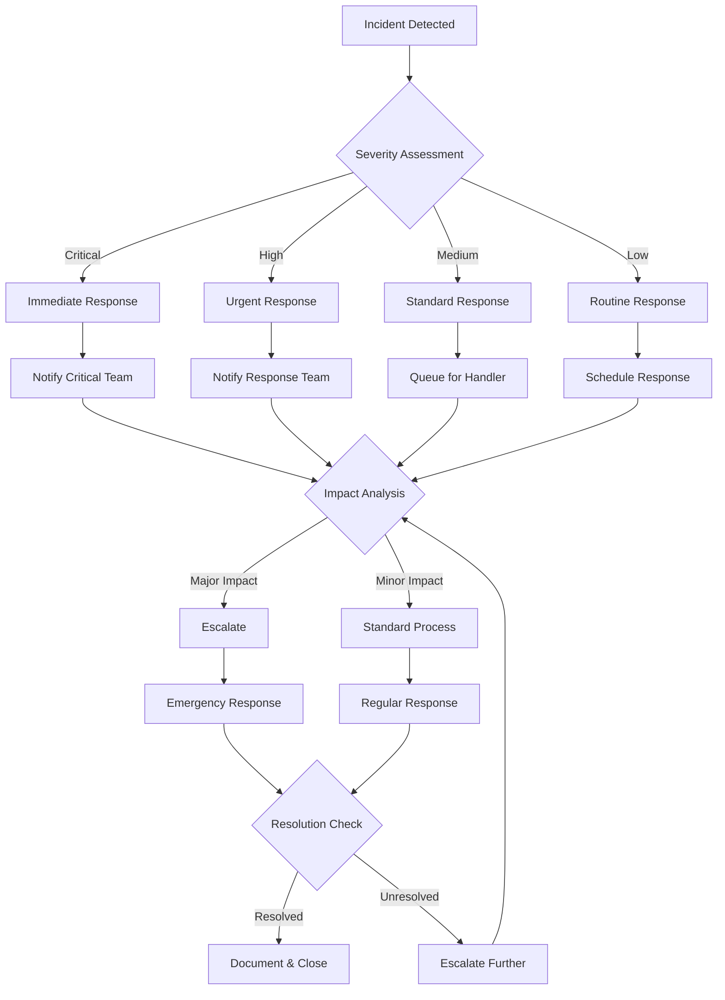
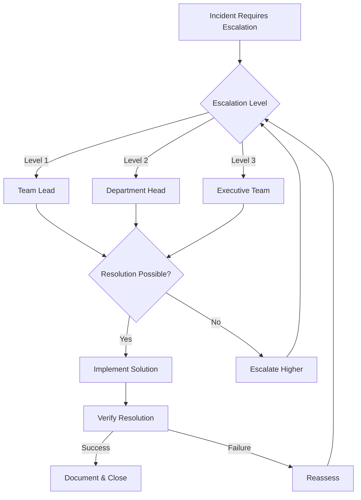
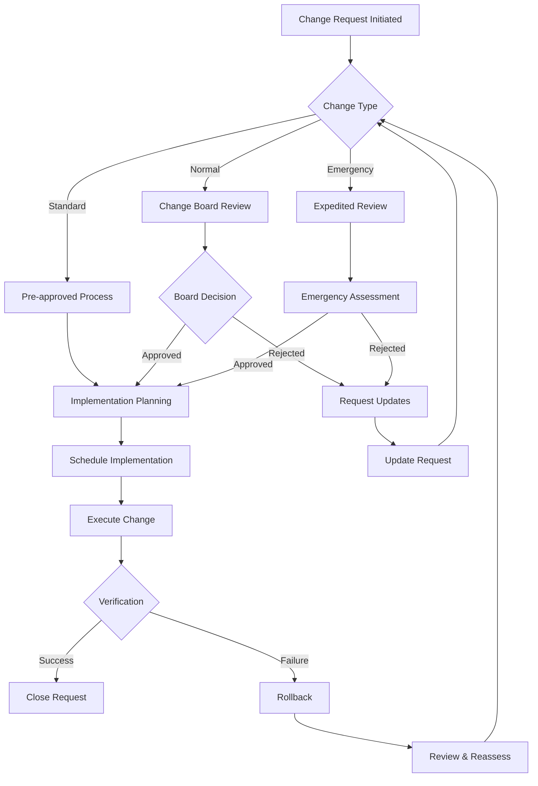
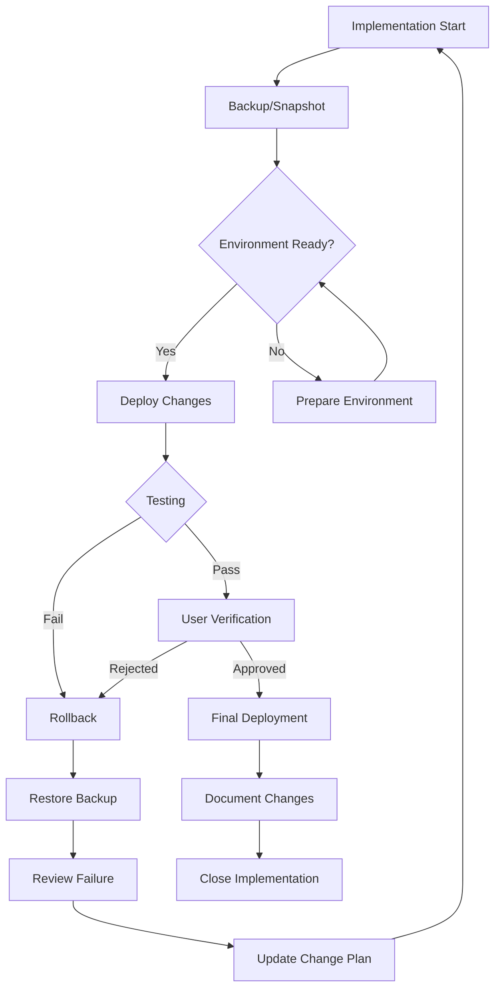
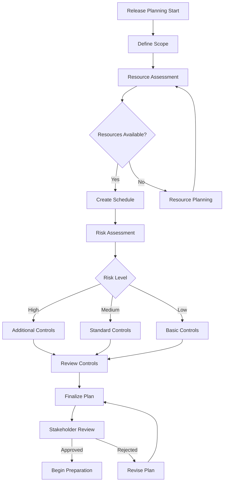
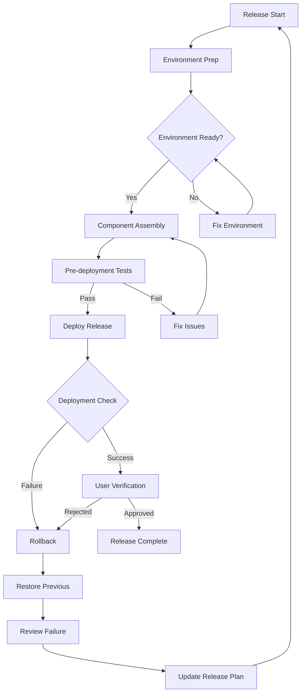
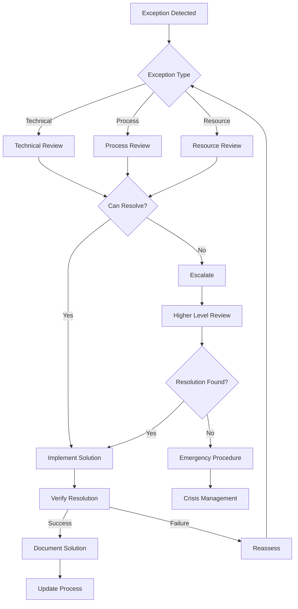
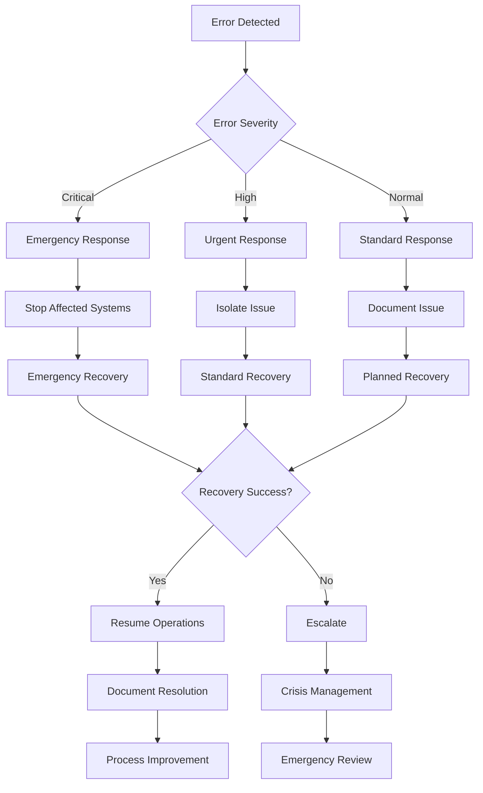
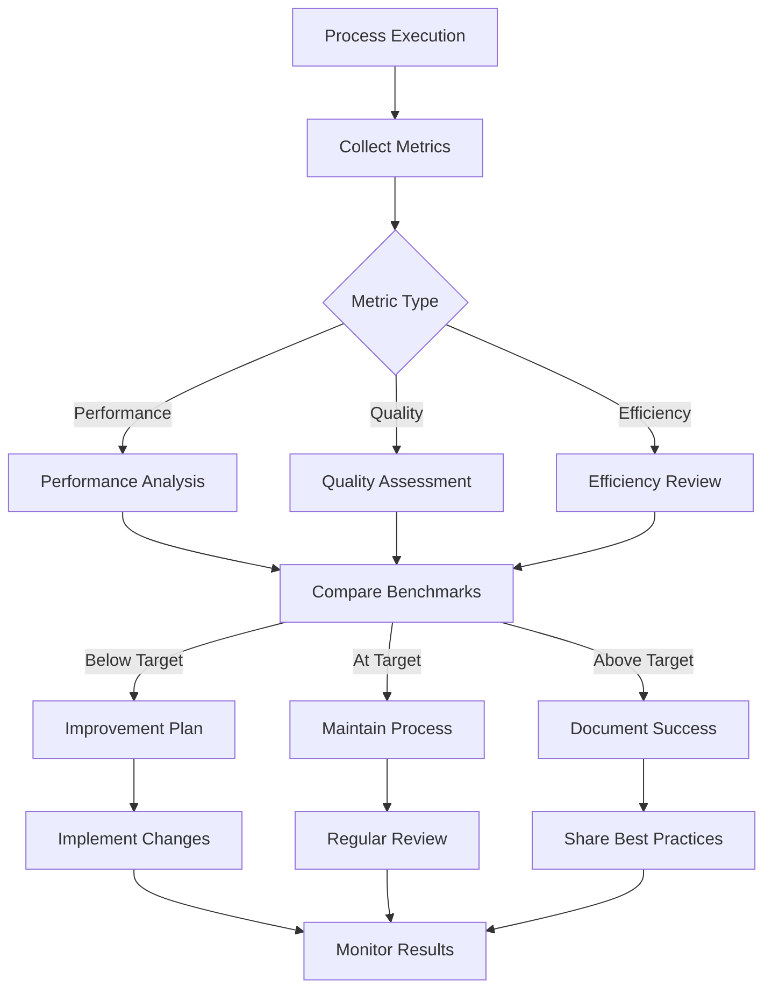

# Process Flowcharts

## 📋 Overview
This document provides detailed flowcharts for our core operational processes using Mermaid diagrams. These visual representations help clarify process flows, decision points, and exception handling.

## 🚨 Incident Management Flow

### Incident Detection and Response

### Incident Escalation Process

## 🔄 Change Management Flow

### Change Request Process

### Change Implementation Flow

## 🚀 Release Management Flow

### Release Planning Process

### Release Implementation Flow

## ⚠️ Exception Handling

### General Exception Flow

### Error Recovery Flow

## 📊 Process Metrics

### Metrics Collection Flow

## 📚 References

### Internal Documentation
- [[core-processes]]
- [[incident-response]]
- [[change-management]]
- [[release-procedures]]

### External Resources
- [Mermaid Diagram Syntax](https://mermaid-js.github.io/mermaid/)
- [Process Modeling Best Practices](https://example.com/process-modeling)
- [Flowchart Standards](https://example.com/flowchart-standards)

## 📅 Version History
- 2024-03-20: Initial process flowcharts documentation
- [Future updates will be logged here]

---

*Last updated: 2024-03-20* 