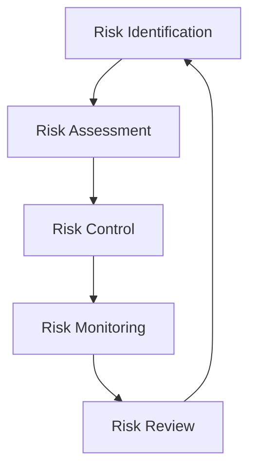

# Risk Management Processes

```yaml
---
title: Risk Management Processes
unit: [[units/Risk_Management/risk_management_unit]]
created: 2024-02-13
updated: 2024-02-13
owner: Risk Management Unit
process_type: operational
criticality: high
reviewers:
  - Governance Unit
  - Compliance Unit
  - Quality Assurance Unit
status: draft
version: 1.0
tags:
  - risk
  - processes
  - control
  - management
related_frameworks:
  - [[frameworks/risk_management]]
  - [[frameworks/governance_frameworks]]
related_processes:
  - [[processes/quality_processes]]
  - [[processes/compliance_processes]]
---
```

## Purpose & Scope
This document details the operational processes and procedures that implement the [[frameworks/risk_management|Risk Management Framework]], ensuring comprehensive risk identification, assessment, and control across the organization.

## Process Overview

### 1. Process Structure
#### 1.1 Process Flow


#### 1.2 Key Components
- Risk Teams
- Control Points
- Review Cycles
- Reporting Lines

### 2. Risk Identification
#### 2.1 Identification Process
- Risk scanning
- Source analysis
- Trigger identification
- Impact assessment

#### 2.2 Risk Classification
- Risk categories
- Risk levels
- Impact zones
- Probability ranges

### 3. Risk Assessment
#### 3.1 Assessment Process
- Impact analysis
- Probability evaluation
- Risk scoring
- Priority setting

#### 3.2 Analysis Methods
- Quantitative analysis
- Qualitative analysis
- Scenario planning
- Trend analysis

### 4. Risk Control
#### 4.1 Control Strategy
- Prevention measures
- Detection systems
- Response procedures
- Recovery plans

#### 4.2 Control Implementation
- Control design
- Implementation steps
- Monitoring setup
- Effectiveness validation

### 5. Risk Monitoring
#### 5.1 Monitoring System
- Risk indicators
- Control metrics
- Performance measures
- Trend tracking

#### 5.2 Review Process
- Regular reviews
- Special assessments
- Incident analysis
- Performance evaluation

## Implementation Guidelines

### 1. Process Execution
#### 1.1 Execution Steps
1. Risk identification
2. Assessment execution
3. Control implementation
4. Monitoring activation
5. Review scheduling

#### 1.2 Role Requirements
- Risk owners
- Control operators
- Assessment teams
- Review committees

### 2. Control Integration
#### 2.1 Control Points
- Entry controls
- Process controls
- Output controls
- System controls

#### 2.2 Control Methods
- Prevention methods
- Detection techniques
- Response procedures
- Recovery protocols

## Quality Standards

### 1. Process Standards
#### 1.1 Risk Standards
- Assessment standards
- Control requirements
- Monitoring criteria
- Review standards

#### 1.2 Documentation Standards
- Risk documentation
- Control records
- Performance reports
- Review reports

### 2. Output Standards
#### 2.1 Assessment Standards
- Analysis requirements
- Scoring criteria
- Priority levels
- Documentation needs

#### 2.2 Control Standards
- Control effectiveness
- Performance criteria
- Response times
- Recovery standards

## Performance Monitoring

### 1. Monitoring System
#### 1.1 Data Collection
- Risk metrics
- Control data
- Performance measures
- Incident records

#### 1.2 Analysis Methods
- Risk analysis
- Trend evaluation
- Performance assessment
- Impact measurement

### 2. Review Process
#### 2.1 Regular Reviews
- Daily monitoring
- Weekly assessments
- Monthly reviews
- Quarterly audits

#### 2.2 Special Reviews
- Incident reviews
- Control assessments
- System audits
- Process evaluations

## Related Documentation
### Internal Links
- [[procedures/risk_procedures]]
- [[guidelines/risk_guidelines]]
- [[standards/risk_standards]]
- [[forms/risk_forms]]

### External References
- Risk management standards
- Industry regulations
- Best practices
- Compliance requirements

## Maintenance
### Review Schedule
- Daily risk monitoring
- Weekly control review
- Monthly process assessment
- Quarterly framework audit
- Annual process revision

### Update Process
1. Performance review
2. Gap analysis
3. Process improvement
4. Documentation update
5. Training refresh

## Appendices
### A. Process Tools
- Risk tools
- Analysis methods
- Control systems
- Monitoring tools

### B. Templates & Forms
- Risk registers
- Control forms
- Review checklists
- Report formats

### C. Reference Materials
- Process guides
- Best practices
- Training materials
- Resource guides 