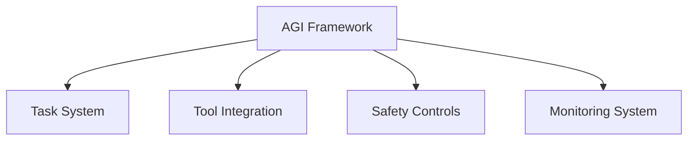

# AGI Framework

## 📋 Overview
This document defines the AGI integration framework for our Operations Knowledge Base, establishing standards and controls for safe and effective AGI system integration.

## 🎯 Framework Components

### Core Architecture


### Framework Layers
1. **Integration Layers**
   ```yaml
   agi_layers:
     task_management:
       - task_definition
       - context_handling
       - execution_control
       - output_validation
     tool_access:
       - tool_registry
       - permission_control
       - usage_monitoring
       - performance_tracking
   ```

2. **Control Layers**
   - Safety mechanisms
   - Access controls
   - Resource limits
   - Monitoring systems

## 🤖 Task Framework

### Task Management
1. **Task Definition**
   ```python
   def define_task():
       specify_objectives()
       set_constraints()
       define_context()
       establish_validation()
   ```

2. **Context Management**
   - State tracking
   - History management
   - Resource context
   - User context

### Execution Control
1. **Control Flow**
   ```json
   {
     "execution_control": {
       "stages": ["validation", "execution", "verification", "completion"],
       "controls": ["safety", "resource", "permission", "output"],
       "monitoring": ["progress", "performance", "resource", "safety"]
     }
   }
   ```

2. **State Management**
   - Task state
   - Resource state
   - Context state
   - System state

## 🛠 Tool Integration

### Tool Management
1. **Tool Registry**
   - Tool definition
   - Capability mapping
   - Access control
   - Usage tracking

2. **Integration Points**
   - API integration
   - Command execution
   - Resource access
   - Data exchange

### Access Control
1. **Permission System**
   - Role-based access
   - Capability control
   - Resource limits
   - Usage quotas

2. **Usage Monitoring**
   - Activity tracking
   - Resource usage
   - Performance metrics
   - Error monitoring

## 🔒 Safety Controls

### Control Mechanisms
1. **Safety Layers**
   - Input validation
   - Action verification
   - Output validation
   - State monitoring

2. **Resource Controls**
   - Compute limits
   - Memory limits
   - Time constraints
   - Access boundaries

### Risk Management
1. **Risk Assessment**
   - Task evaluation
   - Impact analysis
   - Resource assessment
   - Security check

2. **Mitigation Strategies**
   - Prevention measures
   - Detection systems
   - Response procedures
   - Recovery plans

## 📊 Monitoring System

### Performance Monitoring
1. **Metric Collection**
   - Task metrics
   - Resource metrics
   - Performance metrics
   - Safety metrics

2. **Analysis Tools**
   - Real-time monitoring
   - Trend analysis
   - Pattern detection
   - Anomaly detection

### Reporting System
1. **Status Reports**
   - Task status
   - Resource usage
   - Performance stats
   - Safety metrics

2. **Alert System**
   - Safety alerts
   - Performance alerts
   - Resource alerts
   - Error notifications

## 🔄 Continuous Improvement

### Learning System
1. **Pattern Learning**
   - Task patterns
   - Usage patterns
   - Error patterns
   - Performance patterns

2. **Optimization Process**
   - Task optimization
   - Resource optimization
   - Performance tuning
   - Safety enhancement

### Evolution Management
1. **Framework Updates**
   - Capability expansion
   - Control refinement
   - Integration enhancement
   - Safety improvement

2. **Version Control**
   - Change management
   - Version tracking
   - Deployment control
   - Rollback procedures

## 📝 Documentation

### Framework Documentation
1. **Technical Docs**
   - Architecture docs
   - Integration guides
   - API documentation
   - Control documentation

2. **User Guides**
   - Usage guidelines
   - Best practices
   - Safety protocols
   - Troubleshooting

### Maintenance
1. **Update Process**
   - Documentation updates
   - Guide revisions
   - Example updates
   - Reference maintenance

2. **Version Management**
   - Version control
   - Change tracking
   - Archive management
   - Access control

## 📝 Related Documentation
- [[project-guidelines]]
- [[safety-controls]]
- [[tool-integration]]
- [[monitoring-system]]

## 🔄 Change Log
| Date | Change | Author |
|------|--------|--------|
| YYYY-MM-DD | Initial AGI framework documentation | Name |

---

*Last updated: <% tp.date.now("YYYY-MM-DD") %>* 