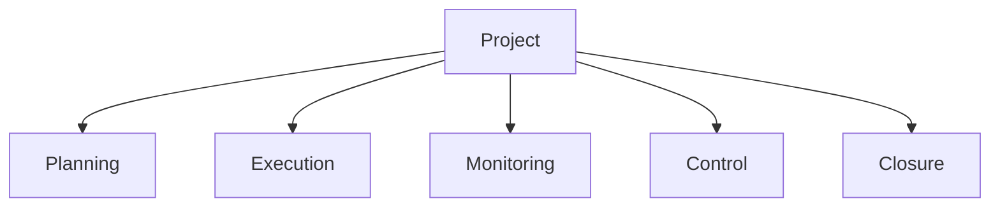

# Project Guidelines

## 📋 Overview
This document provides comprehensive guidelines for project management and documentation within the Operations Knowledge Base.

## 🎯 Purpose
- Standardize project management
- Ensure project success
- Enable effective tracking
- Maintain documentation quality
- Support collaboration

## 🏗 Project Structure

### 1. Project Components


### 2. Documentation Structure
```yaml
project:
  documentation:
    - project_charter
    - project_plan
    - requirements
    - design_docs
    - progress_reports
    - deliverables
```

## 📝 Project Documentation

### 1. Required Documents
1. Project Charter
   - Project overview
   - Objectives
   - Scope
   - Stakeholders

2. Project Plan
   - Timeline
   - Resources
   - Deliverables
   - Milestones

3. Requirements
   - Functional requirements
   - Technical requirements
   - User requirements
   - System requirements

4. Design Documents
   - Architecture design
   - Technical design
   - Interface design
   - Database design

5. Progress Reports
   - Status updates
   - Risk reports
   - Issue logs
   - Change requests

## 🔄 Project Lifecycle

### 1. Initiation Phase
1. Define project
2. Identify stakeholders
3. Create charter
4. Obtain approval
5. Set up structure

### 2. Planning Phase
1. Create project plan
2. Define scope
3. Identify resources
4. Set timeline
5. Plan budget

### 3. Execution Phase
1. Assign tasks
2. Monitor progress
3. Manage resources
4. Track issues
5. Update documentation

### 4. Closure Phase
1. Verify deliverables
2. Document lessons
3. Archive materials
4. Release resources
5. Close project

## 👥 Project Roles

### 1. Core Roles
- Project Sponsor
- Project Manager
- Team Members
- Stakeholders
- Subject Experts

### 2. Responsibilities
```yaml
roles:
  sponsor:
    - Project oversight
    - Resource approval
    - Strategic decisions
  manager:
    - Day-to-day management
    - Team coordination
    - Progress tracking
  members:
    - Task execution
    - Progress reporting
    - Quality assurance
```

## 📊 Project Metrics

### 1. Performance Metrics
- Schedule performance
- Cost performance
- Quality metrics
- Resource utilization
- Value delivered

### 2. Tracking Framework
```yaml
metrics:
  schedule:
    - milestone completion
    - task completion
    - timeline adherence
  cost:
    - budget variance
    - resource usage
    - cost efficiency
```

## 🔍 Quality Standards

### 1. Documentation Quality
- Completeness
- Accuracy
- Clarity
- Consistency
- Maintainability

### 2. Deliverable Quality
- Requirements met
- Standards followed
- Testing completed
- Documentation complete
- Approval obtained

## ⚠️ Risk Management

### 1. Risk Categories
- Technical risks
- Schedule risks
- Resource risks
- Quality risks
- External risks

### 2. Risk Process
1. Identification
2. Assessment
3. Response planning
4. Monitoring
5. Control

## 🔄 Change Management

### 1. Change Process
1. Request submission
2. Impact analysis
3. Review & approval
4. Implementation
5. Documentation

### 2. Change Types
- Scope changes
- Schedule changes
- Resource changes
- Technical changes
- Process changes

## 🚀 Best Practices
- Clear communication
- Regular updates
- Documentation maintenance
- Risk management
- Quality assurance

## 🔗 Related Documents
- [[process-framework]]
- [[documentation-standards]]
- [[quality-standards]]
- [[risk-management]]

## 📝 Change Log
| Date | Author | Changes |
|------|--------|---------|
| <% tp.date.now("YYYY-MM-DD") %> | | Initial version |

## 🏷️ Metadata
- **Status**: Active
- **Owner**: [Owner Name]
- **Last Review**: <% tp.date.now("YYYY-MM-DD") %>
- **Next Review**: <% tp.date.now("YYYY-MM-DD", 90) %>

---
*Last updated: <% tp.date.now("YYYY-MM-DD") %>* 