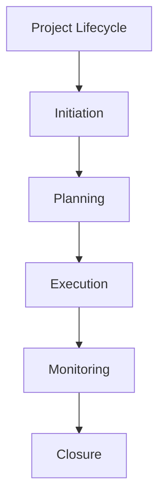

# Project Management Lifecycle

## 📋 Overview
This document defines the project management lifecycle for our Operations Knowledge Base, establishing standardized processes and methodologies for project execution from initiation to closure.

## 🎯 Lifecycle Framework

### Core Phases


### Phase Components
1. **Lifecycle Stages**
   ```yaml
   lifecycle_stages:
     initiation:
       - project_charter
       - stakeholder_analysis
       - feasibility_study
       - initial_scope
     planning:
       - detailed_planning
       - resource_allocation
       - risk_assessment
       - schedule_development
     execution:
       - task_management
       - team_coordination
       - quality_control
       - progress_tracking
   ```

2. **Control Gates**
   - Phase transitions
   - Quality checkpoints
   - Approval processes
   - Review cycles

## 🚀 Initiation Phase

### Project Definition
1. **Charter Development**
   ```python
   def initiate_project():
       define_objectives()
       identify_stakeholders()
       assess_feasibility()
       establish_scope()
   ```

2. **Stakeholder Management**
   - Stakeholder identification
   - Role definition
   - Communication planning
   - Engagement strategy

### Project Setup
1. **Initial Framework**
   ```json
   {
     "setup_components": {
       "governance": ["structure", "roles", "processes", "controls"],
       "resources": ["team", "tools", "budget", "infrastructure"],
       "planning": ["scope", "timeline", "deliverables", "constraints"]
     }
   }
   ```

2. **Baseline Establishment**
   - Scope baseline
   - Schedule baseline
   - Budget baseline
   - Quality standards

## 📋 Planning Phase

### Project Planning
1. **Plan Components**
   - Project scope
   - Work breakdown
   - Resource requirements
   - Timeline development

2. **Resource Planning**
   - Team allocation
   - Tool selection
   - Budget planning
   - Infrastructure setup

### Risk Planning
1. **Risk Assessment**
   - Risk identification
   - Impact analysis
   - Mitigation planning
   - Contingency development

2. **Quality Planning**
   - Quality standards
   - Review processes
   - Testing requirements
   - Acceptance criteria

## 🔄 Execution Phase

### Project Execution
1. **Task Management**
   - Task assignment
   - Progress tracking
   - Issue resolution
   - Quality control

2. **Team Coordination**
   - Team communication
   - Resource coordination
   - Workflow management
   - Performance tracking

### Change Management
1. **Change Control**
   - Change requests
   - Impact assessment
   - Approval process
   - Implementation

2. **Scope Management**
   - Scope verification
   - Change tracking
   - Baseline updates
   - Documentation

## 📊 Monitoring Phase

### Performance Monitoring
1. **Progress Tracking**
   - Schedule monitoring
   - Cost tracking
   - Quality assurance
   - Risk monitoring

2. **Performance Analysis**
   - Variance analysis
   - Trend analysis
   - Forecast development
   - Corrective actions

### Status Reporting
1. **Report Types**
   - Status reports
   - Performance metrics
   - Risk updates
   - Quality assessments

2. **Communication**
   - Stakeholder updates
   - Team communications
   - Issue reporting
   - Decision tracking

## 🎯 Closure Phase

### Project Closure
1. **Completion Activities**
   - Deliverable verification
   - Documentation completion
   - Resource release
   - Administrative closure

2. **Handover Process**
   - Knowledge transfer
   - Documentation handover
   - System transition
   - Support setup

### Project Review
1. **Performance Review**
   - Goal achievement
   - Success metrics
   - Lessons learned
   - Best practices

2. **Documentation**
   - Project archives
   - Final reports
   - Performance records
   - Reference materials

## 🛠 Project Tools

### Management Tools
1. **Planning Tools**
   - Project planning
   - Resource management
   - Schedule tracking
   - Budget control

2. **Execution Tools**
   - Task management
   - Time tracking
   - Issue tracking
   - Document management

### Collaboration Tools
1. **Team Tools**
   - Communication platforms
   - Document sharing
   - Version control
   - Knowledge management

2. **Integration Tools**
   - Tool integration
   - Data synchronization
   - Workflow automation
   - Reporting systems

## 📝 Related Documentation
- [[project-framework]]
- [[resource-management]]
- [[change-management]]
- [[quality-assurance]]

## 🔄 Change Log
| Date | Change | Author |
|------|--------|--------|
| YYYY-MM-DD | Initial project lifecycle documentation | Name |

---

*Last updated: <% tp.date.now("YYYY-MM-DD") %>* 