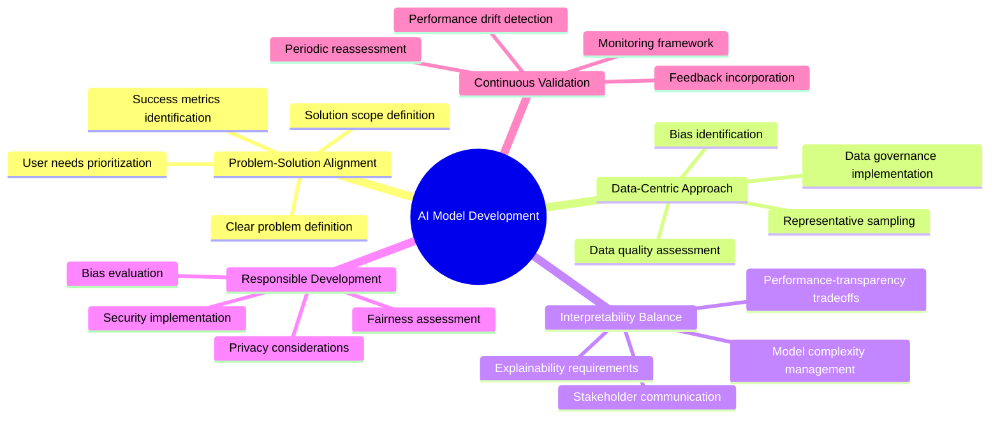
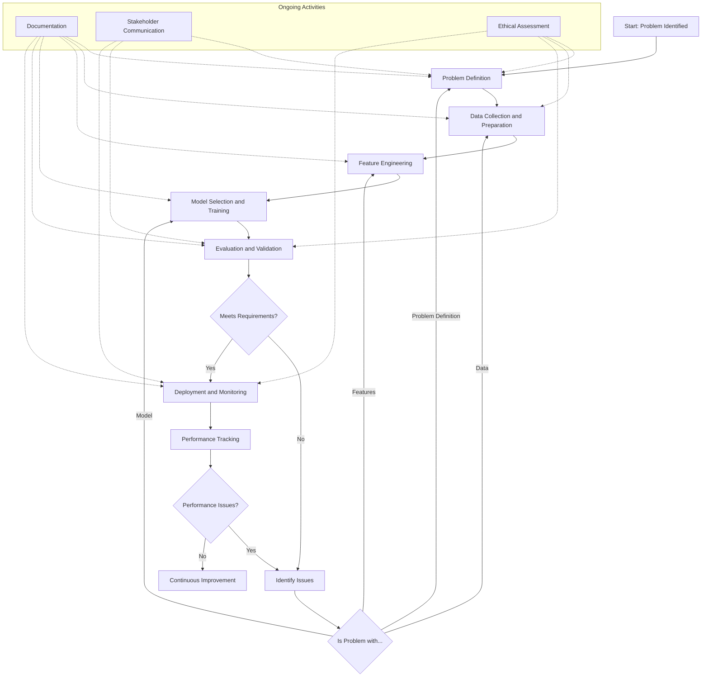
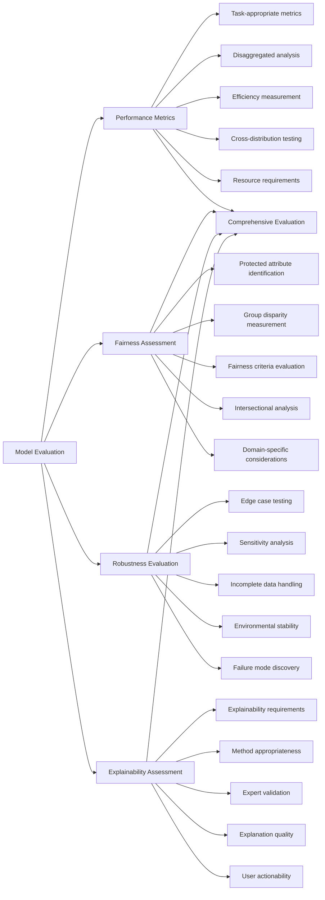
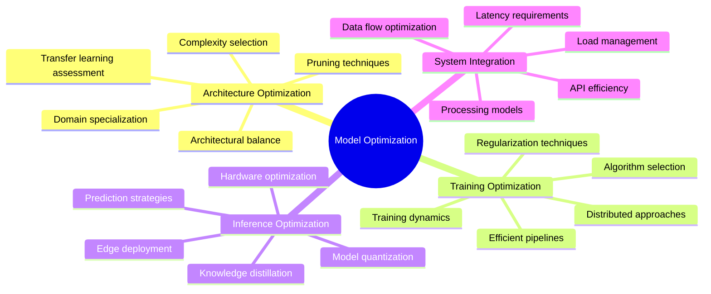
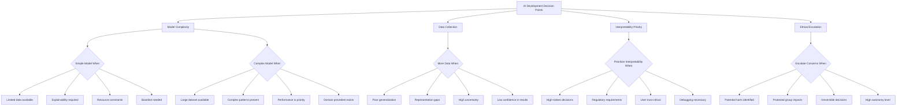

# AI Model Development and Evaluation

## Core Principles
- **Problem-solution alignment**: Ensure AI models address the specific problem they're designed to solve
- **Data-centric approach**: Focus on high-quality, representative data before model complexity
- **Interpretability balance**: Consider the trade-off between performance and explainability
- **Responsible development**: Evaluate and mitigate potential biases and ethical concerns
- **Continuous validation**: Implement ongoing monitoring and evaluation beyond initial deployment



## AI Development Lifecycle
1. **Problem definition**
   - Clearly articulate the problem to be solved
   - Define specific, measurable success criteria
   - Identify key stakeholders and their needs
   - Establish the scope and constraints
   - Determine appropriate evaluation metrics

2. **Data collection and preparation**
   - Identify necessary data sources and formats
   - Assess data quality, completeness, and representativeness
   - Implement proper data cleaning and preprocessing
   - Address imbalances and potential biases
   - Create appropriate train/validation/test splits

3. **Feature engineering**
   - Select relevant features based on domain knowledge
   - Create derived features with predictive power
   - Reduce dimensionality where appropriate
   - Normalize and standardize features consistently
   - Document feature transformations for reproducibility

4. **Model selection and training**
   - Choose model architectures suited to the problem
   - Implement baseline models for comparison
   - Design effective training and evaluation loops
   - Apply appropriate regularization techniques
   - Tune hyperparameters systematically

5. **Evaluation and validation**
   - Assess model performance using relevant metrics
   - Conduct error analysis to identify improvement areas
   - Test for robustness across different scenarios
   - Evaluate fairness across protected groups
   - Verify compliance with regulatory requirements

6. **Deployment and monitoring**
   - Develop efficient deployment pipelines
   - Implement monitoring for data and concept drift
   - Create alerting systems for performance degradation
   - Establish feedback loops for continuous improvement
   - Document operational procedures and requirements



## Model Evaluation Framework
1. **Performance metrics**
   - Select appropriate metrics for problem type (classification, regression, etc.)
   - Evaluate beyond aggregate metrics (per-class, per-group)
   - Consider both predictive accuracy and operational efficiency
   - Assess performance across different data distributions
   - Measure latency, memory usage, and computational requirements

2. **Fairness and bias assessment**
   - Identify protected attributes and fairness criteria
   - Measure performance disparities across groups
   - Evaluate different fairness definitions (demographic parity, equalized odds)
   - Assess intersectional fairness for multiple attributes
   - Consider domain-specific fairness considerations

3. **Robustness evaluation**
   - Test performance on edge cases and adversarial examples
   - Conduct sensitivity analysis for feature perturbations
   - Assess model behavior with missing or corrupted data
   - Evaluate stability across different hardware/software environments
   - Test for unexpected failure modes

4. **Explainability assessment**
   - Determine appropriate level of explainability needed
   - Select suitable explanation methods for model type
   - Validate explanations with domain experts
   - Assess explanation fidelity and consistency
   - Ensure explanations are actionable for end-users



## Responsible AI Implementation
1. **Ethical considerations**
   - Assess potential societal impacts of model deployment
   - Evaluate alignment with organizational values and principles
   - Consider long-term consequences of automated decisions
   - Establish processes for ethical review and escalation
   - Implement mechanisms for stakeholder feedback and redress

2. **Privacy and security**
   - Apply privacy-preserving techniques (differential privacy, federated learning)
   - Minimize collection and storage of sensitive information
   - Implement appropriate access controls and data governance
   - Test for vulnerabilities and potential attack vectors
   - Plan response protocols for potential breaches or misuse

3. **Transparency practices**
   - Document model purpose, capabilities, and limitations
   - Clearly communicate confidence levels and uncertainty
   - Provide appropriate disclosure of data sources and processing
   - Establish processes for contestability and human oversight
   - Create user-appropriate explanations of model behavior

4. **Governance framework**
   - Define clear roles and responsibilities for AI systems
   - Implement model and data version control and lineage tracking
   - Establish regular review cycles for deployed models
   - Create documentation standards for models and processes
   - Develop guidelines for model retirement and replacement

```mermaid
graph TD
    A[Responsible AI] --> B[Ethical Considerations]
    A --> C[Privacy and Security]
    A --> D[Transparency Practices]
    A --> E[Governance Framework]
    
    B --> B1[Impact assessment]
    B --> B2[Value alignment]
    B --> B3[Long-term thinking]
    B --> B4[Review processes]
    B --> B5[Feedback mechanisms]
    
    C --> C1[Privacy techniques]
    C --> C2[Data minimization]
    C --> C3[Access controls]
    C --> C4[Vulnerability testing]
    C --> C5[Response planning]
    
    D --> D1[Capability documentation]
    D --> D2[Uncertainty communication]
    D --> D3[Data disclosure]
    D --> D4[Contestability processes]
    D --> D5[User explanations]
    
    E --> E1[Role definition]
    E --> E2[Version control]
    E --> E3[Review cycles]
    E --> E4[Documentation standards]
    E --> E5[Retirement guidelines]
    
    B --> F[Responsible AI System]
    C --> F
    D --> F
    E --> F
```



## Model Optimization Strategies
1. **Architecture optimization**
   - Select appropriate model complexity for problem scope
   - Consider model pruning and compression techniques
   - Evaluate specialized architectures for specific domains
   - Balance depth vs. width in neural architectures
   - Assess transfer learning vs. custom architecture trade-offs

2. **Training optimization**
   - Implement efficient data loading and preprocessing pipelines
   - Select appropriate optimization algorithms and learning rates
   - Use techniques like early stopping and learning rate scheduling
   - Apply batch normalization, dropout, and other regularization
   - Leverage distributed and parallel training where beneficial

3. **Inference optimization**
   - Quantize models for faster inference and smaller footprint
   - Apply model distillation techniques for efficiency
   - Implement caching and batching strategies for predictions
   - Consider hardware-specific optimizations (CPU, GPU, TPU)
   - Evaluate edge deployment optimizations for mobile/IoT

4. **System integration**
   - Design efficient API interfaces for model serving
   - Implement appropriate caching and load balancing
   - Consider asynchronous processing for non-critical predictions
   - Optimize data flow between system components
   - Balance real-time vs. batch processing requirements



## Decision-Making Framework for AI Development
- **When to use simple models**: Limited data, explainability requirements, computational constraints, baseline establishment
- **When to use complex models**: Large datasets, complex patterns, performance priority, domain precedent
- **When to collect more data**: Poor generalization, inadequate representation, high uncertainty, low confidence
- **When to prioritize interpretability**: High-stakes decisions, regulatory requirements, user trust needs, debugging requirements
- **When to escalate ethical concerns**: Potential harm identified, protected group impacts, decision irreversibility, significant autonomy



## AI Model Documentation Template
```markdown
# Model Documentation

## Overview
- **Model Name**: [Name]
- **Version**: [Version number]
- **Date**: [Creation/update date]
- **Purpose**: [Brief description of the model's purpose]
- **Type**: [Classification, regression, generative, etc.]
- **Responsible Team**: [Team/individuals responsible]

## Training Data
- **Sources**: [Origins of training data]
- **Timeframe**: [Temporal coverage of data]
- **Size**: [Number of samples/records]
- **Features**: [Key features used]
- **Known Limitations**: [Known biases, gaps, or limitations]
- **Preprocessing**: [Key preprocessing steps applied]

## Performance
- **Metrics**: [Key performance metrics with values]
- **Validation Approach**: [Cross-validation, holdout, etc.]
- **Benchmark Comparison**: [Comparison to baselines/alternatives]
- **Subgroup Performance**: [Performance across key demographics/slices]
- **Confidence Intervals**: [Uncertainty quantification]

## Model Details
- **Architecture**: [Key architectural details]
- **Size**: [Parameter count, model size]
- **Training Procedure**: [Key training details]
- **Hyperparameters**: [Critical hyperparameter values]
- **Dependencies**: [Software/library dependencies]

## Usage Guidelines
- **Intended Use Cases**: [Appropriate applications]
- **Limitations**: [Known limitations and constraints]
- **Inappropriate Uses**: [Explicitly discouraged applications]
- **Inference Requirements**: [Computational/system requirements]
- **Integration Guidance**: [How to integrate with systems]

## Ethical Considerations
- **Fairness Assessment**: [Fairness evaluations conducted]
- **Potential Risks**: [Identified risks and mitigations]
- **Privacy Implications**: [Privacy considerations]
- **Feedback Mechanisms**: [How to report issues/concerns]

## Maintenance
- **Monitoring Plan**: [How model is monitored in production]
- **Update Schedule**: [Expected update frequency]
- **Retraining Triggers**: [Events that would prompt retraining]
- **Retirement Criteria**: [Conditions for model retirement]
``` 