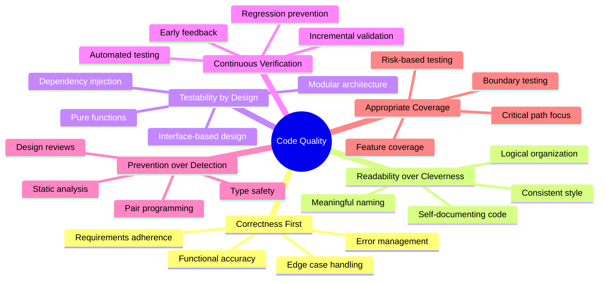
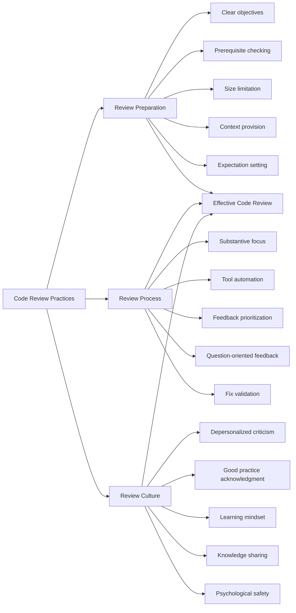
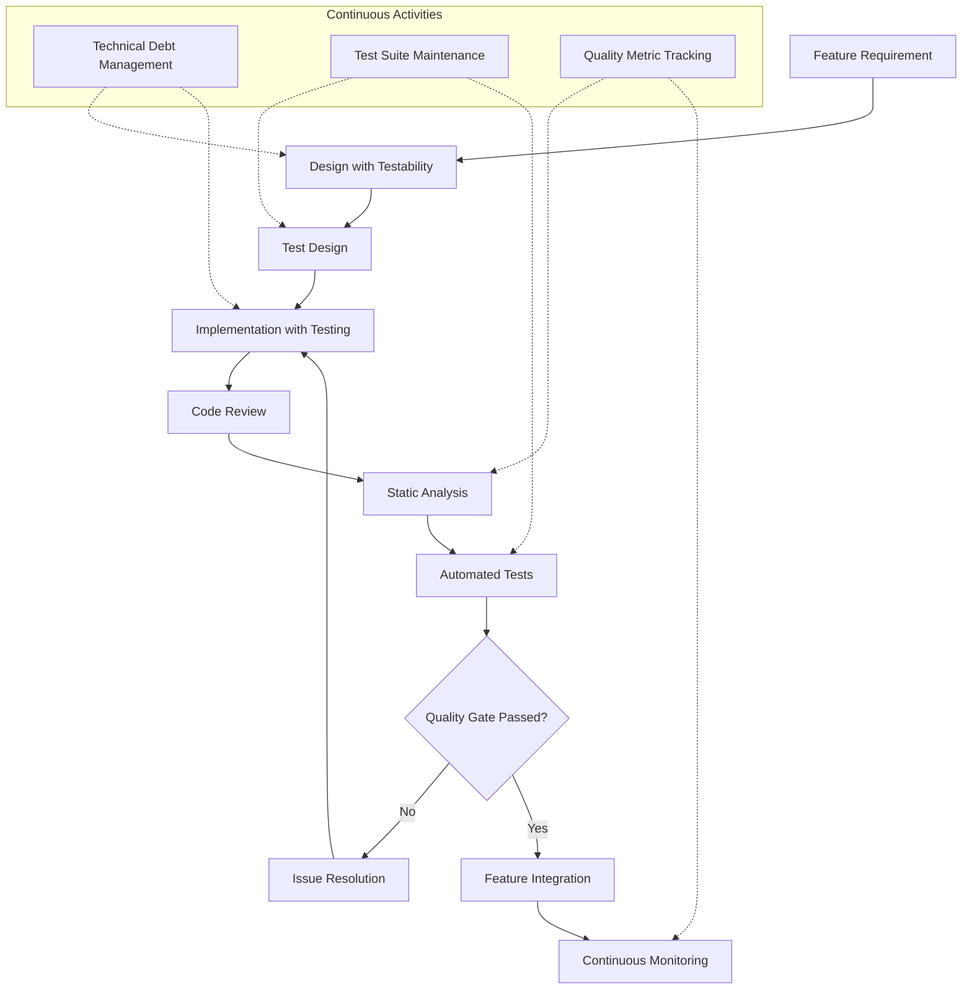

# Code Quality and Testing Best Practices

## Core Principles
- **Correctness first**: Code must correctly implement its intended functionality
- **Readability over cleverness**: Code is read far more often than it's written
- **Testability by design**: Structure code to facilitate thorough testing
- **Continuous verification**: Integrate testing throughout the development process
- **Prevention over detection**: Design processes to prevent bugs rather than just finding them
- **Appropriate coverage**: Balance testing effort with risk and criticality

## Clean Code Guidelines
1. **Naming practices**
   - Use intention-revealing names that clearly express purpose
   - Choose domain-appropriate terminology
   - Favor specific over general names
   - Maintain consistent naming conventions
   - Scale name length with scope size

2. **Function design**
   - Keep functions short and focused on a single task
   - Limit parameters to maintain clarity (≤3 is ideal)
   - Avoid side effects beyond the function's stated purpose
   - Maintain consistent abstraction levels within functions
   - Follow the "do one thing" principle rigorously

3. **Comment quality**
   - Write comments that explain why, not what (code shows what)
   - Keep comments synchronized with code changes
   - Use comments to explain intent, unusual approaches, or warnings
   - Document API contracts, preconditions, and postconditions
   - Avoid commented-out code in production codebase

4. **Code organization**
   - Group related functionality together
   - Separate concerns into appropriate classes/modules
   - Apply consistent formatting and structure
   - Follow the principle of least surprise
   - Make code flow readable from top to bottom where possible

```mermaid
graph TD
    A[Clean Code Guidelines] --> B[Naming Practices]
    A --> C[Function Design]
    A --> D[Comment Quality]
    A --> E[Code Organization]
    
    B --> B1[Intention-revealing names]
    B --> B2[Domain terminology]
    B --> B3[Specific over general]
    B --> B4[Consistent conventions]
    B --> B5[Appropriate name length]
    
    C --> C1[Short focused functions]
    C --> C2[Limited parameters]
    C --> C3[Side effect avoidance]
    C --> C4[Consistent abstraction]
    C --> C5[Single responsibility]
    
    D --> D1[Explaining why not what]
    D --> D2[Synchronization with code]
    D --> D3[Intent documentation]
    D --> D4[API contract definition]
    D --> D5[No commented-out code]
    
    E --> E1[Related functionality grouping]
    E --> E2[Concern separation]
    E --> E3[Consistent formatting]
    E --> E4[Least surprise principle]
    E --> E5[Top-to-bottom readability]
    
    B --> F[Readable and Maintainable Code]
    C --> F
    D --> F
    E --> F
```

## Testing Frameworks
1. **Unit testing**
   - Test individual components in isolation
   - Mock dependencies to ensure focused testing
   - Verify specific behaviors rather than implementation details
   - Structure tests according to Arrange-Act-Assert pattern
   - Maintain fast execution to enable frequent running

2. **Integration testing**
   - Test interactions between components
   - Verify correct data flow between system parts
   - Test configuration and environmental dependencies
   - Include database, file system, and network interactions
   - Validate system boundaries and external interfaces

3. **End-to-end testing**
   - Test complete user journeys through the system
   - Validate system behavior from user perspective
   - Verify cross-functional requirements (performance, usability)
   - Test in production-like environments
   - Incorporate realistic data scenarios

4. **Property-based testing**
   - Define properties that should hold true for all inputs
   - Generate random test cases to find edge cases
   - Verify invariants and post-conditions
   - Use for mathematical operations and complex algorithms
   - Supplement example-based tests with property validation

```mermaid
flowchart TD
    A[Testing Frameworks] --> B[Unit Testing]
    A --> C[Integration Testing]
    A --> D[End-to-End Testing]
    A --> E[Property-Based Testing]
    
    B --> B1[Component isolation]
    B --> B2[Dependency mocking]
    B --> B3[Behavior verification]
    B --> B4[AAA pattern]
    B --> B5[Fast execution]
    
    C --> C1[Component interaction]
    C --> C2[Data flow verification]
    C --> C3[Configuration testing]
    C --> C4[External system integration]
    C --> C5[Boundary validation]
    
    D --> D1[User journey testing]
    D --> D2[User perspective validation]
    D --> D3[Cross-functional verification]
    D --> D4[Environment fidelity]
    D --> D5[Realistic data scenarios]
    
    E --> E1[Property definition]
    E --> E2[Random case generation]
    E --> E3[Invariant verification]
    E --> E4[Algorithm validation]
    E --> E5[Example supplementation]
    
    B --> F[Comprehensive Test Strategy]
    C --> F
    D --> F
    E --> F
```

## Test Design Strategies
1. **Test-Driven Development (TDD)**
   - Write tests before implementing features
   - Use tests to drive design decisions
   - Follow the Red-Green-Refactor cycle
   - Focus on small increments of functionality
   - Evolve design through continuous refactoring

2. **Behavior-Driven Development (BDD)**
   - Express tests in domain/business language
   - Focus on system behavior from user perspective
   - Structure as Given-When-Then scenarios
   - Align tests with acceptance criteria
   - Use as living documentation of system functionality

3. **Risk-based testing**
   - Prioritize tests based on risk assessment
   - Focus effort on critical system components
   - Consider both probability and impact in risk evaluation
   - Test high-traffic/high-visibility features thoroughly
   - Balance coverage with resource constraints

4. **Mutation testing**
   - Introduce small changes (mutations) to code
   - Verify that tests fail when code is mutated
   - Identify weak or inadequate tests
   - Improve test quality by fixing non-failing tests
   - Measure effectiveness of test suite

```mermaid
graph TD
    A[Test Design Strategies] --> B[Test-Driven Development]
    A --> C[Behavior-Driven Development]
    A --> D[Risk-Based Testing]
    A --> E[Mutation Testing]
    
    B --> B1[Tests before implementation]
    B --> B2[Design driving]
    B --> B3[Red-Green-Refactor]
    B --> B4[Small increments]
    B --> B5[Continuous refactoring]
    
    C --> C1[Domain language usage]
    C --> C2[User perspective focus]
    C --> C3[Given-When-Then format]
    C --> C4[Acceptance criteria alignment]
    C --> C5[Living documentation]
    
    D --> D1[Risk-based prioritization]
    D --> D2[Critical component focus]
    D --> D3[Risk factor evaluation]
    D --> D4[High-visibility testing]
    D --> D5[Resource balancing]
    
    E --> E1[Code mutation]
    E --> E2[Failure verification]
    E --> E3[Weak test identification]
    E --> E4[Test quality improvement]
    E --> E5[Effectiveness measurement]
    
    B --> F[Effective Test Design]
    C --> F
    D --> F
    E --> F
```

## Code Review Practices
1. **Review preparation**
   - Define clear review objectives and scope
   - Ensure code meets prerequisites before review
   - Limit review size to maintain focus and quality
   - Provide context and background for reviewers
   - Establish clear expectations for feedback

2. **Review process**
   - Focus on design, logic, and maintainability over style
   - Use automated tools to handle style and basic issues
   - Separate must-fix from nice-to-have suggestions
   - Ask questions rather than making accusations
   - Validate fixes for identified issues

3. **Review culture**
   - Depersonalize criticism - review the code, not the coder
   - Acknowledge good practices and clever solutions
   - Maintain a learning and teaching mindset
   - Share knowledge across the team
   - Cultivate psychological safety

## Static Analysis and Tooling
- Integrate linters to enforce style and catch common mistakes
- Use type checking to prevent type-related errors
- Implement security scanners to identify vulnerabilities
- Add complexity analyzers to highlight potentially problematic code
- Configure IDE tools to provide real-time feedback
- Set up automated checks in the build pipeline

```mermaid
graph TD
    A[Static Analysis & Tooling] --> B[Linters]
    A --> C[Type Checking]
    A --> D[Security Scanners]
    A --> E[Complexity Analyzers]
    A --> F[IDE Integration]
    A --> G[CI/CD Checks]
    
    B --> B1[Style enforcement]
    B --> B2[Common error detection]
    B --> B3[Convention ensuring]
    
    C --> C1[Type compatibility]
    C --> C2[Null/undefined prevention]
    C --> C3[Interface adherence]
    
    D --> D1[Vulnerability identification]
    D --> D2[Dependency scanning]
    D --> D3[Secret detection]
    
    E --> E1[Cyclomatic complexity]
    E --> E2[Cognitive complexity]
    E --> E3[Dependency depth]
    
    F --> F1[Real-time feedback]
    F --> F2[Quick fix suggestions]
    F --> F3[Refactoring assistance]
    
    G --> G1[Pre-commit hooks]
    G --> G2[Pull request validation]
    G --> G3[Build pipeline integration]
    
    B --> H[Automated Quality Assurance]
    C --> H
    D --> H
    E --> H
    F --> H
    G --> H
```

## Handling Tech Debt and Code Smells
- Systematically identify and document technical debt
- Prioritize debt based on impact and remediation cost
- Allocate regular time for debt reduction (e.g., "refactoring fridays")
- Address debt as part of feature work when possible
- Develop metrics to track debt levels and trends
- Create team awareness of common code smells

```mermaid
flowchart TD
    A[Tech Debt Management] --> B[Identification & Documentation]
    A --> C[Prioritization]
    A --> D[Allocation of Time]
    A --> E[Integration with Features]
    A --> F[Metric Development]
    A --> G[Smell Awareness]
    
    B --> B1[Debt inventory]
    B --> B2[Impact documentation]
    B --> B3[Root cause analysis]
    
    C --> C1[Impact assessment]
    C --> C2[Remediation cost]
    C --> C3[Risk evaluation]
    
    D --> D1[Dedicated time]
    D --> D2[Regular sessions]
    D --> D3[Balance with features]
    
    E --> E1[Opportunistic refactoring]
    E --> E2[Boy Scout rule]
    E --> E3[Incremental improvement]
    
    F --> F1[Code quality metrics]
    F --> F2[Trend analysis]
    F --> F3[Team dashboards]
    
    G --> G1[Common smell education]
    G --> G2[Pattern recognition]
    G --> G3[Prevention strategies]
    
    B --> H[Managed Technical Debt]
    C --> H
    D --> H
    E --> H
    F --> H
    G --> H
```

## Code Quality and Testing Process Model
