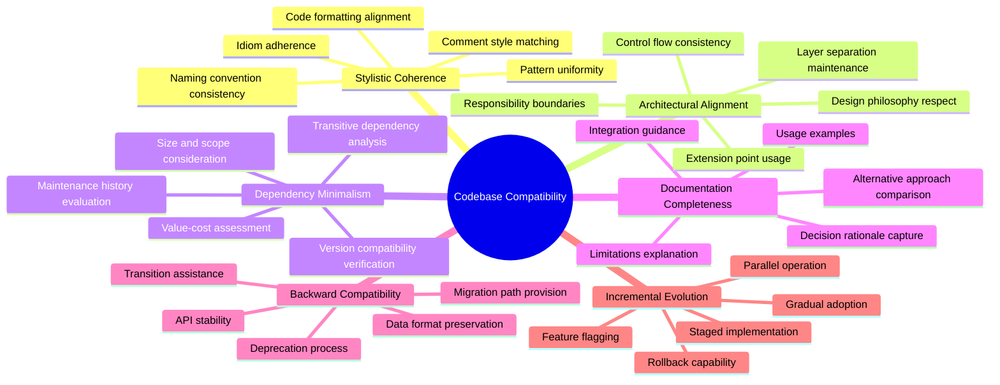
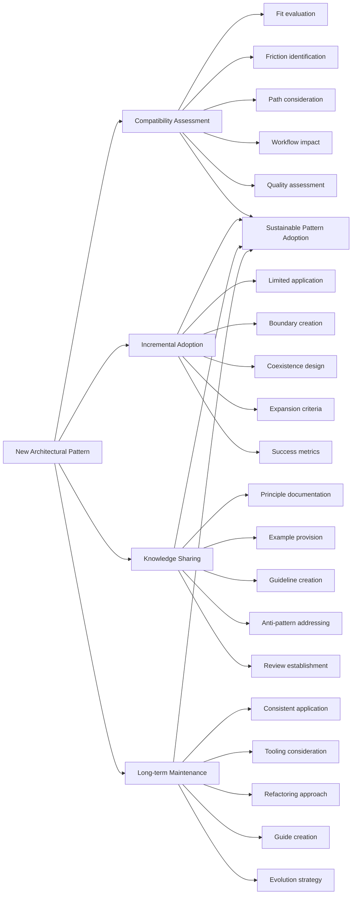
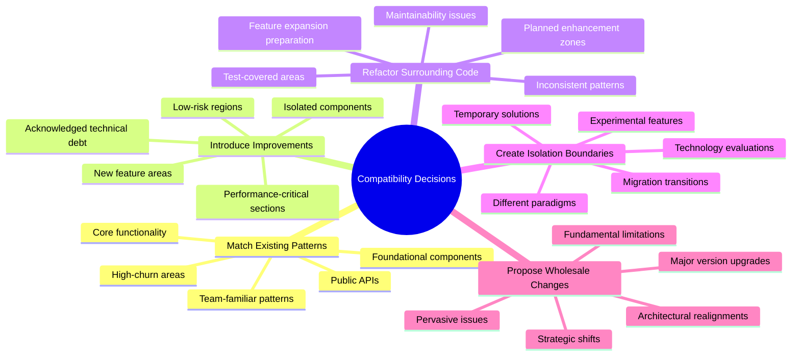
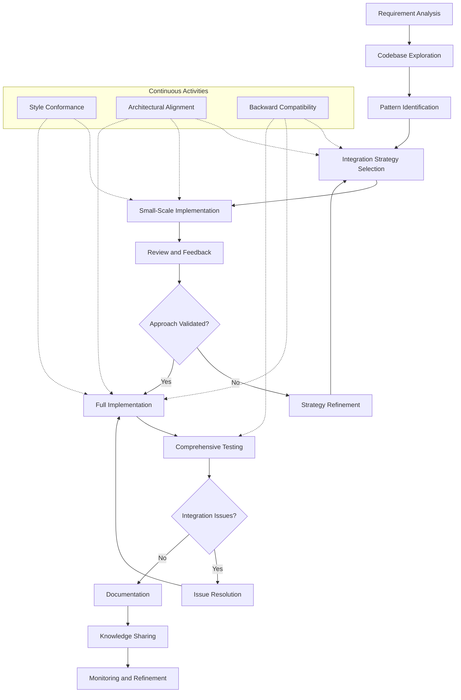

# Codebase Compatibility and Integration

## Core Principles
- **Stylistic coherence**: Maintain consistent coding style, naming conventions, and patterns across the codebase
- **Architectural alignment**: Ensure new elements fit within the existing architectural structure and design philosophy
- **Dependency minimalism**: Introduce new dependencies only when they provide substantial value over existing solutions
- **Documentation completeness**: Document not just what and how, but why decisions were made
- **Backward compatibility**: Minimize breaking changes and provide migration paths when unavoidable
- **Incremental evolution**: Prefer gradual, reversible changes over large-scale restructuring

## Introduction of New Methods and Functions
1. **Consistency with existing patterns**
   - Study similar functions in the codebase
   - Adopt consistent parameter ordering and naming
   - Follow established error handling approaches
   - Match return value patterns and null handling
   - Maintain existing logging and debugging conventions

2. **Function signature design**
   - Optimize for clarity at the call site
   - Consider future extensibility without breaking changes
   - Make dangerous operations explicit
   - Use parameter types consistent with the codebase
   - Consider backward compatibility with existing callers

3. **Implementation considerations**
   - Reuse existing utility functions
   - Maintain consistent abstraction levels
   - Avoid duplicating functionality
   - Follow established performance patterns
   - Consider edge cases handled by similar functions

4. **Documentation and testing**
   - Document parameters, return values, exceptions, and side effects
   - Provide usage examples showing integration with existing code
   - Add comprehensive tests matching codebase testing style
   - Document performance characteristics and limitations
   - Cross-reference related functionality

```mermaid
graph TD
    A[New Method Introduction] --> B[Existing Pattern Analysis]
    A --> C[Signature Design]
    A --> D[Implementation Considerations]
    A --> E[Documentation and Testing]
    
    B --> B1[Function study]
    B --> B2[Parameter conventions]
    B --> B3[Error approach]
    B --> B4[Return patterns]
    B --> B5[Logging conventions]
    
    C --> C1[Call site clarity]
    C --> C2[Future extensibility]
    C --> C3[Operation safety]
    C --> C4[Type consistency]
    C --> C5[Backward compatibility]
    
    D --> D1[Utility reuse]
    D --> D2[Abstraction consistency]
    D --> D3[Duplication avoidance]
    D --> D4[Performance alignment]
    D --> D5[Edge case handling]
    
    E --> E1[Interface documentation]
    E --> E2[Example provision]
    E --> E3[Test creation]
    E --> E4[Performance documentation]
    E --> E5[Cross-referencing]
    
    B --> F[Compatible Method]
    C --> F
    D --> F
    E --> F
```

## Introduction of New Classes and Modules
1. **Architectural placement**
   - Identify appropriate layer/component for new functionality
   - Respect existing module boundaries and responsibilities
   - Consider interaction patterns with existing components
   - Maintain separation of concerns
   - Align with current architectural direction

2. **Interface design**
   - Create interfaces consistent with similar components
   - Follow existing patterns for constructor parameters
   - Maintain consistent method naming and organization
   - Design for testability and mockability
   - Consider extension and inheritance models in the codebase

3. **Implementation approach**
   - Study similar classes for implementation patterns
   - Reuse existing base classes and utilities where appropriate
   - Follow established state management approaches
   - Maintain consistent error handling strategies
   - Adopt similar synchronization and threading models

4. **Integration strategy**
   - Design clean integration points with existing code
   - Minimize changes required to existing components
   - Consider initialization and lifecycle management
   - Plan for dependency injection compatibility
   - Address cross-cutting concerns consistently

```mermaid
flowchart TD
    A[New Class/Module] --> B[Architectural Placement]
    A --> C[Interface Design]
    A --> D[Implementation Approach]
    A --> E[Integration Strategy]
    
    B --> B1[Layer identification]
    B --> B2[Boundary respect]
    B --> B3[Interaction consideration]
    B --> B4[Concern separation]
    B --> B5[Direction alignment]
    
    C --> C1[Component consistency]
    C --> C2[Constructor patterns]
    C --> C3[Method conventions]
    C --> C4[Testability design]
    C --> C5[Extension alignment]
    
    D --> D1[Pattern study]
    D --> D2[Class reuse]
    D --> D3[State management]
    D --> D4[Error strategies]
    D --> D5[Threading models]
    
    E --> E1[Integration points]
    E --> E2[Change minimization]
    E --> E3[Lifecycle management]
    E --> E4[Injection compatibility]
    E --> E5[Cross-cutting concerns]
    
    B --> F[Compatible Component]
    C --> F
    D --> F
    E --> F
```

## Introduction of New Dependencies
1. **Dependency evaluation**
   - Assess value provided versus complexity added
   - Evaluate license compatibility
   - Consider maturity, maintenance status, and community health
   - Analyze performance and resource implications
   - Assess security history and vulnerability patterns

2. **Scope containment**
   - Isolate new dependencies behind abstraction layers
   - Minimize direct usage throughout the codebase
   - Create wrappers that match project coding style
   - Control transitive dependency exposure
   - Design for potential future replacement

3. **Version management**
   - Select versions compatible with existing dependencies
   - Document version constraints and reasons
   - Consider future upgrade paths
   - Test with dependency version ranges if applicable
   - Understand semantic versioning approach of the dependency

4. **Integration documentation**
   - Document rationale for introducing the dependency
   - Provide examples of proper usage
   - Document any configuration or initialization requirements
   - Note known limitations or issues
   - Include performance characteristics and tuning guidance

```mermaid
graph TD
    A[New Dependency] --> B[Dependency Evaluation]
    A --> C[Scope Containment]
    A --> D[Version Management]
    A --> E[Integration Documentation]
    
    B --> B1[Value assessment]
    B --> B2[License verification]
    B --> B3[Maturity evaluation]
    B --> B4[Performance analysis]
    B --> B5[Security review]
    
    C --> C1[Abstraction layers]
    C --> C2[Usage limitation]
    C --> C3[Style-matching wrappers]
    C --> C4[Transitive control]
    C --> C5[Replacement design]
    
    D --> D1[Compatibility selection]
    D --> D2[Constraint documentation]
    D --> D3[Upgrade consideration]
    D --> D4[Range testing]
    D --> D5[Versioning understanding]
    
    E --> E1[Rationale documentation]
    E --> E2[Usage examples]
    E --> E3[Configuration documentation]
    E --> E4[Limitation notes]
    E --> E5[Performance guidance]
    
    B --> F[Well-Integrated Dependency]
    C --> F
    D --> F
    E --> F
```

## Introduction of New Architectural Patterns
1. **Pattern compatibility assessment**
   - Evaluate fit with existing architecture
   - Identify areas of friction or mismatch
   - Consider migration path from existing patterns
   - Assess impact on established development workflows
   - Evaluate against project's quality attributes

2. **Incremental adoption strategy**
   - Apply new patterns to limited areas first
   - Create clean boundaries between pattern approaches
   - Design for coexistence of old and new patterns
   - Establish criteria for expanding pattern usage
   - Define success metrics for pattern adoption

3. **Knowledge sharing**
   - Document pattern principles and rationale
   - Provide examples contrasting with existing approaches
   - Create guidelines for appropriate pattern application
   - Address common anti-patterns and misuses
   - Establish review criteria for implementations

4. **Long-term maintenance**
   - Plan for consistent application across the codebase
   - Consider tooling and static analysis to enforce patterns
   - Establish refactoring approach for existing code
   - Create migration guides and templates
   - Document pattern evolution strategy

## Comprehensive Documentation Practices
1. **Code-level documentation**
   - Document intent, not just implementation
   - Explain "why" in addition to "what"
   - Note assumptions and preconditions
   - Document performance characteristics and complexity
   - Highlight non-obvious implications and side effects

2. **Integration documentation**
   - Explain how components interact
   - Document data flow and transformation
   - Clarify responsibility boundaries
   - Provide sequence diagrams for complex interactions
   - Explain configuration and wiring

3. **Architecture documentation**
   - Maintain up-to-date architecture diagrams
   - Document key design decisions and alternatives considered
   - Explain trade-offs and constraints
   - Provide both high-level and detailed views
   - Link architectural concepts to code implementations

4. **User and developer guides**
   - Create onboarding guides for new developers
   - Provide cookbook-style examples for common tasks
   - Document troubleshooting approaches
   - Keep documentation in sync with code changes
   - Include migration guides for significant changes

```mermaid
graph TD
    A[Documentation Practices] --> B[Code-level Documentation]
    A --> C[Integration Documentation]
    A --> D[Architecture Documentation]
    A --> E[User/Developer Guides]
    
    B --> B1[Intent explanation]
    B --> B2[Reasoning inclusion]
    B --> B3[Assumption documentation]
    B --> B4[Performance notation]
    B --> B5[Implication highlighting]
    
    C --> C1[Interaction explanation]
    C --> C2[Data flow documentation]
    C --> C3[Boundary clarification]
    C --> C4[Sequence diagramming]
    C --> C5[Configuration explanation]
    
    D --> D1[Diagram maintenance]
    D --> D2[Decision documentation]
    D --> D3[Trade-off explanation]
    D --> D4[Multi-level views]
    D --> D5[Code linking]
    
    E --> E1[Onboarding creation]
    E --> E2[Example provision]
    E --> E3[Troubleshooting documentation]
    E --> E4[Documentation synchronization]
    E --> E5[Migration guides]
    
    B --> F[Comprehensive Documentation]
    C --> F
    D --> F
    E --> F
```

## Styling and Formatting Integration
1. **Visual consistency**
   - Follow existing indentation and bracket styles
   - Maintain consistent line length and wrapping
   - Use spacing and alignment patterns from the codebase
   - Apply consistent capitalization and naming
   - Follow comment formatting conventions

2. **Code organization**
   - Maintain consistent file structure
   - Follow established section ordering within files
   - Group related functionality using existing patterns
   - Apply consistent import/include organization
   - Respect existing public/private boundaries

3. **Naming harmony**
   - Study and apply naming conventions for different element types
   - Maintain consistent abbreviation usage
   - Follow domain terminology established in the codebase
   - Use naming patterns that indicate element relationships
   - Respect naming contexts and namespaces

4. **Tool integration**
   - Utilize existing linters and formatters
   - Conform to static analysis rules
   - Update style configuration when necessary
   - Document any style exceptions with rationale
   - Consider automating style enforcement

```mermaid
graph TD
    A[Styling Integration] --> B[Visual Consistency]
    A --> C[Code Organization]
    A --> D[Naming Harmony]
    A --> E[Tool Integration]
    
    B --> B1[Style following]
    B --> B2[Line consistency]
    B --> B3[Spacing patterns]
    B --> B4[Capitalization consistency]
    B --> B5[Comment formatting]
    
    C --> C1[Structure maintenance]
    C --> C2[Section ordering]
    C --> C3[Functionality grouping]
    C --> C4[Import organization]
    C --> C5[Boundary respect]
    
    D --> D1[Convention study]
    D --> D2[Abbreviation consistency]
    D --> D3[Terminology following]
    D --> D4[Relationship patterns]
    D --> D5[Context respect]
    
    E --> E1[Linter utilization]
    E --> E2[Analysis conformance]
    E --> E3[Configuration updates]
    E --> E4[Exception documentation]
    E --> E5[Automation consideration]
    
    B --> F[Stylistic Harmony]
    C --> F
    D --> F
    E --> F
```

## Compatibility Decision Framework
- **When to strictly match existing patterns**: Core functionalities, publicly exposed APIs, foundational components
- **When to introduce improved approaches**: Isolated components, areas with explicit technical debt, performance-critical sections
- **When to refactor surrounding code**: Inconsistent existing patterns, maintainability issues, preparation for feature expansion
- **When to create isolation boundaries**: Experimental features, significantly different paradigms, temporary solutions
- **When to propose wholesale changes**: Fundamental limitations, pervasive issues, strategic technical direction shifts

## Codebase Integration Process Model
