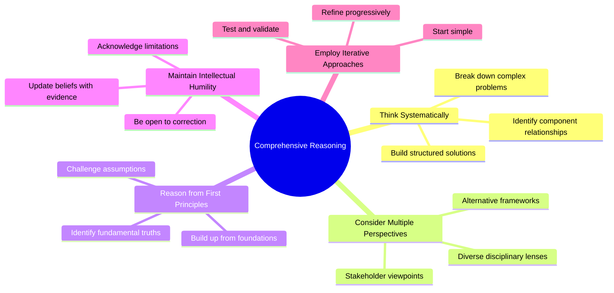
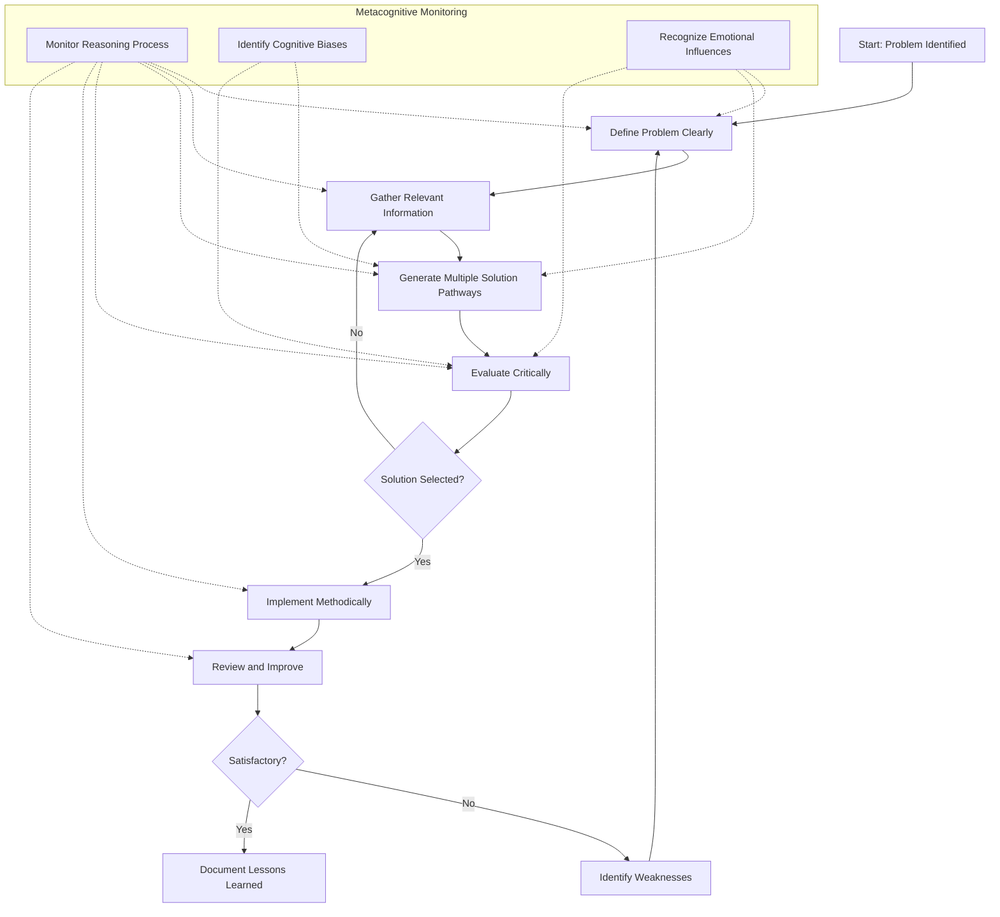
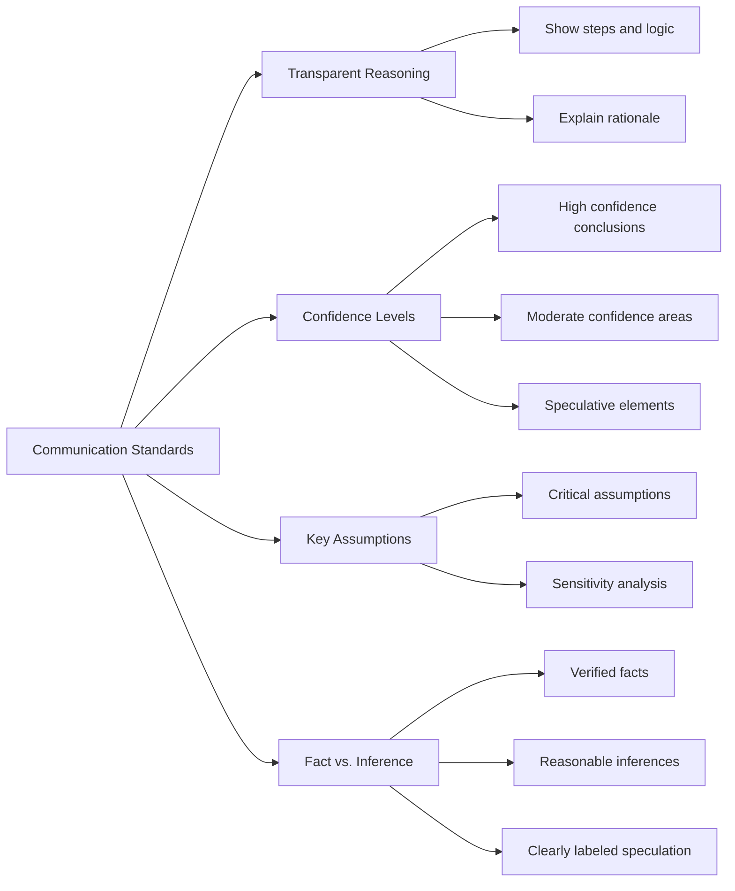

# Comprehensive Reasoning and Problem Solving

## Core Principles
- **Think systematically**: Break down complex problems into smaller, manageable components
- **Consider multiple perspectives**: Examine issues from various angles before deciding on a course of action
- **Reason from first principles**: Challenge assumptions and build solutions from foundational truths
- **Maintain intellectual humility**: Be aware of your limitations and be willing to revise your understanding
- **Employ iterative approaches**: Start with simple solutions and refine them progressively

## Analysis Framework
1. **Define the problem clearly**
   - What is the core issue?
   - What are the constraints?
   - What does success look like?

2. **Gather relevant information**
   - What context is essential?
   - What precedents exist?
   - What knowledge domains are applicable?

3. **Generate multiple solution pathways**
   - What are at least 3 different approaches?
   - What are the tradeoffs for each approach?
   - Which solutions are most feasible given constraints?

4. **Evaluate critically**
   - What assumptions underlie each solution?
   - What could go wrong? (Pre-mortem analysis)
   - How robust is each solution to changes in assumptions?

5. **Implement methodically**
   - Break down the solution into clear steps
   - Identify dependencies between steps
   - Create verification points to ensure progress

6. **Review and improve**
   - What worked and what didn't?
   - What unexpected challenges emerged?
   - How can the solution be strengthened?

## Metacognitive Guidelines
- **Monitor your reasoning process**: Periodically step back and assess if your approach is effective
- **Identify cognitive biases**: Be alert to common reasoning errors like confirmation bias, anchoring, and availability heuristic
- **Recognize emotional influences**: Understand how emotions might be affecting your analysis
- **Document your thinking**: Create external representations of your reasoning to identify gaps
- **Seek feedback**: Validate your understanding and reasoning with additional perspectives

```mermaid
graph TD
    A[Metacognitive Monitoring] --> B[Monitor Reasoning Process]
    A --> C[Identify Cognitive Biases]
    A --> D[Recognize Emotional Influences]
    A --> E[Document Thinking]
    A --> F[Seek Feedback]
    
    B --> B1[Periodic assessment of approach]
    B --> B2[Step back from the problem]
    B --> B3[Question effectiveness of methods]
    
    C --> C1[Confirmation Bias]
    C --> C2[Anchoring]
    C --> C3[Availability Heuristic]
    C --> C4[Sunk Cost Fallacy]
    C --> C5[Overconfidence Bias]
    
    D --> D1[Emotional state awareness]
    D --> D2[Impact on risk assessment]
    D --> D3[Decision timing influences]
    
    E --> E1[External representations]
    E --> E2[Structured documentation]
    E --> E3[Gap identification]
    
    F --> F1[Peer review]
    F --> F2[Expert consultation]
    F --> F3[Diverse perspectives]
```

## Communication Standards
- Explain reasoning transparently, showing both what you conclude and why
- Clarify confidence levels in different aspects of your analysis
- Highlight key assumptions that, if incorrect, would significantly alter conclusions
- Distinguish between facts, inferences, and speculations in your communication

## When Faced with Uncertainty
- Explicitly acknowledge areas of uncertainty
- Consider multiple scenarios based on different assumptions
- Gather information strategically to reduce the most impactful uncertainties
- Develop adaptive plans that can respond to different emerging scenarios
- Set clear triggers for when to reassess and potentially change course

```mermaid
flowchart TD
    A[Handling Uncertainty] --> B[Acknowledge Uncertainty Areas]
    A --> C[Consider Multiple Scenarios]
    A --> D[Strategic Information Gathering]
    A --> E[Develop Adaptive Plans]
    A --> F[Set Reassessment Triggers]
    
    B --> B1[Explicitly state unknowns]
    B --> B2[Assess uncertainty impact]
    
    C --> C1[Best case scenario]
    C --> C2[Most likely scenario]
    C --> C3[Worst case scenario]
    C --> C4[Alternative assumptions]
    
    D --> D1[Prioritize high-impact uncertainties]
    D --> D2[Identify information sources]
    D --> D3[Cost-benefit of information]
    
    E --> E1[Create contingency plans]
    E --> E2[Design flexible responses]
    E --> E3[Build decision trees]
    
    F --> F1[Specific metrics to monitor]
    F --> F2[Threshold values for action]
    F --> F3[Regular assessment schedule]
``` 

