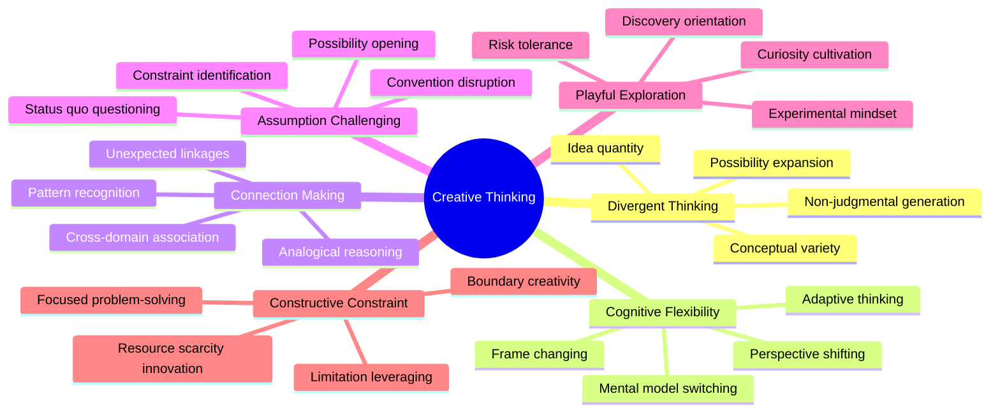
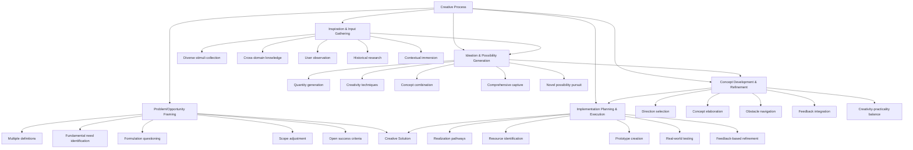
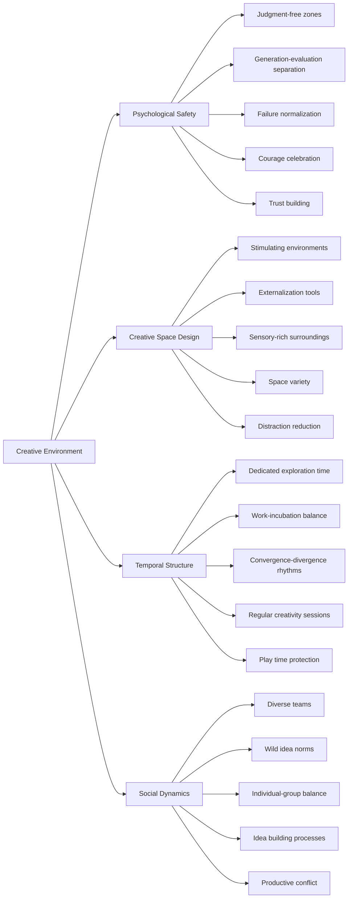
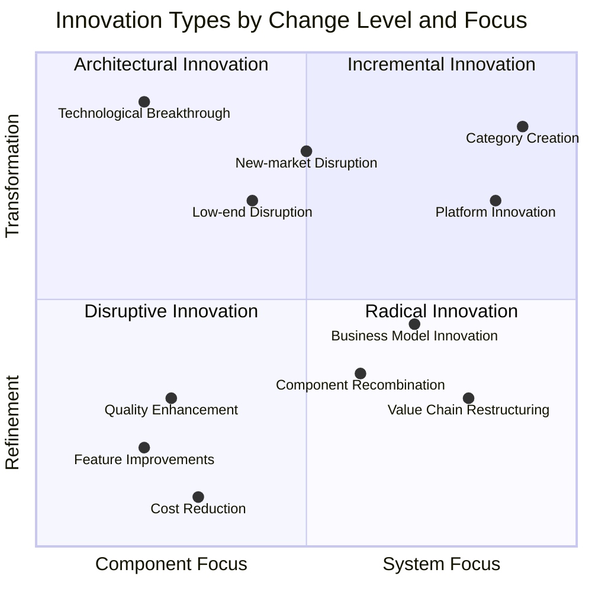
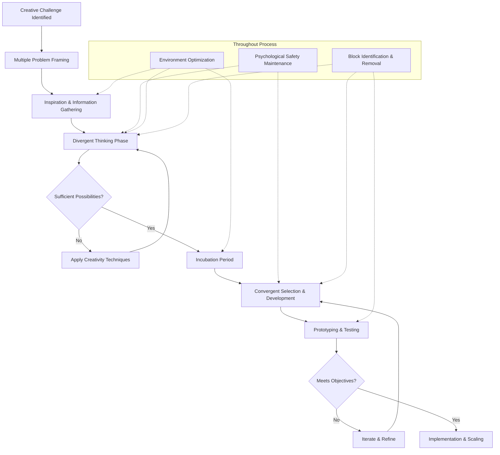

# Creative Thinking and Innovation

## Core Principles
- **Divergent thinking**: Generate numerous varied possibilities before converging on solutions
- **Cognitive flexibility**: Shift between different perspectives and thinking styles
- **Connection making**: Identify patterns and associations between seemingly unrelated concepts
- **Assumption challenging**: Question established beliefs and conventional wisdom
- **Playful exploration**: Maintain a sense of curiosity, openness, and experimentation
- **Constructive constraint**: Use limitations as catalysts for creative solutions

## Creative Process Framework
1. **Problem/opportunity framing**
   - Define the challenge in multiple ways
   - Identify the fundamental need or opportunity
   - Question initial problem formulations
   - Expand or contract scope to find optimal focus
   - Articulate success criteria that allow for unexpected solutions

2. **Inspiration and input gathering**
   - Collect diverse stimuli and information
   - Seek cross-domain knowledge and analogies
   - Observe user behaviors and pain points
   - Research historical approaches and precedents
   - Immerse in relevant contexts and environments

3. **Ideation and possibility generation**
   - Produce quantity and variety of ideas without judgment
   - Use structured creativity techniques to prompt new thinking
   - Combine and build upon emerging concepts
   - Capture all ideas, including seemingly impractical ones
   - Push beyond obvious solutions to novel possibilities

4. **Concept development and refinement**
   - Select promising directions to develop further
   - Elaborate on core concepts with increasing detail
   - Identify potential obstacles and design around them
   - Incorporate feedback while maintaining novelty
   - Balance creativity with practicality and constraints

5. **Implementation planning and execution**
   - Develop pathways to realize the creative vision
   - Identify resources and capabilities needed
   - Create prototypes and minimum viable versions
   - Test with intended users and contexts
   - Refine based on real-world feedback

## Creativity Techniques
1. **Associative methods**
   - Random stimulus: Introduce unrelated elements to spark connections
   - Forced relationships: Connect the challenge with unrelated objects/concepts
   - Analogical thinking: Apply solutions from different domains
   - Word association chains: Follow conceptual links to unexpected places
   - Biomimicry: Draw inspiration from natural systems and processes

2. **Structural methods**
   - SCAMPER: Substitute, Combine, Adapt, Modify, Put to other use, Eliminate, Reverse
   - Morphological analysis: Explore all possible combinations of solution attributes
   - Attribute listing: Modify each feature of an existing solution
   - Six Thinking Hats: Apply different thinking modes (facts, feelings, benefits, cautions, creativity, process)
   - Problem reversal: Invert the problem statement to find alternative approaches

3. **Divergent thinking methods**
   - Brainstorming: Generate numerous ideas without judgment
   - Brainwriting: Silent written idea generation to prevent social influences
   - Mind mapping: Visual exploration of connected ideas
   - Lotus Blossom: Systematic expansion of ideas from a central concept
   - Rolestorming: Generate ideas from alternative perspectives or personas

4. **Convergent methods**
   - Dot voting: Prioritize ideas through collective selection
   - Evaluation matrices: Assess options against multiple criteria
   - Concept combining: Merge promising elements from different ideas
   - Prototyping: Create low-fidelity representations to evaluate concepts
   - Plus-Minus-Interesting (PMI): Assess positive aspects, negative aspects, and interesting implications

```mermaid
graph TD
    A[Creativity Techniques] --> B[Associative Methods]
    A --> C[Structural Methods]
    A --> D[Divergent Thinking Methods]
    A --> E[Convergent Methods]
    
    B --> B1[Random stimulus]
    B --> B2[Forced relationships]
    B --> B3[Analogical thinking]
    B --> B4[Word association chains]
    B --> B5[Biomimicry]
    
    C --> C1[SCAMPER]
    C --> C2[Morphological analysis]
    C --> C3[Attribute listing]
    C --> C4[Six Thinking Hats]
    C --> C5[Problem reversal]
    
    D --> D1[Brainstorming]
    D --> D2[Brainwriting]
    D --> D3[Mind mapping]
    D --> D4[Lotus Blossom]
    D --> D5[Rolestorming]
    
    E --> E1[Dot voting]
    E --> E2[Evaluation matrices]
    E --> E3[Concept combining]
    E --> E4[Prototyping]
    E --> E5[Plus-Minus-Interesting]
```

## Creative Environment Cultivation
1. **Psychological safety**
   - Create judgment-free zones for idea sharing
   - Separate idea generation from evaluation
   - Normalize experimentation and productive failure
   - Celebrate courageous creativity
   - Build trust through supportive responses

2. **Creative space design**
   - Establish physical environments that stimulate thinking
   - Provide tools for externalization and visualization
   - Create sensory-rich, inspiration-filled surroundings
   - Allow for both collaborative and reflective spaces
   - Reduce distractions and interruptions

3. **Temporal structure**
   - Allocate dedicated time for creative exploration
   - Balance focused work with incubation periods
   - Create rhythms of convergence and divergence
   - Schedule regular creativity sessions
   - Protect time for play and open-ended exploration

4. **Social dynamics**
   - Build diverse teams with complementary perspectives
   - Establish norms that encourage wild ideas
   - Create processes that balance individual and group creativity
   - Design constructive ways to build on others' ideas
   - Facilitate productive creative conflict

## Innovation Types
1. **Incremental innovation**
   - Improve existing products, services, or processes
   - Enhance features, reduce costs, or increase quality
   - Build on established platforms and paradigms
   - Focus on optimization and refinement
   - Address known user needs and pain points

2. **Architectural innovation**
   - Reconfigure existing components in new ways
   - Create novel combinations of established elements
   - Reimagine relationships between system parts
   - Transform delivery or business models
   - Maintain core technologies while changing structures

3. **Disruptive innovation**
   - Create simpler, more accessible alternatives
   - Target overlooked segments or non-consumers
   - Trade off performance for affordability or convenience
   - Establish new performance trajectories
   - Transform existing value networks

4. **Radical innovation**
   - Develop breakthrough technologies or approaches
   - Create entirely new categories and paradigms
   - Address unarticulated or latent needs
   - Require significant shifts in user behavior
   - Often based on scientific or technological advances

## Creative Blocks and Solutions
1. **Cognitive blocks**
   - Fixation: Force perspective shifts and introduce random stimuli
   - Premature judgment: Separate generation from evaluation phases
   - Functional fixedness: Consider objects and concepts beyond their typical use
   - Analysis paralysis: Set time bounds and embrace imperfect action
   - Expertise bias: Deliberately adopt a beginner's mindset

2. **Emotional blocks**
   - Fear of failure: Reframe failure as learning and experimentation
   - Risk aversion: Start with small, low-stakes creative attempts
   - Need for approval: Create judgment-free zones and practice self-authorization
   - Creative anxiety: Focus on the process rather than outcomes
   - Motivation issues: Connect creative work to personal meaning and purpose

3. **Social blocks**
   - Conformity pressure: Establish nonconformity as valuable
   - Groupthink: Encourage independent thinking before group convergence
   - Status hierarchies: Create equality during creative sessions
   - Criticism culture: Institute constructive feedback protocols
   - Collaboration barriers: Build psychological safety and trust

4. **Environmental blocks**
   - Resource constraints: Frame limitations as creative catalysts
   - Time pressure: Allocate dedicated creative time
   - Distraction-rich settings: Create focus spaces and times
   - Lack of stimulation: Curate inspiring environments and inputs
   - Rigid structures: Build flexibility into processes and spaces

```mermaid
flowchart TD
    A[Creative Blocks] --> B[Cognitive Blocks]
    A --> C[Emotional Blocks]
    A --> D[Social Blocks]
    A --> E[Environmental Blocks]
    
    B --> B1[Fixation]
    B1 --> BS1[Forced perspective shifts]
    B --> B2[Premature judgment]
    B2 --> BS2[Generation-evaluation separation]
    B --> B3[Functional fixedness]
    B3 --> BS3[Reconceptualization exercises]
    B --> B4[Analysis paralysis]
    B4 --> BS4[Time-bounded action]
    B --> B5[Expertise bias]
    B5 --> BS5[Beginner's mindset practice]
    
    C --> C1[Fear of failure]
    C1 --> CS1[Failure reframing]
    C --> C2[Risk aversion]
    C2 --> CS2[Low-stakes experiments]
    C --> C3[Approval need]
    C3 --> CS3[Judgment-free zones]
    C --> C4[Creative anxiety]
    C4 --> CS4[Process focus]
    C --> C5[Motivation issues]
    C5 --> CS5[Meaning connection]
    
    D --> D1[Conformity pressure]
    D1 --> DS1[Nonconformity valuing]
    D --> D2[Groupthink]
    D2 --> DS2[Independent thinking first]
    D --> D3[Status hierarchies]
    D3 --> DS3[Creative equality]
    D --> D4[Criticism culture]
    D4 --> DS4[Constructive feedback protocols]
    D --> D5[Collaboration barriers]
    D5 --> DS5[Psychological safety building]
    
    E --> E1[Resource constraints]
    E1 --> ES1[Constraint reframing]
    E --> E2[Time pressure]
    E2 --> ES2[Dedicated creative time]
    E --> E3[Distraction-rich settings]
    E3 --> ES3[Focus spaces]
    E --> E4[Stimulation lack]
    E4 --> ES4[Inspiration curation]
    E --> E5[Rigid structures]
    E5 --> ES5[Process flexibility]
```

## Creative Thinking Process Model
