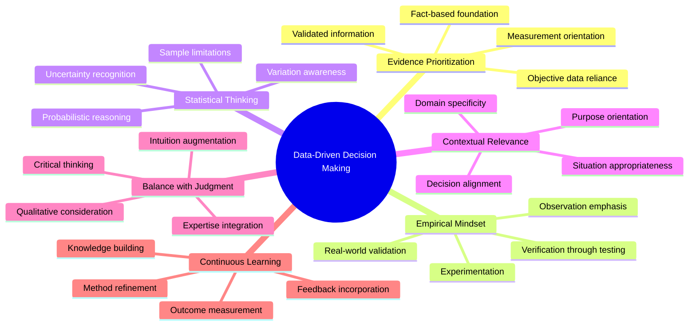
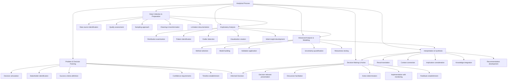
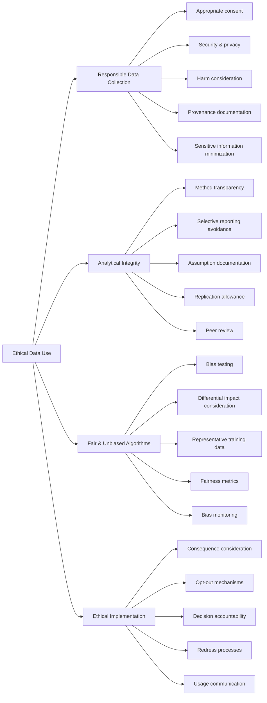
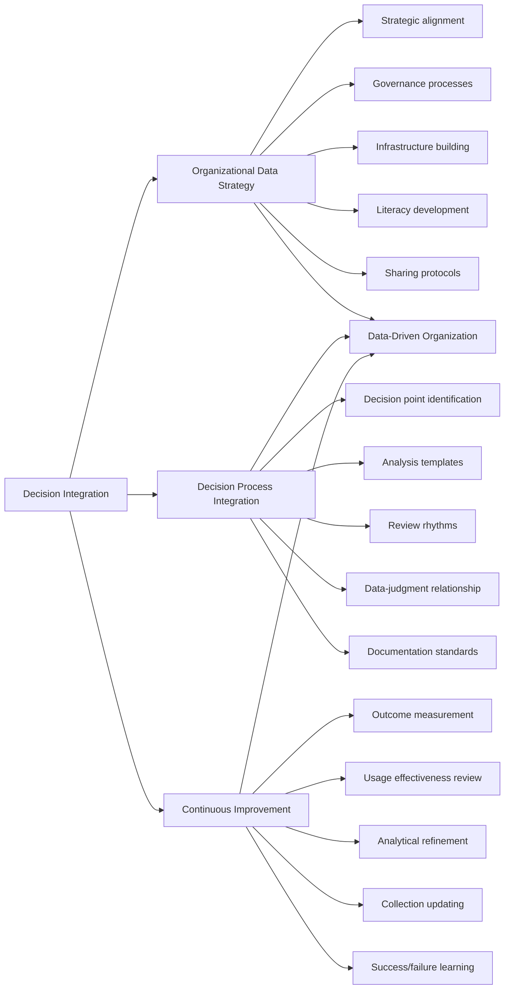
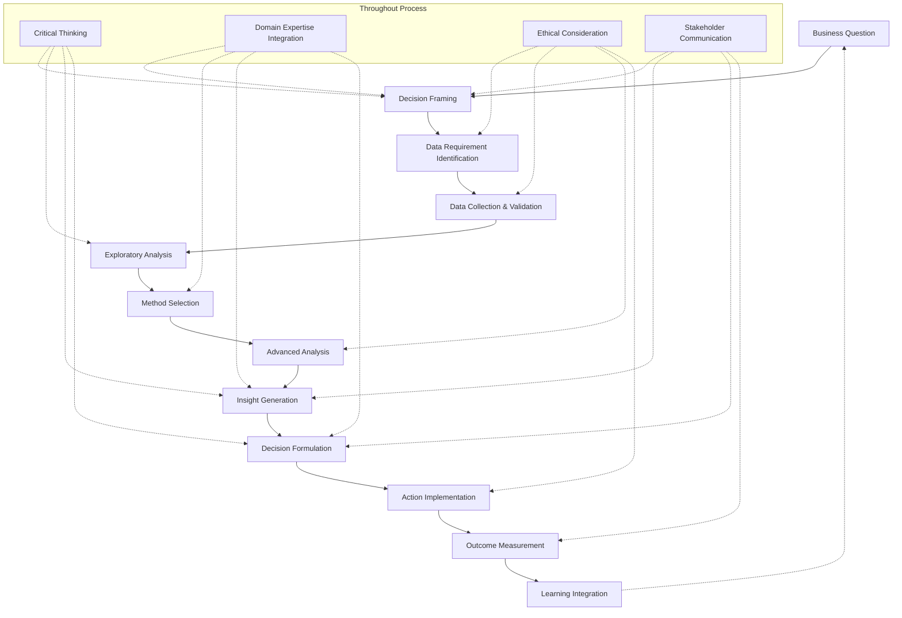

# Data-Driven Decision Making and Analysis

## Core Principles
- **Evidence prioritization**: Base decisions on objective data rather than intuition alone
- **Empirical mindset**: Seek verification through measurement and testing
- **Statistical thinking**: Consider variation, uncertainty, and probabilistic outcomes
- **Contextual relevance**: Ensure data and analysis align with the specific decision context
- **Balance with judgment**: Complement data with domain expertise and critical thinking
- **Continuous learning**: Update approaches based on outcome measurement and feedback

## Analytical Process Framework
1. **Problem and decision framing**
   - Articulate the specific decision to be made
   - Identify key stakeholders and their information needs
   - Define success criteria and trade-offs
   - Determine required precision and confidence levels
   - Establish decision timelines and constraints

2. **Data collection and preparation**
   - Identify relevant data sources and availability
   - Assess data quality, completeness, and biases
   - Determine appropriate sampling approaches
   - Clean and transform data for analysis
   - Document data limitations and assumptions

3. **Exploratory analysis**
   - Examine distributions and central tendencies
   - Identify patterns, trends, and relationships
   - Detect outliers and anomalies
   - Generate visualizations to facilitate understanding
   - Develop initial insights and hypotheses

4. **Advanced analysis and modeling**
   - Apply appropriate analytical methods based on the question
   - Build models to explain relationships or predict outcomes
   - Validate models using appropriate techniques
   - Quantify uncertainty and confidence intervals
   - Test alternative approaches for robustness

5. **Interpretation and synthesis**
   - Translate analytical results into actionable insights
   - Connect findings to the original decision context
   - Consider practical implications and limitations
   - Integrate with domain expertise and other information
   - Develop recommendations with appropriate confidence

6. **Decision making and action**
   - Present findings in decision-relevant formats
   - Facilitate informed discussion among stakeholders
   - Determine appropriate actions based on analysis
   - Implement decisions with monitoring mechanisms
   - Establish feedback processes for learning

## Analytical Methods and Tools
1. **Statistical analysis**
   - Descriptive statistics: Summarize and describe data characteristics
   - Inferential statistics: Draw conclusions and make predictions beyond the data
   - Hypothesis testing: Evaluate specific propositions about data
   - Regression analysis: Model relationships between variables
   - Time series analysis: Analyze temporal patterns and trends

2. **Data mining and machine learning**
   - Classification: Categorize data into predefined groups
   - Clustering: Identify natural groupings in data
   - Association rule learning: Discover relationships between variables
   - Dimensionality reduction: Simplify data while preserving information
   - Anomaly detection: Identify unusual patterns or outliers

3. **Decision analysis**
   - Decision trees: Map out decision paths and outcomes
   - Monte Carlo simulation: Model probability distributions of outcomes
   - Bayesian analysis: Update beliefs based on new evidence
   - Optimization methods: Find optimal solutions given constraints
   - Sensitivity analysis: Test how changes in inputs affect outcomes

4. **Qualitative and mixed methods**
   - Thematic analysis: Identify patterns in qualitative data
   - Content analysis: Systematically analyze text or other media
   - Grounded theory: Develop theories from data
   - Mixed-method integration: Combine qualitative and quantitative insights
   - Case studies: In-depth examination of specific instances

```mermaid
graph TD
    A[Analytical Methods] --> B[Statistical Analysis]
    A --> C[Data Mining & Machine Learning]
    A --> D[Decision Analysis]
    A --> E[Qualitative & Mixed Methods]
    
    B --> B1[Descriptive statistics]
    B --> B2[Inferential statistics]
    B --> B3[Hypothesis testing]
    B --> B4[Regression analysis]
    B --> B5[Time series analysis]
    
    C --> C1[Classification]
    C --> C2[Clustering]
    C --> C3[Association rule learning]
    C --> C4[Dimensionality reduction]
    C --> C5[Anomaly detection]
    
    D --> D1[Decision trees]
    D --> D2[Monte Carlo simulation]
    D --> D3[Bayesian analysis]
    D --> D4[Optimization methods]
    D --> D5[Sensitivity analysis]
    
    E --> E1[Thematic analysis]
    E --> E2[Content analysis]
    E --> E3[Grounded theory]
    E --> E4[Mixed-method integration]
    E --> E5[Case studies]
```

## Data-Driven Decision Making Challenges
1. **Data quality issues**
   - Missing data: Identify patterns and appropriate imputation strategies
   - Selection bias: Recognize and account for non-representative sampling
   - Measurement error: Quantify and minimize inaccuracies in data collection
   - Data recency: Ensure data is timely enough for the decision
   - Data relevance: Confirm data actually addresses the question at hand

2. **Analytical challenges**
   - Correlation vs. causation: Avoid inferring causality from correlation alone
   - Multiple testing problem: Adjust for increased error when conducting many tests
   - Model overfitting: Balance model complexity with generalizability
   - Confirmation bias: Seek disconfirming evidence for hypotheses
   - Analysis paralysis: Determine when additional analysis adds value

3. **Interpretation pitfalls**
   - Overconfidence: Recognize the limitations of analytical methods
   - Ignoring uncertainty: Properly communicate confidence levels and ranges
   - Cherry-picking: Avoid selecting only favorable results
   - Misaligned metrics: Ensure measures actually reflect desired outcomes
   - Neglecting context: Consider factors not captured in the data

4. **Implementation obstacles**
   - Stakeholder resistance: Address concerns about data-driven approaches
   - Data literacy gaps: Build capacity for understanding analytical results
   - Decision authority: Clarify how data informs decision-making authority
   - Operational constraints: Translate insights into feasible actions
   - Feedback systems: Establish mechanisms to learn from outcomes

```mermaid
flowchart TD
    A[Data-Driven Decision Challenges] --> B[Data Quality Issues]
    A --> C[Analytical Challenges]
    A --> D[Interpretation Pitfalls]
    A --> E[Implementation Obstacles]
    
    B --> B1[Missing data]
    B1 --> BS1[Imputation strategies]
    B --> B2[Selection bias]
    B2 --> BS2[Bias awareness & adjustment]
    B --> B3[Measurement error]
    B3 --> BS3[Error quantification]
    B --> B4[Data recency]
    B4 --> BS4[Timeliness verification]
    B --> B5[Data relevance]
    B5 --> BS5[Question alignment checking]
    
    C --> C1[Correlation vs. causation]
    C1 --> CS1[Causal analysis methods]
    C --> C2[Multiple testing problem]
    C2 --> CS2[Statistical correction]
    C --> C3[Model overfitting]
    C3 --> CS3[Cross-validation techniques]
    C --> C4[Confirmation bias]
    C4 --> CS4[Disconfirming evidence seeking]
    C --> C5[Analysis paralysis]
    C5 --> CS5[Value of information assessment]
    
    D --> D1[Overconfidence]
    D1 --> DS1[Method limitation recognition]
    D --> D2[Ignoring uncertainty]
    D2 --> DS2[Confidence communication]
    D --> D3[Cherry-picking]
    D3 --> DS3[Comprehensive reporting]
    D --> D4[Misaligned metrics]
    D4 --> DS4[Outcome alignment verification]
    D --> D5[Neglecting context]
    D5 --> DS5[Contextual factor consideration]
    
    E --> E1[Stakeholder resistance]
    E1 --> ES1[Concern addressing]
    E --> E2[Data literacy gaps]
    E2 --> ES2[Capacity building]
    E --> E3[Decision authority]
    E3 --> ES3[Role clarification]
    E --> E4[Operational constraints]
    E4 --> ES4[Feasibility assessment]
    E --> E5[Feedback systems]
    E5 --> ES5[Learning mechanism creation]
```

## Ethical Data Use Framework
1. **Responsible data collection**
   - Obtain appropriate consent for data collection
   - Ensure data security and privacy protections
   - Consider potential harms to data subjects
   - Document data provenance and handling
   - Minimize collection of sensitive information

2. **Analytical integrity**
   - Maintain transparency about methods and limitations
   - Avoid p-hacking and selective reporting
   - Document assumptions and analytical choices
   - Allow for replication and verification
   - Subject analyses to appropriate peer review

3. **Fair and unbiased algorithms**
   - Test for and mitigate algorithmic bias
   - Consider differential impacts across groups
   - Ensure fair representation in training data
   - Implement appropriate fairness metrics
   - Establish ongoing bias monitoring processes

4. **Ethical implementation**
   - Consider both intended and unintended consequences
   - Provide appropriate opt-out mechanisms
   - Establish accountability for decisions
   - Create appeal or redress processes
   - Communicate data use to affected parties

## Decision-Making Integration
1. **Organizational data strategy**
   - Align data collection with strategic decision needs
   - Create data governance processes and standards
   - Build appropriate data infrastructure and tools
   - Develop data literacy across the organization
   - Establish data sharing and collaboration protocols

2. **Decision process integration**
   - Identify key decision points for data integration
   - Create templates for decision-relevant analyses
   - Establish rhythms for data review and discussion
   - Clarify when data overrides versus informs judgment
   - Develop decision documentation standards

3. **Continuous improvement**
   - Measure decision outcomes and quality
   - Review data usage effectiveness
   - Refine analytical approaches based on results
   - Update data collection based on emerging needs
   - Learn from both successes and failures

## Data-Driven Decision Making Process Model
