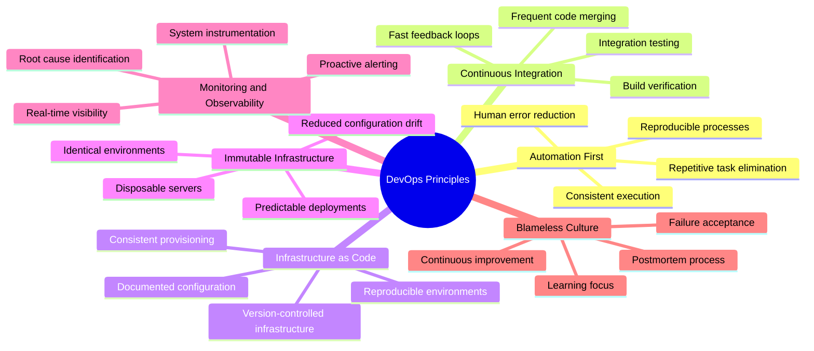
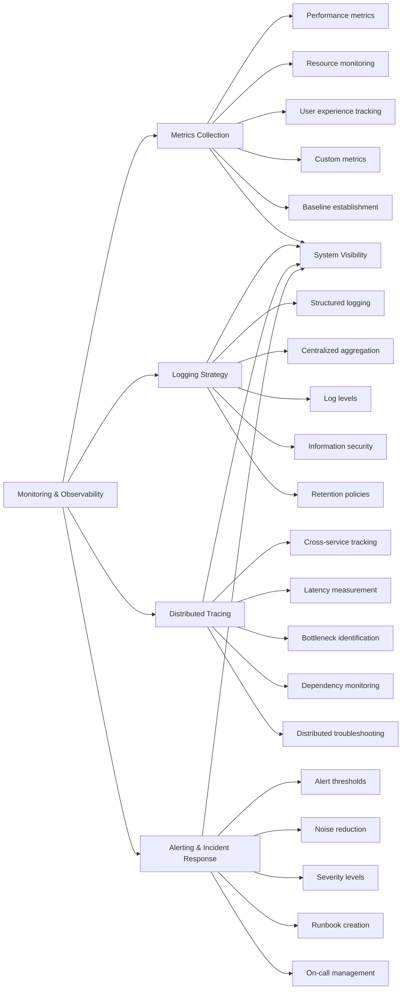
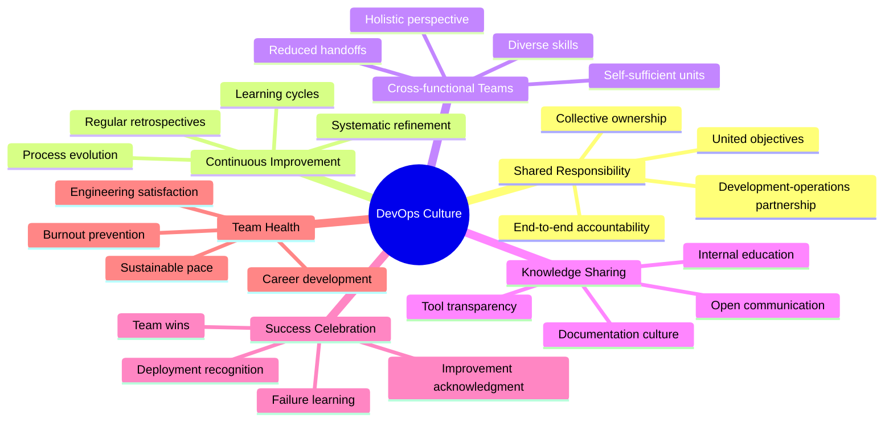
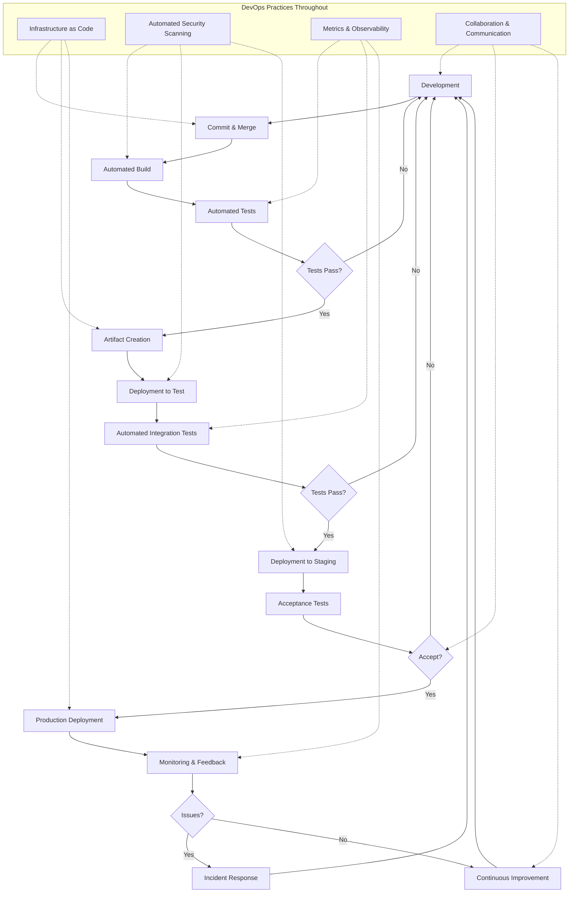

# DevOps and CI/CD Best Practices

## Core Principles
- **Automation first**: Automate repetitive tasks to ensure consistency
- **Continuous integration**: Integrate code changes frequently, at least daily
- **Infrastructure as code**: Define infrastructure through machine-readable definition files
- **Immutable infrastructure**: Build once, deploy many times, never modify in place
- **Monitoring and observability**: Instrument everything for visibility and troubleshooting
- **Blameless culture**: Focus on learning from failures, not assigning blame

## CI/CD Pipeline Components
1. **Source control management**
   - Use version control for all artifacts (code, configs, infrastructure)
   - Implement branching strategies that support team workflow
   - Enforce access controls and code ownership
   - Enable integration with automation tools
   - Maintain clean, auditable history

2. **Continuous integration**
   - Automate build process on every commit
   - Run unit and integration tests automatically
   - Perform static code analysis and security scanning
   - Generate artifacts for deployment
   - Provide immediate feedback to developers

3. **Continuous delivery**
   - Automate deployment to testing environments
   - Implement automated smoke and acceptance tests
   - Create approval gates for production deployments
   - Maintain deployment history and audit trails
   - Enable easy rollbacks and recovery

4. **Continuous deployment**
   - Automatically deploy verified changes to production
   - Implement progressive deployment strategies
   - Monitor deployment impact in real-time
   - Automate rollback on failure detection
   - Optimize for minimal user impact

```mermaid
graph TD
    A[CI/CD Pipeline] --> B[Source Control Management]
    A --> C[Continuous Integration]
    A --> D[Continuous Delivery]
    A --> E[Continuous Deployment]
    
    B --> B1[Version control usage]
    B --> B2[Branching strategy]
    B --> B3[Access control]
    B --> B4[Tool integration]
    B --> B5[History maintenance]
    
    C --> C1[Automated builds]
    C --> C2[Automated testing]
    C --> C3[Static analysis]
    C --> C4[Artifact generation]
    C --> C5[Developer feedback]
    
    D --> D1[Test environment deployment]
    D --> D2[Acceptance testing]
    D --> D3[Approval gates]
    D --> D4[Deployment history]
    D --> D5[Recovery mechanisms]
    
    E --> E1[Automated production deployment]
    E --> E2[Progressive strategies]
    E --> E3[Real-time monitoring]
    E --> E4[Automatic rollback]
    E --> E5[Impact minimization]
    
    B --> F[Software Delivery Pipeline]
    C --> F
    D --> F
    E --> F
```

## Deployment Strategies
1. **Blue-green deployment**
   - Maintain two identical production environments
   - Deploy new version to inactive environment
   - Test thoroughly in isolation
   - Switch traffic when verified
   - Enable immediate rollback by reverting traffic

2. **Canary deployment**
   - Deploy new version to small subset of servers/users
   - Gradually increase traffic to new version
   - Monitor for errors and performance issues
   - Roll back quickly if problems detected
   - Complete rollout when confidence is high

3. **Feature flags**
   - Implement conditional code execution
   - Deploy disabled features to production
   - Activate features selectively for testing
   - Roll out gradually to user segments
   - Disable features instantly if issues arise

4. **A/B testing**
   - Deploy multiple versions simultaneously
   - Direct specific user segments to each version
   - Measure performance/engagement differences
   - Make data-driven decisions
   - Standardize on best-performing version

```mermaid
flowchart TD
    A[Deployment Strategies] --> B[Blue-Green Deployment]
    A --> C[Canary Deployment]
    A --> D[Feature Flags]
    A --> E[A/B Testing]
    
    B --> B1[Dual environments]
    B --> B2[Isolated deployment]
    B --> B3[Traffic switching]
    B --> B4[Immediate rollback]
    B --> B5[Zero downtime]
    
    C --> C1[Limited initial exposure]
    C --> C2[Progressive traffic increase]
    C --> C3[Continuous monitoring]
    C --> C4[Quick problem containment]
    C --> C5[Confidence-based completion]
    
    D --> D1[Conditional execution]
    D --> D2[Production-ready but disabled]
    D --> D3[Selective activation]
    D --> D4[Gradual rollout]
    D --> D5[Instant deactivation]
    
    E --> E1[Multiple version deployment]
    E --> E2[Segmented user routing]
    E --> E3[Performance measurement]
    E --> E4[Data-driven decision]
    E --> E5[Standardization]
    
    B --> F[Safe, Controlled Deployment]
    C --> F
    D --> F
    E --> F
```

## Infrastructure Management
1. **Infrastructure as code (IaC)**
   - Define infrastructure through code and configuration files
   - Version control all infrastructure definitions
   - Apply same development practices to infrastructure code
   - Test infrastructure changes before production
   - Automate infrastructure provisioning and updates

2. **Configuration management**
   - Centralize configuration management
   - Separate configuration from code
   - Implement environment-specific configurations
   - Secure sensitive configuration values
   - Version and audit configuration changes

3. **Container orchestration**
   - Package applications with their dependencies
   - Ensure consistent execution across environments
   - Scale containers based on demand
   - Manage container lifecycle and health
   - Enable service discovery and load balancing

4. **Cloud infrastructure**
   - Leverage cloud service models (IaaS, PaaS, SaaS)
   - Implement multi-region resilience where appropriate
   - Optimize for cost efficiency
   - Automate resource scaling
   - Follow cloud security best practices

```mermaid
graph TD
    A[Infrastructure Management] --> B[Infrastructure as Code]
    A --> C[Configuration Management]
    A --> D[Container Orchestration]
    A --> E[Cloud Infrastructure]
    
    B --> B1[Code-defined infrastructure]
    B --> B2[Version-controlled definitions]
    B --> B3[Development practices]
    B --> B4[Infrastructure testing]
    B --> B5[Automated provisioning]
    
    C --> C1[Centralized management]
    C --> C2[Configuration separation]
    C --> C3[Environment specificity]
    C --> C4[Secret management]
    C --> C5[Change versioning]
    
    D --> D1[Application packaging]
    D --> D2[Execution consistency]
    D --> D3[Dynamic scaling]
    D --> D4[Lifecycle management]
    D --> D5[Service networking]
    
    E --> E1[Service model utilization]
    E --> E2[Multi-region design]
    E --> E3[Cost optimization]
    E --> E4[Auto-scaling]
    E --> E5[Security implementation]
    
    B --> F[Modern Infrastructure]
    C --> F
    D --> F
    E --> F
```

## Monitoring and Observability
1. **Metrics collection**
   - Gather system and application performance metrics
   - Monitor resource utilization and saturation
   - Track business and user experience metrics
   - Implement custom application metrics
   - Establish baselines and trends

2. **Logging strategy**
   - Implement structured, searchable logs
   - Centralize log aggregation and storage
   - Ensure appropriate log levels and contexts
   - Secure sensitive log information
   - Define log retention and archiving policies

3. **Distributed tracing**
   - Track requests across service boundaries
   - Measure latency between service calls
   - Identify bottlenecks in request flows
   - Monitor service dependencies
   - Troubleshoot complex distributed systems

4. **Alerting and incident response**
   - Define actionable alert thresholds
   - Reduce alert noise and false positives
   - Implement alert severity levels and routing
   - Create runbooks for common incidents
   - Establish on-call rotations and escalation paths

## Security Integration
1. **Pipeline security**
   - Integrate security scanning into the CI/CD pipeline
   - Detect vulnerabilities in application code
   - Scan dependencies for known issues
   - Check infrastructure configurations for security risks
   - Fail builds on critical security issues

2. **Secret management**
   - Store secrets in dedicated, secure storage
   - Control access to secrets with least privilege
   - Rotate secrets regularly
   - Audit secret access and usage
   - Never store secrets in code repositories

3. **Access management**
   - Implement role-based access control
   - Apply principle of least privilege
   - Secure administrative access
   - Use multi-factor authentication
   - Regular access review and cleanup

4. **Compliance automation**
   - Codify compliance requirements
   - Automate compliance verification
   - Generate compliance reports automatically
   - Track compliance status over time
   - Integrate compliance checks in deployment pipelines

```mermaid
graph TD
    A[Security Integration] --> B[Pipeline Security]
    A --> C[Secret Management]
    A --> D[Access Management]
    A --> E[Compliance Automation]
    
    B --> B1[Security scanning]
    B --> B2[Vulnerability detection]
    B --> B3[Dependency checking]
    B --> B4[Configuration validation]
    B --> B5[Build policies]
    
    C --> C1[Secure storage]
    C --> C2[Access control]
    C --> C3[Secret rotation]
    C --> C4[Usage auditing]
    C --> C5[Repository protection]
    
    D --> D1[Role-based control]
    D --> D2[Least privilege]
    D --> D3[Admin security]
    D --> D4[Multi-factor auth]
    D --> D5[Access review]
    
    E --> E1[Requirement codification]
    E --> E2[Automated verification]
    E --> E3[Report generation]
    E --> E4[Status tracking]
    E --> E5[Pipeline integration]
    
    B --> F[Secure Software Delivery]
    C --> F
    D --> F
    E --> F
```

## Collaboration and Culture
- Foster shared responsibility between development and operations
- Implement regular retrospectives to drive continuous improvement
- Create cross-functional teams with end-to-end responsibility
- Share knowledge through documentation and internal training
- Celebrate successful deployments and learning from failures
- Measure and improve team health and engineering satisfaction

## DevOps Implementation Framework
- Start small with high-value, low-risk improvements
- Measure key metrics before and after changes
- Build internal champions across the organization
- Create visible success stories to drive adoption
- Incrementally address technical and cultural aspects
- Continuously evolve practices based on team feedback

```mermaid
flowchart TD
    A[DevOps Implementation] --> B[Start Small]
    A --> C[Metric Measurement]
    A --> D[Champion Building]
    A --> E[Success Storytelling]
    A --> F[Incremental Approach]
    A --> G[Continuous Evolution]
    
    B --> B1[Value identification]
    B --> B2[Risk assessment]
    B --> B3[Quick wins]
    
    C --> C1[Baseline establishment]
    C --> C2[Progress tracking]
    C --> C3[Impact demonstration]
    
    D --> D1[Cross-org champions]
    D --> D2[Leadership buy-in]
    D --> D3[Skill development]
    
    E --> E1[Result visibility]
    E --> E2[Benefit articulation]
    E --> E3[Adoption motivation]
    
    F --> F1[Technical improvements]
    F --> F2[Cultural shifts]
    F --> F3[Process refinements]
    
    G --> G1[Feedback collection]
    G --> G2[Practice adaptation]
    G --> G3[Maturity advancement]
    
    B --> H[Successful DevOps Transformation]
    C --> H
    D --> H
    E --> H
    F --> H
    G --> H
```

## DevOps and CI/CD Process Model
