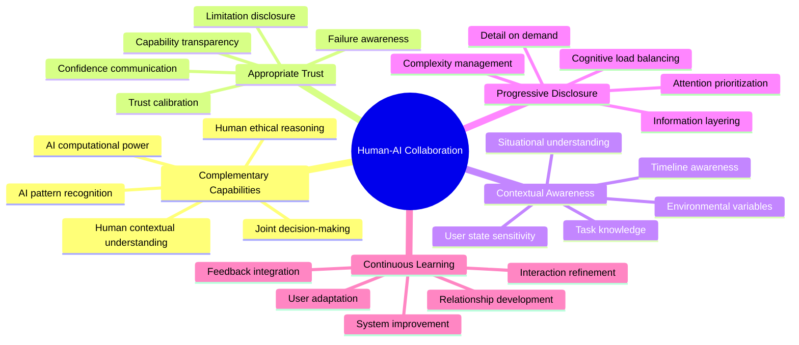
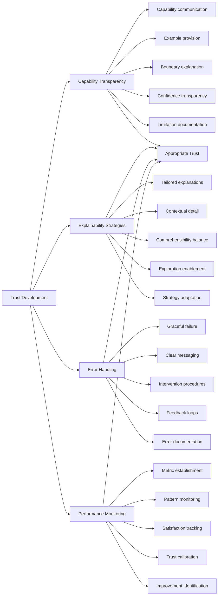
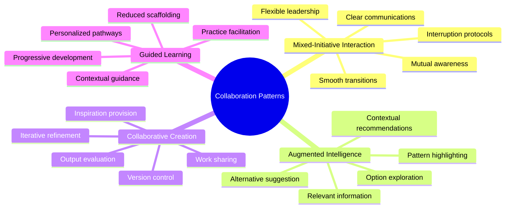

# Human-AI Interaction and Collaboration

## Core Principles
- **Complementary capabilities**: Leverage unique strengths of both humans and AI systems
- **Appropriate trust**: Develop calibrated trust that matches AI system capabilities
- **Contextual awareness**: Ensure AI systems understand their operational context
- **Progressive disclosure**: Present information at appropriate levels of detail
- **Continuous learning**: Enable mutual adaptation between humans and AI systems



## Interaction Design Framework
1. **Collaboration models**
   - AI as tool: System provides capabilities that extend human abilities
   - AI as assistant: System proactively helps with defined tasks
   - AI as augmentation: System seamlessly integrates into human workflow
   - AI as partner: System engages in joint problem-solving
   - AI as coach: System helps humans develop skills and knowledge

2. **Decision allocation**
   - Identify tasks best suited for human decision-making
   - Determine areas where AI can make recommendations
   - Establish domains for autonomous AI action
   - Design handoff protocols between human and AI
   - Create escalation procedures for uncertain situations

3. **Communication design**
   - Develop shared language and concepts
   - Design multimodal interaction approaches
   - Create appropriate information visualization
   - Establish feedback mechanisms
   - Implement context-appropriate interruption patterns

4. **Workflow integration**
   - Map human workflow processes and touchpoints
   - Identify opportunities for AI assistance
   - Design seamless transitions between AI and human tasks
   - Create appropriate documentation and audit trails
   - Establish performance metrics for the combined system

```mermaid
graph TD
    A[Interaction Design] --> B[Collaboration Models]
    A --> C[Decision Allocation]
    A --> D[Communication Design]
    A --> E[Workflow Integration]
    
    B --> B1[AI as tool]
    B --> B2[AI as assistant]
    B --> B3[AI as augmentation]
    B --> B4[AI as partner]
    B --> B5[AI as coach]
    
    C --> C1[Human decision domains]
    C --> C2[AI recommendation areas]
    C --> C3[Autonomous AI domains]
    C --> C4[Handoff protocols]
    C --> C5[Escalation procedures]
    
    D --> D1[Shared language]
    D --> D2[Multimodal interaction]
    D --> D3[Information visualization]
    D --> D4[Feedback mechanisms]
    D --> D5[Interruption patterns]
    
    E --> E1[Workflow mapping]
    E --> E2[Assistance opportunities]
    E --> E3[Transition design]
    E --> E4[Documentation design]
    E --> E5[Performance metrics]
    
    B --> F[Effective Human-AI System]
    C --> F
    D --> F
    E --> F
```



## Trust Development Framework
1. **Capability transparency**
   - Clearly communicate what the AI can and cannot do
   - Provide examples of successful and unsuccessful operations
   - Explain the boundaries of AI system knowledge
   - Show confidence levels for different domains
   - Document performance characteristics and limitations

2. **Explainability strategies**
   - Design explanations tailored to user needs and expertise
   - Provide appropriate level of detail for context
   - Balance completeness with comprehensibility
   - Enable further exploration of system reasoning
   - Adapt explanation strategies based on feedback

3. **Error handling**
   - Design graceful failure modes
   - Provide clear error messages and recovery options
   - Establish procedures for human intervention
   - Create feedback loops for error correction
   - Document common errors and mitigation strategies

4. **Performance monitoring**
   - Establish metrics for human-AI system performance
   - Monitor for shifts in usage patterns or effectiveness
   - Create feedback mechanisms for user satisfaction
   - Track trust calibration accuracy
   - Identify opportunities for system improvement



## User Experience Guidelines
1. **Mental model alignment**
   - Understand user expectations and preconceptions
   - Design interfaces that match conceptual understanding
   - Provide appropriate affordances for interaction
   - Confirm shared understanding through feedback
   - Evolve design based on observed mental models

2. **Cognitive load management**
   - Minimize unnecessary information processing
   - Present information at appropriate moments
   - Chunk complex information into manageable units
   - Design for recognition over recall
   - Provide contextual cues and memory aids

3. **Agency and control**
   - Enable appropriate user control over AI behavior
   - Provide mechanisms to override or guide AI decisions
   - Create transparent settings and preferences
   - Design for gradual delegation of tasks
   - Enable revocation of AI authority when needed

4. **Feedback and adaptation**
   - Design multi-layered feedback mechanisms
   - Create opportunities for explicit user correction
   - Learn from implicit user behavior
   - Enable customization of interaction patterns
   - Demonstrate system learning from feedback

```mermaid
graph TD
    A[User Experience] --> B[Mental Model Alignment]
    A --> C[Cognitive Load Management]
    A --> D[Agency and Control]
    A --> E[Feedback and Adaptation]
    
    B --> B1[Expectation understanding]
    B --> B2[Interface alignment]
    B --> B3[Interaction affordances]
    B --> B4[Understanding confirmation]
    B --> B5[Design evolution]
    
    C --> C1[Information minimization]
    C --> C2[Appropriate timing]
    C --> C3[Information chunking]
    C --> C4[Recognition design]
    C --> C5[Contextual cues]
    
    D --> D1[Control enablement]
    D --> D2[Override mechanisms]
    D --> D3[Transparent settings]
    D --> D4[Gradual delegation]
    D --> D5[Authority revocation]
    
    E --> E1[Feedback layers]
    E --> E2[Correction opportunities]
    E --> E3[Behavior learning]
    E --> E4[Customization options]
    E --> E5[Learning demonstration]
    
    B --> F[Effective User Experience]
    C --> F
    D --> F
    E --> F
```



## Collaboration Pattern Library
1. **Mixed-initiative interaction**
   - Design for flexible leadership between human and AI
   - Create smooth transitions between actors
   - Establish clear communication channels
   - Enable appropriate interruption protocols
   - Design for mutual awareness of activities

2. **Augmented intelligence**
   - Surface relevant information at decision points
   - Highlight patterns and anomalies
   - Suggest alternatives not considered
   - Provide context-aware recommendations
   - Enable rapid exploration of options

3. **Collaborative creation**
   - Design for iterative refinement between human and AI
   - Enable partial work sharing and continuation
   - Create evaluation frameworks for outputs
   - Provide inspiration and divergent thinking support
   - Enable version control and exploration

4. **Guided learning**
   - Design progressive skill development experiences
   - Provide contextual guidance at appropriate moments
   - Create personalized learning pathways
   - Enable practice with feedback
   - Gradually reduce scaffolding as proficiency increases



## Ethical Collaboration Guidelines
1. **Human autonomy preservation**
   - Ensure meaningful human control over critical decisions
   - Prevent undue influence or manipulation
   - Design for informed consent in delegation
   - Enable contestability of AI outputs
   - Preserve user agency in all interactions

2. **Responsibility allocation**
   - Clearly define accountability for actions and decisions
   - Design appropriate human oversight mechanisms
   - Create transparent audit trails
   - Establish protocols for handling errors or harms
   - Consider liability implications in system design

3. **Cognitive enhancement**
   - Design to augment human capabilities, not replace them
   - Prevent skill atrophy through appropriate challenge
   - Support development of new skills and knowledge
   - Consider long-term impacts on human capabilities
   - Design for complementary human-AI contributions

4. **Inclusive collaboration**
   - Design for accessibility and universal usability
   - Consider diverse user needs and capabilities
   - Prevent or mitigate algorithmic biases in interaction
   - Enable customization for different user preferences
   - Test with diverse user populations

```mermaid
graph TD
    A[Ethical Collaboration] --> B[Human Autonomy]
    A --> C[Responsibility Allocation]
    A --> D[Cognitive Enhancement]
    A --> E[Inclusive Collaboration]
    
    B --> B1[Meaningful control]
    B --> B2[Influence prevention]
    B --> B3[Informed consent]
    B --> B4[Output contestability]
    B --> B5[Agency preservation]
    
    C --> C1[Accountability definition]
    C --> C2[Oversight mechanisms]
    C --> C3[Audit transparency]
    C --> C4[Error protocols]
    C --> C5[Liability consideration]
    
    D --> D1[Capability augmentation]
    D --> D2[Skill preservation]
    D --> D3[Development support]
    D --> D4[Long-term impact]
    D --> D5[Complementary design]
    
    E --> E1[Accessibility]
    E --> E2[Diversity consideration]
    E --> E3[Bias mitigation]
    E --> E4[Customization]
    E --> E5[Inclusive testing]
    
    B --> F[Ethical Human-AI System]
    C --> F
    D --> F
    E --> F
```



## Decision-Making Framework for Interaction Design
- **When to automate**: Tasks with clear criteria, low stakes, repetitive nature, data-intensive processing, time-sensitive reactions
- **When to augment**: Complex judgments, high-stakes decisions, ambiguous contexts, creative tasks, ethical considerations
- **When to customize interaction**: Different user expertise levels, diverse task needs, varied cognitive styles, regulatory requirements, specialized domains
- **When to revise collaboration model**: Performance issues, trust breakdowns, changing user needs, new capabilities, emerging ethical concerns
- **When to escalate to human judgment**: Unprecedented situations, ethical dilemmas, confidence below threshold, conflicting objectives, high-stakes outcomes

```mermaid
flowchart TD
    A[Interaction Design Decisions] --> B[Automation Choice]
    A --> C[Augmentation Approach]
    A --> D[Customization Need]
    A --> E[Model Revision Trigger]
    A --> F[Human Escalation]
    
    B --> B1{Automate When}
    B1 --> B1a[Clear criteria exists]
    B1 --> B1b[Stakes are low]
    B1 --> B1c[Task is repetitive]
    B1 --> B1d[Data processing intensive]
    B1 --> B1e[Time-sensitive reaction]
    
    C --> C1{Augment When}
    C1 --> C1a[Judgment is complex]
    C1 --> C1b[Stakes are high]
    C1 --> C1c[Context is ambiguous]
    C1 --> C1d[Task requires creativity]
    C1 --> C1e[Ethical considerations present]
    
    D --> D1{Customize When}
    D1 --> D1a[User expertise varies]
    D1 --> D1b[Task needs differ]
    D1 --> D1c[Cognitive styles diverse]
    D1 --> D1d[Regulations require]
    D1 --> D1e[Domain is specialized]
    
    E --> E1{Revise Model When}
    E1 --> E1a[Performance issues arise]
    E1 --> E1b[Trust breaks down]
    E1 --> E1c[User needs change]
    E1 --> E1d[New capabilities emerge]
    E1 --> E1e[Ethical concerns develop]
    
    F --> F1{Escalate When}
    F1 --> F1a[Situation unprecedented]
    F1 --> F1b[Ethical dilemma present]
    F1 --> F1c[Confidence below threshold]
    F1 --> F1d[Objectives conflict]
    F1 --> F1e[Stakes exceptionally high]
```



## Interaction Evaluation Framework
```markdown
# Human-AI Interaction Evaluation

## System Performance
- **Task completion rate**: [Percentage of tasks successfully completed]
- **Time efficiency**: [Comparison to non-AI baseline]
- **Error rates**: [Types and frequency of errors]
- **Recovery effectiveness**: [Success in recovering from errors]
- **Learning curve**: [Time/effort to reach proficiency]

## User Experience
- **Perceived usefulness**: [User ratings of system value]
- **Ease of use**: [Usability metrics and feedback]
- **Trust calibration**: [Appropriateness of user trust level]
- **Cognitive load**: [Mental effort required for interaction]
- **User satisfaction**: [Overall experience quality]

## Collaboration Quality
- **Communication effectiveness**: [Clarity and efficiency]
- **Role clarity**: [Understanding of human/AI responsibilities]
- **Handoff smoothness**: [Transition quality between actors]
- **Joint performance**: [Success of combined human-AI system]
- **Adaptation over time**: [Improvement in collaboration]

## Ethical Considerations
- **Agency preservation**: [Maintenance of human autonomy]
- **Accessibility**: [Usability across diverse populations]
- **Transparency**: [Understanding of AI capabilities/actions]
- **Bias mitigation**: [Fairness across user groups]
- **Long-term impacts**: [Effects on human skills/capabilities]

## Improvement Opportunities
- **User feedback**: [Common suggestions/complaints]
- **Performance gaps**: [Areas below target metrics]
- **Unexpected usage patterns**: [Emergent behaviors]
- **Technical limitations**: [System constraints identified]
- **Integration issues**: [Workflow/process challenges]
``` 