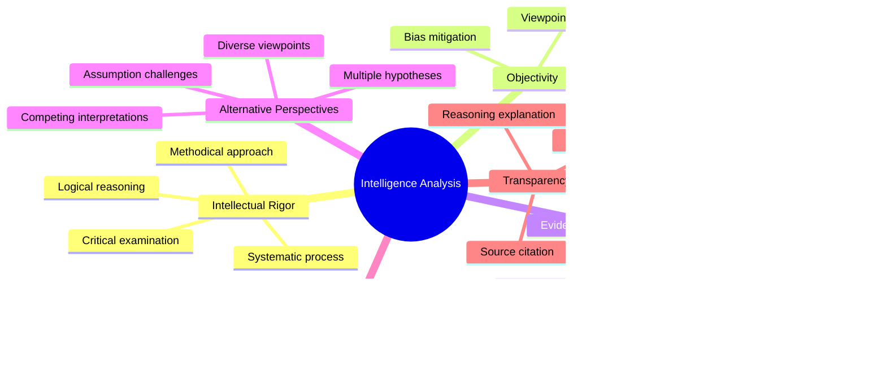

# Intelligence Analysis Methodologies

## Core Principles
- **Intellectual rigor**: Apply disciplined, systematic thinking to complex problems
- **Objectivity**: Separate facts from assumptions and biases
- **Evidence-based reasoning**: Build conclusions on verifiable information
- **Alternative perspectives**: Consider multiple interpretations of the same data
- **Probabilistic thinking**: Express judgments with appropriate confidence levels
- **Transparency**: Document reasoning processes and information sources

## Intelligence Cycle
1. **Planning and direction**
   - Identify client needs and intelligence requirements
   - Define key intelligence questions and priorities
   - Establish collection priorities
   - Allocate resources and capabilities
   - Set timelines and deliverables

2. **Collection**
   - Gather information from multiple sources
   - Apply various collection disciplines (HUMINT, SIGINT, OSINT, etc.)
   - Maintain source protection and operational security
   - Document metadata and source reliability
   - Adapt collection strategies based on emerging needs

3. **Processing and exploitation**
   - Convert raw data into usable information
   - Translate, decrypt, or otherwise prepare information
   - Filter relevant from irrelevant information
   - Organize information for analysis
   - Apply technical processing as needed

4. **Analysis and production**
   - Apply analytical methodologies to processed information
   - Test hypotheses and draw conclusions
   - Produce intelligence products
   - Address key intelligence questions
   - Estimate confidence levels for judgments

5. **Dissemination**
   - Deliver intelligence products to consumers
   - Present findings clearly and concisely
   - Tailor products to consumer needs
   - Provide briefings as needed
   - Ensure secure and timely delivery

6. **Feedback and evaluation**
   - Solicit feedback from intelligence consumers
   - Evaluate effectiveness of intelligence products
   - Identify lessons learned and improvement areas
   - Adjust future collection and analysis accordingly
   - Measure impact on decision-making

## Structured Analytical Techniques
1. **Hypothesis generation and testing**
   - Analysis of Competing Hypotheses (ACH)
   - Multiple Hypothesis Generation
   - Diagnostic Reasoning
   - Hypothesis Mapping
   - Devil's Advocacy

2. **Challenge analysis**
   - Key Assumptions Check
   - Quality of Information Check
   - Indicators or Signposts of Change
   - High-Impact/Low-Probability Analysis
   - "What If?" Analysis

3. **Situational awareness**
   - Chronologies and Timelines
   - Mind Mapping
   - Network Analysis
   - Process Mapping
   - Geospatial Analysis

4. **Future-oriented techniques**
   - Scenario Development
   - Alternative Futures Analysis
   - Red Team Analysis
   - Delphi Method
   - Trend Analysis

## Analysis of Competing Hypotheses (ACH)
1. **Generate hypotheses**
   - Identify all reasonable explanations or outcomes
   - Ensure hypotheses are mutually exclusive
   - Avoid combining multiple scenarios in single hypothesis
   - Include unlikely but plausible hypotheses
   - Document hypothesis generation process

2. **Gather evidence and arguments**
   - Collect all relevant data points and observations
   - Include absence of evidence as significant
   - Consider reliability of each evidence item
   - Document source and quality of evidence
   - Update evidence list as new information emerges

3. **Evaluate evidence against hypotheses**
   - Assess consistency of each evidence item with each hypothesis
   - Use consistent evaluation criteria (consistent, inconsistent, not applicable)
   - Identify which evidence best discriminates between hypotheses
   - Focus on disproving hypotheses rather than confirming
   - Reconsider initial assessments to check for bias

4. **Draw conclusions**
   - Identify hypotheses with fewest inconsistencies
   - Consider diagnosticity of evidence (discriminating power)
   - Assess sensitivity of conclusions to key evidence
   - Articulate confidence level in conclusions
   - Identify information that would alter conclusions

## Cognitive Biases in Intelligence
1. **Information processing biases**
   - Confirmation bias: Favoring information that confirms existing beliefs
   - Anchoring: Over-relying on first piece of information
   - Availability heuristic: Overweighting easily recalled information
   - Framing effect: Being influenced by how information is presented
   - Illusory correlation: Seeing relationships that don't exist

2. **Perception biases**
   - Mirror imaging: Assuming others think like you
   - Groupthink: Consensus seeking over critical evaluation
   - Stereotyping: Applying generalized characteristics
   - Cultural bias: Viewing other cultures through own cultural lens
   - Status quo bias: Preferring things to remain as they are

3. **Decision-making biases**
   - Overconfidence: Excessive certainty in judgments
   - Hindsight bias: Believing events were predictable after the fact
   - Sunk cost fallacy: Continuing commitment due to past investment
   - Loss aversion: Preferring to avoid losses over equivalent gains
   - Authority bias: Excessive deference to authority figures

4. **Memory biases**
   - Consistency bias: Revising memories to match current beliefs
   - Source confusion: Misremembering where information came from
   - Recency bias: Giving greater weight to recent events
   - Imagination inflation: Confusing imagined scenarios with reality
   - Selective memory: Remembering confirmatory evidence more easily

## Intelligence Source Evaluation
1. **Source reliability assessment**
   - Evaluate source's track record and credibility
   - Consider source's access and positioning
   - Assess potential motivations and biases
   - Review source's reporting history
   - Apply consistent reliability rating system

2. **Information validity assessment**
   - Verify consistency with known facts
   - Check for internal logic and coherence
   - Consider plausibility and context
   - Seek corroboration from independent sources
   - Evaluate how information was obtained

3. **Collection method factors**
   - Consider strengths and limitations of collection disciplines
   - Assess technical quality of collection
   - Evaluate chain of custody and handling
   - Consider temporal factors (timeliness, age)
   - Identify potential manipulation or deception

4. **Information integration**
   - Combine multiple sources to improve confidence
   - Identify conflicts between different sources
   - Weight information based on reliability and validity
   - Distinguish between facts, assumptions, and gaps
   - Create integrated assessment with confidence levels

## Writing Intelligence Products
- Produce clear, concise, and logical assessments
- Structure reports with key judgments first
- Clearly distinguish between facts and assessments
- Express uncertainty with standardized language
- Support judgments with specific evidence
- Provide context and implications for decision-makers

## Intelligence Analysis Process Model
