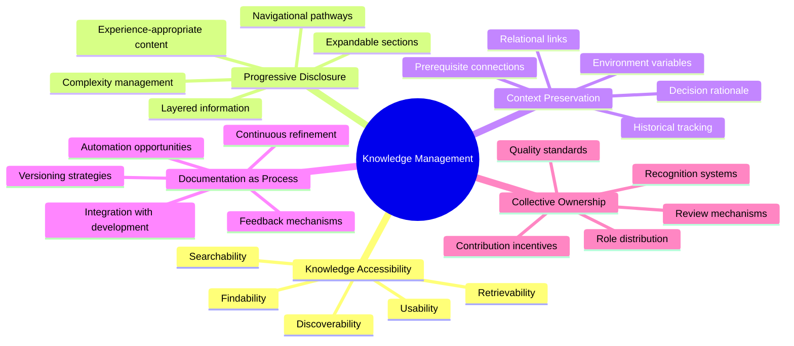
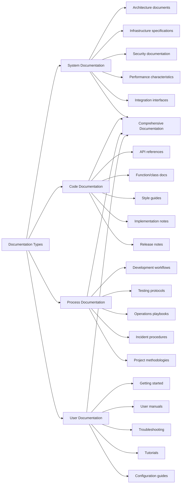
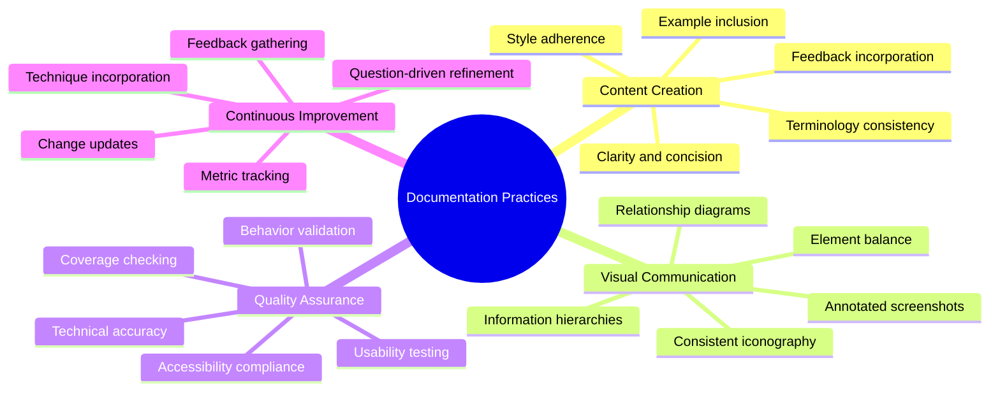

# Knowledge Management and Documentation

## Core Principles
- **Knowledge accessibility**: Ensure information is findable, retrievable, and usable
- **Progressive disclosure**: Structure documentation from simple to advanced content
- **Context preservation**: Maintain connections between related knowledge artifacts
- **Documentation as process**: Treat documentation as an ongoing workflow, not a one-time task
- **Collective ownership**: Distribute responsibility for knowledge creation and maintenance



## Documentation Planning Framework
1. **Audience analysis**
   - Identify all potential documentation users
   - Analyze knowledge levels and technical expertise
   - Understand task-specific information needs
   - Recognize different learning and reference styles
   - Map user journeys and documentation touchpoints

2. **Content scoping**
   - Define documentation coverage requirements
   - Identify critical vs. supplemental information
   - Establish appropriate level of detail
   - Balance comprehensiveness with maintainability
   - Create content outlines and information architecture

3. **Format selection**
   - Choose appropriate media types (text, diagrams, video)
   - Determine interactive vs. static presentation
   - Select tools and platforms for creation/hosting
   - Consider accessibility requirements
   - Evaluate localization and translation needs

4. **Maintenance planning**
   - Establish ownership and review responsibilities
   - Define update triggers and frequency
   - Create deprecation and archiving processes
   - Design feedback collection mechanisms
   - Plan for content migration and preservation

```mermaid
graph TD
    A[Documentation Planning] --> B[Audience Analysis]
    A --> C[Content Scoping]
    A --> D[Format Selection]
    A --> E[Maintenance Planning]
    
    B --> B1[User identification]
    B --> B2[Knowledge assessment]
    B --> B3[Information needs]
    B --> B4[Learning styles]
    B --> B5[User journeys]
    
    C --> C1[Coverage definition]
    C --> C2[Criticality assessment]
    C --> C3[Detail determination]
    C --> C4[Balance evaluation]
    C --> C5[Architecture creation]
    
    D --> D1[Media selection]
    D --> D2[Presentation determination]
    D --> D3[Tool selection]
    D --> D4[Accessibility consideration]
    D --> D5[Localization planning]
    
    E --> E1[Ownership establishment]
    E --> E2[Update definition]
    E --> E3[Archiving process]
    E --> E4[Feedback mechanisms]
    E --> E5[Preservation planning]
    
    B --> F[Effective Documentation Strategy]
    C --> F
    D --> F
    E --> F
```



## Technical Documentation Types
1. **System documentation**
   - Architecture and design documents
   - Infrastructure and deployment specifications
   - Security and compliance documentation
   - Performance characteristics and benchmarks
   - Integration interfaces and protocols

2. **Code documentation**
   - API references and specifications
   - Function and class documentation
   - Code style guides and conventions
   - Implementation notes and examples
   - Release notes and version history

3. **Process documentation**
   - Development workflows and procedures
   - Testing protocols and practices
   - Deployment and operations playbooks
   - Incident response procedures
   - Project management methodologies

4. **User documentation**
   - Getting started guides and onboarding
   - User manuals and reference guides
   - Troubleshooting and FAQ resources
   - Tutorial and training materials
   - Configuration and customization guides



## Knowledge Base Structuring Principles
1. **Information architecture**
   - Organize content in logical hierarchies
   - Create consistent navigation patterns
   - Balance breadth vs. depth in structure
   - Implement effective categorization and tagging
   - Design intuitive search and discovery mechanisms

2. **Cross-referencing strategies**
   - Link related content explicitly
   - Implement "see also" sections and suggestions
   - Create content relationship maps
   - Enable contextual discovery of related information
   - Maintain bidirectional references

3. **Progressive knowledge pathways**
   - Design learning sequences from basic to advanced
   - Create prerequisite relationships between content
   - Provide skill-level indicators for content
   - Offer suggested learning paths
   - Enable customized knowledge journeys

4. **Maintenance structures**
   - Implement content lifecycle management
   - Create ownership and responsibility matrices
   - Design review and update workflows
   - Establish archiving and deprecation processes
   - Build metrics and analytics for content usage

```mermaid
graph TD
    A[Knowledge Base Structure] --> B[Information Architecture]
    A --> C[Cross-Referencing]
    A --> D[Progressive Pathways]
    A --> E[Maintenance Structures]
    
    B --> B1[Logical hierarchies]
    B --> B2[Navigation patterns]
    B --> B3[Structure balance]
    B --> B4[Categorization systems]
    B --> B5[Search mechanisms]
    
    C --> C1[Explicit linking]
    C --> C2[Suggestion sections]
    C --> C3[Relationship mapping]
    C --> C4[Contextual discovery]
    C --> C5[Bidirectional references]
    
    D --> D1[Learning sequences]
    D --> D2[Prerequisite relationships]
    D --> D3[Skill indicators]
    D --> D4[Suggested paths]
    D --> D5[Customized journeys]
    
    E --> E1[Lifecycle management]
    E --> E2[Responsibility matrices]
    E --> E3[Update workflows]
    E --> E4[Archiving processes]
    E --> E5[Usage analytics]
    
    B --> F[Effective Knowledge Structure]
    C --> F
    D --> F
    E --> F
```



## Documentation Best Practices
1. **Content creation**
   - Write clearly and concisely for the target audience
   - Use consistent terminology and vocabulary
   - Include appropriate examples and use cases
   - Follow established style guides and conventions
   - Incorporate feedback from actual users

2. **Visual communication**
   - Use diagrams to explain complex relationships
   - Employ screenshots with annotations
   - Create visual hierarchies for information
   - Design consistent iconography and visual language
   - Balance text and visual elements appropriately

3. **Quality assurance**
   - Implement technical accuracy reviews
   - Conduct usability testing with target audiences
   - Check for completeness and coverage
   - Validate against actual system behavior
   - Ensure accessibility compliance

4. **Continuous improvement**
   - Gather and incorporate user feedback
   - Track usage metrics and identify gaps
   - Update based on product changes
   - Refine based on support and user questions
   - Incorporate new documentation techniques



## Knowledge Capture Workflows
1. **Documentation-driven development**
   - Start with documentation of intended behavior
   - Use documentation as specifications
   - Update documentation with implementation details
   - Review documentation alongside code reviews
   - Treat documentation completeness as release criteria

2. **Post-implementation documentation**
   - Analyze existing code and systems
   - Interview developers and subject matter experts
   - Create documentation from established patterns
   - Validate documentation against actual behavior
   - Review and refine iteratively

3. **Collaborative documentation**
   - Use collaborative writing platforms
   - Establish contribution guidelines
   - Create templates for consistency
   - Implement peer review processes
   - Recognize and incentivize contributions

4. **Automated documentation**
   - Implement code comment to documentation tools
   - Generate API references from code
   - Use system monitoring for infrastructure docs
   - Create visualization tools for architecture
   - Develop change tracking for documentation updates

```mermaid
flowchart TD
    A[Knowledge Capture] --> B[Documentation-Driven Development]
    A --> C[Post-Implementation Documentation]
    A --> D[Collaborative Documentation]
    A --> E[Automated Documentation]
    
    B --> B1[Behavior documentation]
    B --> B2[Documentation as specs]
    B --> B3[Implementation updates]
    B --> B4[Documentation reviews]
    B --> B5[Completeness criteria]
    
    C --> C1[Code analysis]
    C --> C2[Expert interviews]
    C --> C3[Pattern documentation]
    C --> C4[Behavior validation]
    C --> C5[Iterative refinement]
    
    D --> D1[Collaborative platforms]
    D --> D2[Contribution guidelines]
    D --> D3[Template creation]
    D --> D4[Review processes]
    D --> D5[Contribution incentives]
    
    E --> E1[Comment-to-doc tools]
    E --> E2[API generators]
    E --> E3[Monitoring integration]
    E --> E4[Architecture visualization]
    E --> E5[Change tracking]
    
    B --> F[Effective Knowledge Capture]
    C --> F
    D --> F
    E --> F
```



## Knowledge Management Systems
1. **Documentation platforms**
   - Wikis and collaborative document systems
   - Static site generators for technical docs
   - Integrated API documentation tools
   - Knowledge base and help center solutions
   - Combined code and documentation repositories

2. **Information retrieval systems**
   - Full-text search engines
   - Semantic and natural language search
   - Faceted navigation and filtering
   - Recommendation and suggestion engines
   - User preference and history customization

3. **Contribution and governance tools**
   - Version control for documentation
   - Review and approval workflows
   - Quality metrics and dashboards
   - Style checking and formatting tools
   - Ownership and responsibility tracking

4. **Integration capabilities**
   - Connection with development tools
   - Integration with communication platforms
   - Links to project management systems
   - Embedding in operational workflows
   - API access for custom integrations

```mermaid
graph TD
    A[Knowledge Management Systems] --> B[Documentation Platforms]
    A --> C[Information Retrieval]
    A --> D[Contribution Tools]
    A --> E[Integration Capabilities]
    
    B --> B1[Collaborative wikis]
    B --> B2[Static site generators]
    B --> B3[API documentation tools]
    B --> B4[Knowledge base solutions]
    B --> B5[Combined repositories]
    
    C --> C1[Full-text search]
    C --> C2[Semantic search]
    C --> C3[Faceted navigation]
    C --> C4[Recommendation engines]
    C --> C5[Preference customization]
    
    D --> D1[Version control]
    D --> D2[Review workflows]
    D --> D3[Quality metrics]
    D --> D4[Style checking]
    D --> D5[Ownership tracking]
    
    E --> E1[Development integration]
    E --> E2[Communication links]
    E --> E3[Project management]
    E --> E4[Workflow embedding]
    E --> E5[API access]
    
    B --> F[Effective Knowledge System]
    C --> F
    D --> F
    E --> F
```



## Decision-Making Framework for Documentation
- **When to create new documentation**: New features, frequent user questions, complex processes, onboarding challenges, compliance requirements
- **When to update existing documentation**: Product changes, reported inaccuracies, usage metrics show confusion, regular review cycles, terminology updates
- **When to archive documentation**: Feature deprecation, low usage metrics, redundant content, replaced processes, outdated information
- **When to prioritize certain documentation types**: User impact, business criticality, complexity level, usage frequency, resource constraints
- **When to automate documentation**: Repeatable formats, frequently changing information, system-derived data, reference material, high-volume documentation

```mermaid
flowchart TD
    A[Documentation Decisions] --> B[Create New Documentation]
    A --> C[Update Existing Documentation]
    A --> D[Archive Documentation]
    A --> E[Prioritize Documentation Types]
    A --> F[Automate Documentation]
    
    B --> B1{Create When}
    B1 --> B1a[New features released]
    B1 --> B1b[Frequent questions exist]
    B1 --> B1c[Process is complex]
    B1 --> B1d[Onboarding challenges]
    B1 --> B1e[Compliance requires]
    
    C --> C1{Update When}
    C1 --> C1a[Product changes]
    C1 --> C1b[Inaccuracies reported]
    C1 --> C1c[Metrics show confusion]
    C1 --> C1d[Review cycle occurs]
    C1 --> C1e[Terminology changes]
    
    D --> D1{Archive When}
    D1 --> D1a[Feature deprecated]
    D1 --> D1b[Usage metrics low]
    D1 --> D1c[Content redundant]
    D1 --> D1d[Process replaced]
    D1 --> D1e[Information outdated]
    
    E --> E1{Prioritize When}
    E1 --> E1a[User impact high]
    E1 --> E1b[Business critical]
    E1 --> E1c[Complexity elevated]
    E1 --> E1d[Usage frequency high]
    E1 --> E1e[Resources constrained]
    
    F --> F1{Automate When}
    F1 --> F1a[Format repeatable]
    F1 --> F1b[Changes frequent]
    F1 --> F1c[Data system-derived]
    F1 --> F1d[Material reference-based]
    F1 --> F1e[Volume high]
```



## Documentation Quality Assessment Framework
```markdown
# Documentation Quality Assessment

## Content Quality
- **Accuracy**: [Correctness and precision of information]
- **Completeness**: [Coverage of necessary topics and details]
- **Currency**: [Up-to-date with latest product/system versions]
- **Consistency**: [Uniform terminology, style, and formatting]
- **Clarity**: [Understandability for target audience]

## Structural Quality
- **Organization**: [Logical structure and information hierarchy]
- **Navigability**: [Ease of finding specific information]
- **Cross-referencing**: [Effectiveness of internal linking]
- **Searchability**: [Findability via search mechanisms]
- **Accessibility**: [Compliance with accessibility standards]

## User Experience
- **Task alignment**: [Support for common user tasks]
- **Learning curve**: [Ease of understanding for new users]
- **Visual aids**: [Quality and relevance of diagrams, screenshots]
- **Examples**: [Helpfulness of included examples]
- **Interactive elements**: [Effectiveness of any interactive components]

## Maintenance Quality
- **Ownership**: [Clear responsibility for maintenance]
- **Update processes**: [Defined procedures for revisions]
- **Version control**: [Tracking of documentation changes]
- **Feedback mechanisms**: [Systems for user input]
- **Analytics**: [Measurement of documentation effectiveness]

## Improvement Opportunities
- **User feedback**: [Common suggestions from users]
- **Gap analysis**: [Missing or inadequate coverage]
- **Usage patterns**: [Most/least accessed content]
- **Support correlation**: [Relationship with support requests]
- **Benchmark comparison**: [Comparison to industry standards]
``` 