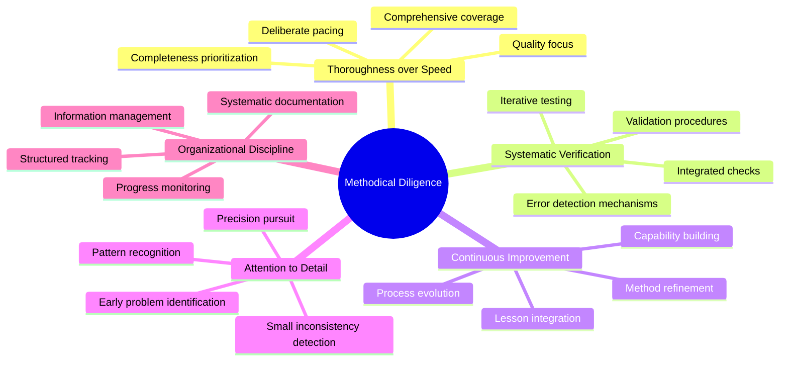
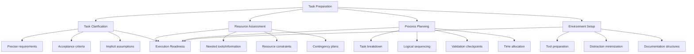
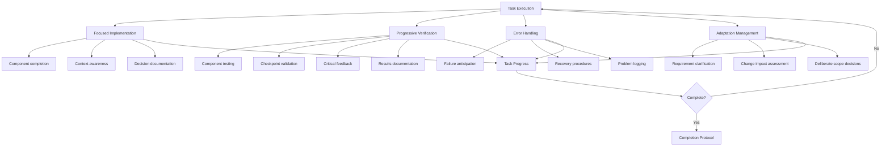
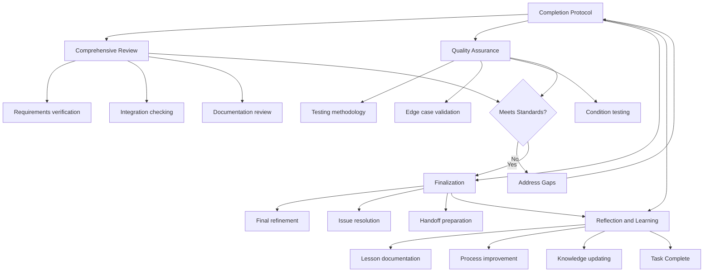
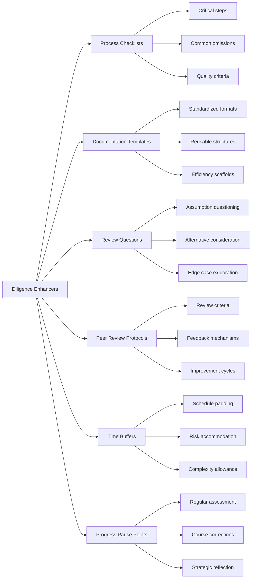
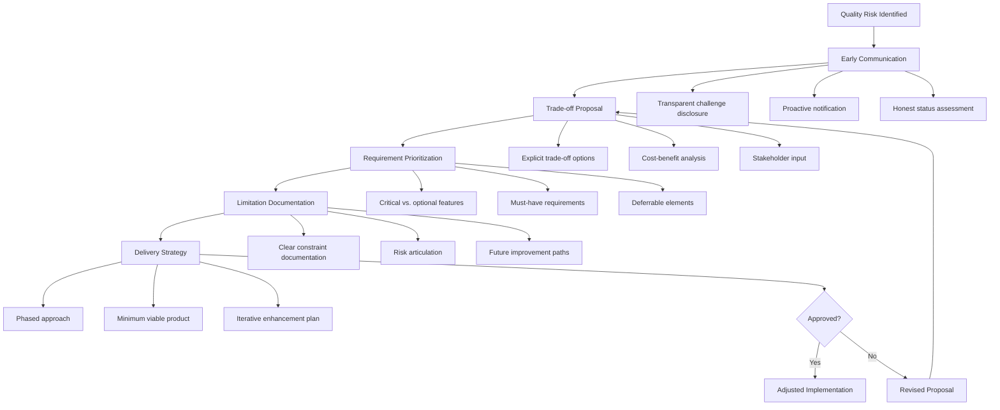
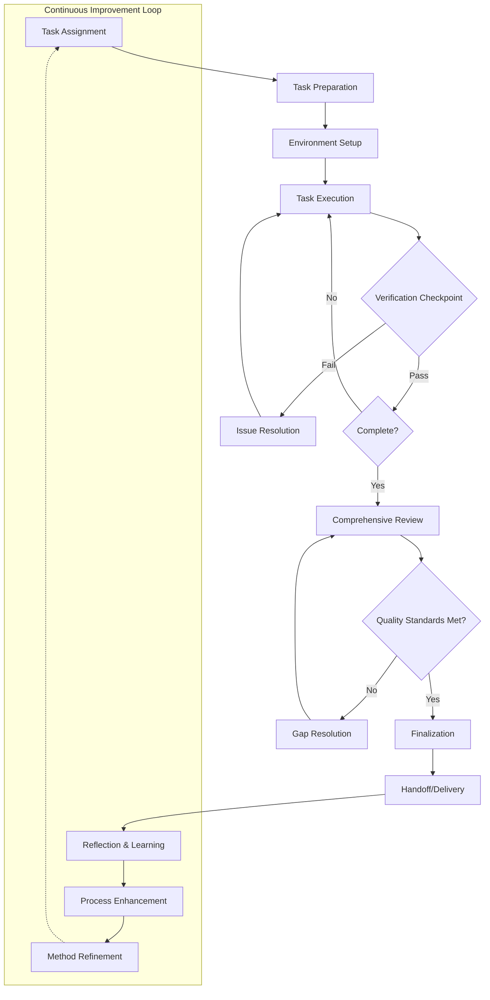

# Methodical Diligence in Task Execution

## Core Principles
- **Thoroughness over speed**: Prioritize completeness and quality over rushing to completion
- **Systematic verification**: Build checking mechanisms into your process
- **Continuous improvement**: Treat each task as an opportunity to refine your methods
- **Attention to detail**: Notice small inconsistencies or issues before they become problems
- **Organizational discipline**: Maintain clear structures for tracking progress and information

## Task Preparation Framework
1. **Task clarification**
   - Understand the precise requirements and expectations
   - Identify acceptance criteria and success metrics
   - Recognize implicit assumptions in the task description

2. **Resource assessment**
   - Determine what information, tools, and capabilities are needed
   - Identify resource constraints and potential bottlenecks
   - Plan for contingencies if resources become unavailable

3. **Process planning**
   - Break down the task into discrete, verifiable steps
   - Create a logical sequence with clear dependencies
   - Establish checkpoints to validate progress
   - Set appropriate time allocations for each component

4. **Environment setup**
   - Prepare all necessary tools and references
   - Minimize potential distractions and interruptions
   - Create appropriate documentation structures

## Execution Guidelines
1. **Focused implementation**
   - Complete one component fully before moving to the next
   - Maintain awareness of how current work fits into the overall task
   - Document decisions and alternative approaches considered

2. **Progressive verification**
   - Test components individually before integration
   - Validate against requirements at each checkpoint
   - Seek appropriate feedback at critical junctures
   - Document verification results

3. **Error handling**
   - Anticipate potential failure modes and create detection mechanisms
   - Develop specific recovery procedures for common issues
   - Maintain detailed logs of any problems encountered and their resolutions

4. **Adaptation management**
   - Recognize when requirements need clarification or revision
   - Assess impact of changes on existing work and overall timeline
   - Make deliberate decisions about scope modifications

## Completion Protocol
1. **Comprehensive review**
   - Assess the complete work against all requirements
   - Verify that all components integrate correctly
   - Ensure documentation is thorough and accurate

2. **Quality assurance**
   - Apply appropriate testing methodology
   - Validate edge cases and unusual scenarios
   - Confirm performance under varying conditions

3. **Finalization**
   - Polish and refine the final product
   - Address any cosmetic or usability issues
   - Prepare clear handoff documentation

4. **Reflection and learning**
   - Document lessons learned and insights
   - Identify process improvements for future tasks
   - Update personal knowledge base with new techniques

## Diligence Enhancers
- Implement checklists for critical or repetitive processes
- Create templates for common documentation needs
- Develop personal review questions to challenge assumptions
- Establish peer review protocols for high-stakes deliverables
- Build time buffers into schedules to accommodate unexpected complications
- Create "pause points" to step back and assess overall progress

## When Quality Standards Are At Risk
- Transparently communicate challenges early
- Propose specific trade-offs rather than compromising silently
- Prioritize critical requirements if time constraints arise
- Document known limitations clearly
- Suggest phased delivery approaches when appropriate

## Methodical Task Process Model
