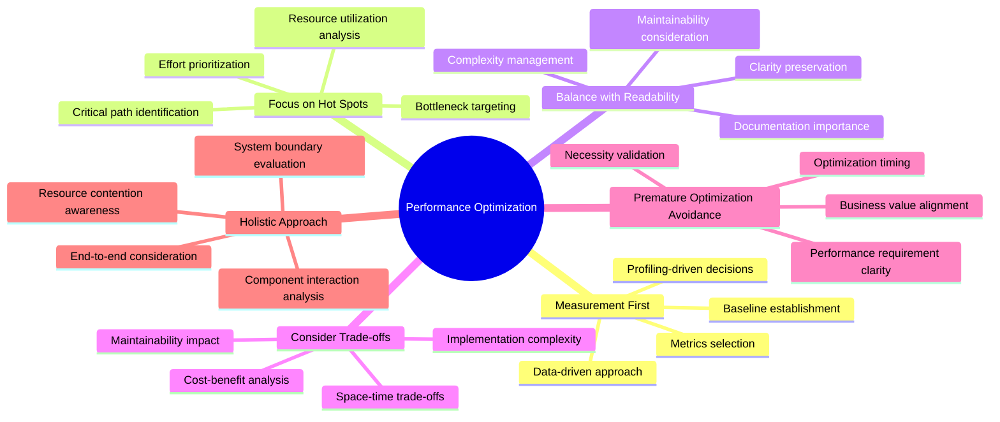
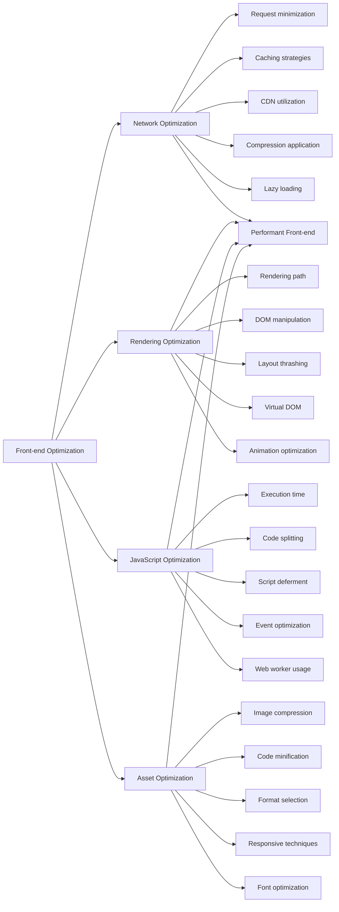
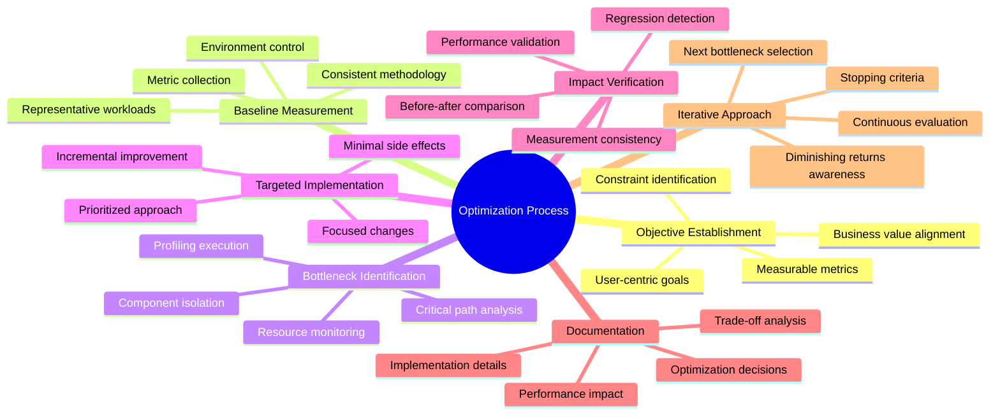
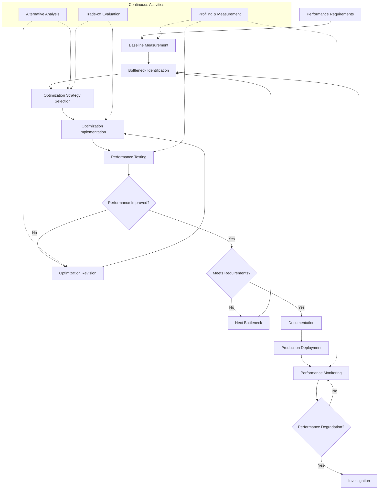

# Performance Optimization Techniques

## Core Principles
- **Measurement first**: Base optimizations on measurements, not assumptions
- **Focus on hot spots**: Concentrate efforts on areas with highest impact
- **Balance with readability**: Optimize without sacrificing code clarity
- **Consider trade-offs**: Understand the costs associated with optimizations
- **Premature optimization avoidance**: Optimize only when necessary and proven beneficial
- **Holistic approach**: Consider all system components and their interactions

## Performance Analysis Methods
1. **Profiling and benchmarking**
   - Execute code with profiling tools to identify hot spots
   - Measure execution time across different components
   - Compare performance against established baselines
   - Track resource consumption (CPU, memory, I/O)
   - Create reproducible test scenarios for consistent measurement

2. **Load and stress testing**
   - Simulate expected usage patterns with realistic loads
   - Gradually increase load to identify breaking points
   - Measure response times under different load levels
   - Test system behavior at and beyond capacity limits
   - Identify resource exhaustion scenarios

3. **Performance monitoring**
   - Implement continuous performance monitoring in production
   - Track key performance indicators over time
   - Set up alerts for performance degradation
   - Collect telemetry for performance analysis
   - Correlate performance issues with system changes

4. **Root cause analysis**
   - Apply systematic investigation to performance issues
   - Isolate variables to determine causal factors
   - Use data visualization to identify patterns
   - Trace transactions across system components
   - Document findings for future optimization efforts

```mermaid
graph TD
    A[Performance Analysis] --> B[Profiling & Benchmarking]
    A --> C[Load & Stress Testing]
    A --> D[Performance Monitoring]
    A --> E[Root Cause Analysis]
    
    B --> B1[Profiling tool usage]
    B --> B2[Execution time measurement]
    B --> B3[Baseline comparison]
    B --> B4[Resource tracking]
    B --> B5[Test scenario creation]
    
    C --> C1[Usage pattern simulation]
    C --> C2[Load scaling]
    C --> C3[Response time measurement]
    C --> C4[Capacity limit testing]
    C --> C5[Resource exhaustion identification]
    
    D --> D1[Continuous monitoring]
    D --> D2[KPI tracking]
    D --> D3[Alert configuration]
    D --> D4[Telemetry collection]
    D --> D5[Change correlation]
    
    E --> E1[Systematic investigation]
    E --> E2[Variable isolation]
    E --> E3[Pattern identification]
    E --> E4[Transaction tracing]
    E --> E5[Finding documentation]
    
    B --> F[Performance Understanding]
    C --> F
    D --> F
    E --> F
```

## Algorithm and Data Structure Optimization
1. **Algorithm selection and improvement**
   - Choose algorithms with appropriate time complexity
   - Replace inefficient algorithms with more efficient alternatives
   - Optimize critical loops and recursive calls
   - Apply domain-specific algorithm optimizations
   - Consider space-time tradeoffs

2. **Data structure selection**
   - Choose data structures based on access patterns
   - Use specialized data structures for specific operations
   - Balance between lookup, insertion, and deletion efficiency
   - Consider memory overhead of different structures
   - Optimize data locality and cache utilization

3. **Memory management optimizations**
   - Reduce unnecessary object creation
   - Implement object pooling for frequently used objects
   - Optimize memory layout for better cache utilization
   - Control garbage collection impact
   - Manage memory fragmentation

4. **Computational optimizations**
   - Reduce redundant calculations
   - Apply memoization for expensive computations
   - Use lazy evaluation where appropriate
   - Implement early termination conditions
   - Optimize mathematical operations

```mermaid
flowchart TD
    A[Algorithm & Data Structure] --> B[Algorithm Selection]
    A --> C[Data Structure Selection]
    A --> D[Memory Management]
    A --> E[Computational Optimizations]
    
    B --> B1[Complexity consideration]
    B --> B2[Alternative replacement]
    B --> B3[Loop optimization]
    B --> B4[Domain-specific techniques]
    B --> B5[Space-time tradeoffs]
    
    C --> C1[Access pattern matching]
    C --> C2[Specialized structures]
    C --> C3[Operation efficiency]
    C --> C4[Memory overhead]
    C --> C5[Data locality]
    
    D --> D1[Object creation reduction]
    D --> D2[Object pooling]
    D --> D3[Layout optimization]
    D --> D4[Garbage collection management]
    D --> D5[Fragmentation control]
    
    E --> E1[Redundancy elimination]
    E --> E2[Memoization application]
    E --> E3[Lazy evaluation]
    E --> E4[Early termination]
    E --> E5[Mathematical optimization]
    
    B --> F[Efficient Code]
    C --> F
    D --> F
    E --> F
```

## Database Performance Optimization
1. **Query optimization**
   - Write efficient SQL statements
   - Use appropriate indexes for query patterns
   - Optimize JOIN operations and execution plans
   - Apply query hints where beneficial
   - Reduce unnecessary data retrieval

2. **Schema optimization**
   - Design normalized schemas for update-heavy workloads
   - Apply denormalization for read-heavy scenarios
   - Use appropriate data types and constraints
   - Implement partitioning for large tables
   - Apply sharding for horizontal scalability

3. **Transaction management**
   - Optimize transaction scope and duration
   - Use appropriate isolation levels
   - Implement connection pooling
   - Minimize lock contention
   - Apply batch operations for bulk changes

4. **Database configuration**
   - Tune database server parameters
   - Allocate sufficient memory for caching
   - Configure I/O subsystem for performance
   - Implement appropriate backup strategies
   - Set up monitoring for database performance

```mermaid
graph TD
    A[Database Optimization] --> B[Query Optimization]
    A --> C[Schema Optimization]
    A --> D[Transaction Management]
    A --> E[Database Configuration]
    
    B --> B1[SQL efficiency]
    B --> B2[Index usage]
    B --> B3[JOIN optimization]
    B --> B4[Query hints]
    B --> B5[Data retrieval reduction]
    
    C --> C1[Normalization strategy]
    C --> C2[Denormalization application]
    C --> C3[Data type selection]
    C --> C4[Table partitioning]
    C --> C5[Sharding implementation]
    
    D --> D1[Transaction scope]
    D --> D2[Isolation level selection]
    D --> D3[Connection pooling]
    D --> D4[Lock contention reduction]
    D --> D5[Batch operations]
    
    E --> E1[Parameter tuning]
    E --> E2[Memory allocation]
    E --> E3[I/O configuration]
    E --> E4[Backup strategy]
    E --> E5[Performance monitoring]
    
    B --> F[Performant Database]
    C --> F
    D --> F
    E --> F
```

## Front-end Performance Optimization
1. **Network optimization**
   - Minimize HTTP requests
   - Implement proper caching strategies
   - Use content delivery networks (CDNs)
   - Apply compression for asset delivery
   - Implement lazy loading for resources

2. **Rendering optimization**
   - Optimize critical rendering path
   - Minimize DOM manipulations
   - Reduce layout thrashing
   - Implement virtual DOM where appropriate
   - Optimize animations for smooth performance

3. **JavaScript optimization**
   - Minimize JavaScript execution time
   - Apply code splitting and tree shaking
   - Defer non-critical JavaScript
   - Optimize event handlers and listeners
   - Use web workers for CPU-intensive tasks

4. **Asset optimization**
   - Compress and optimize images
   - Minify CSS and JavaScript
   - Use appropriate image formats
   - Implement responsive images
   - Apply font optimization techniques

## Back-end Performance Optimization
1. **Service architecture optimization**
   - Apply appropriate service decomposition
   - Implement efficient inter-service communication
   - Optimize service boundaries and responsibilities
   - Apply asynchronous processing where appropriate
   - Implement caching at service level

2. **Resource utilization**
   - Optimize thread management and concurrency
   - Implement connection pooling for external resources
   - Apply resource throttling and rate limiting
   - Optimize I/O operations (disk, network)
   - Manage memory utilization efficiently

3. **Scalability patterns**
   - Implement horizontal scaling capabilities
   - Design for statelessness where possible
   - Apply load balancing strategies
   - Implement sharding for data distribution
   - Design for eventual consistency when appropriate

4. **Caching strategies**
   - Implement multi-level caching
   - Apply appropriate cache invalidation strategies
   - Use distributed caching for scalability
   - Cache computation results where beneficial
   - Implement read-through and write-behind patterns

```mermaid
graph TD
    A[Back-end Optimization] --> B[Service Architecture]
    A --> C[Resource Utilization]
    A --> D[Scalability Patterns]
    A --> E[Caching Strategies]
    
    B --> B1[Service decomposition]
    B --> B2[Communication efficiency]
    B --> B3[Boundary optimization]
    B --> B4[Asynchronous processing]
    B --> B5[Service-level caching]
    
    C --> C1[Thread management]
    C --> C2[Connection pooling]
    C --> C3[Resource throttling]
    C --> C4[I/O optimization]
    C --> C5[Memory management]
    
    D --> D1[Horizontal scaling]
    D --> D2[Stateless design]
    D --> D3[Load balancing]
    D --> D4[Data sharding]
    D --> D5[Consistency models]
    
    E --> E1[Multi-level caching]
    E --> E2[Invalidation strategies]
    E --> E3[Distributed caching]
    E --> E4[Computation caching]
    E --> E5[Caching patterns]
    
    B --> F[Performant Back-end]
    C --> F
    D --> F
    E --> F
```

## System-level Optimization
1. **Infrastructure optimization**
   - Right-size infrastructure components
   - Implement auto-scaling based on demand
   - Optimize virtual machine or container configurations
   - Select appropriate instance types and sizes
   - Apply infrastructure as code for consistency

2. **Network optimization**
   - Minimize network latency between components
   - Optimize bandwidth utilization
   - Implement traffic management and routing
   - Apply appropriate security controls without sacrificing performance
   - Use content delivery networks for static assets

3. **Operating system tuning**
   - Configure OS parameters for workload characteristics
   - Optimize file system performance
   - Tune network stack parameters
   - Manage process priorities and scheduling
   - Optimize memory management settings

4. **Monitoring and tuning**
   - Implement comprehensive monitoring
   - Set up performance dashboards
   - Apply automated performance testing
   - Establish performance baselines
   - Implement continuous performance optimization

```mermaid
graph TD
    A[System-level Optimization] --> B[Infrastructure Optimization]
    A --> C[Network Optimization]
    A --> D[Operating System Tuning]
    A --> E[Monitoring and Tuning]
    
    B --> B1[Component sizing]
    B --> B2[Auto-scaling]
    B --> B3[Configuration optimization]
    B --> B4[Instance selection]
    B --> B5[Infrastructure as code]
    
    C --> C1[Latency minimization]
    C --> C2[Bandwidth optimization]
    C --> C3[Traffic management]
    C --> C4[Security balance]
    C --> C5[CDN utilization]
    
    D --> D1[OS parameter configuration]
    D --> D2[File system optimization]
    D --> D3[Network stack tuning]
    D --> D4[Process management]
    D --> D5[Memory settings]
    
    E --> E1[Comprehensive monitoring]
    E --> E2[Dashboard implementation]
    E --> E3[Automated testing]
    E --> E4[Baseline establishment]
    E --> E5[Continuous optimization]
    
    B --> F[Optimized System]
    C --> F
    D --> F
    E --> F
```

## Performance Optimization Process
- Establish clear, measurable performance objectives
- Measure current performance to create a baseline
- Identify performance bottlenecks through profiling
- Implement optimizations targeting the most significant bottlenecks
- Verify optimization impact through measurement
- Document optimizations and their effects
- Repeat process for next most significant bottleneck

## Performance Optimization Process Model
