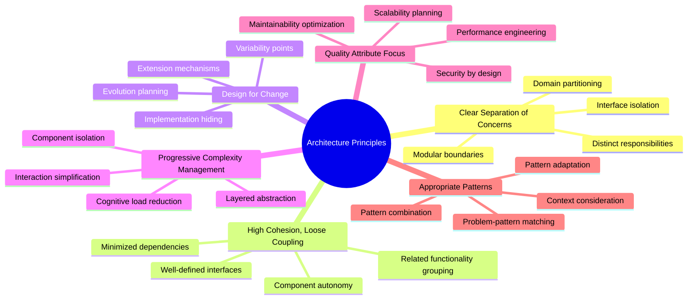
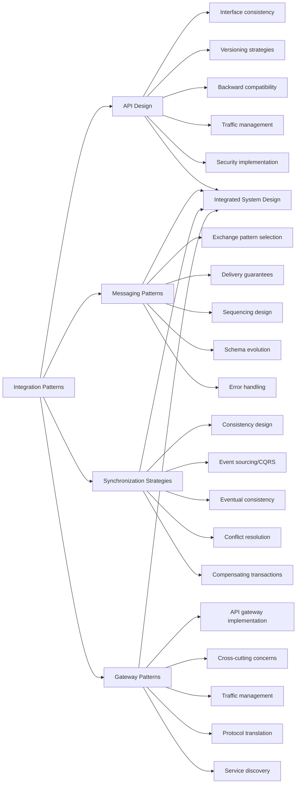
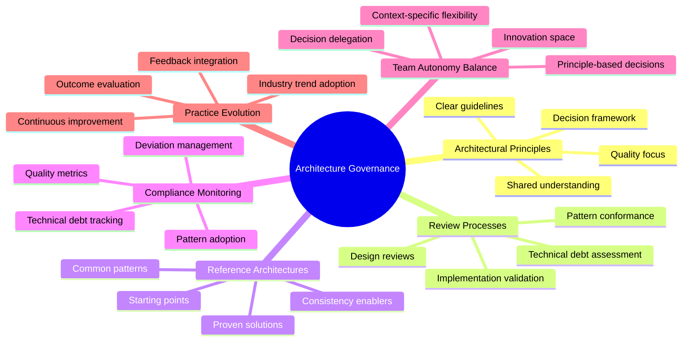
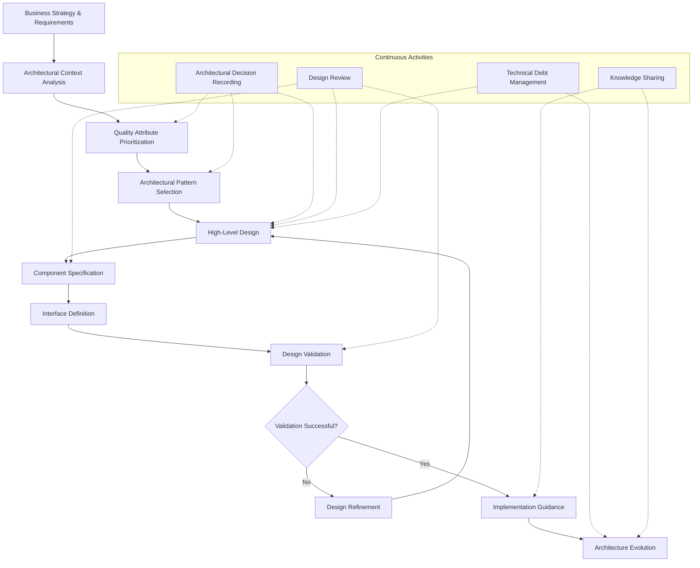

# Software Architecture Principles and Patterns

## Core Principles
- **Clear separation of concerns**: Divide system into distinct areas of responsibility
- **High cohesion, loose coupling**: Group related functionality together while minimizing dependencies
- **Design for change**: Create systems that can evolve with changing requirements
- **Progressive complexity management**: Control complexity through abstraction and modularization
- **Quality attribute focus**: Explicitly design for qualities like performance, scalability, and security
- **Appropriate patterns**: Select architectural patterns that match problem characteristics

## Architectural Styles
1. **Layered architecture**
   - Organize components into horizontal layers with strict dependencies
   - Promote separation of concerns and component isolation
   - Provide clear interfaces between layers
   - Control access through well-defined APIs
   - Enable replacement of individual layers without system-wide impact

2. **Microservices architecture**
   - Design small, independent services around business capabilities
   - Enable autonomous development, deployment, and scaling
   - Implement service boundaries aligned with domain boundaries
   - Communicate through lightweight, technology-agnostic protocols
   - Apply resilience patterns for distributed system reliability

3. **Event-driven architecture**
   - Decouple components through asynchronous event exchange
   - Enable extensibility through event producers and consumers
   - Support reactive and responsive system behavior
   - Enable complex event processing and temporal analysis
   - Facilitate real-time information flow and processing

4. **Hexagonal/Clean architecture**
   - Isolate business logic from external concerns
   - Create explicit boundaries between domain and infrastructure
   - Use ports and adapters to mediate external interactions
   - Enable testability through dependency inversion
   - Support multiple interfaces to the same core functionality

```mermaid
graph TD
    A[Architectural Styles] --> B[Layered Architecture]
    A --> C[Microservices Architecture]
    A --> D[Event-Driven Architecture]
    A --> E[Hexagonal/Clean Architecture]
    
    B --> B1[Horizontal layers]
    B --> B2[Strict dependencies]
    B --> B3[Component isolation]
    B --> B4[Layer interfaces]
    B --> B5[Controlled access]
    
    C --> C1[Business-aligned services]
    C --> C2[Independent lifecycle]
    C --> C3[Domain boundaries]
    C --> C4[Lightweight protocols]
    C --> C5[Distribution resilience]
    
    D --> D1[Asynchronous events]
    D --> D2[Producer-consumer model]
    D --> D3[Reactive behavior]
    D --> D4[Complex event processing]
    D --> D5[Real-time capabilities]
    
    E --> E1[Core domain isolation]
    E --> E2[Explicit boundaries]
    E --> E3[Ports and adapters]
    E --> E4[Dependency inversion]
    E --> E5[Multiple interfaces]
    
    B --> F[Architectural Approach]
    C --> F
    D --> F
    E --> F
```

## System Quality Attributes
1. **Performance efficiency**
   - Design for efficient resource utilization
   - Optimize response time and throughput
   - Minimize computational complexity
   - Balance resource consumption across components
   - Implement caching and data optimization strategies

2. **Scalability**
   - Design for both vertical and horizontal scaling
   - Identify and address potential bottlenecks
   - Implement stateless components where possible
   - Design for data partitioning and distribution
   - Build elastic capacity management

3. **Reliability**
   - Implement fault tolerance mechanisms
   - Design for graceful degradation
   - Apply redundancy where appropriate
   - Implement effective error handling
   - Design self-healing capabilities

4. **Security**
   - Apply defense-in-depth strategies
   - Implement secure by design principles
   - Address authentication, authorization, and audit needs
   - Protect data in transit and at rest
   - Implement secure defaults and fail-secure behavior

5. **Maintainability**
   - Create modular, well-documented components
   - Implement clear patterns and consistent practices
   - Design for testability at multiple levels
   - Minimize technical debt through continuous refactoring
   - Apply principles of self-descriptive architecture

```mermaid
flowchart TD
    A[System Quality Attributes] --> B[Performance Efficiency]
    A --> C[Scalability]
    A --> D[Reliability]
    A --> E[Security]
    A --> F[Maintainability]
    
    B --> B1[Resource efficiency]
    B --> B2[Response optimization]
    B --> B3[Complexity management]
    B --> B4[Resource balancing]
    B --> B5[Caching strategies]
    
    C --> C1[Scaling approaches]
    C --> C2[Bottleneck addressing]
    C --> C3[Stateless design]
    C --> C4[Data partitioning]
    C --> C5[Elastic capacity]
    
    D --> D1[Fault tolerance]
    D --> D2[Graceful degradation]
    D --> D3[Appropriate redundancy]
    D --> D4[Error handling]
    D --> D5[Self-healing]
    
    E --> E1[Defense-in-depth]
    E --> E2[Secure design]
    E --> E3[AAA implementation]
    E --> E4[Data protection]
    E --> E5[Secure defaults]
    
    F --> F1[Modular components]
    F --> F2[Clear patterns]
    F --> F3[Testability]
    F --> F4[Technical debt management]
    F --> F5[Self-description]
    
    B --> G[Quality-Focused Architecture]
    C --> G
    D --> G
    E --> G
    F --> G
```

## Data Architecture Patterns
1. **Data storage strategies**
   - Select appropriate data models (relational, document, graph, etc.)
   - Implement polyglot persistence where appropriate
   - Design data access patterns based on usage characteristics
   - Consider CAP theorem implications for distributed data
   - Plan for data growth and evolution

2. **Caching architectures**
   - Implement multi-level caching strategies
   - Select appropriate cache invalidation approaches
   - Implement distributed caching for scalability
   - Balance memory usage with hit rate optimization
   - Design for cache coherence in distributed systems

3. **Data pipeline patterns**
   - Design for data acquisition, transformation, and loading
   - Implement stream processing for real-time data
   - Create batch processing for high-volume historical data
   - Address data quality and validation requirements
   - Design for observability and monitoring

4. **Data access patterns**
   - Implement appropriate data abstractions (repositories, DAOs)
   - Design query optimization strategies
   - Balance normalization with query performance
   - Implement proper transaction boundaries
   - Address cross-cutting concerns like audit and security

```mermaid
graph TD
    A[Data Architecture] --> B[Data Storage Strategies]
    A --> C[Caching Architectures]
    A --> D[Data Pipeline Patterns]
    A --> E[Data Access Patterns]
    
    B --> B1[Data model selection]
    B --> B2[Polyglot persistence]
    B --> B3[Access pattern design]
    B --> B4[CAP theorem consideration]
    B --> B5[Growth planning]
    
    C --> C1[Multi-level caching]
    C --> C2[Invalidation approaches]
    C --> C3[Distributed caching]
    C --> C4[Memory optimization]
    C --> C5[Cache coherence]
    
    D --> D1[ETL design]
    D --> D2[Stream processing]
    D --> D3[Batch processing]
    D --> D4[Data quality]
    D --> D5[Monitoring design]
    
    E --> E1[Data abstractions]
    E --> E2[Query optimization]
    E --> E3[Normalization balance]
    E --> E4[Transaction boundaries]
    E --> E5[Cross-cutting concerns]
    
    B --> F[Comprehensive Data Strategy]
    C --> F
    D --> F
    E --> F
```

## Integration Patterns
1. **API design**
   - Create consistent, intuitive interfaces
   - Implement appropriate versioning strategies
   - Design for backward compatibility
   - Apply rate limiting and traffic management
   - Address authentication and authorization

2. **Messaging patterns**
   - Select appropriate message exchange patterns (request-reply, pub-sub)
   - Implement message delivery guarantees (at-least-once, exactly-once)
   - Design for message sequencing and ordering where needed
   - Address message schema evolution
   - Implement dead letter queues and error handling

3. **Synchronization strategies**
   - Design for data consistency across services
   - Implement event sourcing and CQRS where appropriate
   - Address eventual consistency challenges
   - Design conflict resolution strategies
   - Consider compensating transactions for failure recovery

4. **Gateway patterns**
   - Implement API gateways for client simplification
   - Design for cross-cutting concerns at gateway level
   - Apply traffic management and routing
   - Implement protocol translation where needed
   - Address service discovery and composition

## Architectural Decision Making
1. **Trade-off analysis**
   - Evaluate competing quality attributes
   - Use quantitative methods where possible
   - Document assumptions and constraints
   - Consider both immediate and long-term impacts
   - Balance technical and business perspectives

2. **Risk assessment**
   - Identify technical and architectural risks
   - Evaluate risk probability and impact
   - Develop mitigation strategies
   - Create contingency plans
   - Establish risk monitoring mechanisms

3. **Technology selection**
   - Evaluate technologies against architectural requirements
   - Consider organizational capabilities and support
   - Assess maturity and community health
   - Evaluate integration with existing ecosystem
   - Consider long-term viability and maintenance

4. **Decision documentation**
   - Use architectural decision records (ADRs)
   - Document context, alternatives, and rationale
   - Make trade-offs explicit
   - Link decisions to quality attributes and constraints
   - Record implications and affected components

```mermaid
graph TD
    A[Architectural Decision Making] --> B[Trade-off Analysis]
    A --> C[Risk Assessment]
    A --> D[Technology Selection]
    A --> E[Decision Documentation]
    
    B --> B1[Quality attribute evaluation]
    B --> B2[Quantitative methods]
    B --> B3[Assumption documentation]
    B --> B4[Impact consideration]
    B --> B5[Perspective balancing]
    
    C --> C1[Risk identification]
    C --> C2[Probability/impact evaluation]
    C --> C3[Mitigation strategy]
    C --> C4[Contingency planning]
    C --> C5[Monitoring mechanisms]
    
    D --> D1[Requirement evaluation]
    D --> D2[Organizational capabilities]
    D --> D3[Maturity assessment]
    D --> D4[Ecosystem integration]
    D --> D5[Long-term viability]
    
    E --> E1[ADR usage]
    E --> E2[Context documentation]
    E --> E3[Trade-off explication]
    E --> E4[Decision linking]
    E --> E5[Implication recording]
    
    B --> F[Informed Architecture Decisions]
    C --> F
    D --> F
    E --> F
```

## Architecture Governance
- Establish architecture principles and standards
- Implement architecture review processes
- Create reference architectures for common use cases
- Monitor architectural compliance and technical debt
- Balance consistency with team autonomy
- Evolve architecture practices based on feedback and outcomes

## Architecture Implementation Process
