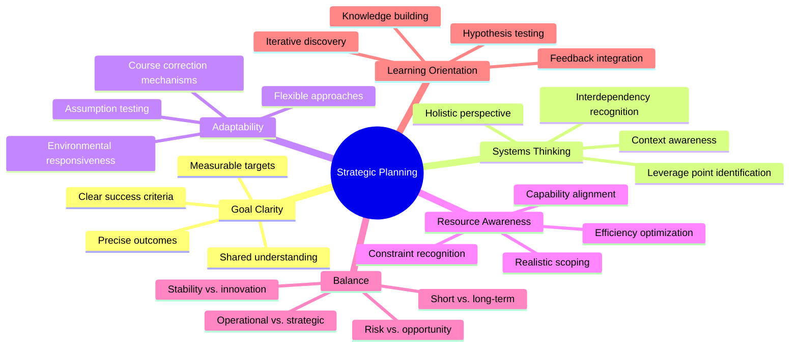
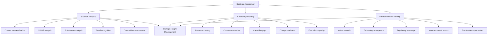
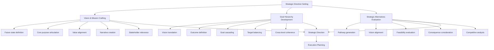
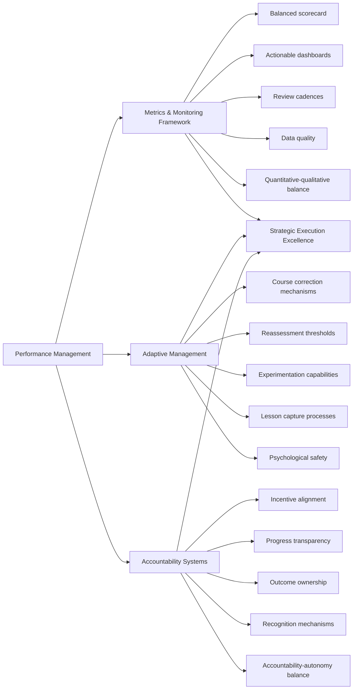
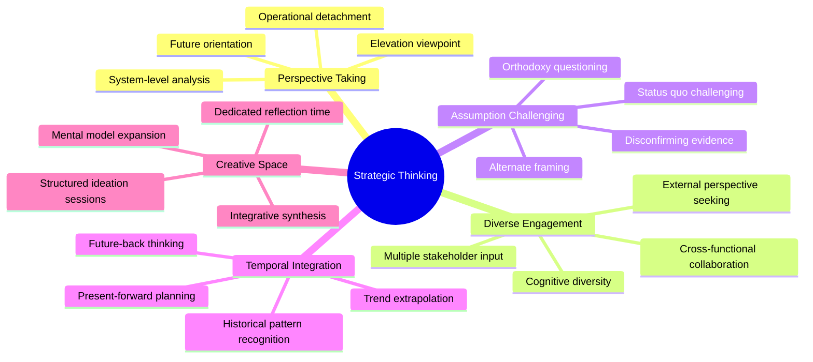
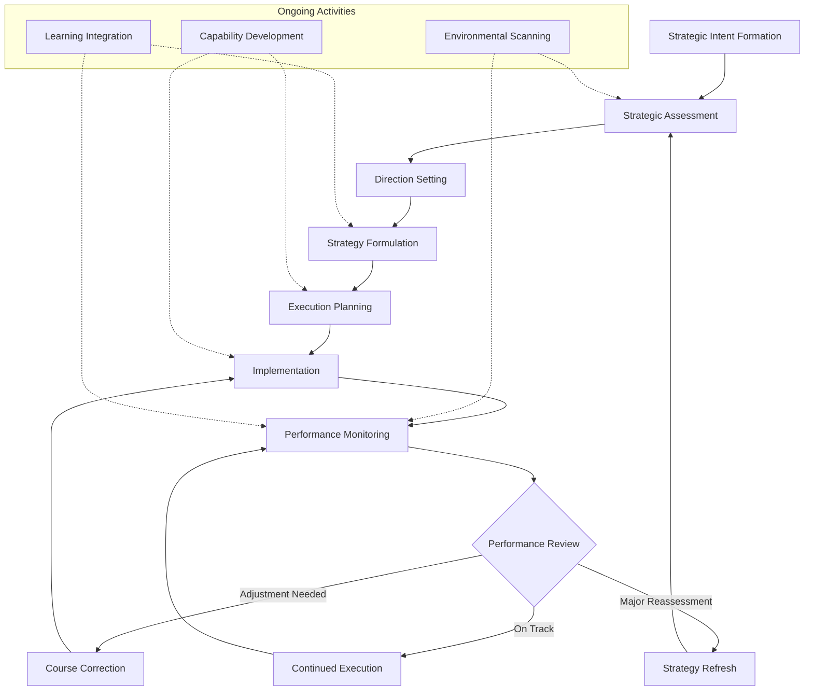

# Strategic Planning and Execution

## Core Principles
- **Goal clarity**: Define precise, measurable outcomes
- **Systems thinking**: Consider interdependencies and broader context
- **Adaptability**: Build plans that can evolve with changing conditions
- **Resource awareness**: Align ambitions with available capabilities
- **Balance**: Consider short-term needs alongside long-term objectives
- **Learning orientation**: View planning as an iterative discovery process

## Strategic Assessment
1. **Situation analysis**
   - Evaluate current state and historical context
   - Identify strengths, weaknesses, opportunities, and threats
   - Analyze stakeholder needs and expectations
   - Recognize market, technological, and environmental trends
   - Assess competitive landscape and strategic position

2. **Capability inventory**
   - Catalog existing resources, skills, and assets
   - Identify core competencies and comparative advantages
   - Recognize capability gaps and constraints
   - Evaluate organizational readiness for change
   - Assess capacity for execution and sustaining momentum

3. **Environmental scanning**
   - Monitor industry trends and disruptions
   - Identify emerging technologies and methodologies
   - Recognize regulatory and compliance considerations
   - Assess macroeconomic and geopolitical factors
   - Anticipate changing stakeholder expectations

## Strategic Direction Setting
1. **Vision and mission crafting**
   - Define aspirational yet achievable future states
   - Articulate core purpose and value proposition
   - Align with fundamental organizational values
   - Create compelling narratives that inspire action
   - Ensure relevance to key stakeholders

2. **Goal hierarchy development**
   - Translate vision into strategic objectives
   - Define measurable outcomes with clear success criteria
   - Create cascading goals that link strategy to operations
   - Balance aspirational targets with pragmatic milestones
   - Ensure coherence across different organizational levels

3. **Strategic alternatives evaluation**
   - Generate multiple strategic pathways
   - Assess alignment with vision and objectives
   - Evaluate feasibility, risk, and resource requirements
   - Consider potential unintended consequences
   - Analyze competitive response and market impact

## Execution Planning
1. **Initiative portfolio design**
   - Identify key initiatives to achieve strategic objectives
   - Prioritize based on impact, urgency, and dependencies
   - Balance transformation with operational stability
   - Sequence initiatives to build momentum and capabilities
   - Ensure appropriate diversification of strategic bets

2. **Resource allocation**
   - Align financial resources with strategic priorities
   - Assign appropriate talent to critical initiatives
   - Balance investment across short and long-term needs
   - Create resource flexibility for emerging opportunities
   - Establish clear accountability for resource utilization

3. **Implementation architecture**
   - Design appropriate governance structures
   - Define roles, responsibilities, and decision rights
   - Establish coordination mechanisms across initiatives
   - Create feedback loops for learning and adaptation
   - Develop knowledge management systems

4. **Risk management**
   - Identify potential obstacles and failure modes
   - Develop mitigation strategies for high-impact risks
   - Create contingency plans for critical uncertainties
   - Establish early warning indicators and triggers
   - Balance risk mitigation with opportunity pursuit

```mermaid
graph TD
    A[Execution Planning] --> B[Initiative Portfolio Design]
    A --> C[Resource Allocation]
    A --> D[Implementation Architecture]
    A --> E[Risk Management]
    
    B --> B1[Key initiative identification]
    B --> B2[Prioritization]
    B --> B3[Transformation-stability balance]
    B --> B4[Initiative sequencing]
    B --> B5[Strategic bet diversification]
    
    C --> C1[Financial alignment]
    C --> C2[Talent assignment]
    C --> C3[Investment balancing]
    C --> C4[Resource flexibility]
    C --> C5[Accountability establishment]
    
    D --> D1[Governance structures]
    D --> D2[Role & responsibility definition]
    D --> D3[Coordination mechanisms]
    D --> D4[Feedback loops]
    D --> D5[Knowledge management]
    
    E --> E1[Obstacle identification]
    E --> E2[Mitigation strategies]
    E --> E3[Contingency planning]
    E --> E4[Warning indicators]
    E --> E5[Risk-opportunity balance]
    
    B --> F[Execution Blueprint]
    C --> F
    D --> F
    E --> F
```

## Performance Management
1. **Metrics and monitoring framework**
   - Develop balanced scorecard of leading and lagging indicators
   - Create dashboards that provide actionable insights
   - Establish regular review cadences and processes
   - Ensure measurement fidelity and data quality
   - Balance quantitative metrics with qualitative assessment

2. **Adaptive management**
   - Create mechanisms to identify necessary course corrections
   - Establish thresholds for strategic reassessment
   - Build capabilities for rapid experimentation
   - Design processes for capturing and applying lessons learned
   - Foster psychological safety for surfacing problems early

3. **Accountability systems**
   - Align incentives with strategic priorities
   - Create appropriate transparency around progress
   - Establish clear ownership for outcomes
   - Develop celebration and recognition mechanisms
   - Balance accountability with empowerment and autonomy

## Special Strategic Contexts
1. **High-uncertainty environments**
   - Develop scenario planning capabilities
   - Create options-based strategies
   - Invest in environmental sensing mechanisms
   - Build strategic and operational flexibility
   - Emphasize rapid learning and adaptation cycles

2. **Resource-constrained settings**
   - Focus on core priorities with highest leverage
   - Seek creative resource mobilization approaches
   - Develop staged implementation plans
   - Emphasize efficiency and resource optimization
   - Consider strategic partnerships and alliances

3. **Transformational change**
   - Create compelling case for change
   - Develop change management capabilities
   - Build coalition of change champions
   - Establish quick wins to build momentum
   - Attend to cultural and mindset shifts

```mermaid
graph TD
    A[Special Strategic Contexts] --> B[High-Uncertainty Environments]
    A --> C[Resource-Constrained Settings]
    A --> D[Transformational Change]
    
    B --> B1[Scenario planning]
    B --> B2[Options-based strategies]
    B --> B3[Environmental sensing]
    B --> B4[Strategic flexibility]
    B --> B5[Rapid adaptation cycles]
    
    C --> C1[Core priority focus]
    C --> C2[Creative resourcing]
    C --> C3[Staged implementation]
    C --> C4[Resource optimization]
    C --> C5[Strategic partnerships]
    
    D --> D1[Change case creation]
    D --> D2[Change management]
    D --> D3[Champion coalition]
    D --> D4[Quick win establishment]
    D --> D5[Cultural attention]
    
    B --> E[Context-Adapted Strategy]
    C --> E
    D --> E
```

## Strategic Thinking Practices
- Regularly step back from operations to evaluate bigger picture
- Engage diverse perspectives when developing strategy
- Challenge conventional wisdom and industry orthodoxies
- Actively seek disconfirming evidence for strategic assumptions
- Develop future back thinking alongside present forward approaches
- Create space for creative and integrative thinking

## Strategic Planning Process Model
