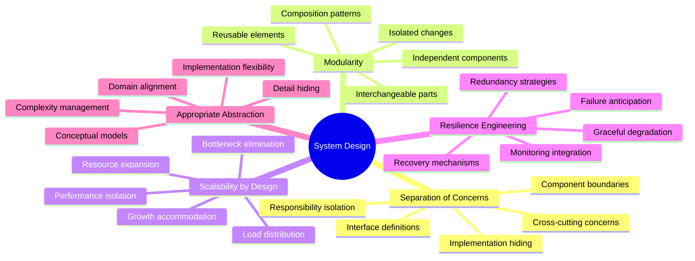
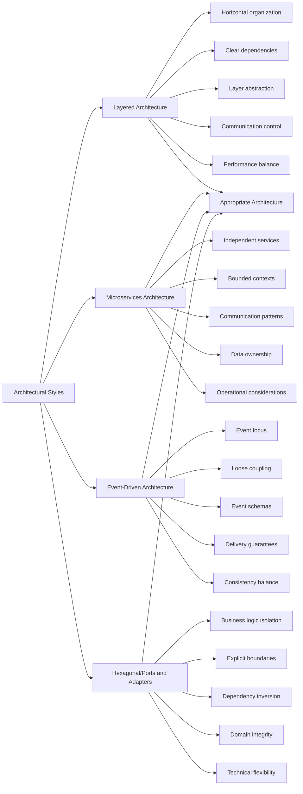
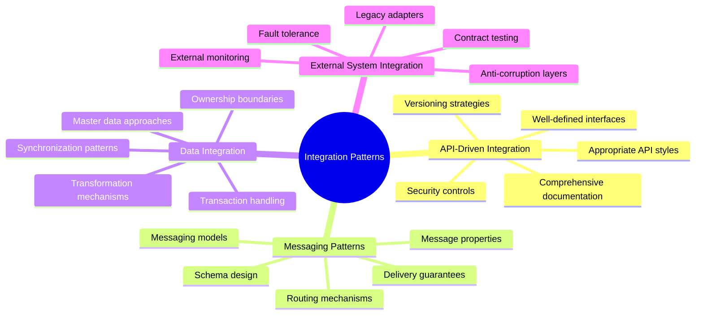

# System Design and Architecture

## Core Principles
- **Separation of concerns**: Divide systems into distinct components with well-defined responsibilities
- **Modularity**: Create independent, interchangeable modules that support system evolution
- **Scalability by design**: Architect systems to handle growth in users, data, and functionality
- **Resilience engineering**: Design for failure with graceful degradation and recovery mechanisms
- **Appropriate abstraction**: Create the right abstractions at the right levels to manage complexity



## Architecture Design Process
1. **Requirements analysis**
   - Identify functional requirements
   - Define quality attributes (performance, security, usability)
   - Establish constraints (technical, business, regulatory)
   - Prioritize conflicting requirements
   - Document assumptions and risks

2. **Architecture exploration**
   - Consider multiple architectural styles
   - Evaluate technology options and constraints
   - Identify key architectural decisions
   - Create proof-of-concepts for critical components
   - Assess trade-offs between quality attributes

3. **Architecture definition**
   - Define component structure and relationships
   - Establish communication patterns and protocols
   - Document data models and flows
   - Specify interfaces and contracts
   - Create deployment and infrastructure models

4. **Architecture validation**
   - Review against requirements and constraints
   - Conduct performance and scalability analysis
   - Perform security threat modeling
   - Test critical paths and integration points
   - Validate architecture with stakeholders

```mermaid
graph TD
    A[Architecture Design Process] --> B[Requirements Analysis]
    A --> C[Architecture Exploration]
    A --> D[Architecture Definition]
    A --> E[Architecture Validation]
    
    B --> B1[Functional requirements]
    B --> B2[Quality attributes]
    B --> B3[Constraints]
    B --> B4[Requirement prioritization]
    B --> B5[Assumptions/risks]
    
    C --> C1[Architectural styles]
    C --> C2[Technology options]
    C --> C3[Key decisions]
    C --> C4[Proof-of-concepts]
    C --> C5[Trade-off assessment]
    
    D --> D1[Component structure]
    D --> D2[Communication patterns]
    D --> D3[Data models]
    D --> D4[Interface specification]
    D --> D5[Deployment models]
    
    E --> E1[Requirements review]
    E --> E2[Performance analysis]
    E --> E3[Threat modeling]
    E --> E4[Integration testing]
    E --> E5[Stakeholder validation]
    
    B --> F[Comprehensive Architecture]
    C --> F
    D --> F
    E --> F
```



## Architectural Styles
1. **Layered architecture**
   - Organize components in horizontal layers
   - Define clear dependencies between layers
   - Implement abstraction between implementation layers
   - Control communication pathways between layers
   - Balance flexibility with performance considerations

2. **Microservices architecture**
   - Design small, focused, independently deployable services
   - Implement bounded contexts from domain-driven design
   - Establish service communication patterns
   - Define data ownership and consistency models
   - Consider operational complexity and monitoring needs

3. **Event-driven architecture**
   - Design around production, detection, and consumption of events
   - Implement loose coupling between components
   - Establish event taxonomies and schemas
   - Consider event ordering, idempotency, and delivery guarantees
   - Balance responsiveness with consistency requirements

4. **Hexagonal/Ports and Adapters**
   - Separate business logic from external concerns
   - Design explicit boundaries using ports and adapters
   - Implement dependency inversion at the boundaries
   - Focus on domain model integrity and testability
   - Enable technical flexibility at the system edges



## Quality Attribute Strategies
1. **Performance optimization**
   - Identify and eliminate bottlenecks in system flow
   - Implement caching strategies at appropriate levels
   - Design for data access efficiency and query optimization
   - Consider asynchronous processing for non-critical paths
   - Balance resource utilization across system components

2. **Scalability patterns**
   - Design for horizontal scaling with stateless components
   - Implement efficient data partitioning and sharding
   - Create load distribution and balancing mechanisms
   - Design for asynchronous work distribution
   - Consider resource pooling and connection management

3. **Security architecture**
   - Implement defense in depth with multiple security layers
   - Design secure authentication and authorization mechanisms
   - Create appropriate data protection and privacy controls
   - Establish secure communication channels and protocols
   - Build audit and monitoring capabilities for security events

4. **Availability and reliability**
   - Design for redundancy and elimination of single points of failure
   - Implement circuit breakers and bulkheads for failure isolation
   - Create effective health monitoring and recovery mechanisms
   - Establish data consistency and recovery strategies
   - Design for graceful degradation under partial system failure

```mermaid
graph TD
    A[Quality Attributes] --> B[Performance Optimization]
    A --> C[Scalability Patterns]
    A --> D[Security Architecture]
    A --> E[Availability and Reliability]
    
    B --> B1[Bottleneck elimination]
    B --> B2[Caching strategies]
    B --> B3[Data access efficiency]
    B --> B4[Asynchronous processing]
    B --> B5[Resource balancing]
    
    C --> C1[Horizontal scaling]
    C --> C2[Data partitioning]
    C --> C3[Load distribution]
    C --> C4[Work distribution]
    C --> C5[Resource pooling]
    
    D --> D1[Defense in depth]
    D --> D2[Auth mechanisms]
    D --> D3[Data protection]
    D --> D4[Secure communication]
    D --> D5[Audit capabilities]
    
    E --> E1[Redundancy design]
    E --> E2[Failure isolation]
    E --> E3[Health monitoring]
    E --> E4[Recovery strategies]
    E --> E5[Graceful degradation]
    
    B --> F[Robust System Architecture]
    C --> F
    D --> F
    E --> F
```



## Integration Patterns
1. **API-driven integration**
   - Design well-defined, consistent APIs
   - Implement appropriate API styles (REST, GraphQL, RPC)
   - Create comprehensive API documentation
   - Establish API versioning and compatibility strategies
   - Design API security and access control

2. **Messaging patterns**
   - Choose appropriate messaging models (point-to-point, pub/sub)
   - Design message formats and schemas
   - Implement message routing and transformation patterns
   - Establish message delivery guarantees and error handling
   - Consider message ordering, idempotency, and correlation

3. **Data integration**
   - Define data ownership boundaries and responsibilities
   - Implement data synchronization and consistency patterns
   - Design strategies for handling distributed transactions
   - Create data transformation and mapping mechanisms
   - Establish master data management approaches

4. **External system integration**
   - Design adapters for legacy system integration
   - Implement anti-corruption layers for external systems
   - Create fault tolerance for unreliable external dependencies
   - Design contract testing and compatibility verification
   - Establish monitoring and observability for external calls



## Architecture Documentation
1. **Views and perspectives**
   - Create multiple architectural views (functional, deployment, etc.)
   - Document different stakeholder perspectives
   - Maintain traceability between views
   - Establish appropriate detail levels for different audiences
   - Create visualization of critical architecture elements

2. **Decision records**
   - Document key architectural decisions
   - Capture context, constraints, and alternatives considered
   - Record rationale for selected approaches
   - Link decisions to quality attributes and requirements
   - Maintain decision history and evolution

3. **Component specifications**
   - Define component responsibilities and boundaries
   - Document interfaces and contracts
   - Specify component interactions and dependencies
   - Detail component quality attribute properties
   - Include implementation constraints and guidelines

4. **Operational architecture**
   - Document deployment models and topologies
   - Specify monitoring, logging, and observability requirements
   - Detail backup, recovery, and business continuity
   - Define operational procedures and runbooks
   - Include capacity planning and scaling guidelines

```mermaid
flowchart TD
    A[Architecture Documentation] --> B[Views and Perspectives]
    A --> C[Decision Records]
    A --> D[Component Specifications]
    A --> E[Operational Architecture]
    
    B --> B1[Multiple views]
    B --> B2[Stakeholder perspectives]
    B --> B3[View traceability]
    B --> B4[Detail levels]
    B --> B5[Visualizations]
    
    C --> C1[Key decisions]
    C --> C2[Context and constraints]
    C --> C3[Decision rationale]
    C --> C4[Quality attribute links]
    C --> C5[Decision history]
    
    D --> D1[Component responsibilities]
    D --> D2[Interface contracts]
    D --> D3[Interaction specification]
    D --> D4[Quality properties]
    D --> D5[Implementation guidelines]
    
    E --> E1[Deployment models]
    E --> E2[Monitoring requirements]
    E --> E3[Recovery procedures]
    E --> E4[Operational procedures]
    E --> E5[Scaling guidelines]
    
    B --> F[Comprehensive Documentation]
    C --> F
    D --> F
    E --> F
```



## System Evaluation Techniques
1. **Architecture reviews**
   - Conduct structured reviews with diverse stakeholders
   - Evaluate alignment with business goals and requirements
   - Assess compliance with architectural principles
   - Identify risks, technical debt, and improvement areas
   - Create actionable recommendations and priorities

2. **Quality attribute evaluation**
   - Perform scenario-based analysis for quality attributes
   - Conduct performance modeling and simulation
   - Implement architecture prototyping for critical paths
   - Create and test failure scenarios and recovery
   - Assess security through threat modeling and analysis

3. **Technical risk assessment**
   - Identify technical risks and uncertainties
   - Evaluate likelihood and impact of technical failures
   - Assess implementation and operational challenges
   - Identify dependencies and integration risks
   - Create risk mitigation plans and contingencies

4. **Trade-off analysis**
   - Evaluate conflicts between quality attributes
   - Document trade-off decisions and rationale
   - Assess short-term vs. long-term architectural consequences
   - Analyze cost-benefit of architectural alternatives
   - Create visual representation of trade-off spaces

```mermaid
graph TD
    A[System Evaluation] --> B[Architecture Reviews]
    A --> C[Quality Attribute Evaluation]
    A --> D[Technical Risk Assessment]
    A --> E[Trade-off Analysis]
    
    B --> B1[Structured reviews]
    B --> B2[Business alignment]
    B --> B3[Principle compliance]
    B --> B4[Risk identification]
    B --> B5[Recommendation creation]
    
    C --> C1[Scenario analysis]
    C --> C2[Performance modeling]
    C --> C3[Critical prototyping]
    C --> C4[Failure testing]
    C --> C5[Threat modeling]
    
    D --> D1[Risk identification]
    D --> D2[Failure impact]
    D --> D3[Implementation challenges]
    D --> D4[Dependency assessment]
    D --> D5[Mitigation planning]
    
    E --> E1[Attribute conflicts]
    E --> E2[Decision documentation]
    E --> E3[Consequence assessment]
    E --> E4[Cost-benefit analysis]
    E --> E5[Trade-off visualization]
    
    B --> F[Comprehensive Evaluation]
    C --> F
    D --> F
    E --> F
```



## Decision-Making Framework for Architecture
- **When to choose microservices**: Independent scaling needs, team autonomy focus, diverse technology requirements, complex domain with clear boundaries
- **When to prefer monolithic design**: Fast development priority, limited operational resources, simpler domain model, early-stage product with evolving boundaries
- **When to apply event-driven patterns**: Loose coupling priority, complex workflows, audit requirements, asynchronous processing needs, integration with multiple systems
- **When to design for high availability**: Critical business functions, 24/7 operations, contractual uptime requirements, significant revenue impact from downtime
- **When to prioritize performance**: User experience directly affected, high-volume data processing, competitive advantage through speed, resource-intensive operations

```mermaid
flowchart TD
    A[Architecture Decisions] --> B[Architecture Style]
    A --> C[Integration Approach]
    A --> D[Quality Attribute Priority]
    A --> E[Technology Selection]
    A --> F[Evolution Strategy]
    
    B --> B1{Microservices When}
    B1 --> B1a[Independent scaling needed]
    B1 --> B1b[Team autonomy valued]
    B1 --> B1c[Technology diversity required]
    B1 --> B1d[Clear domain boundaries exist]
    B1 --> B1e[Operational maturity present]
    
    B --> B2{Monolithic When}
    B2 --> B2a[Fast development priority]
    B2 --> B2b[Limited operations resources]
    B2 --> B2c[Simpler domain model]
    B2 --> B2d[Early-stage product]
    B2 --> B2e[High cohesion in functionality]
    
    C --> C1{Event-Driven When}
    C1 --> C1a[Loose coupling needed]
    C1 --> C1b[Complex workflows present]
    C1 --> C1c[Audit requirements exist]
    C1 --> C1d[Asynchronous processing beneficial]
    C1 --> C1e[Multiple system integration]
    
    D --> D1{High Availability When}
    D1 --> D1a[Business function critical]
    D1 --> D1b[24/7 operations required]
    D1 --> D1c[Contractual uptime exists]
    D1 --> D1d[Revenue impact significant]
    D1 --> D1e[User expectations demand it]
    
    E --> E1{Performance Priority When}
    E1 --> E1a[User experience critical]
    E1 --> E1b[High data volumes]
    E1 --> E1c[Speed provides advantage]
    E1 --> E1d[Resource-intensive operations]
    E1 --> E1e[Real-time requirements]
```



## Architecture Decision Record Template
```markdown
# Architecture Decision Record

## Title
[Short title describing the decision]

## Status
[Proposed | Accepted | Deprecated | Superseded]

## Context
[Description of the forces at play, including technological, business, and team constraints]

## Decision
[The decision that was made]

## Rationale
[Justification for the decision, including alternatives considered]

## Consequences
[Impact of the decision, both positive and negative]

## Compliance
[How compliance with this decision will be verified]

## Related Decisions
[Links to related architecture decisions]

## Notes
[Additional information, links, or references]
```

## Component Specification Template
```markdown
# Component Specification

## Overview
- **Name**: [Component name]
- **Purpose**: [Primary responsibility]
- **Owner**: [Team or individual responsible]
- **Category**: [Service | Library | Infrastructure | etc.]

## Interfaces
- **Provided Interfaces**: [APIs, events, or other interfaces this component exposes]
- **Required Interfaces**: [External dependencies and consumed services]
- **Data Formats**: [Key data structures and formats used for communication]

## Behavior
- **Core Functionality**: [Key capabilities and operations]
- **Error Handling**: [How errors are managed and reported]
- **State Management**: [How state is maintained, if applicable]
- **Concurrency Model**: [Threading and concurrency approach]

## Quality Attributes
- **Performance Characteristics**: [Throughput, latency expectations]
- **Scalability Properties**: [Scaling approach and limitations]
- **Security Considerations**: [Security controls and requirements]
- **Reliability Features**: [Fault tolerance and recovery capabilities]

## Implementation
- **Technology Stack**: [Languages, frameworks, platforms]
- **Deployment Requirements**: [Runtime environment needed]
- **Configuration Options**: [Key configuration parameters]
- **Resource Requirements**: [CPU, memory, storage needs]

## Development
- **Testing Approach**: [Testing strategies and requirements]
- **Build Process**: [How the component is built]
- **Evolution Roadmap**: [Planned future development]
- **Known Limitations**: [Current constraints or technical debt]
``` 